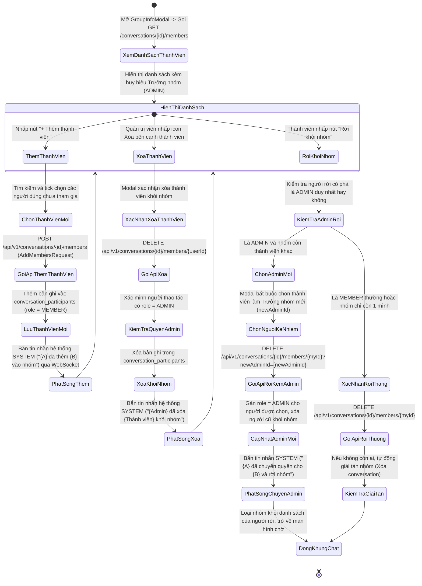
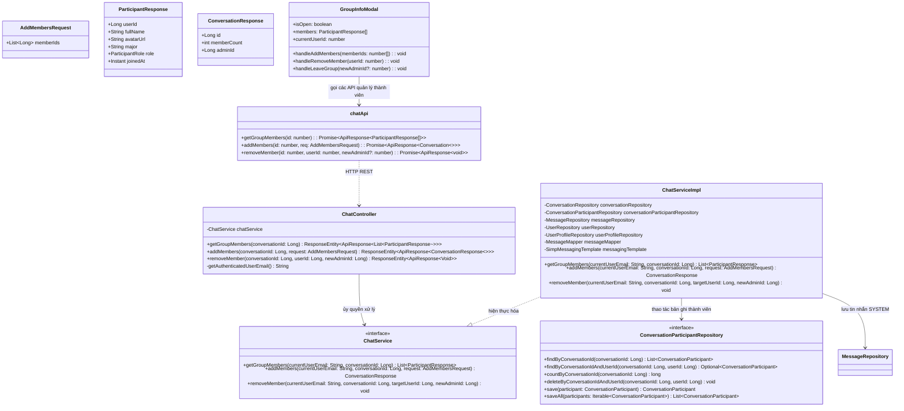
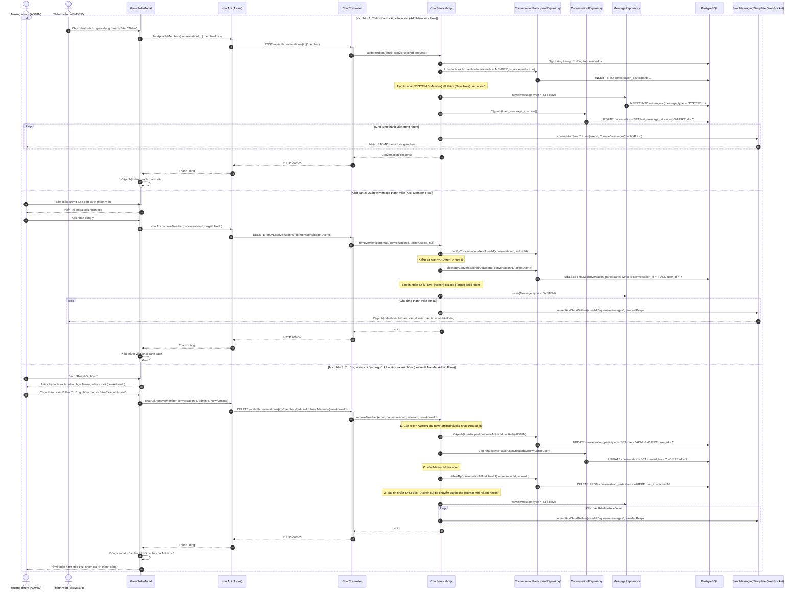

# ĐẶC TẢ YÊU CẦU & THIẾT KẾ CHI TIẾT: UC38 - QUẢN TRỊ THÀNH VIÊN NHÓM TRÒ CHUYỆN (MANAGE GROUP MEMBERS)

## PHẦN 1: ĐẶC TẢ NGHIỆP VỤ (REPORT 3)

### 2.2.3 Business Workflow (Luồng nghiệp vụ)



#### Mô tả chi tiết luồng xử lý bằng chữ (Business Step Description):
* **Bước 1 - Khởi đầu**:
  * Người dùng mở hộp thoại Thông tin nhóm (`GroupInfoModal`).
  * Giao diện tự động gửi yêu cầu `GET /api/v1/conversations/{conversationId}/members` để nạp danh sách toàn bộ thành viên hiện tại của nhóm kèm vai trò của từng người (`ADMIN` hoặc `MEMBER`).
* **Bước 2 - Các bước chuyển tiếp**:
  * **Xem danh sách thành viên**:
    * Hiển thị avatar, họ tên, chuyên ngành và huy hiệu nhận diện.
    * Quản trị viên nhóm (`ADMIN`) có biểu tượng Vương miện màu vàng cam (Crown icon) và huy hiệu "Trưởng nhóm" (`bg-amber-100 text-amber-800`).
    * Nếu người dùng hiện tại là `ADMIN`: Bên cạnh mỗi thành viên thường xuất hiện nút biểu tượng Xóa (Trash2 / UserMinus) màu đỏ để có thể kick thành viên ra khỏi nhóm.
  * **Thêm thành viên mới vào nhóm**:
    * Bất kỳ thành viên nào trong nhóm cũng có thể nhấn nút "+ Thêm thành viên".
    * Mở hộp thoại phụ cho phép tìm kiếm người dùng (không bao gồm các thành viên đã có trong nhóm).
    * Chọn danh sách thành viên mới và nhấn "Xác nhận thêm".
    * Frontend gọi `POST /api/v1/conversations/{conversationId}/members` với danh sách `memberIds`.
    * Backend lưu các thành viên mới với vai trò `role = MEMBER`, tự động sinh tin nhắn hệ thống ghi rõ tên những người được thêm: `"{Người thêm} đã thêm {Tên 1, Tên 2...} vào nhóm"`.
    * Phát sóng tin nhắn thời gian thực qua WebSocket tới tất cả các thành viên cũ và mới.
  * **Xóa thành viên khỏi nhóm (Kick Member)**:
    * Quản trị viên nhấn vào nút Xóa bên cạnh tên của một thành viên cần loại bỏ.
    * Hiển thị Modal xác nhận cảnh báo: *"Bạn có chắc chắn muốn xóa thành viên {Tên} khỏi nhóm?"*.
    * Khi Quản trị viên đồng ý, Frontend gọi API `DELETE /api/v1/conversations/{conversationId}/members/{targetUserId}`.
    * Backend kiểm tra quyền `ADMIN`. Nếu hợp lệ, xóa bản ghi của thành viên đó khỏi bảng `conversation_participants`.
    * Hệ thống sinh tin nhắn sự kiện `message_type = SYSTEM`: `"{Admin} đã xóa {Tên thành viên} khỏi nhóm"` và gửi realtime qua WebSocket. Thành viên bị xóa sẽ bị ngắt quyền truy cập vào nhóm.
  * **Tự rời khỏi nhóm (Leave Group)**:
    * Người dùng nhấn nút "Rời khỏi nhóm" ở dưới cùng của modal.
    * **Trường hợp là Thành viên thường (`role = MEMBER`)**:
      * Hiển thị xác nhận. Khi xác nhận, gọi `DELETE /api/v1/conversations/{conversationId}/members/{currentUserId}`.
      * Hệ thống sinh tin nhắn `SYSTEM`: `"{Tên} đã rời nhóm"`.
    * **Trường hợp là Quản trị viên duy nhất (`role = ADMIN`)**:
      * Nếu nhóm vẫn còn các thành viên khác: Hệ thống hiển thị hộp thoại bắt buộc Quản trị viên phải chỉ định một thành viên kế nhiệm làm Trưởng nhóm mới (`newAdminId`) trước khi được phép rời đi.
      * Khi Quản trị viên chọn thành viên kế nhiệm và bấm Xác nhận rời, Frontend gửi yêu cầu: `DELETE /api/v1/conversations/{conversationId}/members/{currentUserId}?newAdminId={newAdminId}`.
      * Backend cập nhật quyền `role = ADMIN` và `createdBy` cho thành viên mới được chọn, sau đó xóa người cũ ra khỏi nhóm.
      * Hệ thống sinh tin nhắn `SYSTEM`: `"{Tên cũ} đã chuyển quyền cho {Tên mới} và rời nhóm"`.
    * **Trường hợp là thành viên cuối cùng rời nhóm**:
      * Số lượng thành viên còn lại bằng 0 $\rightarrow$ Backend tự động xóa bản ghi cuộc hội thoại trong bảng `conversations` (giải tán nhóm).
* **Bước 3 - Kết thúc**:
  * Các thay đổi về thành viên lập tức được cập nhật trên giao diện của toàn bộ người dùng đang tham gia nhóm qua kết nối thời gian thực WebSocket. Người rời/bị xóa sẽ không còn nhìn thấy nhóm trong danh sách hội thoại của mình.

---

### 3.2 Module Tin Nhắn & Trò Chuyện Trực Tiếp (Direct Messaging & Chat)

#### 3.2.1 Quản trị thành viên nhóm trò chuyện (UC38 - Manage Group Members)

**Function trigger**:
* **Navigation path**: `/app/messages` -> Chọn nhóm -> Mở GroupInfoModal -> Danh sách thành viên.
* **Timing Frequency**: Khi xem thông tin nhóm hoặc khi cần thêm/bớt thành viên.

**Function description**:
* **Actors/Roles**: Tất cả thành viên trong nhóm (`STUDENT`, `ALUMNI`). Vai trò Quản trị viên (`ADMIN`) có thêm quyền xóa thành viên khác.
* **Purpose**: Quản lý số lượng và danh tính các cá nhân tham gia vào nhóm trò chuyện, cho phép mở rộng nhóm bằng cách mời thêm bạn bè, loại bỏ thành viên vi phạm quy tắc nhóm, và xử lý bàn giao quyền quản trị khi Trưởng nhóm rời đi.
* **Interface**:
  * **Danh sách thành viên**: Thẻ hiển thị từng người với Avatar, Họ tên, Nhãn chuyên ngành, Huy hiệu "Trưởng nhóm" (cho Admin) hoặc "Thành viên".
  * **Nút Thêm thành viên ("+ Thêm")**: Mở modal con tìm kiếm và chọn bạn bè để mời vào nhóm.
  * **Nút Xóa thành viên (Icon Trash)**: Chỉ hiển thị cho Quản trị viên, nằm ở góc phải từng dòng thành viên (trừ chính mình).
  * **Hộp thoại Chuyển quyền Trưởng nhóm**: Xuất hiện khi Admin nhấn "Rời nhóm", chứa danh sách radio button để chọn người kế nhiệm.
  * **Nút "Rời khỏi nhóm"**: Nút màu đỏ nổi bật ở chân trang modal.

**Data processing**:
* Nạp danh sách thành viên từ `conversation_participants` join với `users` và `user_profiles`.
* Thêm thành viên: Thêm các bản ghi mới vào `conversation_participants` với `role = MEMBER`.
* Xóa thành viên: Kiểm tra quyền `ADMIN` nếu xóa người khác, xóa bản ghi khỏi CSDL.
* Bàn giao Admin: Chuyển `role = ADMIN` cho `newAdminId` và cập nhật `conversations.created_by`.
* Tự động sinh tin nhắn hệ thống `message_type = SYSTEM` và phát tán qua WebSocket STOMP.

**Screen layout**:
* Nằm trong phần thân của `GroupInfoModal`, chiếm khu vực danh sách cuộn phía dưới mục Thông tin cơ bản của nhóm.

**Function details**:
* **Data**:
  * `conversationId` (Long, bắt buộc): Mã cuộc trò chuyện nhóm.
  * `memberIds` (List<Long>): Danh sách ID người dùng cần thêm.
  * `userId` (Long): Mã người dùng bị xóa hoặc tự rời nhóm.
  * `newAdminId` (Long, tùy chọn): Mã người dùng được chỉ định làm Trưởng nhóm mới.
* **Validation**:
  * Thao tác xóa người khác bắt buộc người thực hiện phải có `role = ADMIN`.
  * Không thể thêm người dùng đã là thành viên của nhóm.
* **Business rules**:
  * `BR-38-01`: Tất cả thành viên trong nhóm đều có quyền mời thêm thành viên mới vào nhóm.
  * `BR-38-02`: Chỉ Quản trị viên (`ADMIN`) mới có quyền xóa thành viên khác ra khỏi nhóm.
  * `BR-38-03`: Thành viên bất kỳ có quyền tự ý rời nhóm bất cứ lúc nào.
  * `BR-38-04`: Nếu Quản trị viên rời nhóm và nhóm còn từ 1 thành viên khác trở lên, Quản trị viên bắt buộc phải bàn giao quyền Trưởng nhóm cho một thành viên được chỉ định (`newAdminId`).
  * `BR-38-05`: Nếu tất cả thành viên đều rời khỏi nhóm (số thành viên còn lại = 0), nhóm sẽ tự động bị xóa sổ vĩnh viễn khỏi CSDL.
* **Error Handling**:
  * `403 Forbidden`: Thành viên thường cố tình xóa người khác $\rightarrow$ Báo lỗi *"Chỉ quản trị viên mới có quyền xóa thành viên khỏi nhóm."*
  * `400 Bad Request`: Thao tác trên cuộc hội thoại 1-1 $\rightarrow$ Báo lỗi *"Thao tác này chỉ áp dụng cho nhóm trò chuyện."*
* **Normal case**: Thêm, xóa hoặc rời nhóm diễn ra mượt mà dưới 200ms, đồng bộ hóa tức thì tới toàn bộ thành viên online.
* **Abnormal case**: Hai quản trị viên cùng thao tác xóa một thành viên cùng lúc $\rightarrow$ Hệ thống xử lý an toàn idempotent, không gây lỗi deadlock CSDL.

---

### 5. Requirement Appendix (Phụ lục Yêu cầu)

#### 5.1 Business Rules (Quy tắc Nghiệp vụ)

| ID | Định nghĩa Quy tắc (Rule Definition) |
| :--- | :--- |
| **BR-38-01** | Bất kỳ thành viên nào đang có mặt trong nhóm đều có quyền thêm thành viên mới. |
| **BR-38-02** | Quyền xóa thành viên (kick) là đặc quyền duy nhất của Quản trị viên nhóm (`ADMIN`). |
| **BR-38-03** | Khi một thành viên bị xóa hoặc tự rời khỏi nhóm, họ lập tức mất toàn bộ quyền xem và gửi tin nhắn trong nhóm đó. |
| **BR-38-04** | Trưởng nhóm khi rời nhóm bắt buộc phải bàn giao quyền cho một thành viên khác nếu nhóm còn người. Hệ thống cập nhật đồng thời trường `role = ADMIN` và `conversations.created_by`. |
| **BR-38-05** | Mọi biến động về nhân sự trong nhóm (thêm người, xóa người, rời nhóm, chuyển quyền trưởng nhóm) đều được hệ thống ghi nhận bằng một tin nhắn hệ thống (`SYSTEM`) và gửi realtime qua WebSocket. |

#### 5.2 Common Requirements (Yêu cầu Chung)
* Danh sách thành viên hiển thị rõ ràng, có phân trang hoặc thanh cuộn mượt mà nếu nhóm đông người.
* Mọi hành động xóa người hoặc rời nhóm đều có hộp thoại xác nhận để tránh bấm nhầm.
* Giao diện phản hồi nhanh, tối ưu hóa các câu truy vấn nạp Profile thành viên (JOIN FETCH / Batching).

#### 5.3 Application Messages List (Danh sách Thông điệp Ứng dụng)

| # | Mã thông điệp | Loại thông điệp | Ngữ cảnh | Nội dung hiển thị |
| :--- | :--- | :--- | :--- | :--- |
| 1 | `MSG-MBR-01` | Toast message | Thêm thành viên thành công | Thêm thành viên vào nhóm thành công. |
| 2 | `MSG-MBR-02` | Toast message | Xóa/Rời nhóm thành công | Đã cập nhật thành viên nhóm. |
| 3 | `MSG-MBR-03` | Modal confirm | Xác nhận xóa thành viên | Bạn có chắc chắn muốn xóa thành viên {Tên} khỏi nhóm? |
| 4 | `MSG-MBR-04` | Modal confirm | Xác nhận rời nhóm (Member) | Bạn có chắc chắn muốn rời khỏi nhóm trò chuyện này? |
| 5 | `MSG-MBR-05` | Modal prompt | Chọn Trưởng nhóm mới (Admin) | Vui lòng chọn một thành viên làm Trưởng nhóm mới trước khi rời đi. |
| 6 | `MSG-MBR-06` | Toast message | Lỗi không có quyền kick | Chỉ quản trị viên mới có quyền xóa thành viên khỏi nhóm. |
| 7 | `MSG-MBR-07` | System message | Thông báo thêm thành viên | {Tên người thêm} đã thêm {Danh sách tên} vào nhóm. |
| 8 | `MSG-MBR-08` | System message | Thông báo xóa thành viên | {Tên Admin} đã xóa {Tên thành viên} khỏi nhóm. |
| 9 | `MSG-MBR-09` | System message | Thông báo rời nhóm thường | {Tên người dùng} đã rời nhóm. |
| 10 | `MSG-MBR-10` | System message | Thông báo chuyển quyền & rời nhóm | {Tên Admin cũ} đã chuyển quyền cho {Tên Admin mới} và rời nhóm. |

---

## PHẦN 2: THIẾT KẾ CHI TIẾT (REPORT 4)

### 3. Detail Design (Thiết kế chi tiết)

#### 3.1 Quản trị thành viên nhóm trò chuyện (UC38 - Manage Group Members)

##### 3.1.1 Class Diagram (Sơ đồ Lớp)



##### 3.1.2 Sequence Diagram (Sơ đồ Tuần tự Gộp)



##### 3.1.3 Thiết kế Cơ sở Dữ liệu & Ràng buộc (Database Schema Design)

* **Bảng `conversation_participants`**:
  * Lưu trữ thành viên và vai trò với ràng buộc `CHECK (role IN ('ADMIN', 'MEMBER'))`.
  * Ràng buộc duy nhất `UNIQUE (conversation_id, user_id)` ngăn chặn một người dùng bị thêm nhiều lần vào cùng một nhóm.
  * Chỉ mục tối ưu: `CREATE INDEX idx_conversation_participants_conv_id ON conversation_participants(conversation_id);`.
* **Bảng `conversations`**:
  * Trường `created_by` lưu vết Quản trị viên hiện tại của nhóm trò chuyện.
* **Xử lý cascade khi giải tán nhóm**:
  * Khi thành viên cuối cùng rời nhóm, cuộc hội thoại được xóa bằng `conversationRepository.delete(conversation)`. Ràng buộc `ON DELETE CASCADE` trên bảng `conversation_participants`, `messages` và `message_attachments` sẽ tự động dọn dẹp sạch toàn bộ dữ liệu phụ thuộc liên quan.

##### 3.1.4 Đặc tả API Endpoint (API Specification)

###### 1. Lấy danh sách thành viên trong nhóm:
* **URL**: `GET /api/v1/conversations/{conversationId}/members`
* **Tiêu đề Request**: `Authorization: Bearer <jwt_access_token>`
* **Phản hồi thành công (HTTP 200 OK)**:
  ```json
  {
    "error": 0,
    "message": "Lấy danh sách thành viên thành công.",
    "data": [
      {
        "userId": 1,
        "fullName": "Nguyen Thanh An",
        "avatarUrl": "https://pub.alumnect.edu.vn/avatar/an.jpg",
        "major": "Kỹ thuật phần mềm",
        "role": "ADMIN",
        "joinedAt": "2026-09-29T10:00:00Z"
      },
      {
        "userId": 2,
        "fullName": "Trần Thị B",
        "avatarUrl": "https://pub.alumnect.edu.vn/avatar/b.jpg",
        "major": "An toàn thông tin",
        "role": "MEMBER",
        "joinedAt": "2026-09-29T10:00:00Z"
      }
    ]
  }
  ```

###### 2. Thêm thành viên vào nhóm:
* **URL**: `POST /api/v1/conversations/{conversationId}/members`
* **Body Request**:
  ```json
  {
    "memberIds": [3, 4]
  }
  ```
* **Phản hồi thành công (HTTP 200 OK)**:
  ```json
  {
    "error": 0,
    "message": "Thêm thành viên vào nhóm thành công.",
    "data": {
      "id": 15,
      "memberCount": 4,
      "adminId": 1
    }
  }
  ```

###### 3. Xóa thành viên hoặc Rời khỏi nhóm:
* **URL**: `DELETE /api/v1/conversations/{conversationId}/members/{userId}?newAdminId={newAdminId}`
* **Query Parameters**:
  * `newAdminId` (Long, tùy chọn): Mã Trưởng nhóm mới khi Trưởng nhóm hiện tại tự rời đi.
* **Phản hồi thành công (HTTP 200 OK)**:
  ```json
  {
    "error": 0,
    "message": "Đã cập nhật thành viên nhóm.",
    "data": null
  }
  ```
* **Phản hồi lỗi không có quyền (HTTP 403 Forbidden)**:
  ```json
  {
    "error": -1,
    "message": "Chỉ quản trị viên mới có quyền xóa thành viên khỏi nhóm.",
    "data": null
  }
  ```
