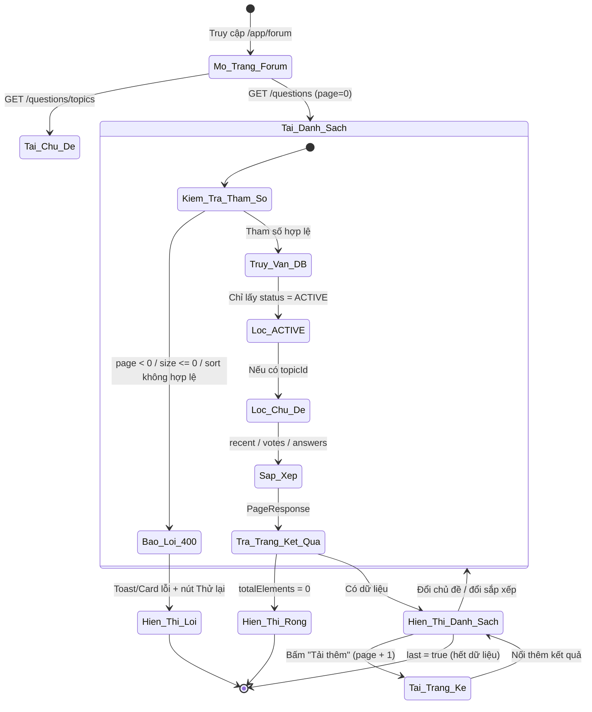
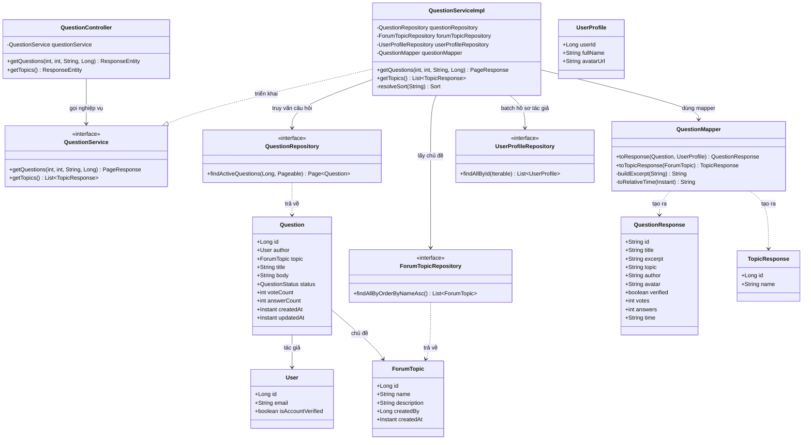
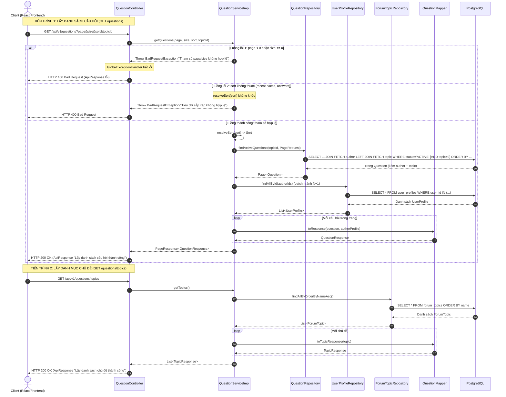

# ĐẶC TẢ YÊU CẦU & THIẾT KẾ CHI TIẾT: UC38 - XEM DANH SÁCH CÂU HỎI (VIEW QUESTION LIST)

## PHẦN 1: ĐẶC TẢ NGHIỆP VỤ (REPORT 3)

### 2.2.3 Business Workflow (Luồng nghiệp vụ)

#### Mô tả chi tiết luồng xử lý bằng chữ (Business Step Description):
* **Bước 1 - Khởi đầu**: Người dùng (Guest, Student hoặc Alumni) truy cập trang diễn đàn `/app/forum`. Frontend đồng thời gọi `GET /api/v1/questions/topics` để lấy danh mục chủ đề (đổ vào bộ lọc) và `GET /api/v1/questions` (trang đầu tiên, `page=0`) để lấy danh sách câu hỏi.
* **Bước 2 - Kiểm tra tham số**: Backend kiểm tra tham số phân trang và sắp xếp. Nếu `page` < 0, `size` ≤ 0, hoặc `sort` không thuộc `{recent, votes, answers}` → trả về HTTP 400 kèm thông điệp lỗi tiếng Việt. Nếu hợp lệ, tiến hành truy vấn.
* **Bước 3 - Truy vấn & lọc**: Hệ thống chỉ lấy các câu hỏi ở trạng thái `ACTIVE` (loại bỏ `HIDDEN`/`DELETED`). Nếu có `topicId`, lọc thêm theo chủ đề (dùng LEFT JOIN để không loại câu hỏi chưa phân loại khi không lọc). Sắp xếp theo tiêu chí đã chọn: mới nhất (`recent`), nhiều vote (`votes`), hoặc nhiều câu trả lời (`answers`).
* **Bước 4 - Trả kết quả & hiển thị**: Backend trả về `PageResponse` (danh sách + metadata phân trang). Frontend hiển thị: trạng thái rỗng nếu không có câu hỏi, hoặc danh sách thẻ câu hỏi. Người dùng có thể đổi chủ đề/tiêu chí sắp xếp (tải lại từ trang 0) hoặc bấm "Tải thêm câu hỏi" để nạp trang kế tiếp (infinite scroll) cho tới khi `last = true`.

---

### 3.2 Module Diễn đàn Hỏi–Đáp (Q&A Forum)
Module 4 của hệ thống, cung cấp không gian hỏi–đáp cho cộng đồng cựu sinh viên và sinh viên. UC38 là chức năng nền tảng: hiển thị danh sách câu hỏi để người dùng duyệt, lọc và tìm nội dung quan tâm trước khi xem chi tiết (UC39) hoặc đặt câu hỏi (UC khác).

#### 3.2.1 Xem danh sách câu hỏi (View Question List)

**Function trigger**:
*   **Navigation path**: `/app/forum` (tab "Q&A Forum" trên thanh điều hướng chính của ứng dụng).
*   **Timing Frequency**: On screen mount (khi vào trang) và On demand (khi đổi bộ lọc/sắp xếp hoặc tải thêm trang).

**Function description**:
*   **Actors/Roles**: Guest (khách vãng lai chưa đăng nhập), Student, Alumni. Danh sách câu hỏi là nội dung công khai nên cả ba đều xem được.
*   **Purpose**: Cho phép người dùng duyệt danh sách câu hỏi công khai của diễn đàn, lọc theo chủ đề và sắp xếp theo nhiều tiêu chí để nhanh chóng tìm được nội dung quan tâm.
*   **Interface**:
    *   **Tiêu đề trang**: Biểu tượng + "Q&A Forum" + phụ đề. Nút "Đặt câu hỏi" chỉ hiển thị với thành viên đã đăng nhập (Student/Alumni).
    *   **Bộ lọc chủ đề**: Dãy nút bo tròn gồm "All" + các chủ đề lấy từ API (Career, Interview, Engineering, Education, Salary, General). Nút đang chọn có nền gradient thương hiệu.
    *   **Bộ chọn sắp xếp**: 3 nút — Newest (recent), Top voted (votes), Most answered (answers).
    *   **Danh sách câu hỏi**: Mỗi thẻ gồm số vote (bên trái), badge chủ đề, tiêu đề, đoạn trích nội dung (≤160 ký tự), và chân thẻ (avatar + tên tác giả + huy hiệu verified + thời gian tương đối + số câu trả lời).
    *   **Trạng thái**: Skeleton (đang tải), Card lỗi + nút "Thử lại" (lỗi), thông báo rỗng + nút "Xóa bộ lọc" (không có dữ liệu), nút "Tải thêm câu hỏi" (còn trang).

**Data processing**:
1.  **Lấy chủ đề**: Client gọi `GET /api/v1/questions/topics` để lấy danh sách `{ id, name }` đổ vào bộ lọc.
2.  **Lấy câu hỏi**: Client gọi `GET /api/v1/questions?page={n}&size={m}&sort={s}[&topicId={id}]`. Interceptor Axios tự bóc `ApiResponse.data`.
3.  **Backend xử lý**: Kiểm tra tham số → truy vấn `questions` (JOIN FETCH tác giả, LEFT JOIN FETCH chủ đề, lọc `status = ACTIVE`) → truy vấn gộp (batch) `user_profiles` của các tác giả (tránh N+1) → map sang `QuestionResponse` phẳng → bọc trong `PageResponse`.
4.  **Client hiển thị**: Zod `safeParse` chuẩn hóa từng phần tử (bỏ phần tử hỏng), gộp các trang đã tải và render; suy ra `hasMore` từ trường `last` để bật/tắt nút "Tải thêm".

**Screen layout**:
*   *Figure 1: Màn hình danh sách câu hỏi diễn đàn (trạng thái có dữ liệu).*
*   *Figure 2: Trạng thái đang tải (skeleton) và trạng thái rỗng.*

**Function details**:
*   **Data**:
    *   Tham số đầu vào: `page` (int, ≥ 0, mặc định 0), `size` (int, ≥ 1, mặc định 10), `sort` (String: `recent`/`votes`/`answers`, mặc định `recent`), `topicId` (Long, tùy chọn).
    *   Dữ liệu trả về mỗi câu hỏi (`QuestionResponse`): `id` (String), `title` (String), `excerpt` (String), `topic` (String), `author` (String), `avatar` (String), `verified` (boolean), `votes` (int), `answers` (int), `time` (String — thời gian tương đối).
    *   Danh mục chủ đề (`TopicResponse`): `id` (Long), `name` (String).
*   **Validation**:
    *   `page`: phải là số nguyên không âm.
    *   `size`: phải là số nguyên dương.
    *   `sort`: phải thuộc `{recent, votes, answers}`.
    *   `topicId`: tùy chọn; nếu không tồn tại chủ đề tương ứng thì kết quả rỗng (không lỗi).
*   **Business rules**: Xem mục 5.1 (BR-38-01 → BR-38-06).
*   **Error Handling**:
    *   HTTP 400 khi tham số phân trang/sắp xếp không hợp lệ (thông điệp tiếng Việt).
    *   HTTP 500 (bắt tập trung ở `GlobalExceptionHandler`) cho lỗi hệ thống ngoài dự kiến — Frontend hiển thị Card lỗi + nút Thử lại.
*   **Normal case**: Tham số hợp lệ → trả về HTTP 200 kèm một trang câu hỏi `ACTIVE` đã sắp xếp/lọc; Frontend hiển thị danh sách và nút tải thêm.
*   **Abnormal case**:
    *   Tham số sai → HTTP 400, Frontend hiển thị thông điệp lỗi.
    *   Không có câu hỏi khớp bộ lọc → HTTP 200 với `content` rỗng, Frontend hiển thị trạng thái "Chưa có câu hỏi nào".

---

### 5. Requirement Appendix (Phụ lục Yêu cầu)

#### 5.1 Business Rules (Quy tắc Nghiệp vụ)

| ID | Định nghĩa Quy tắc (Rule Definition) |
| :--- | :--- |
| BR-38-01 | Danh sách câu hỏi là nội dung công khai: Guest (chưa đăng nhập), Student và Alumni đều xem được. |
| BR-38-02 | Chỉ hiển thị câu hỏi ở trạng thái `ACTIVE`; câu hỏi `HIDDEN` (bị Admin ẩn) và `DELETED` (đã xóa mềm) không được liệt kê. |
| BR-38-03 | Kết quả được phân trang: `page` mặc định 0 (0-based), `size` mặc định 10. `page` phải ≥ 0, `size` phải ≥ 1. |
| BR-38-04 | Hỗ trợ 3 tiêu chí sắp xếp: `recent` (mới nhất trước — mặc định), `votes` (nhiều vote trước), `answers` (nhiều câu trả lời trước). Mọi tiêu chí đều thêm `createdAt DESC` làm điều kiện phụ để kết quả ổn định. |
| BR-38-05 | Có thể lọc theo `topicId`. Khi không lọc, các câu hỏi chưa phân loại chủ đề (topic = null) vẫn xuất hiện. |
| BR-38-06 | Nút "Đặt câu hỏi" chỉ hiển thị với thành viên đã đăng nhập (Student/Alumni); Guest không thấy (chức năng đặt câu hỏi thuộc UC khác). |

#### 5.2 Common Requirements (Yêu cầu Chung)
*   Mọi thông điệp lỗi hiển thị cho người dùng bằng **Tiếng Việt**.
*   Danh sách được phân trang (không tải toàn bộ), dùng `PageResponse` để tối ưu truy vấn và băng thông.
*   Khi tải dữ liệu dùng hiệu ứng xương (shimmer skeleton), không dùng spinner thô.
*   Ảnh đại diện tác giả dùng component `<Avatar>` (tự xử lý ảnh lỗi → chữ cái initials).

#### 5.3 Application Messages List (Danh sách Thông điệp Ứng dụng)

| # | Mã thông điệp | Loại thông điệp | Ngữ cảnh | Nội dung hiển thị |
| :--- | :--- | :--- | :--- | :--- |
| 1 | MSG-QL-01 | Toast/Response | Lấy danh sách thành công | Lấy danh sách câu hỏi thành công |
| 2 | MSG-QL-02 | Toast/Response | Lấy danh mục chủ đề thành công | Lấy danh sách chủ đề thành công |
| 3 | MSG-QL-03 | Alert/Response 400 | Tham số page âm | Tham số page phải là số nguyên không âm |
| 4 | MSG-QL-04 | Alert/Response 400 | Tham số size ≤ 0 | Tham số size phải là số nguyên dương |
| 5 | MSG-QL-05 | Alert/Response 400 | Tiêu chí sắp xếp không hợp lệ | Tiêu chí sắp xếp không hợp lệ: {giá trị} |
| 6 | MSG-QL-06 | Card lỗi + nút Thử lại | Lỗi hệ thống khi tải danh sách | Không tải được danh sách câu hỏi. {message} |
| 7 | MSG-QL-07 | Trạng thái rỗng | Không có câu hỏi khớp bộ lọc | Chưa có câu hỏi nào. Thử đổi chủ đề khác, hoặc là người đầu tiên đặt câu hỏi. |

---

## PHẦN 2: THIẾT KẾ CHI TIẾT (REPORT 4)

### 3. Detail Design (Thiết kế chi tiết)

#### 3.1 Chức năng Xem danh sách câu hỏi (View Question List)

##### 3.1.1 Class Diagram (Sơ đồ Lớp)

###### Mô tả chi tiết cấu trúc các lớp (Class Design Description):
* **Lớp Controller (`QuestionController`)**: Tiếp nhận `GET /questions` (danh sách, có tham số `page/size/sort/topicId`) và `GET /questions/topics` (danh mục chủ đề). Trả về `ResponseEntity<ApiResponse<...>>`. Cả hai được khai báo công khai trong `Endpoints.PUBLIC_GET`.
* **Lớp DTO (`QuestionResponse`, `TopicResponse`)**: `QuestionResponse` là DTO phẳng khớp 100% schema Zod `questionSchema` phía Frontend (không cần map thêm ở Client). `TopicResponse` chứa `id + name` cho bộ lọc.
* **Lớp Service (`QuestionService`, `QuestionServiceImpl`)**: `QuestionServiceImpl` kiểm tra tham số phân trang, chuyển `sort` sang đối tượng `Sort` (`resolveSort`), truy vấn trang câu hỏi, batch hồ sơ tác giả (tránh N+1), và map kết quả. Ném `BadRequestException` cho tham số không hợp lệ.
* **Lớp Mapper (`QuestionMapper`)**: Là `@Component` thường (không dùng MapStruct) vì phải ghép dữ liệu đa nguồn (Question + User + UserProfile + ForumTopic), cắt trích đoạn nội dung (`buildExcerpt`) và tính thời gian tương đối (`toRelativeTime`).
* **Lớp Repository & Entity**: `QuestionRepository.findActiveQuestions` dùng JPQL có JOIN FETCH tác giả + LEFT JOIN FETCH chủ đề, lọc `status = ACTIVE`, kèm `countQuery` riêng cho phân trang. `ForumTopicRepository` lấy danh mục theo tên. Các Entity `Question`, `ForumTopic` ánh xạ bảng `questions`, `forum_topics`; tái sử dụng `User`, `UserProfile` sẵn có.

##### 3.1.2 Sequence Diagram (Sơ đồ Tuần tự)

###### Mô tả chi tiết luồng xử lý bằng chữ (Sequence Flow Description):
1.  **TIẾN TRÌNH 1 - Lấy danh sách câu hỏi**:
    *   **Gửi Request**: Client gọi `GET /api/v1/questions` kèm `page/size/sort/topicId`.
    *   **Luồng lỗi 1 (tham số phân trang)**: Nếu `page < 0` hoặc `size <= 0`, Service ném `BadRequestException` → `GlobalExceptionHandler` trả HTTP 400.
    *   **Luồng lỗi 2 (tiêu chí sắp xếp)**: Nếu `sort` không thuộc `{recent, votes, answers}`, `resolveSort` ném `BadRequestException` → HTTP 400.
    *   **Luồng thành công**: Service tạo `Sort`, gọi `findActiveQuestions` (JOIN FETCH tác giả + LEFT JOIN FETCH chủ đề, chỉ lấy `ACTIVE`, lọc `topicId` nếu có, sắp xếp). Sau đó batch truy vấn `UserProfile` của toàn bộ tác giả (tránh N+1), map từng câu hỏi sang `QuestionResponse`, đóng gói `PageResponse` và trả HTTP 200.
2.  **TIẾN TRÌNH 2 - Lấy danh mục chủ đề**:
    *   Client gọi `GET /api/v1/questions/topics`. Service lấy toàn bộ chủ đề theo tên (A→Z), map sang `TopicResponse` và trả HTTP 200 để Frontend đổ vào bộ lọc.
