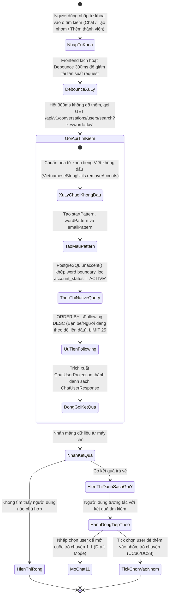
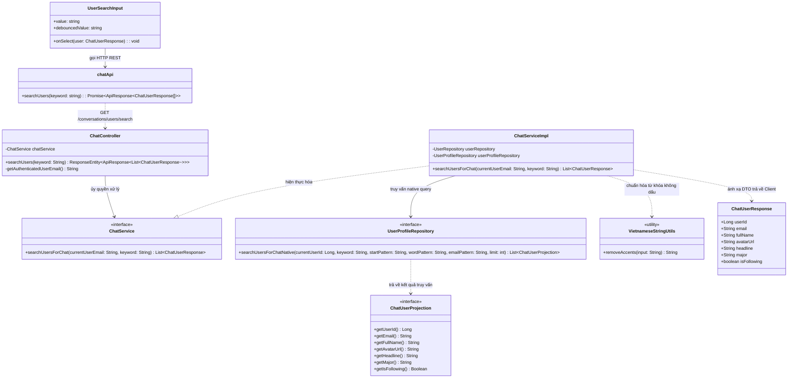
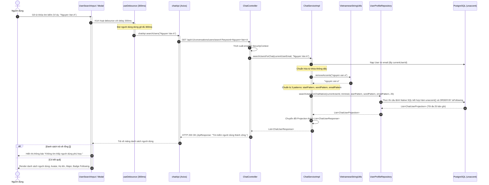

# ĐẶC TẢ YÊU CẦU & THIẾT KẾ CHI TIẾT: UC39 - TÌM KIẾM NGƯỜI DÙNG CHO CHỨC NĂNG CHAT (SEARCH USERS FOR CHAT)

## PHẦN 1: ĐẶC TẢ NGHIỆP VỤ (REPORT 3)

### 2.2.3 Business Workflow (Luồng nghiệp vụ)



#### Mô tả chi tiết luồng xử lý bằng chữ (Business Step Description):
* **Bước 1 - Khởi đầu**:
  * Người dùng tương tác với ô tìm kiếm người dùng trong các ngữ cảnh:
    1. Ô tìm kiếm tại thanh Hộp thư để bắt đầu cuộc trò chuyện mới.
    2. Ô tìm kiếm người dùng trong Modal "Tạo nhóm trò chuyện" (`CreateGroupModal`).
    3. Ô tìm kiếm người dùng trong Modal "Thêm thành viên" (`AddMembersModal`).
  * Người dùng gõ tên tiếng Việt (có dấu hoặc không dấu) hoặc địa chỉ email.
* **Bước 2 - Các bước chuyển tiếp**:
  * **Cơ chế chống rung (Debounce 300ms)**:
    * Để ngăn ngừa việc gửi liên tục các HTTP request lên máy chủ theo từng phím gõ, Frontend sử dụng kỹ thuật Debounce với thời gian chờ 300ms. Chỉ khi người dùng ngừng gõ quá 300ms, request tìm kiếm mới chính thức được kích hoạt.
  * **Xử lý tìm kiếm thông minh tại Backend**:
    * Tiếp nhận tham số `keyword` (nếu để trống hoặc null thì trả về danh sách gợi ý người đang theo dõi).
    * Backend sử dụng lớp tiện ích `VietnameseStringUtils.removeAccents()` để chuyển đổi từ khóa về dạng chữ thường không dấu (ví dụ: *"Nguyễn"* $\rightarrow$ *"nguyen"*).
    * Sinh các mẫu tìm kiếm SQL tối ưu:
      * `startPattern = unaccented + "%"`: Khớp người dùng có họ hoặc từ đầu tiên bắt đầu bằng từ khóa.
      * `wordPattern = "% " + unaccented + "%"`: Khớp ranh giới từ (Word boundary), giúp tìm chính xác người dùng theo tên hoặc tên đệm (ví dụ tìm *"An"* sẽ khớp *"Nguyễn Thành An"* chứ không bị khớp nhầm vào *"Đoàn"*).
      * `emailPattern = keyword.toLowerCase() + "%"`: Khớp tìm kiếm theo tiền tố tài khoản email.
    * Thực thi câu truy vấn Native SQL hiệu năng cao trên PostgreSQL sử dụng extension `unaccent`:
      * Điều kiện an toàn: Tài khoản phải có `account_status = 'ACTIVE'` và `id != currentUserId` (tự động loại trừ tài khoản bị khóa và chính người tìm kiếm).
      * Tiêu chí sắp xếp nghiệp vụ: Ưu tiên người dùng mà người tìm kiếm đang theo dõi lên đầu tiên (`f.follower_id IS NOT NULL THEN 0 ELSE 1 END ASC`), sau đó mới đến thứ tự bảng chữ cái theo họ tên (`p.full_name ASC`).
      * Giới hạn kết quả: Tối đa 25 bản ghi (`LIMIT 25`) để bảo đảm tốc độ phản hồi tức thì.
  * **Hiển thị kết quả trên Client**:
    * Nếu không tìm thấy ai: Hiển thị thông báo *"Không tìm thấy người dùng phù hợp"*.
    * Nếu có kết quả: Hiển thị danh sách thẻ người dùng với ảnh đại diện tròn, họ và tên đầy đủ, nhãn chuyên ngành hoặc tiêu đề nghề nghiệp (`headline`), kèm huy hiệu "Đang theo dõi" (Following) nếu đã kết nối.
* **Bước 3 - Kết thúc**:
  * Người dùng nhấp chọn đối tượng tìm kiếm:
    * Nếu trong ngữ cảnh Chat: Điều hướng và mở khung chat trực tiếp 1-1 với người đó ở chế độ Draft (UC33).
    * Nếu trong ngữ cảnh Tạo nhóm / Thêm thành viên: Đánh dấu tick chọn người đó vào danh sách chuẩn bị thêm (UC36, UC38).

---

### 3.2 Module Tin Nhắn & Trò Chuyện Trực Tiếp (Direct Messaging & Chat)

#### 3.2.1 Tìm kiếm người dùng cho chức năng chat & nhóm (UC39 - Search Users For Chat)

**Function trigger**:
* **Navigation path**: Ô tìm kiếm trên trang `/app/messages`, ô tìm kiếm trong `CreateGroupModal` hoặc ô tìm kiếm trong `GroupInfoModal`.
* **Timing Frequency**: Khi người dùng nhập từ khóa tìm kiếm (kích hoạt sau 300ms debounce) hoặc khi mở modal (hiển thị danh sách bạn bè gợi ý ban đầu).

**Function description**:
* **Actors/Roles**: Tất cả người dùng đã đăng nhập (`STUDENT`, `ALUMNI`).
* **Purpose**: Cung cấp công cụ tìm kiếm nhanh chóng, linh hoạt và chính xác các thành viên trong mạng lưới cựu sinh viên & sinh viên để bắt đầu cuộc trò chuyện mới hoặc thêm vào các nhóm học tập, hỗ trợ tiếng Việt không dấu và tự động ưu tiên các mối quan hệ đã kết nối.
* **Interface**:
  * **Thanh tìm kiếm (Search Input)**: Có biểu tượng kính lúp, nút xóa nhanh từ khóa (Clear icon).
  * **Trạng thái nạp (Searching Indicator)**: Icon loading xoay nhẹ nhàng khi đang xử lý debounce và fetch dữ liệu.
  * **Danh sách kết quả tìm kiếm (User List)**:
    * Avatar người dùng (kèm ảnh mặc định nếu chưa cập nhật).
    * Họ và tên đầy đủ (làm nổi bật ký tự khớp nếu cần).
    * Thông tin chuyên ngành đào tạo (Major) và tiêu đề cá nhân (Headline).
    * Huy hiệu "Đang theo dõi" màu xanh nhạt.
  * **Trạng thái không có kết quả (Empty State)**: Thông báo ngắn gọn và thân thiện.

**Data processing**:
* Trích xuất danh tính người dùng hiện tại từ token JWT.
* Chuyển đổi từ khóa sang không dấu bằng thuật toán Unicode normalization.
* Thực thi native query PostgreSQL kết hợp toán tử `unaccent()`, khớp đầu từ và khớp email.
* Phân loại quan hệ xã hội thông qua bảng `follows`.
* Giới hạn 25 kết quả và trả về mảng `ChatUserResponse`.

**Screen layout**:
* Dạng danh sách thả xuống (Dropdown List) ngay dưới thanh tìm kiếm hoặc dạng danh sách cuộn trong thân Modal.

**Function details**:
* **Data**:
  * Query Parameter: `keyword` (String, tùy chọn, tối đa 100 ký tự).
  * Response: Danh sách `ChatUserResponse` (`userId`, `email`, `fullName`, `avatarUrl`, `headline`, `major`, `isFollowing`).
* **Validation**:
  * Không có ràng buộc bắt buộc với keyword (nếu null/rỗng thì trả về danh sách bạn bè gợi ý).
* **Business rules**:
  * `BR-39-01`: Chỉ tìm kiếm và hiển thị các tài khoản người dùng có trạng thái hoạt động bình thường (`account_status = 'ACTIVE'`). Các tài khoản bị khóa (`LOCKED`), chờ duyệt (`PENDING`) tuyệt đối không xuất hiện trong kết quả.
  * `BR-39-02`: Hệ thống không bao giờ trả về chính người đang thực hiện tìm kiếm (`u.id != currentUserId`).
  * `BR-39-03`: Hỗ trợ tìm kiếm tiếng Việt không dấu: người dùng gõ *"nguyen tuan anh"* vẫn tìm thấy *"Nguyễn Tuấn Anh"*.
  * `BR-39-04`: Áp dụng quy tắc khớp ranh giới từ (Word Boundary Matching): gõ *"Linh"* sẽ khớp *"Ngô Thùy Linh"*, nhưng không khớp nhầm *"Lý Hải Linh"*.
  * `BR-39-05`: Kết quả tìm kiếm luôn ưu tiên xếp những người dùng mà người tìm kiếm đang theo dõi (Following) lên trên cùng.
  * `BR-39-06`: Giới hạn kết quả tối đa 25 người dùng cho mỗi lần tìm kiếm để đảm bảo độ trễ phản hồi thấp nhất.
* **Error Handling**:
  * `401 Unauthorized`: Token hết hạn $\rightarrow$ Điều hướng về trang đăng nhập.
  * `500 Internal Server Error`: Lỗi DB $\rightarrow$ Báo lỗi hệ thống và trả về mảng rỗng trên UI.
* **Normal case**: Người dùng gõ từ khóa, kết quả trả về trong dưới 50ms, danh sách hiển thị mượt mà.
* **Abnormal case**: Mất kết nối Internet khi đang gõ $\rightarrow$ Hiển thị thông báo mất kết nối, tự động retry khi có mạng trở lại.

---

### 5. Requirement Appendix (Phụ lục Yêu cầu)

#### 5.1 Business Rules (Quy tắc Nghiệp vụ)

| ID | Định nghĩa Quy tắc (Rule Definition) |
| :--- | :--- |
| **BR-39-01** | Chỉ người dùng có tài khoản `ACTIVE` mới được hiển thị trong kết quả tìm kiếm. |
| **BR-39-02** | Loại trừ người dùng hiện tại khỏi toàn bộ kết quả tìm kiếm. |
| **BR-39-03** | Tìm kiếm không phân biệt chữ hoa, chữ thường và dấu tiếng Việt (Accent-insensitive). |
| **BR-39-04** | Khớp theo ranh giới từ tiếng Việt và tiền tố email. |
| **BR-39-05** | Ưu tiên các người dùng nằm trong danh sách đang theo dõi (`isFollowing = true`) xếp ở đầu danh sách kết quả. |
| **BR-39-06** | Cắt giới hạn tối đa 25 kết quả trả về cho mỗi truy vấn tìm kiếm. |

#### 5.2 Common Requirements (Yêu cầu Chung)
* Phía Client bắt buộc phải cấu hình Debounce tối thiểu 300ms đối với ô nhập liệu tìm kiếm.
* CSDL PostgreSQL phải cài đặt và kích hoạt extension `unaccent`.
* Thời gian thực thi truy vấn tìm kiếm người dùng trên DB phải đạt dưới 30ms.

#### 5.3 Application Messages List (Danh sách Thông điệp Ứng dụng)

| # | Mã thông điệp | Loại thông điệp | Ngữ cảnh | Nội dung hiển thị |
| :--- | :--- | :--- | :--- | :--- |
| 1 | `MSG-SEARCH-01` | In line | Tìm kiếm thành công | Tìm kiếm người dùng thành công. |
| 2 | `MSG-SEARCH-02` | In line | Không có kết quả phù hợp | Không tìm thấy người dùng phù hợp. |
| 3 | `MSG-SEARCH-03` | Placeholder | Ô tìm kiếm người dùng | Tìm kiếm theo tên hoặc email... |
| 4 | `MSG-SEARCH-04` | Badge | Nhãn người dùng đã theo dõi | Đang theo dõi |

---

## PHẦN 2: THIẾT KẾ CHI TIẾT (REPORT 4)

### 3. Detail Design (Thiết kế chi tiết)

#### 3.1 Tìm kiếm người dùng cho chức năng chat & nhóm (UC39 - Search Users For Chat)

##### 3.1.1 Class Diagram (Sơ đồ Lớp)



##### 3.1.2 Sequence Diagram (Sơ đồ Tuần tự Gộp)



##### 3.1.3 Thiết kế Cơ sở Dữ liệu & Native SQL (Database Query Design)

Tính năng tìm kiếm tối ưu hóa việc sử dụng Extension `unaccent` của PostgreSQL:

```sql
-- Kích hoạt extension unaccent nếu chưa có
CREATE EXTENSION IF NOT EXISTS unaccent;

-- Truy vấn native SQL trong UserProfileRepository:
SELECT p.user_id AS userId,
       u.email AS email,
       p.full_name AS fullName,
       p.avatar_url AS avatarUrl,
       p.headline AS headline,
       m.name AS major,
       CASE WHEN f.follower_id IS NOT NULL THEN true ELSE false END AS isFollowing
FROM user_profiles p
JOIN users u ON p.user_id = u.id
LEFT JOIN majors m ON p.major_id = m.id
LEFT JOIN follows f ON f.follower_id = :currentUserId AND f.following_id = p.user_id
WHERE u.account_status = 'ACTIVE'
  AND u.id != :currentUserId
  AND (
    :keyword IS NULL OR :keyword = ''
    OR unaccent(lower(p.full_name)) ILIKE :startPattern
    OR unaccent(lower(p.full_name)) ILIKE :wordPattern
    OR lower(u.email) LIKE :emailPattern
  )
ORDER BY
  CASE WHEN f.follower_id IS NOT NULL THEN 0 ELSE 1 END ASC,
  p.full_name ASC
LIMIT :limit;
```

##### 3.1.4 Đặc tả API Endpoint (API Specification)

* **URL**: `GET /api/v1/conversations/users/search?keyword={keyword}`
* **Query Parameters**:
  * `keyword` (String, tùy chọn): Từ khóa tìm kiếm theo tên hoặc email.
* **Tiêu đề Request**:
  * `Authorization`: `Bearer <jwt_access_token>`
* **Phản hồi thành công (HTTP 200 OK)**:
  ```json
  {
    "error": 0,
    "message": "Tìm kiếm người dùng thành công.",
    "data": [
      {
        "userId": 2,
        "email": "thib@alumnect.edu.vn",
        "fullName": "Trần Thị B",
        "avatarUrl": "https://pub.alumnect.edu.vn/avatar/user_2.jpg",
        "headline": "Software Engineer tại FPT Software",
        "major": "Kỹ thuật phần mềm",
        "isFollowing": true
      },
      {
        "userId": 5,
        "email": "vanan@alumnect.edu.vn",
        "fullName": "Lê Văn An",
        "avatarUrl": "https://pub.alumnect.edu.vn/avatar/user_5.jpg",
        "headline": "Chuyên viên Phân tích Dữ liệu",
        "major": "Hệ thống thông tin",
        "isFollowing": false
      }
    ]
  }
  ```
* **Phản hồi lỗi xác thực (HTTP 401 Unauthorized)**:
  ```json
  {
    "error": -1,
    "message": "Yêu cầu đăng nhập để truy cập tài nguyên.",
    "data": null
  }
  ```
