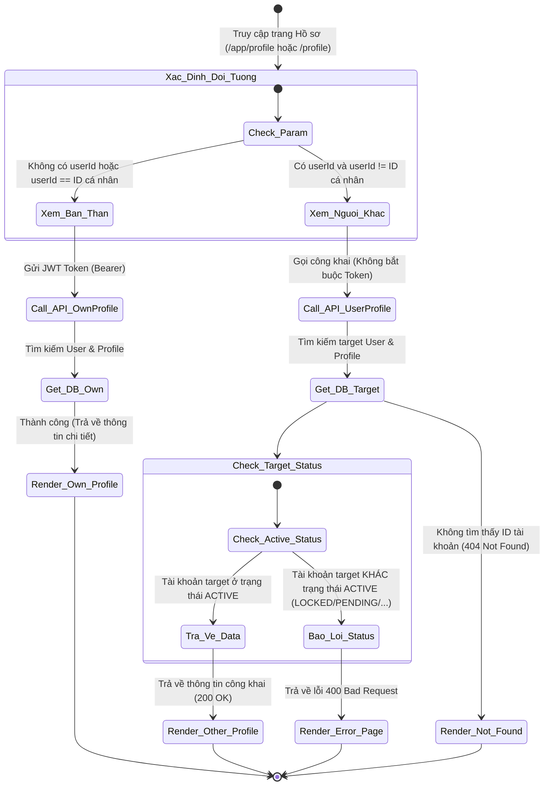
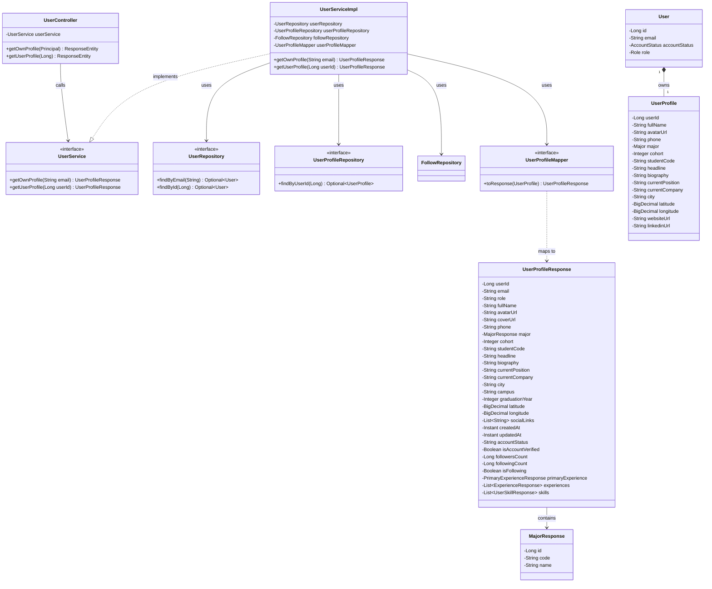
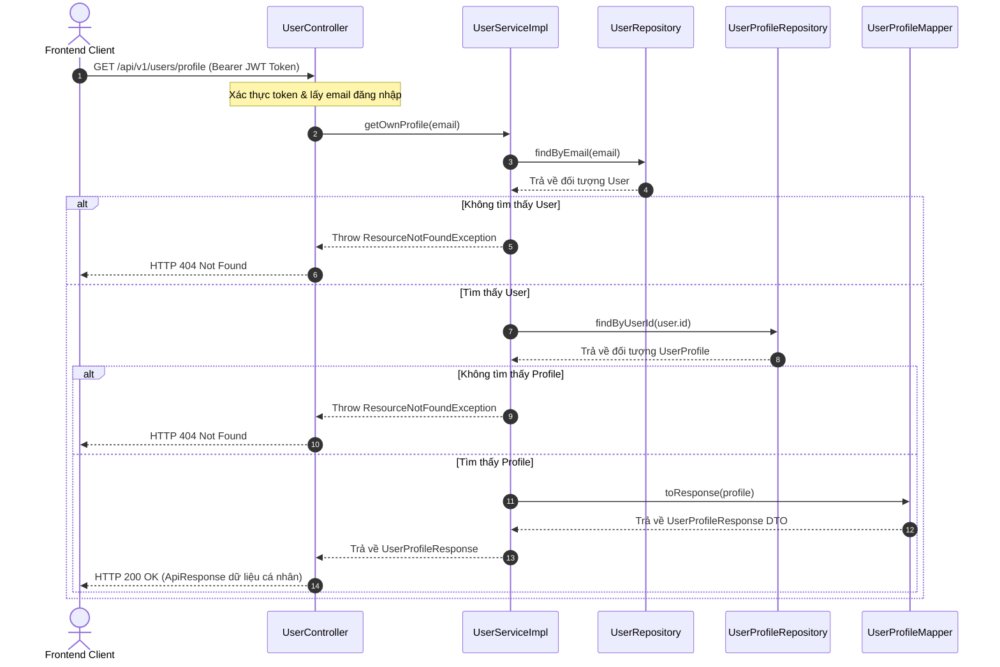
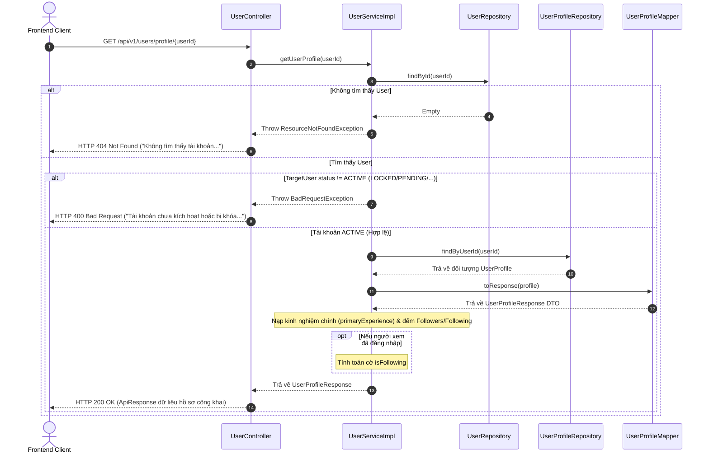

# ĐẶC TẢ YÊU CẦU & THIẾT KẾ CHI TIẾT: UC_ViewUserProfile - XEM HỒ SƠ NGƯỜI DÙNG

## PHẦN 1: ĐẶC TẢ NGHIỆP VỤ (REPORT 3)

### 2.2.3 Business Workflow (Luồng nghiệp vụ)

#### Mô tả chi tiết luồng xử lý bằng chữ (Business Step Description):
* **Bước 1 - Khởi đầu**: Người dùng hoặc khách truy cập vào trang Hồ sơ (`/app/profile` hoặc `/profile`). Frontend kiểm tra tham số truy vấn (query parameter `userId`).
  * Nếu không có `userId` hoặc `userId` trùng với ID của người đăng nhập hiện tại: Hệ thống xác định đây là luồng **Xem hồ sơ cá nhân**.
  * Nếu có `userId` và khác với ID cá nhân: Hệ thống xác định đây là luồng **Xem hồ sơ người dùng khác**.
* **Bước 2a - Luồng xem hồ sơ cá nhân**:
  * Client gửi yêu cầu `GET /api/v1/users/profile` kèm Bearer JWT Token.
  * Server kiểm tra token, tìm kiếm thông tin của người dùng đăng nhập trong cơ sở dữ liệu và trả về toàn bộ thông tin hồ sơ chi tiết (200 OK).
* **Bước 2b - Luồng xem hồ sơ người dùng khác**:
  * Client gửi yêu cầu `GET /api/v1/users/profile/{userId}` (truy cập công khai, không bắt buộc truyền token).
  * Server tìm kiếm người dùng theo `userId`. Nếu không thấy, trả về lỗi `404 Not Found`.
  * Nếu thấy, Server kiểm tra trạng thái hoạt động của tài khoản cần xem. Nếu trạng thái không phải `ACTIVE` (ví dụ bị khóa `LOCKED`, chưa xác thực `PENDING` hoặc đang chờ phê duyệt `WAITING_APPROVAL`), hệ thống ném ra lỗi `400 Bad Request` kèm thông báo chặn truy cập.
  * Nếu trạng thái là `ACTIVE`, hệ thống trả về thông tin hồ sơ công khai (200 OK).

---

### 3.3 Xem Hồ Sơ Người Dùng (Use Case Details)
Chịu trách nhiệm hiển thị thông tin hồ sơ cá nhân phục vụ giao lưu, kết nối cựu sinh viên và sinh viên tại Đại học FPT.

#### 3.3.1 Xem thông tin chi tiết hồ sơ
*   **Function trigger**:
    *   **Navigation path**: 
        *   Hồ sơ bản thân: Sidebar / Header menu -> Click "Trang cá nhân" (`/app/profile`).
        *   Hồ sơ người khác: Click vào Tên/Avatar của thành viên trên Bảng tin, Diễn đàn, Hỏi đáp, Bản đồ (`/app/profile?userId={id}`).
    *   **Timing Frequency**: Bất cứ khi nào người dùng muốn xem thông tin chi tiết hồ sơ.
*   **Function description**:
    *   **Actors/Roles**: Tất cả người dùng đã đăng nhập, ADMIN, hoặc khách vãng lai (xem hồ sơ công khai).
    *   **Purpose**: Cho phép người dùng xem thông tin chi tiết của bản thân (để chỉnh sửa, quản lý) hoặc của người dùng khác (để xem thông tin liên hệ, sự nghiệp, tìm kiếm kết nối).
    *   **Interface**: Giao diện Premium Pastel sang trọng với góc bo tròn lớn (`rounded-3xl`), thẻ trắng mềm (`pillowy white cards`), thông tin liên hệ, giới thiệu tiểu sử, và dòng thời gian hành trình sự nghiệp/học tập.
*   **Data processing**:
    *   Ánh xạ thực thể `UserProfile` và `User` sang cấu trúc DTO `UserProfileResponse` qua MapStruct.
    *   Kiểm tra quyền truy cập trạng thái tài khoản đối với hồ sơ của người dùng khác (Chỉ tài khoản `ACTIVE` mới được phép xem công khai).
*   **Function details**:
    *   **API 1 - Xem hồ sơ bản thân (Own Profile)**:
        *   Endpoint: `GET /api/v1/users/profile`
        *   Auth: Yêu cầu Bearer Token JWT hợp lệ.
    *   **API 2 - Xem hồ sơ người khác (Other Profile)**:
        *   Endpoint: `GET /api/v1/users/profile/{userId}`
        *   Auth: Công khai (Không bắt buộc token).
    *   **Business rules**:
        *   Người dùng xem hồ sơ của chính mình được phép xem bất kỳ lúc nào, kể cả khi trạng thái tài khoản là `PENDING` hoặc `LOCKED`.
        *   Khi xem hồ sơ của người khác (Other Profile), tài khoản cần xem bắt buộc phải ở trạng thái `ACTIVE` đối với mọi đối tượng gọi API (kể cả ADMIN hay chính chủ khi gọi API công khai này). Nếu không, hệ thống chặn và báo lỗi 400.
    *   **Error Handling**:
        *   Xem tài khoản bị khóa/chưa kích hoạt (đối với người dùng khác): Trả về lỗi 400 Bad Request kèm thông báo: *"Tài khoản người dùng này chưa được kích hoạt hoặc đã bị khóa."*
        *   Không tồn tại ID người dùng cần xem: Trả về lỗi 404 Not Found kèm thông báo: *"Không tìm thấy tài khoản người dùng với ID: {userId}"*
    *   **Normal case**: Lấy thông tin thành công, trả về 200 OK kèm dữ liệu hồ sơ dạng JSON.
    *   **Abnormal case**: Lỗi kết nối DB.

---

### 5. Phụ Lục Nghiệp Vụ (Requirement Appendix)

#### 5.1 Business Rules (Quy tắc Nghiệp vụ)

| ID | Định nghĩa Quy tắc (Rule Definition) |
| :--- | :--- |
| BR-08 | Chỉ những tài khoản có trạng thái hoạt động là `ACTIVE` mới được phép xem công khai bởi người khác. |
| BR-09 | Quy tắc xem hồ sơ người khác áp dụng thống nhất cho tất cả các đối tượng (kể cả ADMIN và chính chủ khi gọi API công khai). |

#### 5.3 Application Messages List (Danh sách Thông điệp Ứng dụng)

| # | Mã thông điệp (Message code) | Loại thông điệp (Message Type) | Ngữ cảnh (Context) | Nội dung hiển thị (Content) |
| :--- | :--- | :--- | :--- | :--- |
| 1 | MSG_PROF_01 | Banner / Alert / Modal | Xem tài khoản bị khóa hoặc chưa kích hoạt | Tài khoản người dùng này chưa được kích hoạt hoặc đã bị khóa. |
| 2 | MSG_PROF_02 | Banner / Alert / Modal | Xem tài khoản không tồn tại ID trong DB | Không tìm thấy tài khoản người dùng với ID: {userId} |

---

## PHẦN 2: THIẾT KẾ CHI TIẾT (REPORT 4)

### 3. Detail Design (Thiết kế chi tiết)

#### 3.1 Xem hồ sơ người dùng (UC_ViewUserProfile)

##### 3.1.1 Class Diagram (Sơ đồ Lớp)

##### 3.1.2 Sequence Diagram (Sơ đồ Tuần tự)

###### Luồng A: Lấy hồ sơ cá nhân của chính mình (Đăng nhập bắt buộc)

###### Luồng B: Lấy hồ sơ người dùng khác (Công khai)

