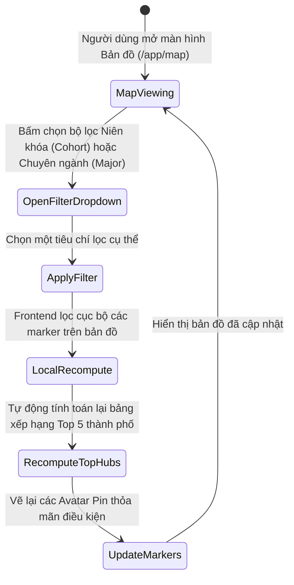
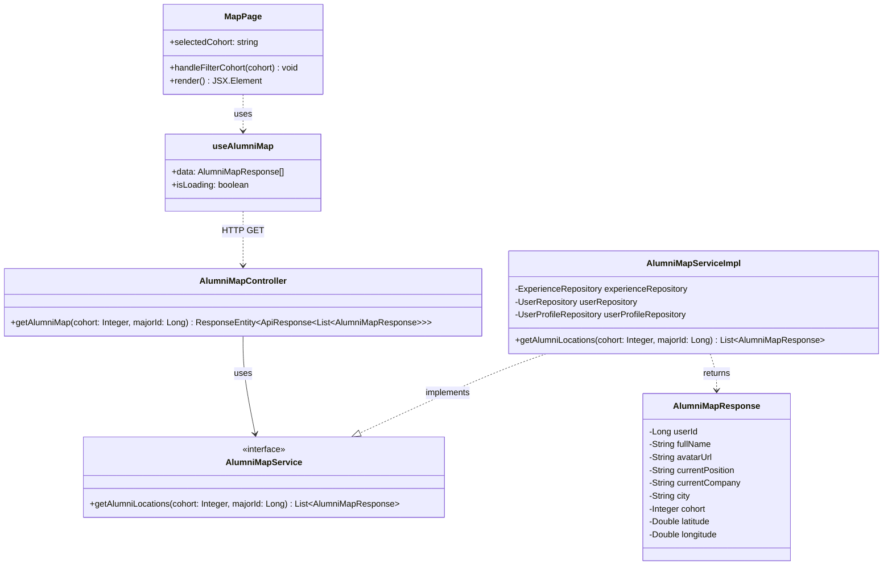
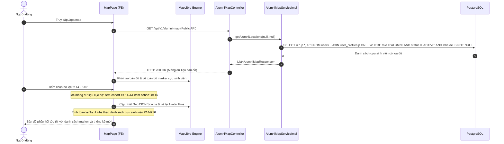

# ĐẶC TẢ YÊU CẦU & THIẾT KẾ CHI TIẾT: UC56 - LỌC CỰU SINH VIÊN TRÊN BẢN ĐỒ (FILTER ALUMNI MAP)

## PHẦN 1: ĐẶC TẢ NGHIỆP VỤ (REPORT 3)

### 2.2.3 Business Workflow (Luồng nghiệp vụ)

#### Mô tả chi tiết luồng xử lý bằng chữ (Business Step Description):
* **Bước 1 - Khởi đầu**: Người dùng (Khách vãng lai, Sinh viên, Cựu sinh viên) truy cập màn hình Bản đồ mạng lưới cựu sinh viên tại đường dẫn `/app/map`. Dữ liệu bản đồ toàn bộ cựu sinh viên có tọa độ đã được nạp sẵn.
* **Bước 2 - Chọn bộ lọc**: Người dùng bấm chọn các nút bộ lọc khóa học (All cohorts, K11-K13, K14-K16, K17+) hoặc chọn chuyên ngành học từ thanh công cụ bản đồ.
* **Bước 3 - Cập nhật dữ liệu hiển thị**: Hệ thống tự động lọc danh sách cựu sinh viên thỏa mãn điều kiện lọc. Engine MapLibre GL JS gỡ bỏ các marker không thỏa mãn và giữ lại các Avatar Pin của cựu sinh viên phù hợp.
* **Bước 4 - Tính toán lại thống kê (Analytics)**: Bảng thống kê Top Hubs (Top 5 thành phố có mật độ cựu sinh viên cao nhất) ở thanh bên phải tự động tính toán lại tỷ lệ và số lượng dựa trên tập dữ liệu đã lọc mà không cần tải lại toàn bộ trang.

---

### 3.2 Module Bản Đồ (3.2 Alumni Map Module)

#### 3.2.1 Lọc cựu sinh viên trên bản đồ (UC56)

**Function trigger**:
* **Navigation path**: Navbar -> "Alumni Map" -> `/app/map` -> Nút bộ lọc khóa học hoặc bộ chọn chuyên ngành.
* **Timing Frequency**: On demand (bất cứ khi nào người dùng muốn thu hẹp phạm vi hiển thị cựu sinh viên).

**Function description**:
* **Actors/Roles**: Tất cả mọi người (Khách vãng lai, Sinh viên, Cựu sinh viên, Quản trị viên).
* **Purpose**: Cho phép người dùng linh hoạt lọc danh sách cựu sinh viên trên bản đồ theo niên khóa và chuyên ngành để nhanh chóng tìm kiếm các đồng môn cùng ngành nghề hoặc cùng thời gian học tập.
* **Interface**:
  * Các nút tròn chọn niên khóa: "Tất cả khóa", "K11 - K13", "K14 - K16", "K17+".
  * Thẻ chọn Chuyên ngành: Dropdown lọc theo ngành đào tạo (Kỹ thuật phần mềm, An toàn thông tin, Thiết kế đồ họa...).
  * Bảng Top Hubs: Thống kê 5 tỉnh/thành phố tập trung đông cựu sinh viên nhất theo bộ lọc hiện tại.

**Data processing**:
1. Client nhận dữ liệu danh sách cựu sinh viên từ API `GET /api/v1/alumni-map`.
2. Khi người dùng bấm nút lọc, hàm `filterAlumni` thực hiện lọc danh sách dựa trên trường `cohort` hoặc `majorId`.
3. Cập nhật state `filteredAlumni`.
4. Kích hoạt hiệu ứng mờ dần (fade out) các marker không khớp và hiển thị nổi bật các marker thỏa mãn.
5. Hàm `computeTopHubs` đếm số lượng cựu sinh viên theo `city` từ mảng đã lọc và sắp xếp giảm dần.

**Screen layout**:
* Figure 56.1: Giao diện bản đồ với các nút bộ lọc khóa học nổi ở góc trên và bảng Top Hubs bên phải.

**Function details**:
* **Data**: `cohort`, `majorId`, danh sách `AlumniMapResponse`.
* **Validation**: Tham số bộ lọc phải thuộc danh mục hợp lệ. Nếu không có kết quả khớp, hiển thị thông báo bản đồ trống.
* **Business rules**:
  * Lọc cục bộ phía Client tối ưu hóa trải nghiệm người dùng, phản hồi tức thì dưới 16ms (60 FPS) không gây giật lag bản đồ.
  * Khi chọn "Tất cả khóa", hệ thống hoàn nguyên hiển thị toàn bộ cựu sinh viên có tọa độ hợp lệ.
* **Error Handling**: Nếu không có cựu sinh viên nào khớp bộ lọc, hiển thị thông báo "Không tìm thấy cựu sinh viên nào khớp với bộ lọc" trên nền bản đồ.
* **Normal case**: Người dùng chọn K14-K16, bản đồ lập tức cập nhật chỉ hiển thị cựu sinh viên các khóa này.
* **Abnormal case**: Dữ liệu cựu sinh viên bị thiếu trường `cohort`, bản ghi đó chỉ hiển thị khi chọn tab "Tất cả khóa".

---

### 5. Requirement Appendix (Phụ lục Yêu cầu)

#### 5.1 Business Rules (Quy tắc Nghiệp vụ)

| ID | Định nghĩa Quy tắc (Rule Definition) |
| :--- | :--- |
| BR-56-01 | Bộ lọc khóa học phân nhóm theo: K11-K13 (cohort 11..13), K14-K16 (cohort 14..16), K17+ (cohort >= 17). |
| BR-56-02 | Thống kê Top Hubs phải được tính toán lại theo thời gian thực (Real-time recalculation) dựa trên tập dữ liệu đã lọc. |
| BR-56-03 | Quá trình lọc không gửi lại request lên máy chủ nếu dữ liệu toàn bộ bản đồ đã được nạp thành công ở lần tải đầu. |

#### 5.3 Application Messages List (Danh sách Thông điệp Ứng dụng)

| # | Mã thông điệp (Message code) | Loại thông điệp (Message Type) | Ngữ cảnh (Context) | Nội dung hiển thị (Content) |
| :--- | :--- | :--- | :--- | :--- |
| 1 | MSG-MAP-FILT-01 | Toast / In line | Lọc dữ liệu thành công | Đã áp dụng bộ lọc bản đồ. |
| 2 | MSG-MAP-FILT-02 | In line overlay | Không có cựu sinh viên nào khớp bộ lọc | Không tìm thấy cựu sinh viên nào khớp với bộ lọc. |

---

## PHẦN 2: THIẾT KẾ CHI TIẾT (REPORT 4)

### 3. Detail Design (Thiết kế chi tiết)

#### 3.1 UC56 Lọc cựu sinh viên trên bản đồ (Filter Alumni Map)

##### 3.1.1 Class Diagram (Sơ đồ Lớp)

###### Mô tả chi tiết cấu trúc các lớp (Class Design Description):
* **Lớp Controller (`AlumniMapController.java`)**: Cung cấp API công khai `GET /api/v1/alumni-map`, hỗ trợ lọc tham số tùy chọn `cohort` và `majorId`.
* **Lớp DTO (`AlumniMapResponse.java`)**: Đối tượng truyền dữ liệu chứa tọa độ địa lý (`latitude`, `longitude`), thông tin nhận diện cơ bản và công việc hiện tại.
* **Lớp Service (`AlumniMapService.java`, `AlumniMapServiceImpl.java`)**: Xử lý logic truy vấn cơ sở dữ liệu, lọc các cựu sinh viên có tài khoản `ACTIVE` và tọa độ hợp lệ.
* **Lớp Frontend (`MapPage.tsx`, `useAlumniMap.ts`)**: Trang hiển thị bản đồ tích hợp MapLibre GL JS, quản lý trạng thái bộ lọc và kết xuất marker Avatar Pin.

##### 3.1.2 Sequence Diagram (Sơ đồ Tuần tự)

###### Mô tả chi tiết luồng xử lý bằng chữ (Sequence Flow Description):
1. **Khởi tạo dữ liệu**: Khi người dùng vào trang bản đồ, Frontend gửi yêu cầu `GET /api/v1/alumni-map` tới máy chủ. Backend truy vấn các cựu sinh viên có tọa độ hợp lệ và trả về mảng `AlumniMapResponse` (HTTP 200 OK). Bản đồ vẽ đầy đủ các marker ban đầu.
2. **Lọc dữ liệu tức thì**: Khi người dùng click chọn bộ lọc (ví dụ: K14-K16), Frontend lọc mảng dữ liệu trong bộ nhớ RAM, cập nhật nguồn dữ liệu GeoJSON cho engine MapLibre và vẽ lại marker. Đồng thời tính toán lại danh sách Top Hubs mà không cần tải lại trang hay gọi thêm request lên máy chủ.
