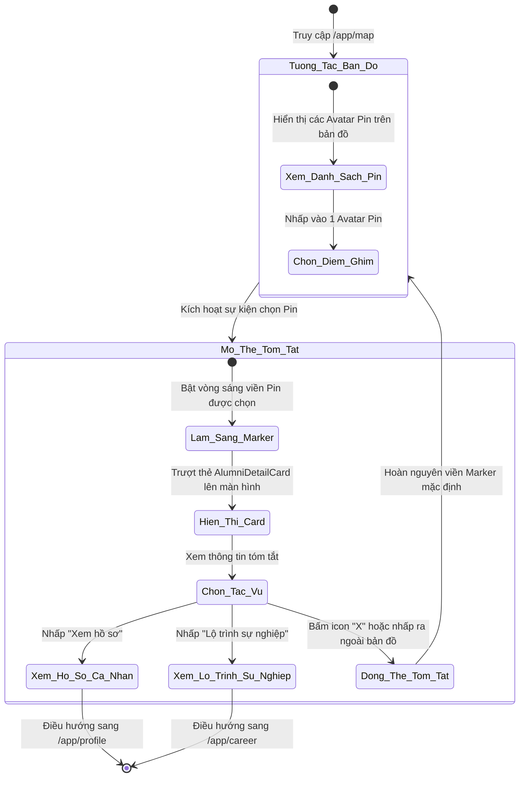
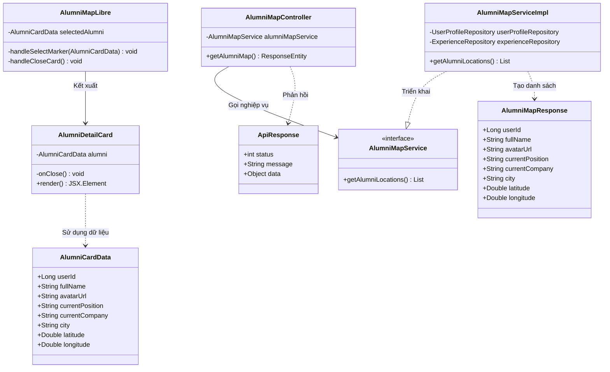
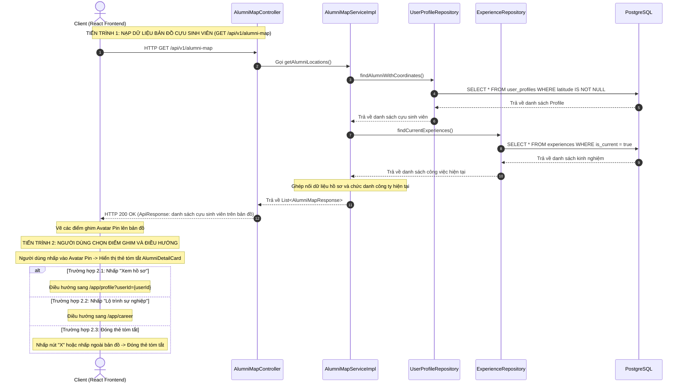

# ĐẶC TẢ YÊU CẦU & THIẾT KẾ CHI TIẾT: UC57 - XEM HỒ SƠ TỪ ĐIỂM GHIM BẢN ĐỒ (VIEW PROFILE FROM MAP MARKER)

## PHẦN 1: ĐẶC TẢ NGHIỆP VỤ (REPORT 3)

### 2.2.3 Business Workflow (Luồng nghiệp vụ)

#### Mô tả chi tiết luồng xử lý bằng chữ (Business Step Description):
* **Bước 1 - Khởi đầu**: Người dùng (Khách vãng lai, Sinh viên hoặc Cựu sinh viên) truy cập vào màn hình Bản đồ mạng lưới cựu sinh viên tại đường dẫn `/app/map`. Dữ liệu bản đồ toàn bộ cựu sinh viên đã nạp sẵn các điểm ghim định vị (Avatar Pin).
* **Bước 2 - Chọn điểm ghim cựu sinh viên**: Người dùng nhấp chuột hoặc chạm vào một Avatar Pin bất kỳ trên bản đồ.
* **Bước 3 - Hiển thị thẻ tóm tắt thông tin (`AlumniDetailCard`)**:
  * Hệ thống làm nổi bật điểm ghim được chọn bằng hiệu ứng vòng tròn sáng viền.
  * Hộp thoại tóm tắt `AlumniDetailCard` mở ra ở góc dưới màn hình (trên Desktop) hoặc dạng Bottom Card (trên Mobile) với hiệu ứng trượt mượt mà của Framer Motion.
  * Thẻ hiển thị các thông tin cơ bản: Ảnh đại diện (Avatar), Họ và tên, Vị trí chức danh hiện tại, Tên công ty làm việc, Tỉnh/Thành phố công tác, cùng 2 nút điều hướng hành động.
* **Bước 4 - Tương tác và điều hướng**:
  * Nếu người dùng bấm **"Xem hồ sơ"**: Hệ thống điều hướng người dùng tới trang thông tin cá nhân chi tiết của cựu sinh viên đó tại `/app/profile?userId={userId}`.
  * Nếu người dùng bấm **"Lộ trình sự nghiệp"**: Hệ thống điều hướng sang trang Lộ trình sự nghiệp tại `/app/career` để xem dòng thời gian các vị trí công việc đã trải qua.
  * Nếu người dùng bấm nút **"X"** hoặc nhấp chuột vào vùng trống trên nền bản đồ: Thẻ `AlumniDetailCard` đóng lại với hiệu ứng thu nhỏ mờ dần, điểm ghim hoàn nguyên về trạng thái hiển thị bình thường.

---

### 3.2 Module Bản Đồ Mạng Lưới Cựu Sinh Viên

#### 3.2.1 Xem hồ sơ từ điểm ghim bản đồ (View Profile from Map Marker)

**Function trigger**:
*   **Navigation path**: Bản đồ cựu sinh viên `/app/map` -> Nhấp chọn một điểm ghim (Avatar Pin) bất kỳ trên bản đồ MapLibre.
*   **Timing Frequency**: On demand (bất cứ khi nào người dùng muốn xem thông tin tóm tắt và hồ sơ của cựu sinh viên tại vị trí địa lý đó).

**Function description**:
*   **Actors/Roles**: Khách vãng lai (GUEST), Sinh viên (STUDENT), Cựu sinh viên (ALUMNI), Quản trị viên (ADMIN).
*   **Purpose**: Cung cấp khả năng tra cứu nhanh thông tin định danh và sự nghiệp của một cựu sinh viên trực tiếp từ điểm ghim trên bản đồ địa lý, hỗ trợ kết nối và điều hướng nhanh sang trang hồ sơ cá nhân hoặc lộ trình sự nghiệp.
*   **Interface**:
    *   **Điểm ghim Avatar Pin:** Điểm đánh dấu tròn chứa ảnh đại diện thu nhỏ, viền màu và mũi tên neo vị trí trên nền bản đồ MapLibre. Khi được chọn, điểm ghim hiển thị viền sáng nổi bật.
    *   **Thẻ tóm tắt thông tin cựu sinh viên (`AlumniDetailCard`):**
        *   Nút đóng "X" ở góc trên bên phải.
        *   Ảnh đại diện lớn kèm họ tên cựu sinh viên.
        *   Thông tin công việc: Chức danh hiện tại, tên công ty và tỉnh/thành phố làm việc.
        *   Thanh nút hành động: Nút **"Xem hồ sơ"** (Button chính) và nút **"Lộ trình sự nghiệp"** (Button phụ).

**Data processing**:
1.  **Nạp dữ liệu bản đồ:** Client gọi API `GET /api/v1/alumni-map` để lấy danh sách cựu sinh viên có tọa độ hợp lệ.
2.  **Kích hoạt chọn điểm ghim:** Khi người dùng click một marker, component bản đồ cập nhật biến trạng thái `selectedAlumni` và hiển thị thẻ tóm tắt.
3.  **Điều hướng trang:** Khi bấm nút hành động, hệ thống sử dụng React Router chuyển trang sang `/app/profile` hoặc `/app/career` kèm theo ID cựu sinh viên.

**Screen layout**:
*   *Figure 1: Màn hình Bản đồ mạng lưới cựu sinh viên với các điểm ghim Avatar Pin*
*   *Figure 2: Thẻ tóm tắt thông tin cựu sinh viên hiển thị nổi trên bản đồ (Desktop View)*
*   *Figure 3: Thẻ tóm tắt dạng Bottom Card trên thiết bị di động (Mobile View)*

**Function details**:
*   **Data**: 
    *   `userId` (Long, ID cựu sinh viên)
    *   `fullName` (String, họ và tên)
    *   `avatarUrl` (String, đường dẫn ảnh đại diện)
    *   `currentPosition` (String, chức danh hiện tại)
    *   `currentCompany` (String, công ty hiện tại)
    *   `city` (String, tỉnh/thành phố công tác)
    *   `latitude` (Double, vĩ độ)
    *   `longitude` (Double, kinh độ)
*   **Validation**: 
    *   Phía Client: Kiểm tra dữ liệu tọa độ hợp lệ trước khi vẽ marker trên bản đồ. Trường hợp chưa có thông tin công ty hoặc vị trí thì hiển thị văn bản dự phòng.
*   **Business rules**:
    *   **Quy tắc viền sáng điểm ghim:** Điểm ghim được chọn phải hiển thị viền sáng để phân biệt rõ ràng với các điểm ghim khác.
    *   **Quy tắc hiển thị duy nhất:** Chỉ hiển thị tối đa một thẻ tóm tắt tại một thời điểm trên màn hình bản đồ.
    *   **Quy tắc văn bản dự phòng:** Trường hợp cựu sinh viên chưa cập nhật công việc, hiển thị nhãn dự phòng *"Chưa cập nhật vị trí"* / *"Chưa cập nhật công ty"*.
*   **Error Handling**:
    *   Mã lỗi máy chủ (500 Internal Server Error) khi API nạp dữ liệu bản đồ gặp sự cố.
*   **Normal case**: Người dùng nhấp chọn điểm ghim, thẻ tóm tắt hiển thị đầy đủ thông tin và hỗ trợ điều hướng mượt mà sang trang hồ sơ chi tiết.
*   **Abnormal case**:
    *   Ảnh đại diện bị lỗi tải -> Tự động hiển thị Avatar mặc định dạng chữ cái đầu của tên.

---

### 5. Phụ lục Yêu cầu (Requirement Appendix)

#### 5.1 Quy tắc Nghiệp vụ (Business Rules)

| ID | Định nghĩa Quy tắc (Rule Definition) |
| :--- | :--- |
| BR-MAP-PIN-01 | Khi người dùng nhấp chọn một điểm ghim trên bản đồ, điểm ghim đó phải được làm sáng viền để người dùng nhận biết rõ vị trí đang tương tác. |
| BR-MAP-PIN-02 | Tại một thời điểm chỉ cho phép hiển thị duy nhất 01 thẻ tóm tắt cựu sinh viên. Nhấp chọn điểm ghim khác sẽ đóng thẻ hiện tại và mở thẻ mới tương ứng. |
| BR-MAP-PIN-03 | Trường hợp cựu sinh viên chưa cập nhật thông tin vị trí làm việc hoặc công ty, giao diện bắt buộc phải hiển thị nhãn dự phòng *"Chưa cập nhật vị trí"* / *"Chưa cập nhật công ty"*. |
| BR-MAP-PIN-04 | Tính năng xem tóm tắt thông tin cựu sinh viên từ điểm ghim bản đồ được mở tự do cho tất cả các đối tượng người dùng, bao gồm cả khách vãng lai. |

#### 5.2 Yêu cầu Chung (Common Requirements)
*   Mọi thông điệp và nhãn hiển thị trên thẻ tóm tắt phải bằng **Tiếng Việt**.
*   Hoạt ảnh xuất hiện và đóng thẻ tóm tắt phải mượt mà, sử dụng hiệu ứng chuyển động của Framer Motion.
*   Thẻ tóm tắt phải có kích thước tối đa phù hợp, không che khuất toàn bộ tầm nhìn của bản đồ trên màn hình máy tính.
*   Trên thiết bị di động, thẻ tóm tắt phải tự động neo cố định ở mép dưới màn hình (Bottom Card) với kích thước chạm ngón tay tối thiểu 44px.

#### 5.3 Danh sách Thông điệp Ứng dụng (Application Messages List)

| # | Mã thông điệp | Loại thông điệp | Ngữ cảnh | Nội dung hiển thị |
| :--- | :--- | :--- | :--- | :--- |
| 1 | MSG-MAP-PIN-01 | Fallback Label | Khi chưa có thông tin chức danh | Chưa cập nhật vị trí |
| 2 | MSG-MAP-PIN-02 | Fallback Label | Khi chưa có thông tin công ty | Chưa cập nhật công ty |
| 3 | MSG-MAP-PIN-03 | Fallback Label | Khi chưa có thông tin thành phố | Việt Nam |
| 4 | MSG-MAP-PIN-04 | Button Label | Nút điều hướng sang hồ sơ cá nhân | Xem hồ sơ |
| 5 | MSG-MAP-PIN-05 | Button Label | Nút điều hướng sang lộ trình sự nghiệp | Lộ trình sự nghiệp |

---

## PHẦN 2: THIẾT KẾ CHI TIẾT (REPORT 4)

### 3. Thiết kế chi tiết

#### 3.1 Chức năng Xem hồ sơ từ điểm ghim bản đồ (View Profile from Map Marker)

##### 3.1.1 Class Diagram (Sơ đồ Lớp)

###### Mô tả chi tiết cấu trúc các lớp (Class Design Description):
* **Lớp Giao diện Frontend (`AlumniMapLibre`, `AlumniDetailCard`)**:
  * `AlumniMapLibre`: Quản lý trạng thái bản đồ MapLibre, quản lý biến trạng thái `selectedAlumni` để quyết định hiển thị thẻ chi tiết và kích hoạt highlight marker được chọn.
  * `AlumniDetailCard`: Component hiển thị thông tin thẻ tóm tắt nổi (Floating Card) với Avatar, thông tin công việc, thành phố và cung cấp các nút điều hướng trang.
  * `AlumniCardData`: Đối tượng dữ liệu cựu sinh viên trên bản đồ.
* **Lớp Backend Controller & Service (`AlumniMapController`, `AlumniMapService`)**:
  * `AlumniMapController`: Cung cấp API `GET /api/v1/alumni-map` công khai cho phép lấy toàn bộ tọa độ và thông tin tóm tắt của cựu sinh viên có vị trí hợp lệ.
  * `AlumniMapServiceImpl`: Truy vấn CSDL, kết hợp thông tin hồ sơ `UserProfile` và kinh nghiệm công việc hiện tại `Experience` để tạo danh sách `AlumniMapResponse`.

##### 3.1.2 Sequence Diagram (Sơ đồ Tuần tự)

###### Mô tả chi tiết luồng xử lý bằng chữ (Sequence Flow Description):

1.  **TIẾN TRÌNH 1: NẠP DỮ LIỆU BẢN ĐỒ CỰU SINH VIÊN (Normal Case)**
    *   **Gửi Request:** Khi người dùng mở màn hình bản đồ `/app/map`, Client gửi yêu cầu HTTP `GET /api/v1/alumni-map`.
    *   **Xử lý phía Server:** `AlumniMapController` tiếp nhận yêu cầu và gọi `AlumniMapServiceImpl.getAlumniLocations()`. Service truy vấn danh sách hồ sơ có tọa độ hợp lệ từ `UserProfileRepository` và nạp thông tin chức danh, công ty hiện tại từ `ExperienceRepository`.
    *   **Tổng hợp & Trả kết quả:** Service tổng hợp dữ liệu thành danh sách `AlumniMapResponse` và trả về qua Controller với mã HTTP 200 OK. Phía Client kết xuất các điểm ghim Avatar Pin lên bản đồ MapLibre.

2.  **TIẾN TRÌNH 2: TƯƠNG TÁC ĐIỂM GHIM VÀ ĐIỀU HƯỚNG (Client Interaction)**
    *   **Kích hoạt chọn điểm ghim:** Người dùng nhấp chuột vào một Avatar Pin bất kỳ trên bản đồ. Hệ thống làm sáng viền marker và mở thẻ tóm tắt `AlumniDetailCard`.
    *   **Điều hướng xem hồ sơ:** Khi người dùng nhấn nút "Xem hồ sơ", hệ thống điều hướng sang trang hồ sơ cá nhân tại `/app/profile?userId={userId}`.
    *   **Điều hướng xem lộ trình:** Khi người dùng nhấn nút "Lộ trình sự nghiệp", hệ thống chuyển sang `/app/career`.
    *   **Đóng thẻ tóm tắt:** Người dùng nhấp nút "X" hoặc bấm ra vùng trống bản đồ, thẻ tóm tắt đóng lại và điểm ghim trở về trạng thái bình thường.
