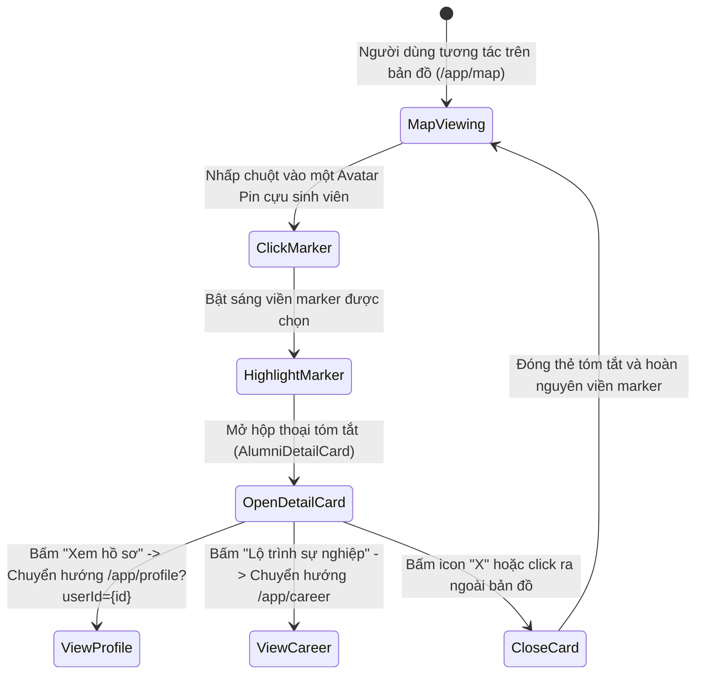
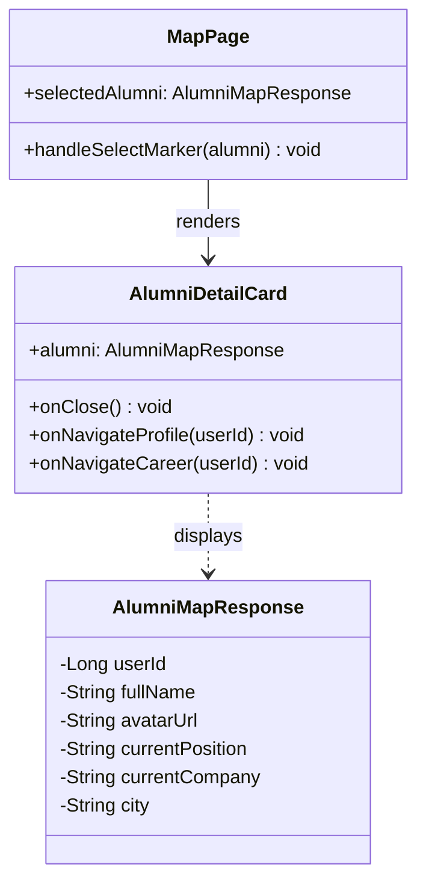
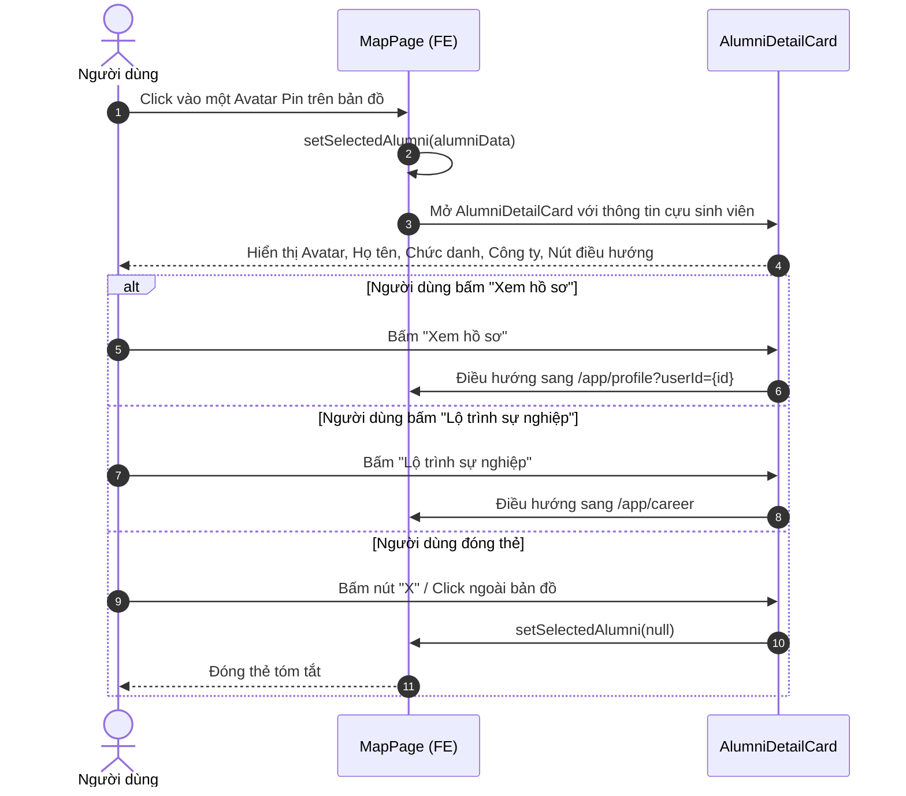

# ĐẶC TẢ YÊU CẦU & THIẾT KẾ CHI TIẾT: UC57 - XEM HỒ SƠ TỪ ĐIỂM GHIM BẢN ĐỒ (VIEW PROFILE FROM MAP MARKER)

## PHẦN 1: ĐẶC TẢ NGHIỆP VỤ (REPORT 3)

### 2.2.3 Business Workflow (Luồng nghiệp vụ)

#### Mô tả chi tiết luồng xử lý bằng chữ (Business Step Description):
* **Bước 1 - Khởi đầu**: Người dùng khám phá mạng lưới cựu sinh viên trên bản đồ trực quan (`/app/map`).
* **Bước 2 - Chọn cựu sinh viên**: Người dùng nhấp vào một điểm ghim đại diện (Avatar Pin). Hệ thống làm nổi bật marker đó và mở thẻ tóm tắt (`AlumniDetailCard`) ở góc dưới màn hình.
* **Bước 3 - Xem thông tin tóm tắt**: Thẻ hiển thị avatar, họ tên, khóa học, chuyên ngành, vị trí công việc và công ty hiện tại cùng tỉnh/thành phố làm việc.
* **Bước 4 - Điều hướng chi tiết**: Người dùng có thể nhấn nút "Xem hồ sơ" để đi đến trang thông tin cá nhân đầy đủ hoặc nhấn "Lộ trình sự nghiệp" để xem dòng thời gian kinh nghiệm làm việc của cựu sinh viên đó.

---

### 3.2 Module Bản Đồ (3.2 Alumni Map Module)

#### 3.2.1 Xem hồ sơ từ điểm ghim bản đồ (UC57)

**Function trigger**:
* **Navigation path**: Bản đồ `/app/map` -> Nhấp chuột vào Avatar Pin bất kỳ.
* **Timing Frequency**: On demand (khi người dùng muốn tìm hiểu thông tin về cựu sinh viên tại vị trí địa lý đó).

**Function description**:
* **Actors/Roles**: Tất cả mọi người (Khách vãng lai, Sinh viên, Cựu sinh viên, Quản trị viên).
* **Purpose**: Cung cấp cái nhìn nhanh về danh tính và nghề nghiệp của cựu sinh viên tại một tọa độ cụ thể trước khi quyết định truy cập vào hồ sơ chi tiết.
* **Interface**: Thẻ `AlumniDetailCard` nổi bo góc lớn (`rounded-2xl`), gồm: Avatar, Họ tên, Badge khóa học, Tiêu đề nghề nghiệp, Tên công ty, Thành phố, Nút "Xem hồ sơ" và Nút "Lộ trình sự nghiệp".

---

### 5. Requirement Appendix (Phụ lục Yêu cầu)

#### 5.1 Business Rules (Quy tắc Nghiệp vụ)

| ID | Định nghĩa Quy tắc (Rule Definition) |
| :--- | :--- |
| BR-57-01 | Chỉ mở duy nhất một thẻ `AlumniDetailCard` tại một thời điểm. Khi chọn marker khác, thẻ tự động cập nhật sang cựu sinh viên mới. |
| BR-57-02 | Khách vãng lai bấm "Xem hồ sơ" vẫn xem được các thông tin công khai của cựu sinh viên theo quy định UC39. |

#### 5.3 Application Messages List (Danh sách Thông điệp Ứng dụng)

| # | Mã thông điệp (Message code) | Loại thông điệp (Message Type) | Ngữ cảnh (Context) | Nội dung hiển thị (Content) |
| :--- | :--- | :--- | :--- | :--- |
| 1 | MSG-MAP-PIN-01 | In line popup | Mở thẻ tóm tắt cựu sinh viên | Hiển thị thông tin cựu sinh viên từ điểm ghim. |

---

## PHẦN 2: THIẾT KẾ CHI TIẾT (REPORT 4)

### 3. Detail Design (Thiết kế chi tiết)

#### 3.1 UC57 Xem hồ sơ từ điểm ghim bản đồ (View Profile from Map Marker)

##### 3.1.1 Class Diagram (Sơ đồ Lớp)

##### 3.1.2 Sequence Diagram (Sơ đồ Tuần tự)

