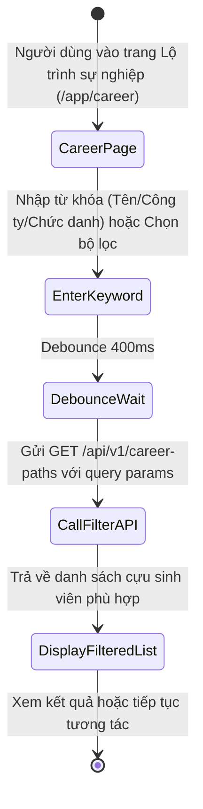
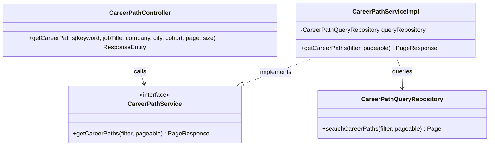
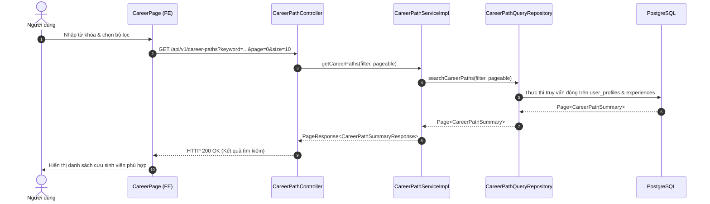

# ĐẶC TẢ YÊU CẦU & THIẾT KẾ CHI TIẾT: UC58.1 - TÌM KIẾM VÀ LỌC LỘ TRÌNH SỰ NGHIỆP (SEARCH & FILTER CAREER PATHS)

## PHẦN 1: ĐẶC TẢ NGHIỆP VỤ (REPORT 3)

### 2.2.3 Business Workflow (Luồng nghiệp vụ)

#### Mô tả chi tiết luồng xử lý bằng chữ (Business Step Description):
* **Bước 1 - Khởi đầu**: Người dùng truy cập trang Lộ trình sự nghiệp (`/app/career`).
* **Bước 2 - Chọn tiêu chí lọc**: Người dùng nhập từ khóa tìm kiếm (họ tên, công ty, vị trí) hoặc chọn bộ lọc theo khóa học (cohort), thành phố (city), chức danh (jobTitle).
* **Bước 3 - Xử lý truy vấn**: Frontend gửi request `GET /api/v1/career-paths` kèm các tham số lọc tới backend.
* **Bước 4 - Hiển thị kết quả**: Backend tìm kiếm trong các bảng `user_profiles` và `experiences`, trả về danh sách cựu sinh viên thỏa mãn điều kiện.

---

### 3.2 Module Lộ trình Sự nghiệp (Career Path)

#### 3.2.1 Tìm kiếm & Lọc lộ trình sự nghiệp (UC58.1)
*(Tài liệu chuyên sâu chi tiết về tính năng tìm kiếm thuộc Module Lộ trình Sự nghiệp - Tham chiếu tổng thể tại [SRS_UC_58_ViewCareerpath.md](file:///d:/Alumnect/docs/update_SRS/SRS_UC_58_ViewCareerpath.md))*

---

### 5. Requirement Appendix (Phụ lục Yêu cầu)

#### 5.1 Business Rules (Quy tắc Nghiệp vụ)

| ID | Định nghĩa Quy tắc (Rule Definition) |
| :--- | :--- |
| BR-CP-01 | Chỉ cựu sinh viên có tài khoản `ACTIVE` và có dữ liệu kinh nghiệm làm việc mới xuất hiện trong kết quả tìm kiếm. |
| BR-CP-02 | Các tiêu chí lọc được kết hợp theo phép toán logic AND. |

#### 5.3 Application Messages List (Danh sách Thông điệp Ứng dụng)

| # | Mã thông điệp (Message code) | Loại thông điệp (Message Type) | Ngữ cảnh (Context) | Nội dung hiển thị (Content) |
| :--- | :--- | :--- | :--- | :--- |
| 1 | MSG-CP-01 | Toast / In line | Lọc lộ trình thành công | Lấy danh sách lộ trình sự nghiệp thành công. |
| 2 | MSG-CP-02 | EmptyState | Không có kết quả phù hợp | Không tìm thấy cựu sinh viên nào phù hợp với bộ lọc đã chọn. |

---

## PHẦN 2: THIẾT KẾ CHI TIẾT (REPORT 4)

### 3. Detail Design (Thiết kế chi tiết)

#### 3.1.1 Class Diagram (Sơ đồ Lớp)

##### 3.1.2 Sequence Diagram (Sơ đồ Tuần tự)

