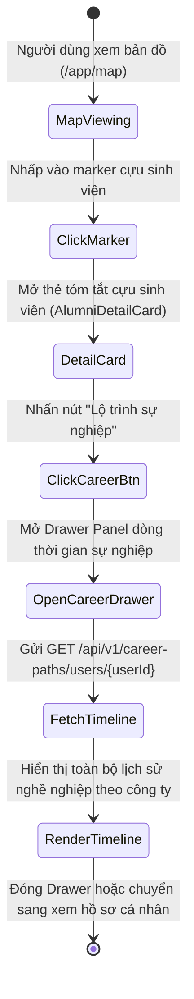
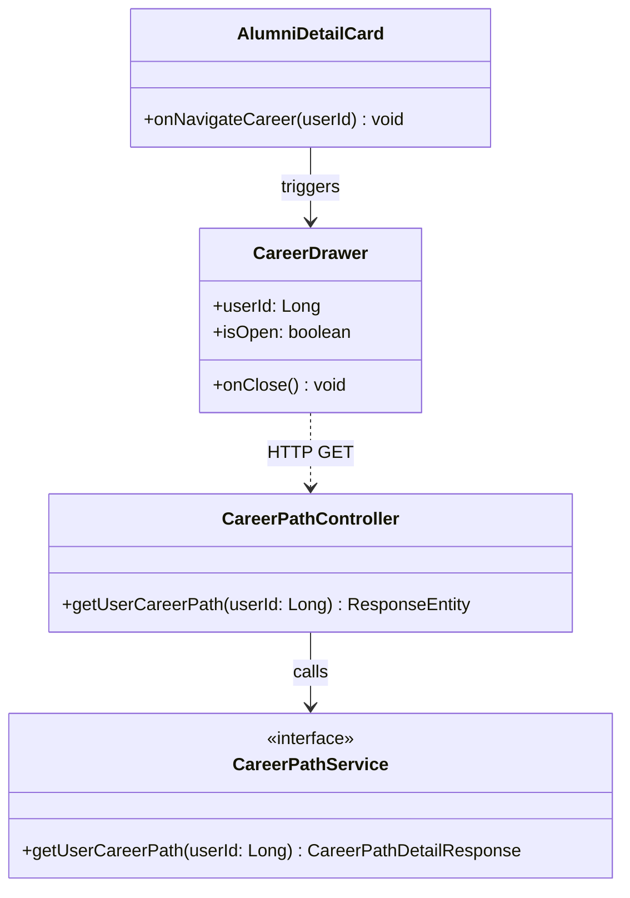
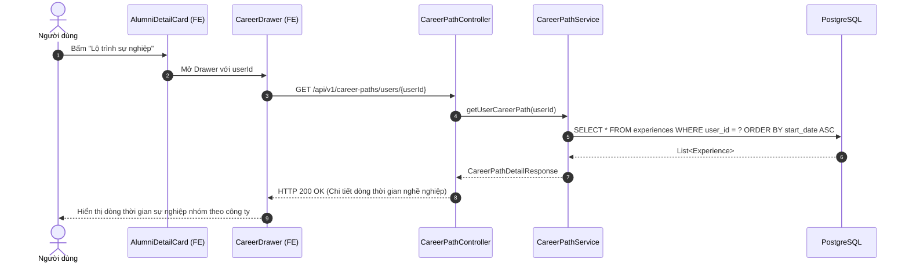

# ĐẶC TẢ YÊU CẦU & THIẾT KẾ CHI TIẾT: UC58.2 - XEM LỘ TRÌNH SỰ NGHIỆP TỪ BẢN ĐỒ (VIEW CAREER PATH FROM MAP)

## PHẦN 1: ĐẶC TẢ NGHIỆP VỤ (REPORT 3)

### 2.2.3 Business Workflow (Luồng nghiệp vụ)

#### Mô tả chi tiết luồng xử lý bằng chữ (Business Step Description):
* **Bước 1 - Khởi đầu**: Người dùng xem bản đồ cựu sinh viên tại `/app/map`.
* **Bước 2 - Chọn cựu sinh viên**: Nhấp vào một marker cựu sinh viên bất kỳ, thẻ tóm tắt `AlumniDetailCard` mở ra.
* **Bước 3 - Mở lộ trình**: Người dùng nhấp vào nút "Lộ trình sự nghiệp". Hệ thống mở Side Drawer (trên Desktop) hoặc Bottom Sheet (trên Mobile) và gọi API `GET /api/v1/career-paths/users/{userId}`.
* **Bước 4 - Xem dòng thời gian**: Hệ thống kết xuất toàn bộ quá trình thăng tiến sự nghiệp của cựu sinh viên đó được sắp xếp từ quá khứ đến hiện tại và nhóm theo từng công ty/tổ chức.

---

### 3.2 Module Lộ trình Sự nghiệp (Career Path)

#### 3.2.2 Xem Lộ trình Sự nghiệp từ Bản đồ (UC58.2)
*(Tham chiếu chi tiết toàn diện tại [SRS_UC_58_ViewCareerpath.md](file:///d:/Alumnect/docs/update_SRS/SRS_UC_58_ViewCareerpath.md))*

---

### 5. Requirement Appendix (Phụ lục Yêu cầu)

#### 5.1 Business Rules (Quy tắc Nghiệp vụ)

| ID | Định nghĩa Quy tắc (Rule Definition) |
| :--- | :--- |
| BR-CP-MAP-01 | Nút "Lộ trình sự nghiệp" trên thẻ bản đồ chỉ kích hoạt khi cựu sinh viên có ít nhất một bản ghi kinh nghiệm làm việc. |
| BR-CP-MAP-02 | Drawer lộ trình sự nghiệp hiển thị đè lên bản đồ với hiệu ứng làm mờ nền (backdrop blur) mà không cần chuyển trang. |

#### 5.3 Application Messages List (Danh sách Thông điệp Ứng dụng)

| # | Mã thông điệp (Message code) | Loại thông điệp (Message Type) | Ngữ cảnh (Context) | Nội dung hiển thị (Content) |
| :--- | :--- | :--- | :--- | :--- |
| 1 | MSG-CPMAP-01 | Toast message | Lấy chi tiết lộ trình thành công | Lấy thông tin lộ trình sự nghiệp thành công. |
| 2 | MSG-CPMAP-02 | In Drawer | Cựu sinh viên chưa cập nhật kinh nghiệm | Cựu sinh viên chưa cập nhật lộ trình làm việc. |

---

## PHẦN 2: THIẾT KẾ CHI TIẾT (REPORT 4)

### 3. Detail Design (Thiết kế chi tiết)

#### 3.1.1 Class Diagram (Sơ đồ Lớp)

##### 3.1.2 Sequence Diagram (Sơ đồ Tuần tự)

