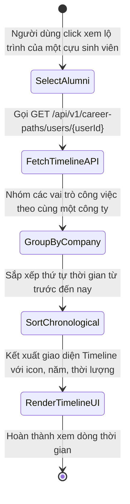
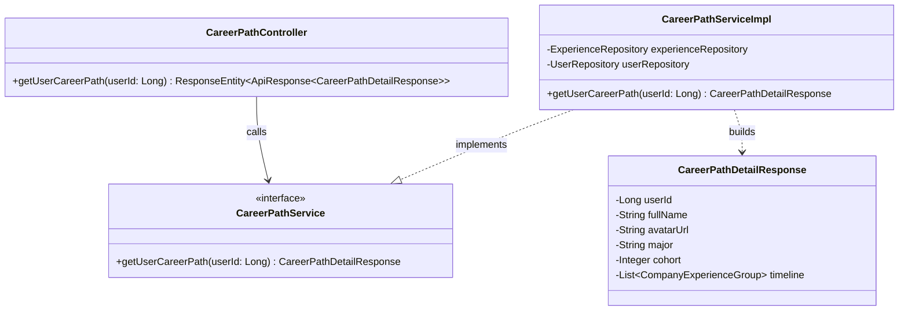
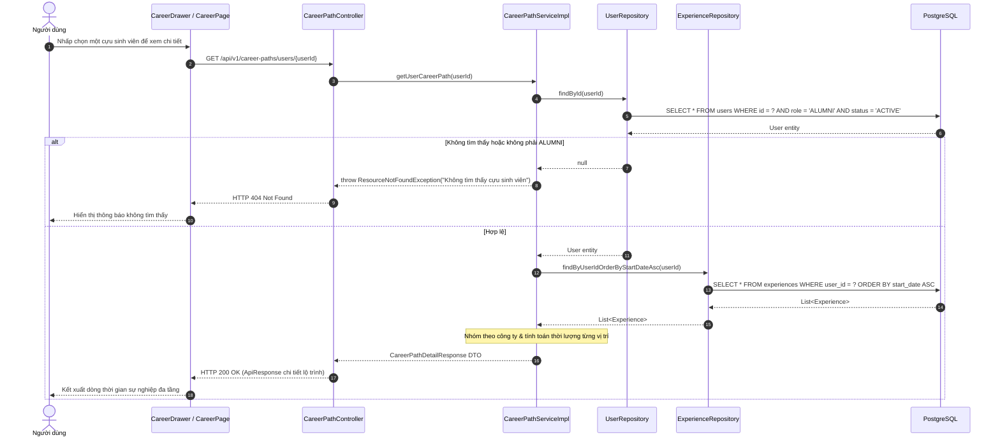

# ĐẶC TẢ YÊU CẦU & THIẾT KẾ CHI TIẾT: UC58.3 - CHI TIẾT DÒNG THỜI GIAN SỰ NGHIỆP (VIEW CAREER PATH TIMELINE)

## PHẦN 1: ĐẶC TẢ NGHIỆP VỤ (REPORT 3)

### 2.2.3 Business Workflow (Luồng nghiệp vụ)

#### Mô tả chi tiết luồng xử lý bằng chữ (Business Step Description):
* **Bước 1 - Khởi đầu**: Người dùng nhấp chọn xem chi tiết lộ trình của một cựu sinh viên cụ thể (từ danh sách `/app/career` hoặc thẻ bản đồ).
* **Bước 2 - Lấy dữ liệu**: Frontend gửi yêu cầu `GET /api/v1/career-paths/users/{userId}` lên máy chủ.
* **Bước 3 - Nhóm và tính toán**: Dữ liệu lịch sử làm việc (`experiences`) được nhóm tự động theo tên công ty/tổ chức. Nếu cựu sinh viên có nhiều vị trí tại cùng một công ty, các vị trí đó hiển thị lồng nhau trong một khối công ty.
* **Bước 4 - Kết xuất trực quan**: Hiển thị thành dòng thời gian dọc (Vertical Timeline) với thời gian bắt đầu - kết thúc, tổng thời gian làm việc (năm, tháng), mô tả công việc và các kỹ năng áp dụng.

---

### 3.2 Module Lộ trình Sự nghiệp (Career Path)

#### 3.2.3 Dòng thời gian Lộ trình Sự nghiệp (UC58.3)
*(Tham chiếu chi tiết toàn diện tại [SRS_UC_58_ViewCareerpath.md](file:///d:/Alumnect/docs/update_SRS/SRS_UC_58_ViewCareerpath.md))*

---

### 5. Requirement Appendix (Phụ lục Yêu cầu)

#### 5.1 Business Rules (Quy tắc Nghiệp vụ)

| ID | Định nghĩa Quy tắc (Rule Definition) |
| :--- | :--- |
| BR-CP-TIME-01 | Dòng thời gian kinh nghiệm sắp xếp theo thứ tự thời gian tăng dần (từ công việc đầu tiên đến công việc hiện tại). |
| BR-CP-TIME-02 | Các vai trò trong cùng một công ty được nhóm vào một thẻ công ty chung để thể hiện rõ hành trình thăng tiến nội bộ. |

#### 5.3 Application Messages List (Danh sách Thông điệp Ứng dụng)

| # | Mã thông điệp (Message code) | Loại thông điệp (Message Type) | Ngữ cảnh (Context) | Nội dung hiển thị (Content) |
| :--- | :--- | :--- | :--- | :--- |
| 1 | MSG-CPTIME-01 | Toast message | Lấy chi tiết thành công | Lấy thông tin lộ trình sự nghiệp thành công. |
| 2 | MSG-CPTIME-02 | Toast Error | Không tìm thấy cựu sinh viên | Người dùng không tồn tại hoặc không phải là cựu sinh viên. |

---

## PHẦN 2: THIẾT KẾ CHI TIẾT (REPORT 4)

### 3. Detail Design (Thiết kế chi tiết)

#### 3.1.1 Class Diagram (Sơ đồ Lớp)

##### 3.1.2 Sequence Diagram (Sơ đồ Tuần tự)

