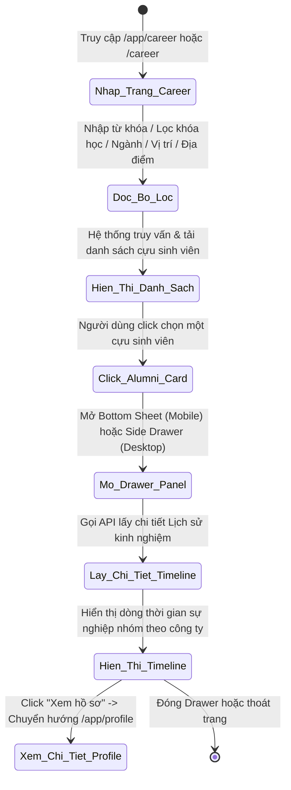
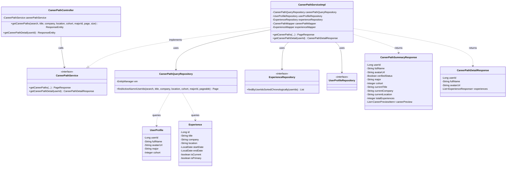
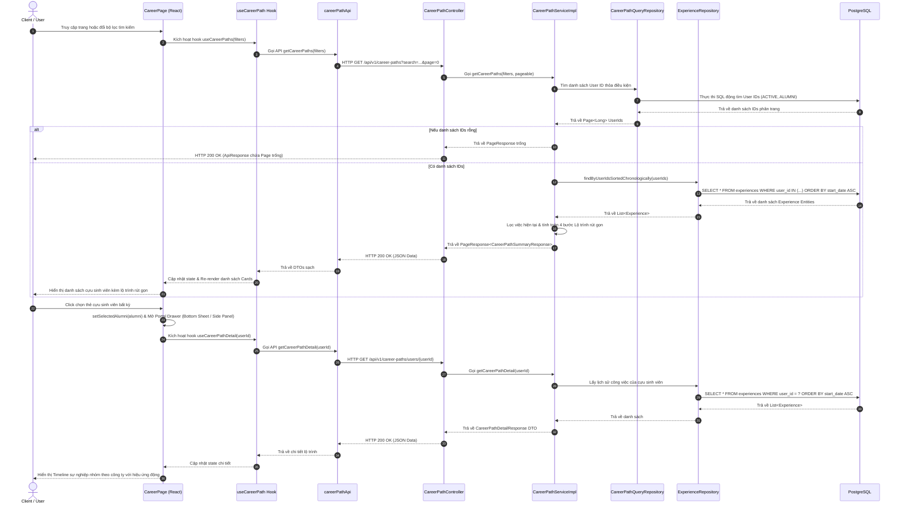

# ĐẶC TẢ YÊU CẦU & THIẾT KẾ CHI TIẾT: UC58 - XEM LỘ TRÌNH SỰ NGHIỆP CỰU SINH VIÊN

## PHẦN 1: ĐẶC TẢ NGHIỆP VỤ (REPORT 3)

### 2.2.3 Business Workflow (Luồng nghiệp vụ)

Sơ đồ trạng thái mô tả luồng nghiệp vụ khi người dùng tìm kiếm và xem lộ trình sự nghiệp cựu sinh viên:

#### Mô tả chi tiết luồng xử lý bằng chữ (Business Step Description):
* **Bước 1 - Khởi đầu**: Người dùng (Sinh viên, Cựu sinh viên hoặc Khách vãng lai) truy cập vào màn hình "Lộ trình sự nghiệp" (`/app/career` hoặc `/career`). Khi màn hình được tải (mount), hệ thống sẽ gửi yêu cầu HTTP GET mặc định lên backend để lấy danh sách lộ trình sự nghiệp của các cựu sinh viên hoạt động có dữ liệu kinh nghiệm làm việc (Experiences).
* **Bước 2 - Lọc dữ liệu**: Người dùng sử dụng "Bộ lọc nâng cao" để nhập từ khóa tìm kiếm (theo Tên, Chức danh, Công ty), lọc riêng Chức danh công việc, lọc riêng Công ty/Tổ chức, lọc riêng Thành phố/Địa điểm, hoặc lọc theo khóa học (Cohort). Khi dừng nhập liệu 400ms (debounce), React sẽ cập nhật các bộ lọc và gửi yêu cầu truy vấn phân trang lên backend. Hệ thống trả về danh sách cựu sinh viên thỏa mãn điều kiện tìm kiếm.
* **Bước 3 - Xem chi tiết**: Người dùng click vào một thẻ cựu sinh viên trong danh sách. Hệ thống sẽ mở một Side Drawer trượt từ bên phải (trên Desktop) hoặc Bottom Sheet trượt từ dưới lên (trên Mobile) và gọi API chi tiết `/api/v1/career-paths/users/{userId}` để lấy toàn bộ các vai trò, vị trí công việc cựu sinh viên đó đã trải qua, hiển thị thành Timeline đẹp mắt được nhóm theo công ty/tổ chức.
* **Bước 4 - Điều hướng hồ sơ**: Trong Drawer Panel chi tiết, người dùng có thể click vào nút "Xem hồ sơ" (View Profile Button), hệ thống chuyển hướng người dùng sang trang xem hồ sơ cá nhân hoàn chỉnh (`/app/profile?userId=...`).

---

### 3.2 Module Lộ trình Sự nghiệp (Career Path)
Module cung cấp các giao diện và APIs hỗ trợ sinh viên khám phá, tham khảo hành trình thăng tiến thực tế trong sự nghiệp của thế hệ cựu sinh viên đi trước để định hướng nghề nghiệp bản thân.

#### 3.2.1 Xem Lộ trình Sự nghiệp của Cựu sinh viên (UC58)

**Function trigger**:
*   **Navigation path**: 
    *   Nội bộ (Đăng nhập): Left Sidebar / Main Menu -> "Lộ trình sự nghiệp" -> `/app/career`
    *   Công khai (Khách): Truy cập trực tiếp link `/career`
*   **Timing Frequency**: On screen mount & On demand (Khi click chọn cựu sinh viên cụ thể trong danh sách).

**Function description**:
*   **Actors/Roles**: Khách vãng lai (Guest), Sinh viên (Student), Cựu sinh viên (Alumni), Quản trị viên (Admin).
*   **Purpose**: Cho phép người dùng duyệt qua danh sách cựu sinh viên kèm theo lộ trình sự nghiệp rút gọn, lọc tìm kiếm nâng cao và mở xem chi tiết dòng thời gian kinh nghiệm thăng tiến theo công ty của một cựu sinh viên bất kỳ.
*   **Interface**:
    *   **Thanh tìm kiếm & Bộ lọc nâng cao**: Các ô input nhập từ khóa tìm kiếm chung, lọc chức danh, lọc công ty, lọc địa điểm, lọc khóa học (cohort) và nút "Xóa tất cả bộ lọc".
    *   **Danh sách cựu sinh viên**: Danh sách các thẻ cựu sinh viên có ảnh đại diện (Avatar), Họ tên, Ngành học, Khóa học (Kxx), Chức danh & Công ty hiện tại, Tổng số vai trò đã trải qua, và một sơ đồ lộ trình thu nhỏ gồm tối đa 4 bước kinh nghiệm liên tiếp nhau ngăn cách bởi mũi tên `->`.
    *   **Thanh phân trang**: Các nút "Trước", "Sau" và bộ hiển thị trang hiện tại `X / Y`.
    *   **Side Drawer Panel / Bottom Sheet**: Hiện ra khi click chọn một cựu sinh viên. Panel này bọc trong Portal gắn vào `<body>` hiển thị đè lên toàn bộ giao diện (kể cả Header) với hiệu ứng làm mờ nền (Backdrop blur) và trượt mượt mà. Hiển thị thông tin cá nhân cơ bản ở phần Header, dòng thời gian sự nghiệp chi tiết ở phần Body (nhóm các vai trò làm việc theo công ty từ quá khứ đến hiện tại) và nút "Xem hồ sơ" ở Footer.

**Data processing**:
1.  **Tải danh sách**: Gửi request HTTP GET `/api/v1/career-paths` kèm các tham số filter và phân trang.
2.  **Xử lý phía Backend**:
    *   Backend gọi `CareerPathQueryRepository` thực thi câu lệnh SQL động lọc trong bảng `user_profiles` và bảng `experiences` để tìm ra các cựu sinh viên (Role: ALUMNI, Status: ACTIVE) thỏa mãn các bộ lọc tìm kiếm.
    *   Tiến hành phân trang và batch fetch toàn bộ các `experiences` của danh sách cựu sinh viên trả về để nhóm và tránh lỗi N+1 Hibernate.
    *   Xác định công việc hiện tại của cựu sinh viên: Ưu tiên bản ghi có `is_primary = true`. Nếu không có, chọn bản ghi đang làm việc (`is_current = true`) có ngày bắt đầu muộn nhất.
    *   Tổng hợp lộ trình rút gọn `careerPreview` (tối đa 4 bước thăng tiến độc lập).
3.  **Tải chi tiết**: Gửi request HTTP GET `/api/v1/career-paths/users/{userId}` khi người dùng click xem chi tiết.
    *   Kiểm tra ID người dùng có hợp lệ (Tồn tại, Status: ACTIVE, Role: ALUMNI).
    *   Truy vấn tất cả lịch sử công việc (`experiences`) của người dùng đó và sắp xếp theo ngày bắt đầu tăng dần (từ quá khứ đến hiện tại).
    *   Trả về DTO chứa thông tin cá nhân và mảng các bản ghi kinh nghiệm làm việc chi tiết.

**Screen layout**:
*   *Figure 28: Career Page layout with Advanced Filters & Paginated Cards List*
*   *Figure 29: Premium Side Drawer Panel layout displaying Interactive Career Timeline (Desktop view)*
*   *Figure 30: Bottom Sheet Layout displaying Interactive Career Timeline (Mobile view)*

**Function details**:
*   **Data**:
    *   Đầu vào bộ lọc: `search` (String), `title` (String), `company` (String), `location` (String), `cohort` (Integer), `majorId` (Long), `page` (Integer), `size` (Integer).
    *   Đầu ra danh sách: `userId` (Long), `fullName` (String), `avatarUrl` (String), `verifiedStatus` (Boolean), `major` (String), `cohort` (Integer), `currentTitle` (String), `currentCompany` (String), `currentLocation` (String), `totalExperiences` (Integer), `careerPreview` (List<CareerPreviewItem>).
    *   Đầu ra chi tiết: `userId` (Long), `fullName` (String), `avatarUrl` (String), `experiences` (List<ExperienceResponse>).
*   **Validation**:
    *   Tham số phân trang: `page >= 0`, `size` tối đa giới hạn ở mức 50 ở phía Backend nhằm chống tấn công từ chối dịch vụ.
*   **Business rules**:
    *   Chỉ các tài khoản cựu sinh viên (Role: ALUMNI) và đang ở trạng thái hoạt động (ACTIVE) mới được xuất hiện trên danh sách lộ trình.
    *   Chỉ hiển thị những cựu sinh viên đã cập nhật ít nhất 1 thông tin kinh nghiệm làm việc (`experiences`).
*   **Error Handling**:
    *   `400 Bad Request`: Định dạng phân trang hoặc tham số không hợp lệ.
    *   `404 Not Found`: Khi xem chi tiết người dùng không tồn tại.
    *   `500 Internal Server Error`: Lỗi kết nối cơ sở dữ liệu.
*   **Normal case**: Người dùng tìm thấy lộ trình, danh sách cards hiển thị đầy đủ, click mở Drawer chi tiết tải timeline mượt mà trong vòng 500ms, click "Xem hồ sơ" điều hướng thành công.
*   **Abnormal case**: Backend không kết nối được PostgreSQL -> hiển thị EmptyState thông báo lỗi máy chủ kèm nút thử lại.

---

### 5. Requirement Appendix (Phụ lục Yêu cầu)

#### 5.1 Business Rules (Quy tắc Nghiệp vụ)

| ID | Định nghĩa Quy tắc (Rule Definition) |
| :--- | :--- |
| BR-CP-01 | Chỉ cựu sinh viên (Role: ALUMNI) mới được xuất hiện trên danh sách Lộ trình sự nghiệp. |
| BR-CP-02 | Các bản ghi kinh nghiệm làm việc thăng tiến được sắp xếp tự động từ quá khứ đến hiện tại để thể hiện rõ nét biểu đồ phát triển sự nghiệp. |
| BR-CP-03 | Lộ trình rút gọn trên Card (Career Preview) chỉ hiển thị tối đa 4 bước công việc liền kề nhau để đảm bảo giao diện cân đối, không bị tràn dòng. |
| BR-CP-04 | Dữ liệu công ty/chức danh hiện tại (Current Title & Current Company) ưu tiên lấy từ công việc được đánh dấu là Chính (`is_primary = true`). |

#### 5.2 Common Requirements (Yêu cầu Chung)
*   Dữ liệu danh sách lộ trình sự nghiệp bắt buộc được phân trang (mặc định 10 bản ghi/trang).
*   Drawer chi tiết lộ trình phải tương thích hoàn toàn (responsive) trên mọi thiết bị: Hiển thị dạng Side Panel trên PC/Tablet và tự động chuyển thành Bottom Sheet trên Mobile.
*   Mọi tương tác mở/đóng Drawer phải sử dụng các hiệu ứng chuyển động mượt mà (smooth micro-animations) thông qua thư viện `framer-motion` và dùng React Portal để tránh lỗi đè lớp hiển thị.

#### 5.3 Application Messages List (Danh sách Thông điệp Ứng dụng)

| # | Mã thông điệp (Message code) | Loại thông điệp (Message Type) | Ngữ cảnh (Context) | Nội dung hiển thị (Content) |
| :--- | :--- | :--- | :--- | :--- |
| 1 | MSG-CP-01 | In line | Không tìm thấy kết quả lọc phù hợp | Không tìm thấy lộ trình phù hợp. |
| 2 | MSG-CP-02 | Skeleton | Trạng thái đang tải danh sách/chi tiết | Hiển thị các khối Skeleton động tương ứng. |
| 3 | MSG-CP-03 | In line | Lỗi khi tải chi tiết lịch sử thăng tiến | Không thể tải dữ liệu. Lỗi khi tải chi tiết lộ trình. |

---

## PHẦN 2: THIẾT KẾ CHI TIẾT (REPORT 4)

### 3. Detail Design (Thiết kế chi tiết)

#### 3.1 Chức năng Xem Lộ trình Sự nghiệp của Cựu sinh viên (UC58)

##### 3.1.1 Class Diagram (Sơ đồ Lớp)

###### Mô tả chi tiết cấu trúc các lớp (Class Design Description):
* **`CareerPathController`**: Nhận yêu cầu GET danh sách lộ trình phân trang (có filter) và GET chi tiết timeline của một cựu sinh viên cụ thể.
* **`CareerPathService` / `CareerPathServiceImpl`**: Lớp xử lý nghiệp vụ chính. Chứa logic phân tích và gán thông tin công việc hiện tại (currentTitle/currentCompany) ưu tiên theo trạng thái `isPrimary`, giới hạn danh sách preview thăng tiến 4 bước.
* **`CareerPathQueryRepository`**: Triển khai truy vấn SQL động (sử dụng Criteria API hoặc Native Query của JPA) để lọc tài khoản cựu sinh viên thỏa mãn nhiều bộ lọc phức tạp.
* **`ExperienceRepository`**: Cung cấp hàm `findByUserIdsSortedChronologically` để nạp nhanh (batch fetch) dữ liệu kinh nghiệm đã được sắp xếp tăng dần theo thời gian.
* **`CareerPathSummaryResponse`** & **`CareerPathDetailResponse`**: Các cấu trúc DTO tối ưu hóa dung lượng truyền tải mạng, chỉ gửi về các thông tin cần hiển thị trên giao diện.

##### 3.1.2 Sequence Diagram (Sơ đồ Tuần tự)

###### Mô tả chi tiết luồng xử lý bằng chữ (Sequence Flow Description):
1.  **Luồng xem danh sách (Normal Case)**:
    *   **Gửi yêu cầu**: Khi người dùng vào trang hoặc thay đổi bộ lọc, React sẽ gọi Hook `useCareerPaths` để gửi request HTTP GET `/api/v1/career-paths` lên controller.
    *   **Truy vấn cơ sở dữ liệu**: Controller gọi Service. Service trước hết truy cập `CareerPathQueryRepository` để tìm danh sách các User ID thỏa mãn bộ lọc tìm kiếm và phân trang từ DB.
    *   **Batch fetch & Xử lý nghiệp vụ**: Service dùng danh sách ID đó để kéo nhanh toàn bộ các kinh nghiệm làm việc liên quan trong 1 câu truy vấn SQL (`IN (...)`) từ `ExperienceRepository`. Sau đó tiến hành duyệt qua, gán công việc hiện tại dựa theo thuộc tính `isPrimary` / `isCurrent` và trích xuất tối đa 4 bước kinh nghiệm thăng tiến độc lập chuyển thành đối tượng `CareerPathSummaryResponse` gửi trả về Frontend.
    *   **Hiển thị**: Frontend nhận dữ liệu và kết xuất danh sách thẻ cựu sinh viên lên màn hình.
2.  **Luồng xem chi tiết (Detailed Timeline Drawer Case)**:
    *   Khi người dùng click vào thẻ cựu sinh viên, giao diện lập tức render một khung Drawer được dịch chuyển ra ngoài Portal của `body`.
    *   Đồng thời gọi API chi tiết `/api/v1/career-paths/users/{userId}`. Backend truy xuất toàn bộ danh sách `experiences` của cựu sinh viên đó sắp xếp theo thời gian tăng dần và trả về.
    *   Frontend hiển thị dữ liệu thành dòng thời gian thăng tiến chi tiết (timeline), nhóm các vai trò làm việc theo công ty từ quá khứ đến hiện tại.
