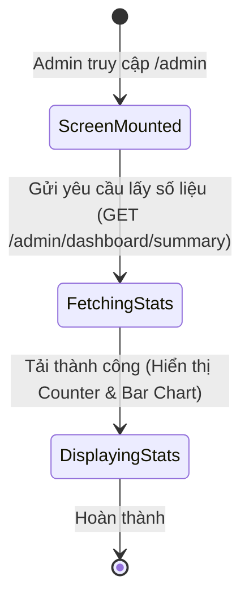
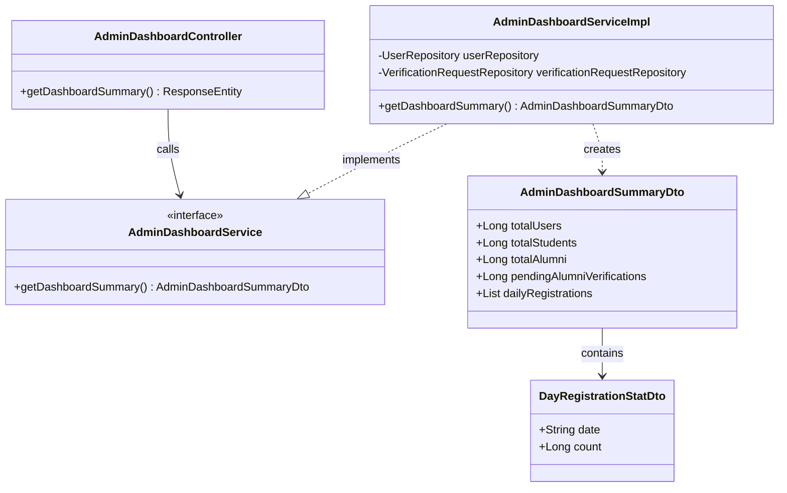
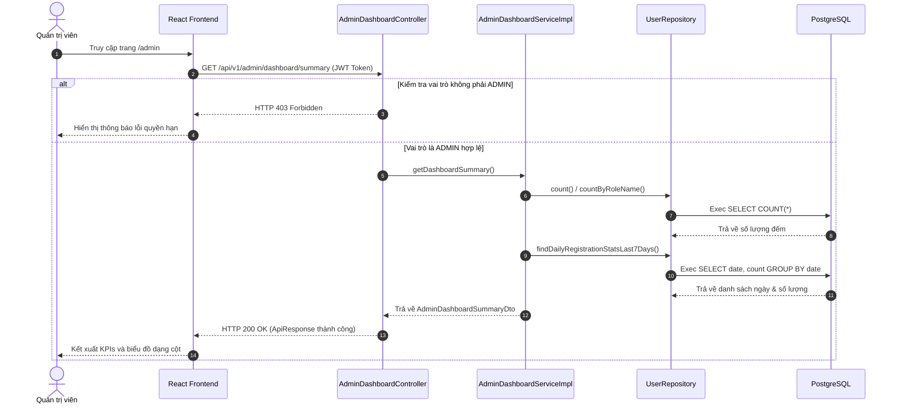

# ĐẶC TẢ YÊU CẦU & THIẾT KẾ CHI TIẾT: UC60 - XEM BẢNG SỐ LIỆU THỐNG KÊ DASHBOARD (OVERVIEW STATISTICS DASHBOARD)

## PHẦN 1: ĐẶC TẢ NGHIỆP VỤ (REPORT 3)

### 2.2.3 Business Workflow (Luồng nghiệp vụ)



#### Mô tả chi tiết luồng xử lý bằng chữ (Business Step Description):
* **Bước 1 - Khởi đầu**: Quản trị viên (Admin) đăng nhập thành công vào hệ thống và điều hướng truy cập vào trang tổng quan quản trị (đường dẫn `/admin`).
* **Bước 2 - Các bước chuyển tiếp**: 
  * Giao diện React gửi yêu cầu lấy số liệu thống kê tổng hợp của hệ thống tới API backend.
  * Trong lúc chờ dữ liệu tải về, giao diện hiển thị các khung xương tải giả lập (Shimmer Skeletons) màu kem ấm.
  * Sau khi dữ liệu tải về thành công, hệ thống hiển thị số lượng người dùng qua hiệu ứng nhảy số tự động (Counter), và hiển thị biểu đồ cột SVG biểu diễn số liệu đăng ký của 7 ngày gần nhất.
* **Bước 3 - Kết thúc**: Trình duyệt hoàn tất kết xuất giao diện Dashboard cho Admin theo dõi.

### 3.2 Module Quản Trị Hệ Thống (Admin Console)
Module dành riêng cho người dùng có vai trò `ADMIN` thực hiện các thao tác quản trị dữ liệu và kiểm soát hệ thống.

#### 3.2.1 Xem bảng số liệu thống kê Dashboard (UC60)
* **Function trigger**:
  * **Navigation path**: `/admin` (Trang Overview Dashboard của Admin)
  * **Timing Frequency**: On screen mount (Mỗi khi trang tổng quan được tải)

* **Function description**:
  * **Actors/Roles**: Admin
  * **Purpose**: Cung cấp các số liệu KPIs và biểu đồ tăng trưởng đăng ký để quản trị viên nắm bắt tình hình hoạt động của hệ thống.
  * **Interface**:
    * 4 Thẻ KPI: Tổng số người dùng (Total Users), Tổng số sinh viên (Total Students), Tổng số cựu sinh viên đã xác minh (Total Alumni), Số yêu cầu xác minh cựu sinh viên chờ duyệt (Pending Verifications).
    * Biểu đồ cột: Biểu diễn lượng tài khoản đăng ký mới mỗi ngày trong 7 ngày gần nhất.

* **Data processing**:
  1. Frontend gửi yêu cầu `GET` kèm Token Bearer trong Header.
  2. Spring Security xác thực Token và kiểm tra vai trò `ADMIN`.
  3. Service truy vấn đếm tổng số bản ghi trong bảng `users`, `user_profiles` lọc theo vai trò tương ứng và đếm số lượng bản ghi `verification_requests` trạng thái `PENDING`.
  4. Thực hiện truy vấn native SQL nhóm lượng người dùng mới đăng ký theo ngày trong 7 ngày gần nhất.
  5. Trả dữ liệu JSON về cho client.

* **Screen layout**:
  * Figure 60.1: Admin Overview Statistics Dashboard layout.

* **Function details**:
  * **Data**: `totalUsers`, `totalStudents`, `totalAlumni`, `pendingAlumniVerifications`, `dailyRegistrations` (mảng chứa `date` và `count`).
  * **Validation**: Kiểm tra token có vai trò `ADMIN`.
  * **Business rules**: Chỉ tài khoản có vai trò `ADMIN` mới được phép truy xuất dữ liệu này. Sinh viên và cựu sinh viên khác sẽ bị trả về mã lỗi 403 Forbidden.
  * **Error Handling**: 
    * Token hết hạn: Trả về HTTP 401 Unauthorized.
    * Không đúng quyền: Trả về HTTP 403 Forbidden.
  * **Normal case**: Trả về dữ liệu thống kê chính xác dạng JSON cùng mã HTTP 200 OK.
  * **Abnormal case**: Lỗi kết nối database, trả về HTTP 500 Internal Server Error.

---

### 5. Phụ Lục Yêu Cầu (Requirement Appendix)

#### 5.1 Business Rules (Quy tắc Nghiệp vụ)
| ID | Định nghĩa Quy tắc (Rule Definition) |
| :--- | :--- |
| **BR-ADMIN-01** | Quyền ADMIN là cao nhất, có toàn quyền truy cập các API bắt đầu bằng `/api/v1/admin/**`. |

#### 5.2 Common Requirements (Yêu cầu Chung)
* Số liệu thống kê được đếm thời gian thực từ cơ sở dữ liệu.
* Dữ liệu présenté dạng số được hiển thị hiệu ứng Counter.

#### 5.3 Application Messages List (Danh sách Thông điệp Ứng dụng)
| # | Mã thông điệp (Message code) | Loại thông điệp (Message Type) | Ngữ cảnh (Context) | Nội dung hiển thị (Content) |
| :--- | :--- | :--- | :--- | :--- |
| 1 | MSG-UC60-01 | Toast message | Lấy dữ liệu dashboard thành công | Lấy số liệu thống kê dashboard thành công |

---

## PHẦN 2: THIẾT KẾ CHI TIẾT (REPORT 4)

### 3. Detail Design (Thiết kế chi tiết)

#### 3.1 Xem bảng số liệu thống kê Dashboard

##### 3.1.1 Class Diagram (Sơ đồ Lớp)


###### Mô tả chi tiết cấu trúc các lớp (Class Design Description):
* **Lớp Controller**: `AdminDashboardController.java` tiếp nhận yêu cầu `GET` từ Client, thực hiện định tuyến và gọi `AdminDashboardService` để lấy dữ liệu.
* **Lớp DTO**: `AdminDashboardSummaryDto.java` chứa các trường đếm số lượng người dùng và danh sách các ngày đăng ký dạng `DayRegistrationStatDto.java`.
* **Lớp Service**: Giao diện `AdminDashboardService.java` định nghĩa nghiệp vụ và lớp triển khai `AdminDashboardServiceImpl.java` thực hiện tính toán số liệu thống kê từ cơ sở dữ liệu.
* **Lớp Repository**: `UserRepository.java` và `VerificationRequestRepository.java` cung cấp các phương thức đếm bản ghi và truy vấn thống kê native SQL.

##### 3.1.2 Sequence Diagram (Sơ đồ Tuần tự)


###### Mô tả chi tiết luồng xử lý bằng chữ (Sequence Flow Description):
1. **Luồng 1 - Thành công (Normal Case)**:
   * Client gửi yêu cầu lấy số liệu (GET) chứa Token JWT ADMIN hợp lệ lên `AdminDashboardController`.
   * Controller gọi `AdminDashboardServiceImpl` để tính toán số liệu.
   * Service thực hiện các truy vấn đếm trên repository và gọi native query lấy dữ liệu đăng ký nhóm theo ngày từ DB.
   * Kết quả trả về được đóng gói vào DTO và trả về HTTP 200 OK cùng dữ liệu.
2. **Luồng 2 - Lỗi quyền hạn (Forbidden Case)**:
   * Người dùng thông thường (Student/Alumni) gửi token không có quyền ADMIN. Controller trả về HTTP 403 Forbidden kèm theo thông điệp lỗi.

##### 3.1.3 Database Schema
Các trường chính sử dụng trong câu lệnh SQL động:
* `users`
  * `id` (BIGINT, PRIMARY KEY)
  * `created_at` (TIMESTAMP)
* `verification_requests`
  * `status` (VARCHAR)

##### 3.1.4 API Contract
* **Đường dẫn**: `GET /api/v1/admin/dashboard/summary`
* **HTTP Status**: 200 OK
* **Response Payload**:
  ```json
  {
    "error": 0,
    "message": "Lấy số liệu thống kê dashboard thành công",
    "data": {
      "totalUsers": 5,
      "totalStudents": 2,
      "totalAlumni": 2,
      "pendingAlumniVerifications": 1,
      "dailyRegistrations": [
        {
          "date": "2026-07-05",
          "count": 5
        }
      ]
    }
  }
  ```
