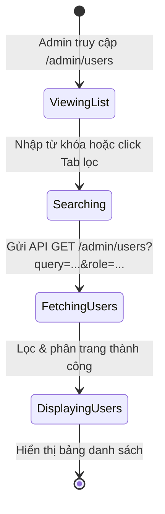
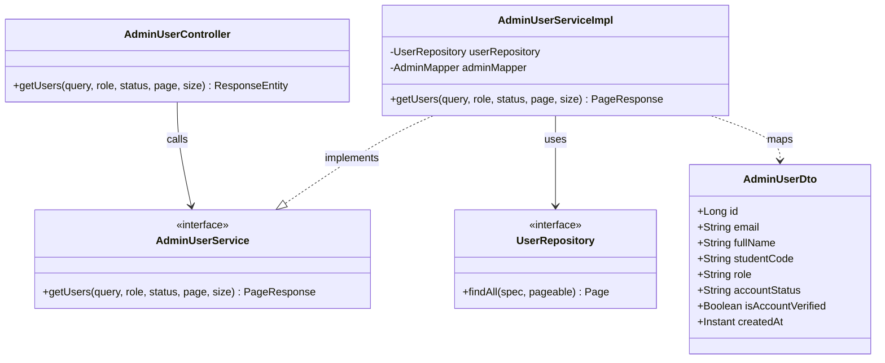
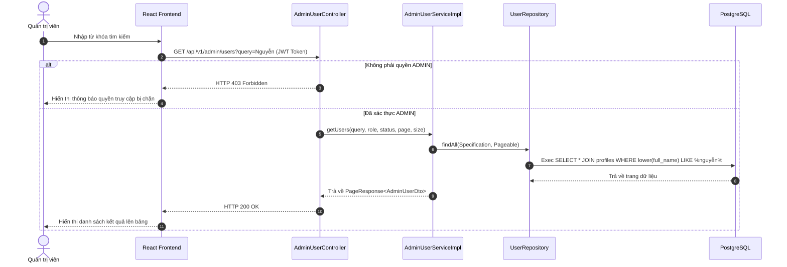

# ĐẶC TẢ YÊU CẦU & THIẾT KẾ CHI TIẾT: UC61 - XEM DANH SÁCH TÀI KHOẢN (VIEW USER LIST)

## PHẦN 1: ĐẶC TẢ NGHIỆP VỤ (REPORT 3)

### 2.2.3 Business Workflow (Luồng nghiệp vụ)



#### Mô tả chi tiết luồng xử lý bằng chữ (Business Step Description):
* **Bước 1 - Khởi đầu**: Admin điều hướng truy cập vào menu "Quản lý tài khoản" (đường dẫn `/admin/users`).
* **Bước 2 - Các bước chuyển tiếp**:
  * Trình duyệt kích hoạt gọi API lấy toàn bộ danh sách tài khoản được sắp xếp theo ngày đăng ký mới nhất lên đầu.
  * Admin có thể nhập từ khóa tìm kiếm (tên, email, mã số sinh viên) hoặc chọn các tab để lọc nhanh (Sinh viên, Cựu sinh viên, Chờ duyệt, Bị khóa).
  * API backend nhận các tham số lọc động và thực hiện phân trang, sắp xếp và khớp chuỗi truy vấn động.
* **Bước 3 - Kết thúc**: Hệ thống trả về danh sách tài khoản thỏa mãn kèm phân trang, hiển thị mượt mà trên giao diện dưới dạng bảng dữ liệu.

### 3.2 Module Quản Trị Hệ Thống (Admin Console)

#### 3.2.1 Xem danh sách tài khoản (UC61)
* **Function trigger**:
  * **Navigation path**: `/admin/users` (Trang User Management)
  * **Timing Frequency**: On screen mount hoặc mỗi khi thay đổi bộ lọc/từ khóa tìm kiếm.

* **Function description**:
  * **Actors/Roles**: Admin
  * **Purpose**: Cho phép Admin quản lý, tìm kiếm và kiểm soát tất cả người dùng trong hệ thống.
  * **Interface**:
    * Các tab lọc trạng thái: Tất cả, Cựu sinh viên, Sinh viên, Chờ duyệt, Bị khóa.
    * Ô tìm kiếm đa năng.
    * Bảng dữ liệu hiển thị: Avatar, Họ tên, Email, Vai trò, Trạng thái (Badge), Mã số sinh viên, Ngày tạo.
    * Phân trang điều hướng: Trang trước, Trang sau, Số trang hiện tại.

* **Data processing**:
  1. Frontend gửi yêu cầu `GET` kèm các tham số query (chứa từ khóa tìm kiếm, vai trò, trạng thái lọc nhanh, page và size).
  2. Backend sử dụng `Specification<User>` để tạo câu lệnh SQL `WHERE` động:
     * Chuyển từ khóa tìm kiếm về chữ thường.
     * Thực hiện so khớp `LIKE %keyword%` không phân biệt hoa thường trên các trường: `email`, `fullName`, `studentCode`.
  3. Thực hiện phân trang và trả kết quả JSON dạng `PageResponse`.

* **Screen layout**:
  * Figure 61.1: User Management Screen layout with search and filter tabs.

* **Function details**:
  * **Data**: `query`, `role`, `status`, `page`, `size`. Trả về `PageResponse` chứa danh sách `AdminUserDto` và siêu dữ liệu phân trang.
  * **Validation**: Từ khóa tìm kiếm tối đa 255 ký tự. Page và size phải lớn hơn hoặc bằng 0.
  * **Business rules**: Bắt buộc lọc bỏ các trường nhạy cảm như băm mật khẩu ra khỏi DTO trả về.
  * **Error Handling**: Trả về HTTP 400 Bad Request nếu tham số phân trang âm hoặc không hợp lệ.
  * **Normal case**: Trả về danh sách tài khoản khớp bộ lọc cùng mã HTTP 200 OK.
  * **Abnormal case**: Lỗi kết nối CSDL, trả về HTTP 500.

---

### 5. Phụ Lục Yêu Cầu (Requirement Appendix)

#### 5.1 Business Rules (Quy tắc Nghiệp vụ)
| ID | Định nghĩa Quy tắc (Rule Definition) |
| :--- | :--- |
| **BR-ADMIN-04** | API quản trị `/api/v1/admin/**` bắt buộc phải chặn truy cập từ người dùng có vai trò `STUDENT` hoặc `ALUMNI` (trả về HTTP 403 Forbidden). |

#### 5.2 Common Requirements (Yêu cầu Chung)
* Kết quả hiển thị phải được phân trang, mặc định 10 bản ghi mỗi trang.
* Danh sách cập nhật tự động khi thay đổi bộ lọc mà không cần reload trang.

#### 5.3 Application Messages List (Danh sách Thông điệp Ứng dụng)
| # | Mã thông điệp (Message code) | Loại thông điệp (Message Type) | Ngữ cảnh (Context) | Nội dung hiển thị (Content) |
| :--- | :--- | :--- | :--- | :--- |
| 1 | MSG-UC61-01 | In line | Không tìm thấy kết quả tìm kiếm | Không tìm thấy tài khoản phù hợp. |

---

## PHẦN 2: THIẾT KẾ CHI TIẾT (REPORT 4)

### 3. Detail Design (Thiết kế chi tiết)

#### 3.1 Xem danh sách tài khoản

##### 3.1.1 Class Diagram (Sơ đồ Lớp)


###### Mô tả chi tiết cấu trúc các lớp (Class Design Description):
* **Lớp Controller**: `AdminUserController.java` tiếp nhận yêu cầu lấy danh sách người dùng kèm bộ lọc và tham số phân trang, gọi `AdminUserService` để lấy dữ liệu.
* **Lớp DTO**: `AdminUserDto.java` đại diện cấu trúc dữ liệu người dùng được làm phẳng từ thực thể `User` và `UserProfile` gửi về cho client.
* **Lớp Service**: Giao diện `AdminUserService.java` định nghĩa các phương thức xử lý tài khoản, `AdminUserServiceImpl.java` kế thừa thực thi logic tạo `Specification` và truy xuất DB.
* **Lớp Mapper**: `AdminMapper.java` định nghĩa ánh xạ MapStruct để chuyển đổi tự động thực thể `User` và `UserProfile` sang DTO.
* **Lớp Repository**: `UserRepository.java` kế thừa `JpaSpecificationExecutor` hỗ trợ việc thực hiện câu lệnh tìm kiếm động.

##### 3.1.2 Sequence Diagram (Sơ đồ Tuần tự)


###### Mô tả chi tiết luồng xử lý bằng chữ (Sequence Flow Description):
1. **Luồng 1 - Thành công (Normal Case)**:
   * Client gửi yêu cầu lấy danh sách người dùng (GET) kèm Token JWT ADMIN hợp lệ.
   * Controller gọi phương thức `getUsers` của Service.
   * Service xây dựng bộ lọc Specification động, sau đó gọi phương thức repository `findAll(spec, pageable)` để thực thi SQL.
   * Dữ liệu nhận về được MapStruct chuyển đổi sang danh sách `AdminUserDto` và gửi lại Client với mã HTTP 200 OK.
2. **Luồng 2 - Lỗi phân quyền (Forbidden Error Case)**:
   * Vai trò người dùng không phải ADMIN cố gắng truy cập. Spring Security phát hiện và trả về HTTP 403 Forbidden.

##### 3.1.3 Database Schema
Bảng tham gia chính:
* `users`
  * `id` (BIGINT, PRIMARY KEY)
  * `email` (VARCHAR)
  * `account_status` (VARCHAR)
* `user_profiles`
  * `user_id` (BIGINT, PRIMARY KEY, FOREIGN KEY)
  * `full_name` (VARCHAR)
  * `student_code` (VARCHAR)

##### 3.1.4 API Contract
* **Đường dẫn**: `GET /api/v1/admin/users?query=Nguyễn&page=0&size=10`
* **HTTP Status**: 200 OK
* **Response Payload**:
  ```json
  {
    "error": 0,
    "message": "Lấy danh sách người dùng thành công",
    "data": {
      "content": [
        {
          "id": 2,
          "email": "sinhvien@fpt.edu.vn",
          "fullName": "Nguyễn Văn Sinh Viên",
          "studentCode": "HE180001",
          "role": "STUDENT",
          "accountStatus": "ACTIVE",
          "isAccountVerified": true,
          "createdAt": "2026-07-05T09:50:11.902Z"
        }
      ],
      "totalElements": 1,
      "totalPages": 1,
      "size": 10,
      "number": 0
    }
  }
  ```
