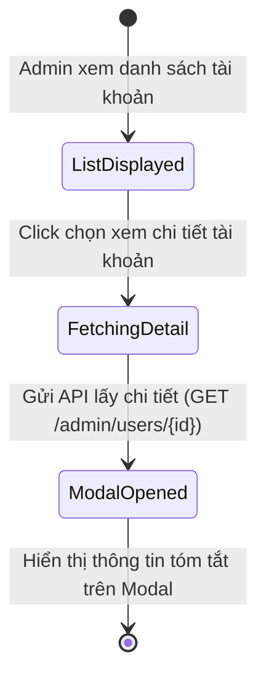
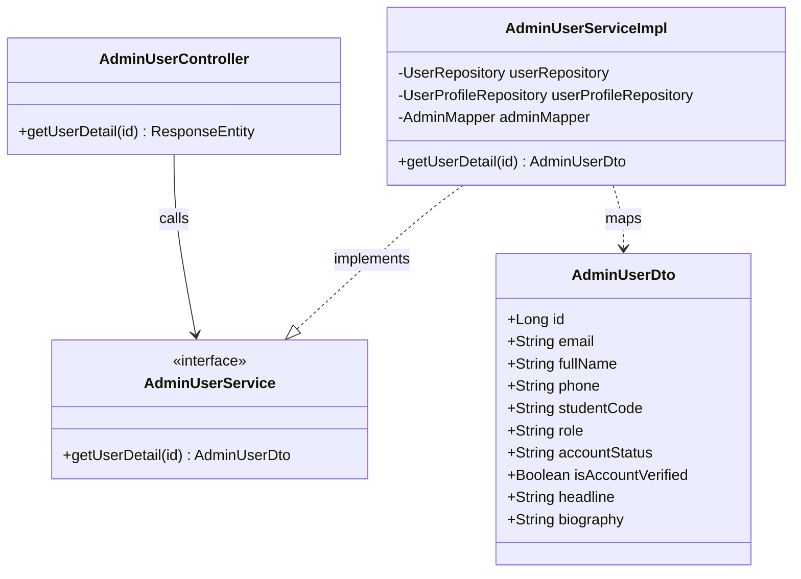
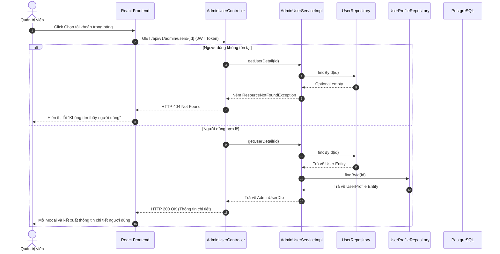

# ĐẶC TẢ YÊU CẦU & THIẾT KẾ CHI TIẾT: UC62 - XEM CHI TIẾT HỒ SƠ TÀI KHOẢN (VIEW USER PROFILE DETAIL)

## PHẦN 1: ĐẶC TẢ NGHIỆP VỤ (REPORT 3)

### 2.2.3 Business Workflow (Luồng nghiệp vụ)



#### Mô tả chi tiết luồng xử lý bằng chữ (Business Step Description):
* **Bước 1 - Khởi đầu**: Quản trị viên (Admin) xem danh sách tài khoản người dùng tại `/admin/users` và chọn một tài khoản để xem chi tiết.
* **Bước 2 - Các bước chuyển tiếp**:
  * Admin click chọn tài khoản từ bảng danh sách tài khoản.
  * Hệ thống hiển thị trạng thái chờ tải và gửi yêu cầu API `GET /api/v1/admin/users/{id}` để truy xuất dữ liệu hồ sơ chi tiết.
  * Sau khi dữ liệu tải về thành công, hệ thống mở cửa sổ Modal popup và kết xuất các thông tin hồ sơ của tài khoản.
* **Bước 3 - Kết thúc**: Admin xem xong thông tin chi tiết trên Modal và bấm nút đóng Modal để quay lại danh sách tài khoản.

### 3.2 Module Quản Trị Hệ Thống (Admin Console)

#### 3.2.1 Xem chi tiết hồ sơ tài khoản (UC62)
* **Function trigger**:
  * **Navigation path**: `/admin/users` (click trực tiếp vào dòng của tài khoản trong bảng danh sách).
  * **Timing Frequency**: On demand (Khi click chọn xem chi tiết).

* **Function description**:
  * **Actors/Roles**: Admin
  * **Purpose**: Xem các thông tin đăng ký và hồ sơ liên kết của một tài khoản trực tiếp qua Modal tóm tắt mà không cần chuyển trang.
  * **Interface**:
    * Modal popup hiển thị: Avatar, Họ tên, Email, Số điện thoại, Vai trò tài khoản, Trạng thái (Badge), Mã số sinh viên, Niên khóa, Headline.

* **Data processing**:
  1. Frontend gửi yêu cầu `GET /api/v1/admin/users/{id}` kèm token.
  2. Backend kiểm tra tính hợp lệ của Token Admin.
  3. Service truy xuất bản ghi `User` và `UserProfile` theo ID của người dùng.
  4. Trả kết quả JSON về cho Client để render lên Modal.

* **Screen layout**:
  * Figure 62.1: User Profile Details Modal layout.

* **Function details**:
  * **Data**: `id` tài khoản.
  * **Business rules**: Các thông tin liên hệ như Email và Điện thoại phải được hiển thị đầy đủ trên Modal cho Admin kiểm soát.
  * **Validation**: Xác nhận ID là số nguyên dương hợp lệ.
  * **Error Handling**: Ném lỗi 404 Not Found nếu ID tài khoản không tồn tại trong hệ thống.
  * **Normal case**: Trả về chi tiết đối tượng tài khoản cùng mã HTTP 200 OK để hiển thị lên Modal.
  * **Abnormal case**: Lỗi truy cập DB, trả về HTTP 500.

---

### 5. Phụ Lục Yêu Cầu (Requirement Appendix)

#### 5.1 Business Rules (Quy tắc Nghiệp vụ)
| ID | Định nghĩa Quy tắc (Rule Definition) |
| :--- | :--- |
| **BR-ADMIN-01** | Quyền ADMIN là cao nhất, có toàn quyền quản trị tài khoản cựu sinh viên và sinh viên. |

#### 5.2 Application Messages List (Danh sách Thông điệp Ứng dụng)
| # | Mã thông điệp (Message code) | Loại thông điệp (Message Type) | Ngữ cảnh (Context) | Nội dung hiển thị (Content) |
| :--- | :--- | :--- | :--- | :--- |
| 1 | MSG-UC62-01 | Alert / Red | ID tài khoản không tồn tại | Không tìm thấy người dùng với ID: {id} |

---

## PHẦN 2: THIẾT KẾ CHI TIẾT (REPORT 4)

### 3. Detail Design (Thiết kế chi tiết)

#### 3.1 Xem chi tiết hồ sơ tài khoản

##### 3.1.1 Class Diagram (Sơ đồ Lớp)


###### Mô tả chi tiết cấu trúc các lớp (Class Design Description):
* **Lớp Controller**: `AdminUserController.java` tiếp nhận yêu cầu lấy chi tiết hồ sơ tài khoản theo `id` từ Client và gửi kết quả dạng `ResponseEntity`.
* **Lớp DTO**: `AdminUserDto.java` chứa các trường thông tin hồ sơ phẳng để gửi ra ngoài, đảm bảo không chứa băm mật khẩu.
* **Lớp Service**: Giao diện `AdminUserService.java` định nghĩa các phương thức xử lý tài khoản, `AdminUserServiceImpl.java` thực thi nghiệp vụ lấy dữ liệu người dùng.
* **Lớp Repository**: `UserRepository.java` và `UserProfileRepository.java` cung cấp các phương thức tìm kiếm thực thể bằng ID.

##### 3.1.2 Sequence Diagram (Sơ đồ Tuần tự)


###### Mô tả chi tiết luồng xử lý bằng chữ (Sequence Flow Description):
1. **Luồng 1 - Thành công (Normal Case)**:
   * Client gửi yêu cầu lấy thông tin chi tiết (GET) kèm ID người dùng hợp lệ.
   * Service tìm kiếm `User` và `UserProfile` trong DB bằng repositories.
   * Tìm thấy đầy đủ thông tin, Service chuyển đổi và trả về `AdminUserDto` cho Controller, Controller phản hồi HTTP 200 OK.
   * Frontend nhận phản hồi, mở cửa sổ Modal hiển thị đầy đủ thông tin chi tiết của người dùng.
2. **Luồng 2 - Không tìm thấy người dùng (Not Found Case)**:
   * ID người dùng gửi lên không tồn tại trong CSDL. Service ném ra `ResourceNotFoundException`.
   * ExceptionHandler bắt lỗi và trả về HTTP 404 Not Found cùng thông điệp tương ứng cho Client.

##### 3.1.3 Database Schema
Các bảng cơ sở dữ liệu liên quan:
* Bảng `users`
* Bảng `user_profiles`

##### 3.1.4 API Contract
* **Đường dẫn**: `GET /api/v1/admin/users/2`
* **HTTP Status**: 200 OK
* **Response Payload**:
  ```json
  {
    "error": 0,
    "message": "Lấy chi tiết người dùng thành công",
    "data": {
      "id": 2,
      "email": "sinhvien@fpt.edu.vn",
      "fullName": "Nguyễn Văn Sinh Viên",
      "studentCode": "HE180001",
      "role": "STUDENT",
      "accountStatus": "ACTIVE",
      "isAccountVerified": true,
      "createdAt": "2026-07-05T09:50:11.902Z",
      "phone": "0988888888",
      "headline": "Sinh viên Kỹ thuật phần mềm K18"
    }
  }
  ```
