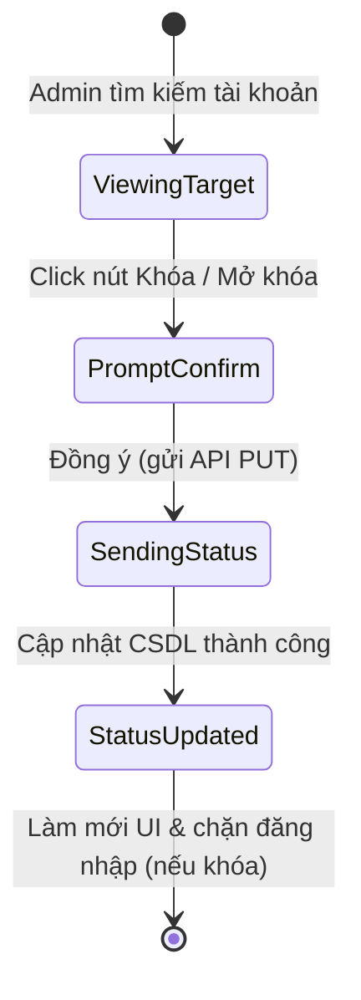
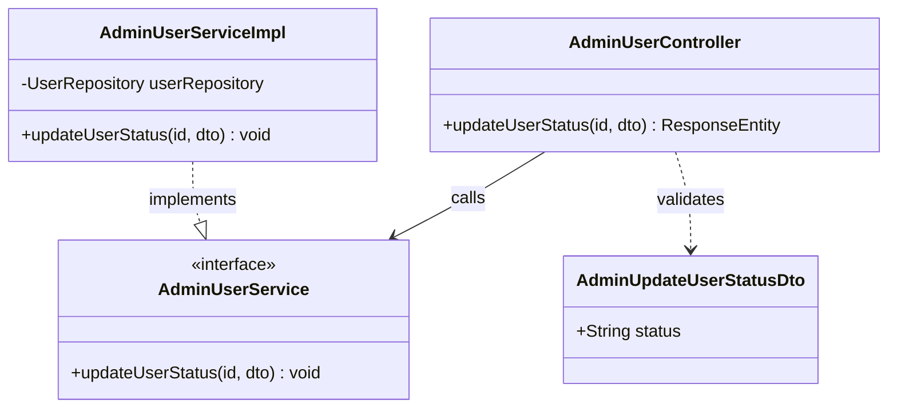
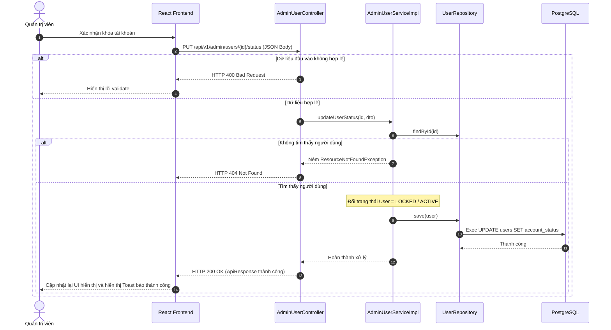

# ĐẶC TẢ YÊU CẦU & THIẾT KẾ CHI TIẾT: UC63 - KHÓA / MỞ KHÓA TÀI KHOẢN (LOCK / UNLOCK ACCOUNT)

## PHẦN 1: ĐẶC TẢ NGHIỆP VỤ (REPORT 3)

### 2.2.3 Business Workflow (Luồng nghiệp vụ)



#### Mô tả chi tiết luồng xử lý bằng chữ (Business Step Description):
* **Bước 1 - Khởi đầu**: Admin xác định tài khoản cần xử lý (vi phạm quy tắc hoặc cần mở khóa lại) từ danh sách tài khoản hoặc từ trang cá nhân của thành viên đó.
* **Bước 2 - Các bước chuyển tiếp**:
  * Admin nhấn chọn nút Khóa hoặc Mở khóa tài khoản tương ứng.
  * Giao diện React hiển thị cảnh báo xác nhận yêu cầu hành động để tránh thao tác nhầm lẫn.
  * Khi Admin đồng ý, frontend gửi yêu cầu cập nhật trạng thái kèm theo DTO chứa giá trị trạng thái đích (`ACTIVE` hoặc `LOCKED`) lên backend.
* **Bước 3 - Kết thúc**: Backend lưu trạng thái vào CSDL. Hệ thống tự động làm mới giao diện, tài khoản bị khóa sẽ không thể tiếp tục thực hiện đăng nhập hoặc tương tác trên hệ thống.

### 3.2 Module Quản Trị Hệ Thống (Admin Console)

#### 3.2.1 Khóa / Mở khóa tài khoản (UC63)
* **Function trigger**:
  * **Navigation path**: Nút thao tác nhanh trực tiếp trong bảng `/admin/users` hoặc tại Bảng điều khiển quản trị trên trang `/app/profile?userId={id}`.
  * **Timing Frequency**: On demand (Khi phát hiện tài khoản vi phạm hoặc khi duyệt mở khóa lại cho thành viên).

* **Function description**:
  * **Actors/Roles**: Admin
  * **Purpose**: Vô hiệu hóa hoặc kích hoạt lại quyền hoạt động của một tài khoản trong hệ thống.
  * **Interface**:
    * Các nút bấm Lock/Unlock hiển thị kèm Icon tương ứng (Lock, Unlock).
    * Hộp thoại xác nhận của hệ thống (confirm dialog).

* **Data processing**:
  1. Frontend gửi yêu cầu `PUT /api/v1/admin/users/{id}/status` kèm body trạng thái.
  2. Backend kiểm tra tính hợp lệ của Token Admin.
  3. Cập nhật trường `account_status` trong bảng `users` sang giá trị `ACTIVE` hoặc `LOCKED`.
  4. Trả kết quả thành công về cho Client.

* **Screen layout**:
  * Figure 63.1: Confirm Dialog for Lock action.
  * Figure 63.2: Confirm Dialog for Unlock action.

* **Function details**:
  * **Data**: `id` người dùng và trạng thái mới (`status` gửi trong Request Body).
  * **Validation**: Trạng thái gửi lên không được rỗng (`@NotNull`) và phải thuộc danh mục Enum hợp lệ.
  * **Business rules**: Admin không được tự khóa chính mình hoặc các tài khoản Admin khác để tránh mất quyền truy cập hệ thống.
  * **Error Handling**: Ném lỗi 400 Bad Request nếu trạng thái gửi lên không hợp lệ.
  * **Normal case**: Cập nhật trạng thái thành công, trả về HTTP 200 OK.
  * **Abnormal case**: Lỗi kết nối CSDL, trả về HTTP 500.

---

### 5. Phụ Lục Yêu Cầu (Requirement Appendix)

#### 5.1 Business Rules (Quy tắc Nghiệp vụ)
| ID | Định nghĩa Quy tắc (Rule Definition) |
| :--- | :--- |
| **BR-ADMIN-03** | Mọi thay đổi trạng thái tài khoản (Lock/Unlock/Verify) đều phải được lưu vết lịch sử trong DB (người duyệt, ghi chú, thời điểm). |

#### 5.2 Application Messages List (Danh sách Thông điệp Ứng dụng)
| # | Mã thông điệp (Message code) | Loại thông điệp (Message Type) | Ngữ cảnh (Context) | Nội dung hiển thị (Content) |
| :--- | :--- | :--- | :--- | :--- |
| 1 | MSG-UC63-01 | Toast / Success | Cập nhật trạng thái thành công | Cập nhật trạng thái tài khoản thành công |
| 2 | MSG-UC63-02 | Alert / Red | Gửi trạng thái không hợp lệ | Trạng thái tài khoản không hợp lệ: {status} |

---

## PHẦN 2: THIẾT KẾ CHI TIẾT (REPORT 4)

### 3. Detail Design (Thiết kế chi tiết)

#### 3.1 Khóa / Mở khóa tài khoản

##### 3.1.1 Class Diagram (Sơ đồ Lớp)


###### Mô tả chi tiết cấu trúc các lớp (Class Design Description):
* **Lớp Controller**: `AdminUserController.java` tiếp nhận yêu cầu thay đổi trạng thái kèm DTO từ Client và định tuyến xử lý.
* **Lớp DTO**: `AdminUpdateUserStatusDto.java` tiếp nhận trạng thái mới từ Client (ACTIVE hoặc LOCKED) và thực hiện kiểm định validation đầu vào.
* **Lớp Service**: Giao diện `AdminUserService.java` định nghĩa các phương thức xử lý tài khoản, `AdminUserServiceImpl.java` kế thừa thực thi logic thay đổi trạng thái trong DB.
* **Lớp Repository**: `UserRepository.java` cung cấp các phương thức tìm kiếm và lưu trữ thực thể người dùng.

##### 3.1.2 Sequence Diagram (Sơ đồ Tuần tự)


###### Mô tả chi tiết luồng xử lý bằng chữ (Sequence Flow Description):
1. **Luồng 1 - Thành công (Normal Case)**:
   * Client gửi yêu cầu thay đổi trạng thái (PUT) chứa token ADMIN hợp lệ và payload JSON trạng thái hợp lệ.
   * Service tìm người dùng trong DB, thay đổi trường `accountStatus` và lưu lại thông qua repository.
   * Trả về kết quả thành công HTTP 200 OK cùng ApiResponse.
2. **Luồng 2 - Lỗi dữ liệu đầu vào (Validation Error Case)**:
   * Client gửi yêu cầu thiếu trường `status` hoặc sai định dạng. Bộ lọc JSR-380 phát hiện lỗi, GlobalExceptionHandler trả về HTTP 400 Bad Request kèm chi tiết lỗi.
3. **Luồng 3 - Ngoại lệ không tìm thấy người dùng (Not Found Case)**:
   * ID người dùng gửi lên không tồn tại trong CSDL. Service ném `ResourceNotFoundException`. GlobalExceptionHandler bắt lỗi và trả về HTTP 404.

##### 3.1.3 Database Schema
Bảng sửa đổi:
* Bảng `users` (trường `account_status` cập nhật thành `LOCKED` hoặc `ACTIVE`).

##### 3.1.4 API Contract
* **Đường dẫn**: `PUT /api/v1/admin/users/3/status`
* **HTTP Status**: 200 OK
* **Request Payload**:
  ```json
  {
    "status": "LOCKED"
  }
  ```
* **Response Payload**:
  ```json
  {
    "error": 0,
    "message": "Cập nhật trạng thái tài khoản thành công",
    "data": null
  }
  ```
