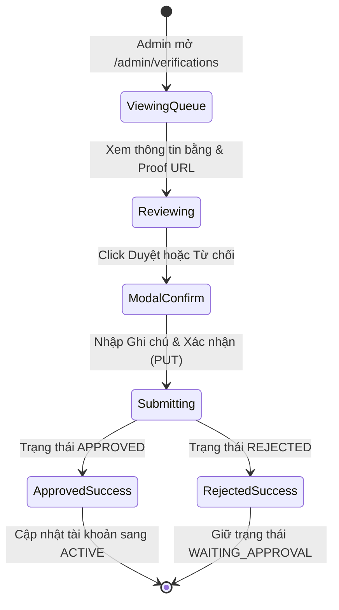
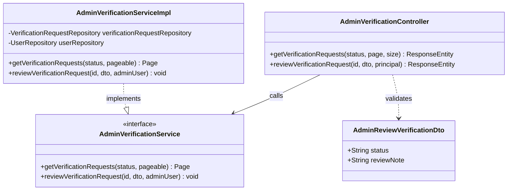
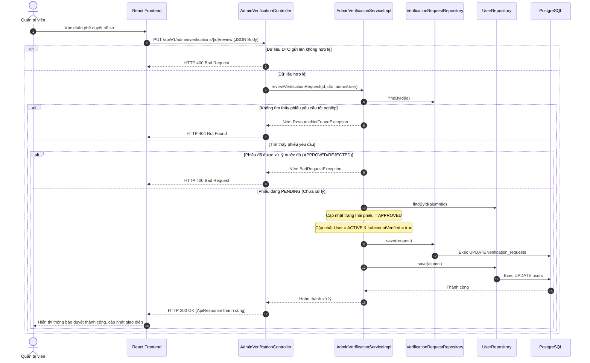

# ĐẶC TẢ YÊU CẦU & THIẾT KẾ CHI TIẾT: UC64 - PHÊ DUYỆT TÀI KHOẢN CỰU SINH VIÊN (APPROVE ALUMNI ACCOUNT)

## PHẦN 1: ĐẶC TẢ NGHIỆP VỤ (REPORT 3)

### 2.2.3 Business Workflow (Luồng nghiệp vụ)



#### Mô tả chi tiết luồng xử lý bằng chữ (Business Step Description):
* **Bước 1 - Khởi đầu**: Admin điều hướng vào hàng đợi duyệt hồ sơ cựu sinh viên (đường dẫn `/admin/verifications`).
* **Bước 2 - Các bước chuyển tiếp**:
  * Admin xem thông tin học vấn (ngành học, niên khóa), ghi chú và mở xem ảnh minh chứng tốt nghiệp (`proofUrl`).
  * Admin bấm chọn "Duyệt" (nếu minh chứng hợp lệ) hoặc "Từ chối" (nếu minh chứng không đúng/mờ).
  * Giao diện hiển thị Modal kiểm duyệt yêu cầu nhập ghi chú kiểm duyệt. Nếu chọn Từ chối, lý do từ chối kiểm duyệt là bắt buộc.
  * Admin bấm xác nhận để gửi API kiểm duyệt lên backend.
* **Bước 3 - Kết thúc**:
  * Nếu duyệt thành công (`APPROVED`), hệ thống đổi trạng thái phiếu duyệt tốt nghiệp sang `APPROVED`, đồng bộ cập nhật tài khoản người dùng sang `ACTIVE` và gán `isAccountVerified = true`.
  * Nếu từ chối (`REJECTED`), hệ thống cập nhật phiếu về `REJECTED`, tài khoản người dùng vẫn ở trạng thái chờ duyệt `WAITING_APPROVAL` để gửi lại thông tin khác.

### 3.2 Module Quản Trị Hệ Thống (Admin Console)

#### 3.2.1 Phê duyệt tài khoản cựu sinh viên (UC64)
* **Function trigger**:
  * **Navigation path**: `/admin/verifications` hoặc hàng đợi phê duyệt nhanh tại trang tổng quan `/admin`.
  * **Timing Frequency**: On demand (Khi có hồ sơ đăng ký cựu sinh viên mới được gửi lên).

* **Function description**:
  * **Actors/Roles**: Admin
  * **Purpose**: Kiểm soát hồ sơ, xác thực thông tin bằng cấp của cựu sinh viên Đại học FPT trước khi cho phép hoạt động trên hệ thống.
  * **Interface**:
    * Bộ lọc danh sách theo trạng thái: Đang chờ duyệt, Đã chấp thuận, Đã từ chối.
    * Bảng danh sách hiển thị tên, ngành học, khóa học, ghi chú kèm link ảnh minh chứng tốt nghiệp.
    * Modal phản hồi kiểm duyệt.

* **Data processing**:
  1. Frontend gửi yêu cầu `PUT /api/v1/admin/verifications/{id}/review` kèm body chứa status (APPROVED / REJECTED) và reviewNote.
  2. Backend kiểm tra tính tồn tại và trạng thái `PENDING` của phiếu yêu cầu tốt nghiệp.
  3. Cập nhật thông tin phiếu yêu cầu: trạng thái duyệt, ghi chú kiểm duyệt, thời gian duyệt, tài khoản quản trị duyệt.
  4. Đồng bộ cập nhật thông tin tài khoản người dùng tương ứng dựa trên kết quả phê duyệt.
  5. Trả kết quả JSON về cho Client.

* **Screen layout**:
  * Figure 64.1: Alumni Verification Queue layout.
  * Figure 64.2: Review Confirmation Modal layout.

* **Function details**:
  * **Data**: `status` (APPROVED hoặc REJECTED), `reviewNote`.
  * **Validation**: Trạng thái gửi lên không được rỗng. Nếu từ chối, `reviewNote` bắt buộc phải nhập.
  * **Business rules**: Chỉ tài khoản của Alumni mới có yêu cầu xác minh tốt nghiệp.
  * **Error Handling**: Ném lỗi 400 Bad Request nếu phiếu yêu cầu tốt nghiệp đã được xử lý từ trước.
  * **Normal case**: Phê duyệt hoặc từ chối thành công, trả về HTTP 200 OK.
  * **Abnormal case**: Lỗi kết nối CSDL, trả về HTTP 500.

---

### 5. Phụ Lục Yêu Cầu (Requirement Appendix)

#### 5.1 Business Rules (Quy tắc Nghiệp vụ)
| ID | Định nghĩa Quy tắc (Rule Definition) |
| :--- | :--- |
| **BR-ADMIN-02** | Trạng thái tài khoản của Alumni chỉ được phép chuyển sang `ACTIVE` sau khi hồ sơ xác thực bằng đại học được phê duyệt `APPROVED`. |

#### 5.2 Application Messages List (Danh sách Thông điệp Ứng dụng)
| # | Mã thông điệp (Message code) | Loại thông điệp (Message Type) | Ngữ cảnh (Context) | Nội dung hiển thị (Content) |
| :--- | :--- | :--- | :--- | :--- |
| 1 | MSG-UC64-01 | Toast / Success | Phê duyệt thành công | Đã phê duyệt yêu cầu xác thực cựu sinh viên thành công |
| 2 | MSG-UC64-02 | Alert / Red | Phiếu đã được xử lý trước đó | Yêu cầu xác thực này đã được xử lý trước đó |

---

## PHẦN 2: THIẾT KẾ CHI TIẾT (REPORT 4)

### 3. Detail Design (Thiết kế chi tiết)

#### 3.1 Phê duyệt tài khoản cựu sinh viên

##### 3.1.1 Class Diagram (Sơ đồ Lớp)


###### Mô tả chi tiết cấu trúc các lớp (Class Design Description):
* **Lớp Controller**: `AdminVerificationController.java` tiếp nhận các yêu cầu lấy danh sách phiếu hoặc kiểm duyệt phiếu gửi từ client và định tuyến.
* **Lớp DTO**: `AdminReviewVerificationDto.java` chứa các trường đầu vào cho hành động kiểm duyệt (status và reviewNote) kèm các annotation kiểm định validation.
* **Lớp Service**: Giao diện `AdminVerificationService.java` định nghĩa các nghiệp vụ liên quan đến kiểm duyệt, `AdminVerificationServiceImpl.java` thực thi logic nghiệp vụ và đồng bộ trạng thái tài khoản.
* **Lớp Repository**: `VerificationRequestRepository.java` cung cấp các phương thức truy vấn và cập nhật bảng yêu cầu xác minh tốt nghiệp trong database.

##### 3.1.2 Sequence Diagram (Sơ đồ Tuần tự)


###### Mô tả chi tiết luồng xử lý bằng chữ (Sequence Flow Description):
1. **Luồng 1 - Thành công (Normal Case)**:
   * Client gửi yêu cầu phê duyệt (PUT) kèm DTO hợp lệ và token ADMIN hợp lệ.
   * Service tìm thấy phiếu đang ở trạng thái PENDING. Nó cập nhật trạng thái phiếu thành APPROVED/REJECTED, đồng bộ đổi trạng thái tài khoản cựu sinh viên, và gọi repositories lưu vào CSDL.
   * DB cập nhật thành công, trả về HTTP 200 OK kèm ApiResponse.
2. **Luồng 2 - Lỗi dữ liệu đầu vào (Validation Error Case)**:
   * Trạng thái gửi lên bị thiếu hoặc không đúng quy định. Spring Security/JSR-380 validation chặn lại và trả về HTTP 400 Bad Request.
3. **Luồng 3 - Phiếu đã được kiểm duyệt từ trước (Business Rule Error Case)**:
   * Admin cố tình gửi lại hành động duyệt cho phiếu đã APPROVED/REJECTED. Service ném `BadRequestException`, trả về HTTP 400 Bad Request.

##### 3.1.3 Database Schema
Các bảng liên quan:
* Bảng `verification_requests`
* Bảng `users`

##### 3.1.4 API Contract
* **Đường dẫn**: `PUT /api/v1/admin/verifications/1/review`
* **HTTP Status**: 200 OK
* **Request Payload**:
  ```json
  {
    "status": "APPROVED",
    "reviewNote": "Ảnh minh chứng bằng cấp hợp lệ."
  }
  ```
* **Response Payload**:
  ```json
  {
    "error": 0,
    "message": "Đã phê duyệt yêu cầu xác thực cựu sinh viên thành công",
    "data": null
  }
  ```
