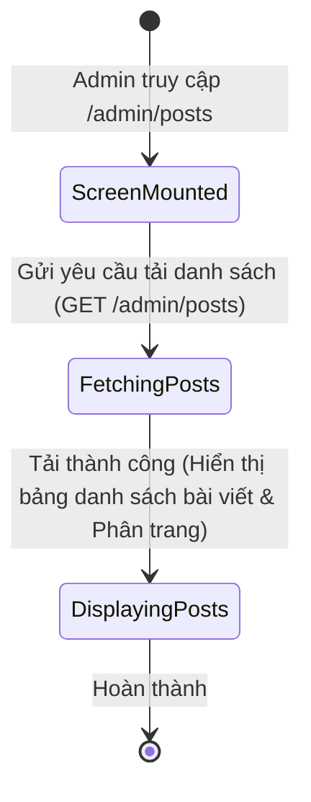
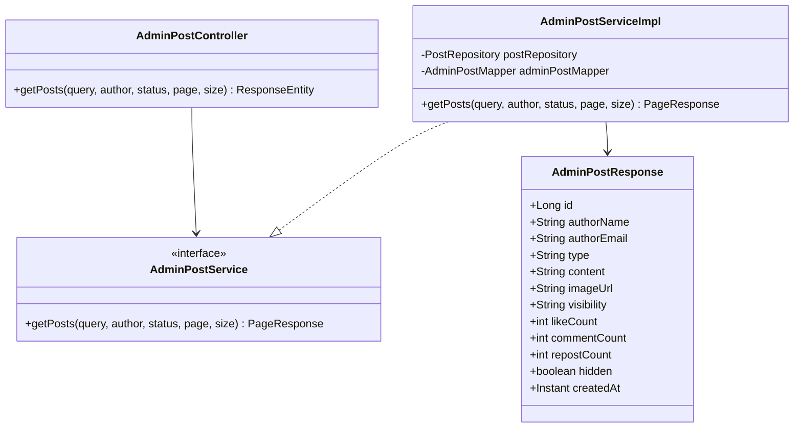
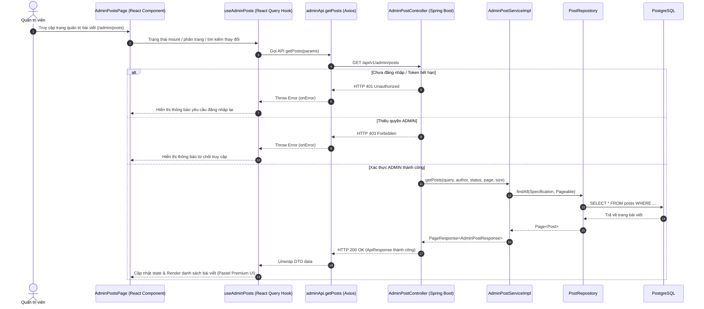

# ĐẶC TẢ YÊU CẦU & THIẾT KẾ CHI TIẾT: UC65 - XEM TOÀN BỘ BÀI VIẾT CỘNG ĐỒNG (VIEW ALL FEED POSTS)

## PHẦN 1: ĐẶC TẢ NGHIỆP VỤ

### 2.2.3 Business Workflow (Luồng nghiệp vụ)



#### Mô tả chi tiết luồng xử lý bằng chữ (Business Step Description):
* **Bước 1 - Khởi đầu**: Quản trị viên (Admin) đăng nhập thành công vào hệ thống và truy cập vào trang quản trị bài viết (đường dẫn `/admin/posts`).
* **Bước 2 - Các bước chuyển tiếp**: 
  * Giao diện React gửi yêu cầu lấy danh sách bài viết phân trang của toàn hệ thống tới API backend.
  * Trong lúc chờ dữ liệu tải về, giao diện hiển thị các khung xương giả lập (Skeletons) màu kem ấm.
  * Sau khi dữ liệu tải về thành công, hệ thống hiển thị danh sách bài viết gồm thông tin tác giả, nội dung bài viết, loại bài viết, phạm vi hiển thị, các chỉ số tương ứng (thích, bình luận, chia sẻ) và trạng thái bài viết (ẩn/hiển thị).
* **Bước 3 - Kết thúc**: Trình duyệt hoàn tất kết xuất giao diện quản trị bài viết cho Admin theo dõi.

### 3.2 Module Quản Trị Hệ Thống (Admin Console)
Module dành riêng cho người dùng có vai trò `ADMIN` thực hiện các thao tác quản trị dữ liệu và kiểm soát hệ thống.

#### 3.2.2 Xem toàn bộ bài viết cộng đồng (UC65)
* **Function trigger**:
  - **Navigation path**: `/admin/posts` (Trang Quản lý bài viết của Admin)
  - **Timing Frequency**: On screen mount (Mỗi khi trang được tải)

* **Function description**:
  - **Actors/Roles**: Admin
  - **Purpose**: Cho phép quản trị viên xem và kiểm duyệt toàn bộ các bài viết cộng đồng được đăng tải trên hệ thống.
  - **Interface**:
    - Bảng thông tin: Họ tên & email tác giả, nội dung tóm tắt bài viết, phạm vi hiển thị (Công khai/Thành viên), các chỉ số tương tác (like, comment, repost) và trạng thái ẩn/hiển thị.
    - Thanh điều hướng phân trang ở chân bảng.

* **Data processing**:
  1. Frontend gửi yêu cầu `GET` kèm Token Bearer trong Header đến `/api/v1/admin/posts`.
  2. Spring Security xác thực Token và kiểm tra vai trò `ADMIN`.
  3. Service thực hiện phân trang, truy vấn toàn bộ bài viết từ bảng `posts` và map dữ liệu thông qua `AdminPostMapper`.
  4. Trả dữ liệu JSON dạng phân trang về cho client.

* **Screen layout**:
  - Figure 65.1: Admin Feed Posts List Layout.

* **Function details**:
  - **Data**: Danh sách bài viết dạng `AdminPostResponse` chứa `id`, `authorName`, `authorEmail`, `type`, `content`, `imageUrl`, `visibility`, `likeCount`, `commentCount`, `repostCount`, `hidden`, `createdAt`.
  - **Validation**: Kiểm tra token có vai trò `ADMIN`.
  - **Business rules**: Chỉ tài khoản có vai trò `ADMIN` mới được phép truy xuất dữ liệu này. Người dùng vai trò khác nhận mã lỗi 403.
  - **Error Handling**: 
    - Token hết hạn: Trả về HTTP 401 Unauthorized.
    - Không đúng quyền: Trả về HTTP 403 Forbidden.
  - **Normal case**: Trả về dữ liệu phân trang bài viết dạng JSON cùng mã HTTP 200 OK.
  - **Abnormal case**: Lỗi kết nối database, trả về HTTP 500 Internal Server Error.

---

### 5. Phụ Lục Yêu Cầu (Requirement Appendix)

#### 5.1 Business Rules (Quy tắc Nghiệp vụ)
| ID | Định nghĩa Quy tắc (Rule Definition) |
| :--- | :--- |
| **BR-ADMIN-01** | Quyền ADMIN là cao nhất, có toàn quyền truy cập các API bắt đầu bằng `/api/v1/admin/**`. |

#### 5.3 Application Messages List (Danh sách Thông điệp Ứng dụng)
| # | Mã thông điệp (Message code) | Loại thông điệp (Message Type) | Ngữ cảnh (Context) | Nội dung hiển thị (Content) |
| :--- | :--- | :--- | :--- | :--- |
| 1 | MSG-UC65-01 | Toast message | Lấy danh sách bài viết thành công | Lấy danh sách bài viết thành công |

---

## PHẦN 2: THIẾT KẾ CHI TIẾT

### 3. Detail Design (Thiết kế chi tiết)

#### 3.1 Xem toàn bộ bài viết cộng đồng

##### 3.1.1 Class Diagram (Sơ đồ Lớp)


##### 3.1.2 Sequence Diagram (Sơ đồ Tuần tự)


###### Mô tả chi tiết luồng xử lý bằng chữ (Sequence Flow Description):
1. **Luồng thành công (Normal Case)**:
   - Admin truy cập trang `/admin/posts` trên trình duyệt.
   - Component `AdminPostsPage.tsx` kích hoạt hook `useAdminPosts` gửi yêu cầu API `GET /api/v1/admin/posts` kèm theo token JWT xác thực trong Header.
   - `AdminPostController` kiểm tra quyền `ADMIN`. Sau khi xác thực hợp lệ, gọi dịch vụ `AdminPostServiceImpl.getPosts()`.
   - Dịch vụ sử dụng `PostSpecification` tạo truy vấn động và phân trang, gọi `PostRepository.findAll(Specification, Pageable)`.
   - Kết quả truy vấn từ bảng `posts` được map sang `AdminPostResponse` thông qua `AdminPostMapper`.
   - Hệ thống trả về mã trạng thái HTTP 200 OK kèm payload danh sách bài viết định dạng JSON. Giao diện React hiển thị danh sách bài viết dưới dạng bảng.
2. **Luồng thất bại do xác thực (Auth Error Cases)**:
   - Nếu token không hợp lệ hoặc thiếu quyền `ADMIN`, Spring Security tự động ngắt tiến trình và trả về HTTP 401 hoặc 403. Giao diện người dùng sẽ bắt lỗi và hiển thị thông báo lỗi tương ứng.

##### 3.1.3 Database Schema (Cơ cấu Dữ liệu)
Bảng chính sử dụng để quản lý bài viết:
* **`posts`**:
  - `id` (BIGINT, PRIMARY KEY)
  - `user_id` (BIGINT, FOREIGN KEY) - Liên kết tới bảng `users(id)` để lấy thông tin tác giả.
  - `type` (VARCHAR) - Loại bài viết (`NORMAL`, `ACHIEVEMENT`, `RECRUITMENT`, `EVENT`).
  - `content` (TEXT) - Nội dung bài viết.
  - `image_url` (VARCHAR) - Đường dẫn hình ảnh đính kèm bài viết.
  - `visibility` (VARCHAR) - Phạm vi hiển thị (`PUBLIC`, `MEMBERS`).
  - `like_count` / `comment_count` / `repost_count` (INTEGER) - Chỉ số tương tác.
  - `is_hidden` (BOOLEAN) - Trạng thái ẩn/hiện của bài viết (Admin kiểm soát).
  - `created_at` (TIMESTAMPTZ) - Thời gian tạo bài viết.

##### 3.1.4 API Contract (Đặc tả API)
* **Đường dẫn**: `GET /api/v1/admin/posts`
* **Tham số truy vấn (Query Params)**:
  - `query` (String): Từ khóa tìm kiếm nội dung bài viết.
  - `author` (String): Từ khóa tìm kiếm tên/email tác giả.
  - `status` (String): Bộ lọc trạng thái ẩn/hiện (`ALL`, `VISIBLE`, `HIDDEN`).
  - `page` (Integer): Số trang (0-indexed).
  - `size` (Integer): Số lượng bài viết trên mỗi trang.
* **HTTP Status**: 200 OK
* **Response Payload**:
  ```json
  {
    "error": 0,
    "message": "Lấy danh sách bài viết thành công",
    "data": {
      "content": [
        {
          "id": 1,
          "authorName": "Nguyễn Trí Tuệ",
          "authorEmail": "career.explorer@fpt.edu.vn",
          "type": "NORMAL",
          "content": "Chào mừng toàn thể thành viên đến với mạng lưới cựu sinh viên AlumNect FPT!...",
          "imageUrl": null,
          "visibility": "PUBLIC",
          "likeCount": 15,
          "commentCount": 3,
          "repostCount": 1,
          "hidden": false,
          "createdAt": "2026-07-24T05:00:00Z"
        }
      ],
      "totalElements": 5,
      "totalPages": 1,
      "size": 10,
      "number": 0
    }
  }
  ```

---

## PHẦN 3: BẢN ĐỒ PHÂN BỐ TỆP TIN (PHYSICAL FILE MAP)

Dưới đây là sơ đồ ánh xạ các tệp tin triển khai tính năng UC65:

### 1. Backend (Spring Boot)
- **Controller**: [AdminPostController.java](file:///e:/Learn/AlumNectFPT/Alumnect/alumnect-backend/src/main/java/com/alumnect/alumnect_backend/controller/admin/AdminPostController.java) (Định nghĩa endpoint API `/admin/posts`).
- **Service**: [AdminPostService.java](file:///e:/Learn/AlumNectFPT/Alumnect/alumnect-backend/src/main/java/com/alumnect/alumnect_backend/service/admin/AdminPostService.java) & [AdminPostServiceImpl.java](file:///e:/Learn/AlumNectFPT/Alumnect/alumnect-backend/src/main/java/com/alumnect/alumnect_backend/service/admin/AdminPostServiceImpl.java) (Xử lý nghiệp vụ phân trang & lọc động).
- **Specification**: [PostSpecification.java](file:///e:/Learn/AlumNectFPT/Alumnect/alumnect-backend/src/main/java/com/alumnect/alumnect_backend/specification/post/PostSpecification.java) (Tạo truy vấn động JPA Criteria).
- **DTO**: [AdminPostResponse.java](file:///e:/Learn/AlumNectFPT/Alumnect/alumnect-backend/src/main/java/com/alumnect/alumnect_backend/dto/response/admin/AdminPostResponse.java).
- **Mapper**: [AdminPostMapper.java](file:///e:/Learn/AlumNectFPT/Alumnect/alumnect-backend/src/main/java/com/alumnect/alumnect_backend/mapper/admin/AdminPostMapper.java).

### 2. Frontend (React + TypeScript)
- **API Client**: [adminApi.ts](file:///e:/Learn/AlumNectFPT/Alumnect/alumnect-frontend/src/features/admin/api/adminApi.ts) (Định nghĩa hàm `getPosts` call API backend).
- **Hooks**: [useAdmin.ts](file:///e:/Learn/AlumNectFPT/Alumnect/alumnect-frontend/src/features/admin/hooks/useAdmin.ts) (Hook React Query `useAdminPosts`).
- **Page Component**: [AdminPostsPage.tsx](file:///e:/Learn/AlumNectFPT/Alumnect/alumnect-frontend/src/features/admin/components/AdminPostsPage.tsx) (Giao diện hiển thị danh sách bài viết Premium Pastel UI).
- **Barrel File**: [index.ts](file:///e:/Learn/AlumNectFPT/Alumnect/alumnect-frontend/src/features/admin/index.ts) (Xuất khẩu tập trung module admin).
- **Router**: [App.tsx](file:///e:/Learn/AlumNectFPT/Alumnect/alumnect-frontend/src/App.tsx) (Đăng ký route `/admin/posts`).

