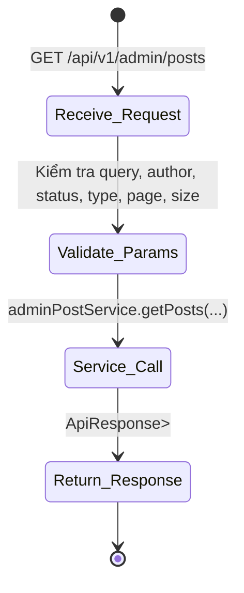
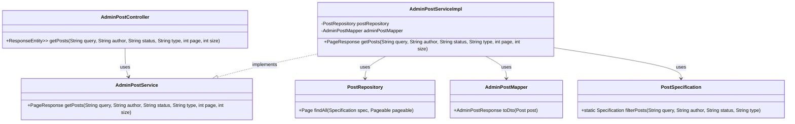

# ĐẶC TẢ YÊU CẦU & THIẾT KẾ CHI TIẾT: UC66 - Filter By Type

## PHẦN 1: ĐẶC TẢ NGHIỆP VỤ (REPORT 3)

### 2.2.3 Business Workflow (Luồng nghiệp vụ)
<!--
Mô tả bằng sơ đồ Mermaid (State/Activity Diagram) kết hợp với danh sách các bước xử lý nghiệp vụ thực tế của hệ thống từ đầu tới cuối.
-->


#### Mô tả chi tiết luồng xử lý bằng chữ (Business Step Description):
* **Bước 1 – Nhận yêu cầu**: Frontend gọi endpoint `GET /api/v1/admin/posts` với các tham số tùy chọn.
* **Bước 2 – Kiểm tra tham số**: Spring tự động kiểm tra `@RequestParam(required = false)`; nếu giá trị không hợp lệ trả về `400 Bad Request`.
* **Bước 3 – Gọi Service**: Controller truyền các tham số (`query`, `author`, `status`, `type`, `page`, `size`) cho `adminPostService.getPosts`.
* **Bước 4 – Trả về kết quả**: Service trả về `PageResponse<AdminPostResponse>` được bọc trong `ApiResponse.success` và gửi lại cho client.

### 3.2 Admin Post Management (Module quản trị bài viết)

#### 3.2.1 Filter By Type (UC66)

**Function trigger**:
* **Navigation path**: `Admin > Bài viết > Xem danh sách`
* **Timing Frequency**: On demand (khi người dùng truy cập trang hoặc thay đổi bộ lọc).

**Function description**:
* **Actors/Roles**: ADMIN
* **Purpose**: Lọc danh sách bài viết theo loại (`NORMAL`, `EVENT`, `RECRUITMENT`, `ACHIEVEMENT`) cùng các bộ lọc khác.
* **Interface**:
  * **Request method**: `GET`
  * **Query parameters**:
    - `query` (string, optional) – Từ khóa nội dung
    - `author` (string, optional) – Tên hoặc email tác giả
    - `status` (string, optional) – `VISIBLE`, `HIDDEN` hoặc `ALL`
    - `type` (string, optional) – `NORMAL`, `EVENT`, `RECRUITMENT`, `ACHIEVEMENT` hoặc `ALL`
    - `page` (int, required) – Số trang (0‑based)
    - `size` (int, required) – Số phần tử mỗi trang
  * **Response**: `ApiResponse<PageResponse<AdminPostResponse>>`
    - `content` – Danh sách DTO bài viết
    - `totalElements`, `totalPages`, `pageSize`, `pageNumber`, `last`

**Data processing**:
* Controller chuyển tham số sang Service.
* Service tạo `Specification<Post>` thông qua `PostSpecification.filterPosts` để xây dựng predicate động dựa trên các tham số.
* Repository thực hiện truy vấn phân trang (`findAll(spec, pageable)`).
* Mapper chuyển `Post` entity sang `AdminPostResponse` DTO.

**Screen layout**:
* Không áp dụng (Backend API).

**Function details**:
* **Data**: Các trường của `AdminPostResponse` (id, authorName, authorEmail, type, content, imageUrl, visibility, likeCount, commentCount, repostCount, hidden, createdAt).
* **Validation**: Các tham số không bắt buộc; `page` và `size` có giá trị mặc định `0` và `10` nếu không truyền.
* **Business rules**:
  - Nếu `type` không thuộc các giá trị cho phép trả về `400 Bad Request`.
  - Nếu `status` không hợp lệ trả về `400 Bad Request`.
* **Error Handling**:
  - `400` – Tham số không hợp lệ.
  - `500` – Lỗi server nội bộ.
* **Normal case**: Truy vấn thành công, trả về danh sách bài viết (có hoặc không có dữ liệu).
* **Abnormal case**: Tham số không hợp lệ hoặc lỗi DB, trả về thông báo lỗi chi tiết.

---

## PHẦN 2: THIẾT KẾ CHI TIẾT (REPORT 4)

### 3. Detail Design (Thiết kế chi tiết)

#### 3.1 AdminPostController
```java
@GetMapping
public ResponseEntity<ApiResponse<PageResponse<AdminPostResponse>>> getPosts(
        @RequestParam(required = false) String query,
        @RequestParam(required = false) String author,
        @RequestParam(required = false) String status,
        @RequestParam(required = false) String type,
        @RequestParam(defaultValue = "0") int page,
        @RequestParam(defaultValue = "10") int size) {
    PageResponse<AdminPostResponse> posts = adminPostService.getPosts(query, author, status, type, page, size);
    return ResponseEntity.ok(ApiResponse.success("Lấy danh sách bài viết thành công", posts));
}
```

#### 3.2 AdminPostService
```java
PageResponse<AdminPostResponse> getPosts(String query, String author, String status, String type, int page, int size);
```

#### 3.3 PostSpecification
```java
public static Specification<Post> filterPosts(String query, String author, String status, String type) {
    return (root, queryObj, cb) -> {
        List<Predicate> predicates = new ArrayList<>();
        if (StringUtils.hasText(query)) {
            predicates.add(cb.like(cb.lower(root.get("content")), "%" + query.toLowerCase() + "%"));
        }
        if (StringUtils.hasText(author)) {
            Join<Post, User> userJoin = root.join("author", JoinType.LEFT);
            predicates.add(cb.or(
                cb.like(cb.lower(userJoin.get("fullName")), "%" + author.toLowerCase() + "%"),
                cb.like(cb.lower(userJoin.get("email")), "%" + author.toLowerCase() + "%")
            ));
        }
        if (StringUtils.hasText(status)) {
            predicates.add(cb.equal(root.get("visibility"), status.toUpperCase()));
        }
        if (StringUtils.hasText(type)) {
            predicates.add(cb.equal(root.get("type"), type.toUpperCase()));
        }
        return cb.and(predicates.toArray(new Predicate[0]));
    };
}
```

#### 3.4 Class Diagram (Mermaid)


---

*This SRS document follows the structure defined in `TemplateSRS.md` and reflects the implementation of UC66 – Filter By Type.*
