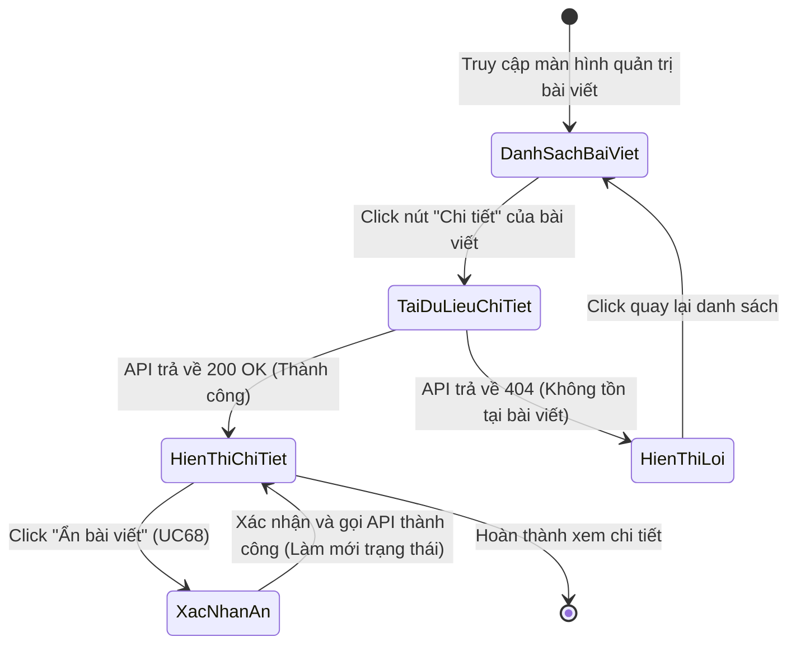
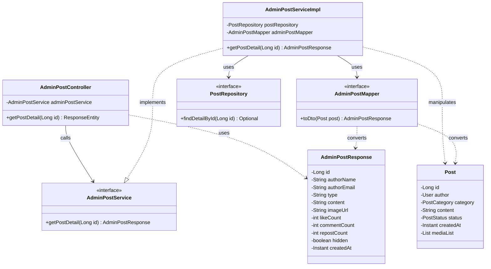
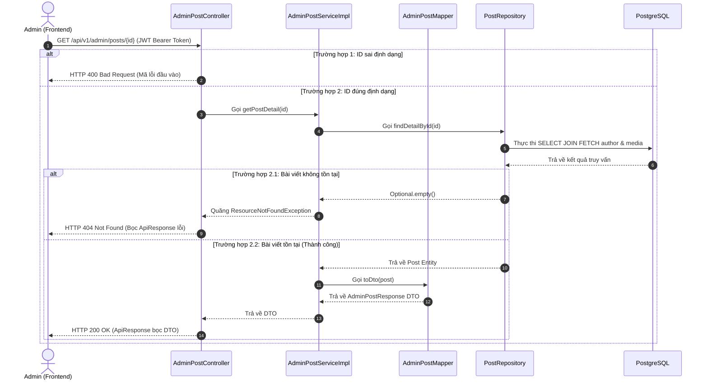

# ĐẶC TẢ YÊU CẦU & THIẾT KẾ CHI TIẾT: UC67 - XEM CHI TIẾT BÀI VIẾT CỘNG ĐỒNG (ADMIN)

## PHẦN 1: ĐẶC TẢ NGHIỆP VỤ (REPORT 3)

### 2.2.3 Business Workflow (Luồng nghiệp vụ)

#### Mô tả chi tiết luồng xử lý bằng chữ (Business Step Description):
* **Bước 1 - Khởi đầu**: Quản trị viên (Admin) đã đăng nhập vào hệ thống và truy cập trang quản lý bài viết cộng đồng (/admin/posts).
* **Bước 2 - Yêu cầu Xem Chi Tiết**: Admin nhấp chuột vào nút "Chi tiết" của một bài viết cụ thể. Hệ thống kích hoạt chuyển hướng sang URL `/admin/posts/:id` và đồng thời gửi yêu cầu API lấy chi tiết bài viết.
* **Bước 3 - Xử lý phía Server**:
  * Server kiểm tra phân quyền (chỉ ADMIN mới được truy cập).
  * Thực hiện tìm kiếm bài viết trong cơ sở dữ liệu.
  * Nếu bài viết tồn tại, nạp đầy đủ thông tin tác giả, hình ảnh đính kèm và trả về mã phản hồi 200 OK.
  * Nếu không tìm thấy bài viết, trả về lỗi 404 Not Found.
* **Bước 4 - Hiển thị giao diện**:
  * Khi đang tải dữ liệu: Hiển thị bộ xương tải (Skeleton Screen) kem ấm.
  * Tải thành công: Hiển thị chi tiết bài viết (tác giả, nội dung, ảnh đính kèm, tương tác, trạng thái ẩn/hiện).
  * Tải thất bại: Hiển thị giao diện báo lỗi (EmptyState) để người dùng quay lại trang danh sách.

---

### 3.2 Quản Lý Bài Viết

#### 3.2.1 Xem chi tiết bài viết cộng đồng dành cho Admin

**Function trigger**:
*   **Navigation path**: /admin/posts -> click nút "Chi tiết" trên bảng danh sách bài viết -> chuyển hướng tới `/admin/posts/:id`
*   **Timing Frequency**: On screen mount (Mỗi khi Admin truy cập trang chi tiết bài viết)

**Function description**:
*   **Actors/Roles**: ADMIN
*   **Purpose**: Giúp Quản trị viên xem đầy đủ nội dung bài viết cộng đồng cùng hình ảnh đính kèm và các chỉ số tương tác để phục vụ việc kiểm duyệt và ẩn bài viết vi phạm.
*   **Interface**:
    *   Nút "Quay lại danh sách bài viết".
    *   Khung hiển thị thông tin tác giả: Ảnh đại diện (Avatar), Họ tên, Email.
    *   Khung hiển thị nội dung: Badge loại bài viết (Bình thường, Thành tựu, Tuyển dụng, Sự kiện), nội dung văn bản đầy đủ, hình ảnh đính kèm (nếu có).
    *   Thanh chỉ số tương tác: lượt thích, bình luận, lượt đăng lại.
    *   Khung kiểm duyệt ở cột phải: Trạng thái hiện tại (Đang hiển thị / Đã ẩn), ID bài viết, thời gian đăng bài, và nút bấm "Ẩn bài viết" (hoặc "Mở ẩn bài viết" nếu bài viết đang ẩn).

**Data processing**:
1. Client gửi request `GET /api/v1/admin/posts/{id}` kèm JWT token của Admin trong header.
2. Spring Boot Security lọc phân quyền. Nếu role không phải ADMIN, trả về 403 Forbidden.
3. Controller tiếp nhận ID bài viết, gọi Service tìm kiếm.
4. Service thực thi câu lệnh SQL kết hợp fetch join lấy thông tin tác giả và danh sách media.
5. Nếu tìm thấy, Mapper chuyển đổi thực thể Post sang `AdminPostResponse` DTO gửi về Client.

**Screen layout**:
*   Figure 67: Màn hình chi tiết bài viết của Admin chia làm 2 cột: Cột trái chứa nội dung bài viết (2/3 chiều rộng), cột phải chứa thông tin kiểm duyệt và các nút hành động (1/3 chiều rộng).

**Function details**:
*   **Data**:
    *   `id` (Long): ID bài viết.
    *   `authorName` (String): Họ tên tác giả.
    *   `authorEmail` (String): Email tác giả.
    *   `type` (String): Loại bài viết (GENERAL, ACHIEVEMENT, RECRUITMENT, EVENT).
    *   `content` (String): Nội dung bài viết.
    *   `imageUrl` (String): Link ảnh đính kèm.
    *   `likeCount`, `commentCount`, `repostCount` (Integer): Các số liệu tương tác.
    *   `hidden` (Boolean): Trạng thái ẩn.
    *   `createdAt` (Instant): Thời điểm tạo.
*   **Validation**: ID bài viết trên đường dẫn phải là số nguyên dương lớn hơn 0.
*   **Business rules**:
    *   BR-Admin-01: Chỉ tài khoản có vai trò ADMIN mới được phép gọi API xem chi tiết bài viết.
    *   BR-Admin-02: Admin có quyền xem chi tiết tất cả các bài viết kể cả các bài viết đang bị ẩn (HIDDEN).
*   **Error Handling**:
    *   Trả về 404 Not Found kèm thông báo "Không tìm thấy bài viết với ID: {id}" nếu ID truyền vào không tồn tại.
    *   Trả về 400 Bad Request nếu ID sai định dạng (ví dụ: chữ cái).
*   **Normal case**: API trả về status 200 OK bọc JSON data có cấu trúc `AdminPostResponse`. Giao diện hiển thị đầy đủ thông tin bài viết.
*   **Abnormal case**: Kết nối mạng lỗi hoặc API trả về 500/404, giao diện hiển thị EmptyState báo lỗi thân thiện.

---

### 5. Requirement Appendix (Phụ lục Yêu cầu)

#### 5.1 Business Rules (Quy tắc Nghiệp vụ)

| ID | Định nghĩa Quy tắc (Rule Definition) |
| :--- | :--- |
| BR-Admin-01 | Chỉ tài khoản có vai trò ADMIN mới được phép truy cập tài nguyên quản trị bài viết. |
| BR-Admin-02 | Admin có quyền xem chi tiết mọi bài viết bao gồm bài viết đang ở trạng thái ACTIVE hoặc HIDDEN. |

---

## PHẦN 2: THIẾT KẾ CHI TIẾT (REPORT 4)

### 3. Detail Design (Thiết kế chi tiết)

#### 3.1 Xem chi tiết bài viết cộng đồng (Admin)

##### 3.1.1 Class Diagram (Sơ đồ Lớp)

##### 3.1.2 Sequence Diagram (Sơ đồ Tuần tự)

