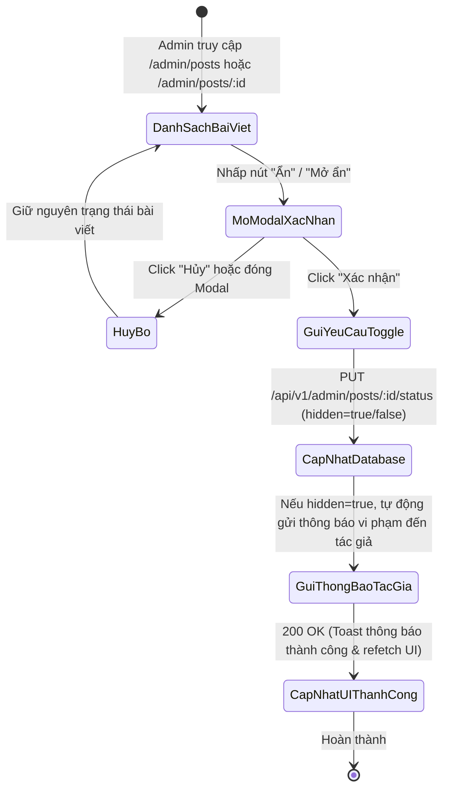
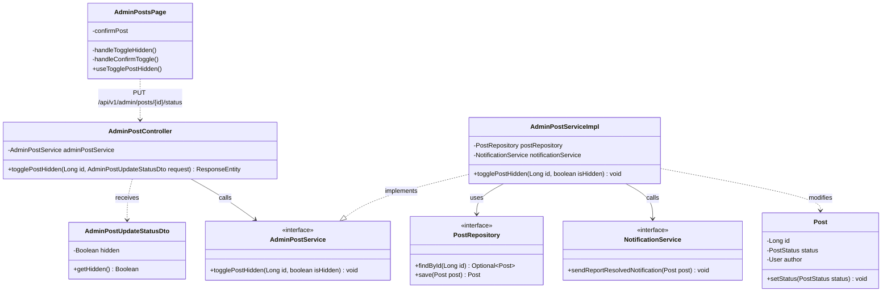
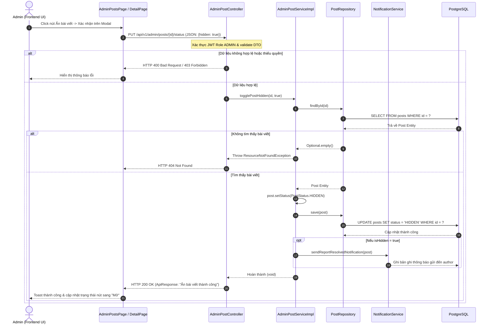

# ĐẶC TẢ YÊU CẦU & THIẾT KẾ CHI TIẾT: UC68 - ẨN / MỞ ẨN BÀI VIẾT VI PHẠM TRÊN BẢNG TIN (ADMIN)

## PHẦN 1: ĐẶC TẢ NGHIỆP VỤ (REPORT 3)

### 2.2.3 Business Workflow (Luồng nghiệp vụ)

#### Mô tả chi tiết luồng xử lý bằng chữ (Business Step Description):
* **Bước 1 - Khởi đầu**: Quản trị viên (Admin) phát hiện một bài viết vi phạm tiêu chuẩn cộng đồng (từ trang Quản lý bài viết `/admin/posts` hoặc trang Chi tiết bài viết `/admin/posts/:id` hoặc hàng đợi báo cáo `/admin/reports`).
* **Bước 2 - Yêu cầu Thao tác**: Admin nhấp vào nút "Ẩn" (icon `EyeOff`) trên hàng của bài viết tương ứng. Hệ thống hiển thị hộp thoại Modal cảnh báo xác nhận hành động.
* **Bước 3 - Xác nhận & Xử lý**:
  * Admin nhấn nút "Ẩn bài viết" trên Modal.
  * Frontend kích hoạt mutation `useTogglePostHidden`, gửi request `PUT /api/v1/admin/posts/{id}/status` với payload `{ "hidden": true }`.
  * Backend kiểm tra quyền Admin, tìm kiếm bài viết theo `id`, cập nhật trạng thái `post.status = PostStatus.HIDDEN` và lưu vào PostgreSQL.
  * Nếu là thao tác ẩn bài viết, hệ thống tự động kích hoạt `NotificationService.sendReportResolvedNotification(post)` để thông báo cho tác giả bài viết biết về việc nội dung đã bị ẩn do vi phạm quy định.
* **Bước 4 - Phản hồi kết quả**:
  * Backend phản hồi `200 OK` kèm thông điệp "Ẩn bài viết thành công".
  * Frontend đóng Modal, hiển thị Toast thông báo thành công, và tự động làm mới giao diện (Badge trạng thái chuyển sang màu đỏ "Đã ẩn (Vi phạm)", nút hành động chuyển thành "Mở").

---

### 3.2 Quản Lý Bài Viết

#### 3.2.1 Ẩn hoặc hiển thị lại bài viết vi phạm (UC68)

**Function trigger**:
*   **Navigation path**: /admin/posts (hoặc /admin/posts/:id) -> Click nút Ẩn/Mở tại cột Thao tác -> Xác nhận trên Modal.
*   **Timing Frequency**: On demand (bất cứ khi nào Admin muốn xử lý bài viết vi phạm).

**Function description**:
*   **Actors/Roles**: ADMIN
*   **Purpose**: Cho phép Quản trị viên nhanh chóng ẩn các bài viết vi phạm điều khoản cộng đồng khỏi Bảng tin của người dùng thông thường, đồng thời có thể khôi phục lại hiển thị nếu bài viết được xác minh là hợp lệ.
*   **Interface**:
    *   Nút bấm chuyển đổi nhanh trên bảng danh sách: Nút "Ẩn" màu đỏ (icon `EyeOff`) hoặc nút "Mở" màu xanh (icon `Eye`).
    *   Hộp thoại xác nhận (Confirmation Modal): Tiêu đề, thông điệp cảnh báo, nút "Hủy" và nút xác nhận "Ẩn bài viết" / "Mở ẩn".
    *   Badge trạng thái bài viết: "Hiển thị" (Xanh lá) hoặc "Đã ẩn (Vi phạm)" (Đỏ).

**Data processing**:
1. Client gửi `PUT /api/v1/admin/posts/{id}/status` kèm JSON Body `AdminPostUpdateStatusDto { hidden: boolean }`.
2. Spring Security xác thực quyền ADMIN.
3. Controller ủy quyền cho `AdminPostService.togglePostHidden(id, hidden)`.
4. Service tìm kiếm thực thể `Post`, cập nhật trường `status` sang `HIDDEN` hoặc `ACTIVE`.
5. Nếu ẩn (`hidden == true`), gửi thông báo hệ thống đến tác giả bài viết.
6. Lưu thực thể vào cơ sở dữ liệu và trả về phản hồi thành công `ApiResponse<Void>`.

**Screen layout**:
*   Figure 68.1: Nút thao tác Ẩn/Mở trên từng dòng của bảng danh sách bài viết `/admin/posts`.
*   Figure 68.2: Hộp thoại xác nhận ẩn bài viết Modal với 2 nút hành động.

**Function details**:
*   **Data**:
    *   `id` (Long - Path Variable): Mã bài viết cần xử lý.
    *   `hidden` (Boolean - Request Body): Giá trị `true` để ẩn, `false` để mở hiển thị.
*   **Validation**:
    *   `id` phải là số nguyên dương hợp lệ.
    *   Trường `hidden` không được để trống (`@NotNull`).
*   **Business rules**:
    *   BR-Post-01: Bài viết bị ẩn (HIDDEN) sẽ không xuất hiện trên Bảng tin công khai (UC15), kết quả tìm kiếm (UC35) và hồ sơ cá nhân của người dùng khác.
    *   BR-Post-02: Chỉ quản trị viên (ADMIN) mới có quyền thay đổi trạng thái ẩn của bất kỳ bài viết nào trong hệ thống.
*   **Error Handling**:
    *   404 Not Found nếu bài viết không tồn tại.
    *   403 Forbidden nếu người thực hiện không có quyền Admin.
*   **Normal case**: Cập nhật trạng thái thành công trong cơ sở dữ liệu, giao diện frontend cập nhật ngay tức thì mà không cần tải lại toàn bộ trang.
*   **Abnormal case**: Lỗi mạng hoặc server trả về lỗi 500, Modal đóng lại và hiển thị Toast thông báo lỗi chi tiết.

---

### 5. Requirement Appendix (Phụ lục Yêu cầu)

#### 5.1 Business Rules (Quy tắc Nghiệp vụ)

| ID | Định nghĩa Quy tắc (Rule Definition) |
| :--- | :--- |
| BR-Post-01 | Bài viết có trạng thái HIDDEN sẽ bị chặn hiển thị trên toàn bộ giao diện phía người dùng (Feed, Search, Profile). |
| BR-Post-02 | Khi một bài viết bị ẩn, hệ thống tự động phát sinh thông báo gửi đến tác giả để đảm bảo tính minh bạch. |

#### 5.2 Common Requirements (Yêu cầu Chung)
*   Thao tác mang tính tác động mạnh (ẩn nội dung) bắt buộc phải có Modal xác nhận người dùng.
*   Trạng thái tải (Loading state) phải được vô hiệu hóa trên nút bấm để chống bấm lặp (double-click).

#### 5.3 Application Messages List (Danh sách Thông điệp Ứng dụng)

| # | Mã thông điệp | Loại thông điệp | Ngữ cảnh | Nội dung hiển thị |
| :--- | :--- | :--- | :--- | :--- |
| 1 | MSG_POST_01 | Toast message | Ẩn bài viết thành công | Đã ẩn bài viết thành công! |
| 2 | MSG_POST_02 | Toast message | Mở hiển thị bài viết thành công | Đã hiển thị lại bài viết! |
| 3 | MSG_POST_03 | Toast message | Lỗi thay đổi trạng thái | Có lỗi xảy ra khi thay đổi trạng thái bài viết. |

---

## PHẦN 2: THIẾT KẾ CHI TIẾT (REPORT 4)

### 3. Detail Design (Thiết kế chi tiết)

#### 3.1 Ẩn / Mở ẩn bài viết vi phạm (UC68)

##### 3.1.1 Class Diagram (Sơ đồ Lớp)

##### 3.1.2 Sequence Diagram (Sơ đồ Tuần tự)

###### Mô tả chi tiết luồng xử lý bằng chữ (Sequence Flow Description):
1. **Kích hoạt thao tác**: Admin nhấp vào nút Ẩn trên giao diện danh sách bài viết hoặc chi tiết bài viết, sau đó xác nhận trong Modal.
2. **Gửi Request**: Frontend gửi yêu cầu `PUT /api/v1/admin/posts/{id}/status` chứa `hidden: true` và Bearer JWT Token.
3. **Xử lý nghiệp vụ**: Controller tiếp nhận và chuyển tiếp sang `AdminPostServiceImpl.togglePostHidden()`. Service truy vấn `Post` từ cơ sở dữ liệu qua `PostRepository`.
4. **Cập nhật & Gửi thông báo**: Cập nhật trạng thái `post.status` thành `HIDDEN`, gọi `postRepository.save(post)`, đồng thời kích hoạt `NotificationService` để gửi thông báo vi phạm đến tác giả bài viết.
5. **Phản hồi UI**: Trả về `HTTP 200 OK`, Frontend đóng Modal, hiển thị Toast "Đã ẩn bài viết thành công!" và cập nhật giao diện thời gian thực.
