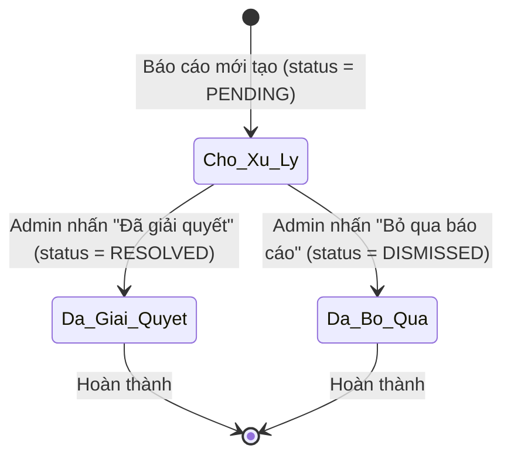
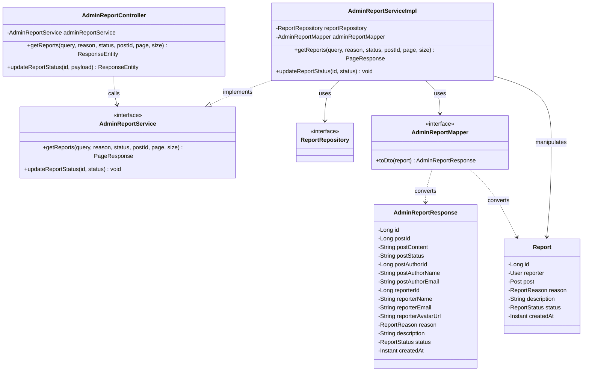
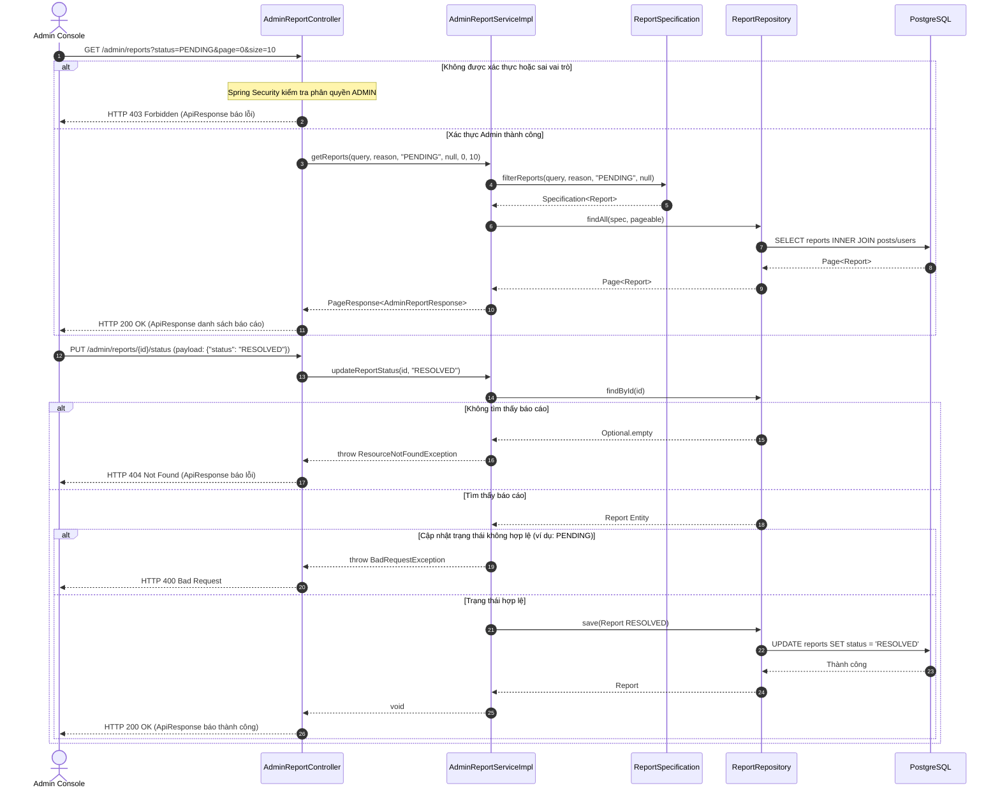

# ĐẶC TẢ YÊU CẦU & THIẾT KẾ CHI TIẾT: UC69 - XEM DANH SÁCH BÁO CÁO VI PHẠM

## PHẦN 1: ĐẶC TẢ NGHIỆP VỤ (REPORT 3)

### 2.2.3 Business Workflow (Luồng nghiệp vụ)

#### Mô tả chi tiết luồng xử lý bằng chữ (Business Step Description):
* **Bước 1 - Khởi đầu**: Khi người dùng (Student/Alumni) gửi báo cáo vi phạm qua UC24, hệ thống tạo bản ghi báo cáo trong bảng `reports` ở trạng thái mặc định là `PENDING` (Chờ xử lý).
* **Bước 2 - Xem danh sách**: Admin truy cập Dashboard Admin, chọn mục "Báo cáo vi phạm". Giao diện gửi yêu cầu `GET /api/v1/admin/reports` kèm các tham số lọc trạng thái, lý do và từ khóa tìm kiếm. Hệ thống trả về danh sách phân trang.
* **Bước 3 - Xử lý báo cáo**: Admin có thể mở xem chi tiết từng báo cáo, đọc nội dung mô tả của người báo cáo và nội dung bài viết bị báo cáo. Admin thực hiện một trong các hành động sau:
  - Nhấn "Đã giải quyết": Gửi yêu cầu `PUT /api/v1/admin/reports/{id}/status` với `status = RESOLVED`. Admin cũng có thể ẩn bài viết vi phạm qua API riêng của bài viết (`PUT /api/v1/admin/posts/{postId}/status`).
  - Nhấn "Bỏ qua": Gửi yêu cầu `PUT /api/v1/admin/reports/{id}/status` với `status = DISMISSED`.
* **Bước 4 - Kết thúc**: Bản ghi báo cáo chuyển sang trạng thái tương ứng (`RESOLVED` hoặc `DISMISSED`) và không thể quay lại trạng thái `PENDING`.

### 3.2 Admin Dashboard & System (Module 6)
Module này cung cấp các tính năng quản lý, theo dõi KPIs, phê duyệt tài khoản cựu sinh viên, khóa/mở khóa người dùng và kiểm duyệt nội dung vi phạm dành riêng cho Quản trị viên (Admin) của hệ thống AlumNect.

#### 3.2.1 Xem danh sách báo cáo vi phạm (UC69)

**Function trigger**:
*   **Navigation path**: Dashboard Admin -> Menu trái chọn "Báo cáo vi phạm" -> Route `/admin/reports`
*   **Timing Frequency**: On screen mount (khi trang được tải) hoặc khi người dùng thay đổi bộ lọc/tìm kiếm.

**Function description**:
*   **Actors/Roles**: Admin
*   **Purpose**: Cho phép Admin kiểm tra, xem chi tiết và xử lý kịp thời các báo cáo nội dung vi phạm pháp luật hoặc quy chuẩn cộng đồng.
*   **Interface**:
    *   Thanh chọn trạng thái (Tabs): "Đang chờ xử lý" (PENDING), "Đã giải quyết" (RESOLVED), "Đã bỏ qua" (DISMISSED).
    *   Dropdown chọn lý do báo cáo: "Tất cả lý do", "Spam / Rác", "Không phù hợp", "Sai lệch thông tin", "Lừa đảo & Giả mạo", "Lý do khác".
    *   Ô tìm kiếm: cho phép nhập từ khóa để tìm kiếm theo tác giả bài viết, người gửi báo cáo, nội dung bài viết.
    *   Bảng danh sách báo cáo: chứa ảnh đại diện, tên, email người báo cáo, lý do, mô tả ngắn, nội dung bài viết bị báo cáo, trạng thái bài viết hiện tại (Công khai, Đã ẩn, Đã xóa).
    *   Modal chi tiết báo cáo: hiển thị thông tin đầy đủ người báo cáo, thời gian, mô tả chi tiết, toàn bộ nội dung văn bản bài viết, kèm các nút hành động (Ẩn bài viết, Đã giải quyết, Bỏ qua báo cáo).

**Data processing**:
*   **GET List**: Nhận các tham số lọc, tạo đối tượng `Specification<Report>` để thực hiện truy vấn `SELECT` với `INNER JOIN` các bảng `posts`, `users`, `user_profiles` để lấy thông tin chi tiết bài viết, tác giả và người báo cáo.
*   **PUT Status**: Kiểm tra xem báo cáo có tồn tại không. Nếu có, cập nhật thuộc tính `status` và lưu xuống PostgreSQL. Nếu chuyển trạng thái không hợp lệ (như chuyển về PENDING) ném ra ngoại lệ.

**Screen layout**:
*   Figure 69.1: Màn hình Danh sách báo cáo vi phạm - Giao diện Pastel Premium.
*   Figure 69.2: Modal chi tiết báo cáo vi phạm kèm các nút giải quyết/bỏ qua/ẩn bài.

**Function details**:
*   **Data**: Report ID, Post ID, Reporter User, Post Author User, Reason, Description, Status, CreatedAt.
*   **Validation**:
    *   Mã trạng thái cập nhật chỉ được là `RESOLVED` hoặc `DISMISSED`. Không chấp nhận `PENDING`.
*   **Business rules**:
    *   Chỉ người dùng có vai trò `ADMIN` mới được truy cập các API thuộc `/api/v1/admin/reports/**`.
    *   Mỗi báo cáo khi tạo mới luôn ở trạng thái `PENDING`.
    *   Khi báo cáo đã chuyển sang `RESOLVED` hoặc `DISMISSED`, không thể chuyển ngược lại `PENDING`.
*   **Error Handling**:
    *   Trả về `401 Unauthorized` nếu JWT thiếu hoặc hết hạn.
    *   Trả về `403 Forbidden` nếu vai trò người dùng không phải `ADMIN`.
    *   Trả về `404 Not Found` nếu không tìm thấy ID báo cáo vi phạm.
    *   Trả về `400 Bad Request` nếu trạng thái cập nhật không hợp lệ.
*   **Normal case**: Lấy danh sách báo cáo thành công, trả về JSON bọc trong đối tượng ApiResponse chuẩn kèm mã HTTP 200 OK.
*   **Abnormal case**: Yêu cầu bị từ chối do phân quyền hoặc lỗi máy chủ, trả về thông báo lỗi tiếng Việt tương ứng.

---

### 5. Requirement Appendix (Phụ lục Yêu cầu)

#### 5.1 Business Rules (Quy tắc Nghiệp vụ)

| ID | Định nghĩa Quy tắc (Rule Definition) |
| :--- | :--- |
| BR-69-01 | Chỉ vai trò `ADMIN` được phép truy cập xem danh sách và xử lý báo cáo vi phạm bài viết. |
| BR-69-02 | Trạng thái báo cáo hợp lệ gồm `PENDING` (Chờ xử lý), `RESOLVED` (Đã giải quyết), `DISMISSED` (Đã bỏ qua). |
| BR-69-03 | Không cho phép cập nhật trạng thái báo cáo quay lại `PENDING` sau khi đã giải quyết hoặc bỏ qua. |
| BR-69-04 | Dữ liệu danh sách báo cáo vi phạm phải được phân trang để tối ưu hóa hiệu năng truy vấn và truyền tải qua mạng. |

#### 5.2 Common Requirements (Yêu cầu Chung)
*   Tất cả múi giờ hiển thị trên giao diện kiểm duyệt của Admin mặc định là Asia/Ho_Chi_Minh.
*   Mọi thông báo thành công hoặc thất bại đều được hiển thị qua Toast hoặc hộp thoại Modal xác nhận rõ ràng.
*   Giao diện tuân thủ bảng màu Pastel Premium (nền kem ấm `#faf4ec`, surface trắng `#ffffff`, chữ mận chín mượt mà `#322c3f`).

#### 5.3 Application Messages List (Danh sách Thông điệp Ứng dụng)

| # | Mã thông điệp (Message code) | Loại thông điệp (Message Type) | Ngữ cảnh (Context) | Nội dung hiển thị (Content) |
| :--- | :--- | :--- | :--- | :--- |
| 1 | MSG-UC69-01 | Inline / Toast | Lấy danh sách báo cáo vi phạm thành công | Lấy danh sách báo cáo vi phạm thành công |
| 2 | MSG-UC69-02 | Toast | Đã giải quyết báo cáo vi phạm thành công | Đã giải quyết báo cáo vi phạm |
| 3 | MSG-UC69-03 | Toast | Đã bỏ qua báo cáo vi phạm thành công | Đã bỏ qua báo cáo vi phạm |
| 4 | MSG-UC69-04 | Under field / Toast | Trạng thái báo cáo không hợp lệ | Trạng thái báo cáo không hợp lệ: {status} |
| 5 | MSG-UC69-05 | Under field / Toast | Không thể chuyển trạng thái báo cáo về PENDING | Không thể cập nhật báo cáo quay lại trạng thái PENDING. |
| 6 | MSG-UC69-06 | Inline / Login redirect | JWT Token hết hạn | Phiên đăng nhập không hợp lệ hoặc đã hết hạn. |
| 7 | MSG-UC69-07 | Inline | Người dùng thường cố ý truy cập API Admin | Chỉ Quản trị viên mới được phép truy cập tài nguyên này. |
| 8 | MSG-UC69-08 | Toast | Không tìm thấy ID báo cáo vi phạm | Không tìm thấy báo cáo vi phạm với ID: {id} |

---

## PHẦN 2: THIẾT KẾ CHI TIẾT (REPORT 4)

### 3. Detail Design (Thiết kế chi tiết)

#### 3.1 Xem danh sách và xử lý báo cáo vi phạm

##### 3.1.1 Class Diagram (Sơ đồ Lớp)

###### Mô tả chi tiết cấu trúc các lớp (Class Design Description):
* **Lớp Controller**: `AdminReportController.java` chịu trách nhiệm tiếp nhận các yêu cầu HTTP GET (để lấy danh sách báo cáo) và PUT (để cập nhật trạng thái báo cáo), thực hiện lọc và gọi `AdminReportService` xử lý.
* **Lớp DTO**: `AdminReportResponse.java` chứa dữ liệu chi tiết của báo cáo bao gồm thông tin của bài viết bị báo cáo, tác giả bài viết và thông tin người báo cáo để hiển thị trực quan cho Admin.
* **Lớp Service**: Giao diện `AdminReportService.java` và lớp triển khai `AdminReportServiceImpl.java` thực thi logic nghiệp vụ lọc dữ liệu qua JPA Specifications và lưu cập nhật trạng thái báo cáo xuống database.
* **Lớp Mapper**: `AdminReportMapper.java` sử dụng MapStruct để ánh xạ các trường từ thực thể `Report` lồng nhau sang DTO phẳng `AdminReportResponse`.
* **Lớp Repository & Entity**: `ReportRepository.java` kế thừa `JpaSpecificationExecutor` để thực hiện câu lệnh tìm kiếm lọc động trên bảng `reports` biểu diễn bởi thực thể `Report.java`.

##### 3.1.2 Sequence Diagram (Sơ đồ Tuần tự)

###### Mô tả chi tiết luồng xử lý bằng chữ (Sequence Flow Description):
1.  **Luồng lấy danh sách báo cáo (GET List)**:
    *   Admin gửi yêu cầu GET tới `/admin/reports`.
    *   Hệ thống kiểm tra xác thực JWT và phân quyền Admin trong `Endpoints.java`. Nếu không có quyền, trả về 403 Forbidden.
    *   Nếu hợp lệ, Controller chuyển các tham số lọc xuống Service. Service xây dựng Specification động thông qua `ReportSpecification` và gọi Repository tìm kiếm trong DB PostgreSQL.
    *   Các bản ghi tìm thấy được MapStruct chuyển đổi sang `AdminReportResponse` và bọc vào `PageResponse` trả về cho Admin với mã 200 OK.
2.  **Luồng cập nhật trạng thái báo cáo (PUT Status)**:
    *   Admin gửi yêu cầu cập nhật trạng thái báo cáo vi phạm sang `RESOLVED` hoặc `DISMISSED`.
    *   Service tìm kiếm báo cáo theo ID. Nếu không thấy, ném ngoại lệ `ResourceNotFoundException` trả về 404 Not Found.
    *   Nếu tìm thấy, Service xác minh trạng thái mới hợp lệ. Nếu hợp lệ, cập nhật trạng thái báo cáo xuống database, ghi nhật ký hoạt động qua SLF4J, và trả về thông điệp thành công 200 OK cho Admin.
