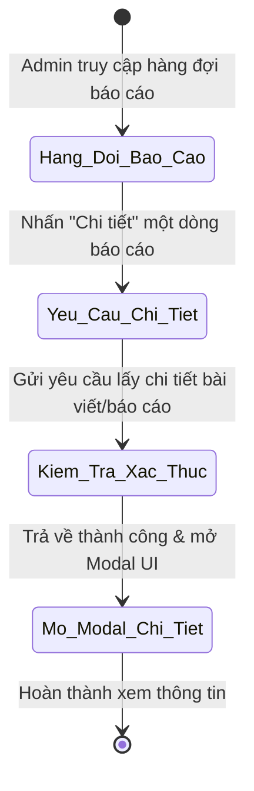
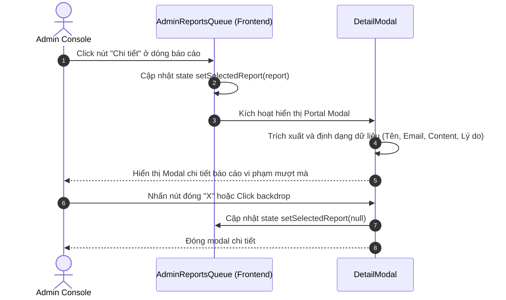

# ĐẶC TẢ YÊU CẦU & THIẾT KẾ CHI TIẾT: UC70 - XEM CHI TIẾT BÁO CÁO VI PHẠM

## PHẦN 1: ĐẶC TẢ NGHIỆP VỤ (REPORT 3)

### 2.2.3 Business Workflow (Luồng nghiệp vụ)

#### Mô tả chi tiết luồng xử lý bằng chữ (Business Step Description):
* **Bước 1 - Yêu cầu xem chi tiết**: Quản trị viên (Admin) duyệt danh sách báo cáo vi phạm (UC69) và nhấn nút **"Chi tiết"** ở hàng tương ứng.
* **Bước 2 - Lấy dữ liệu**: Frontend kích hoạt hiển thị modal và nạp thông tin chi tiết từ bản ghi báo cáo đã chọn (gồm nội dung bài viết vi phạm, thông tin tác giả và người báo cáo).
* **Bước 3 - Hiển thị giao diện**: Hệ thống hiển thị hộp thoại Modal chi tiết bao gồm: lý do vi phạm, mô tả chi tiết, nội dung đầy đủ của bài viết bị báo cáo, trạng thái bài viết hiện tại.
* **Bước 4 - Đóng modal**: Admin xem xong thông tin và có thể đóng modal bằng cách nhấn biểu tượng "X" hoặc click ra ngoài vùng backdrop.

### 3.2 Admin Dashboard & System (Module 6)

#### 3.2.1 Xem chi tiết báo cáo vi phạm (UC70)

**Function trigger**:
*   **Navigation path**: Dashboard Admin -> Menu "Báo cáo vi phạm" -> Nhấp nút "Chi tiết" ở dòng tương ứng.
*   **Timing Frequency**: Khi Admin muốn xem thông tin chi tiết để kiểm duyệt bài viết bị báo cáo.

**Function description**:
*   **Actors/Roles**: Admin
*   **Purpose**: Cung cấp đầy đủ thông tin chi tiết về hành vi vi phạm, lý do báo cáo và bài viết gốc để Admin có căn cứ xử lý vi phạm chính xác.
*   **Interface**:
    *   Hộp thoại Modal chi tiết có góc bo tròn lớn (`rounded-3xl`), nền card trắng mềm mại trên kem ấm.
    *   Khu vực 1: Thông tin người báo cáo (Avatar, Tên, Email, Lý do, Mô tả, Thời gian gửi).
    *   Khu vực 2: Thông tin bài viết bị báo cáo (Tác giả, Email, Link xem bài đầy đủ, Trạng thái bài viết, Toàn bộ nội dung văn bản).
    *   Khu vực 3: Các nút hành động xử lý (Ẩn bài, Đã giải quyết, Bỏ qua, Đóng).

**Data processing**:
*   Hiển thị modal chi tiết lấy dữ liệu từ `selectedReport` trong state. Nếu muốn cập nhật thông tin bài viết mới nhất, Admin có thể nhấn link xem bài đầy đủ để mở trang chi tiết bài viết Admin (`/admin/posts/{postId}`) thực hiện truy vấn chi tiết từ server.

**Screen layout**:
*   Figure 70.1: Modal chi tiết báo cáo vi phạm bài viết.

**Function details**:
*   **Data**: Report ID, Post ID, Reporter, Post Author, Reason, Description, Status, CreatedAt.
*   **Validation**:
    *   Chỉ mở Modal chi tiết khi có dữ liệu báo cáo hợp lệ được chọn.
*   **Business rules**:
    *   Chỉ Quản trị viên (`ADMIN`) mới được phép truy cập xem chi tiết báo cáo.
*   **Error Handling**:
    *   Nếu bản ghi báo cáo chứa thông tin không đầy đủ, hiển thị placeholder tương ứng (ví dụ: "Không có mô tả thêm").
*   **Normal case**: Modal mở ra mượt mà với hiệu ứng hoạt ảnh `pop` đàn hồi, hiển thị đầy đủ thông tin chi tiết.
*   **Abnormal case**: Lỗi tải dữ liệu, hiển thị thông báo lỗi.

---

### 5. Requirement Appendix (Phụ lục Yêu cầu)

#### 5.1 Business Rules (Quy tắc Nghiệp vụ)

| ID | Định nghĩa Quy tắc (Rule Definition) |
| :--- | :--- |
| BR-70-01 | Chi tiết báo cáo vi phạm bắt buộc phải hiển thị toàn bộ nội dung văn bản của bài viết bị báo cáo để phục vụ công tác đối chiếu kiểm duyệt. |
| BR-70-02 | Chỉ Admin được phép truy cập xem thông tin chi tiết này để bảo mật thông tin cá nhân của người dùng báo cáo. |

#### 5.3 Application Messages List (Danh sách Thông điệp Ứng dụng)

| # | Mã thông điệp (Message code) | Loại thông điệp (Message Type) | Ngữ cảnh (Context) | Nội dung hiển thị (Content) |
| :--- | :--- | :--- | :--- | :--- |
| 1 | MSG-UC70-01 | Modal | Mở xem chi tiết báo cáo vi phạm | Chi tiết báo cáo vi phạm #{id} |
| 2 | MSG-UC70-02 | In modal | Không có mô tả chi tiết từ người báo cáo | Không có mô tả thêm |

---

## PHẦN 2: THIẾT KẾ CHI TIẾT (REPORT 4)

### 3. Detail Design (Thiết kế chi tiết)

#### 3.1 Xem chi tiết báo cáo vi phạm

##### 3.1.1 Class Diagram (Sơ đồ Lớp)
*(Sử dụng chung cấu trúc lớp của module Reports được mô tả chi tiết tại UC69)*

##### 3.1.2 Sequence Diagram (Sơ đồ Tuần tự)

###### Mô tả chi tiết luồng xử lý bằng chữ (Sequence Flow Description):
1.  **Mở chi tiết**: Admin nhấp vào nút "Chi tiết" trên một dòng báo cáo. Frontend cập nhật state `selectedReport` bằng thông tin của dòng báo cáo đó.
2.  **Kích hoạt render**: Trình duyệt kích hoạt React Portal để render `DetailModal` chèn trực tiếp vào `document.body` nhằm tránh lỗi tràn khung layout.
3.  **Đóng chi tiết**: Khi Admin click vào nút "X" hoặc click ra ngoài vùng backdrop mờ, state `selectedReport` được đặt về `null`, đóng modal và hoàn trả lại trạng thái cuộn bình thường của trang.
