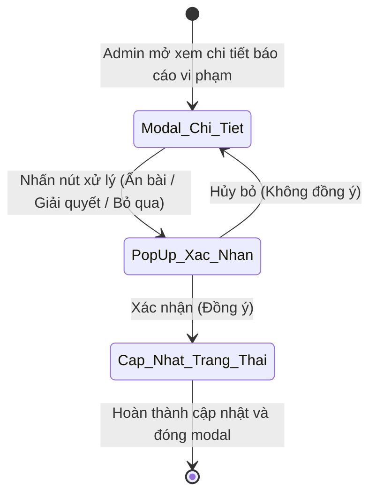
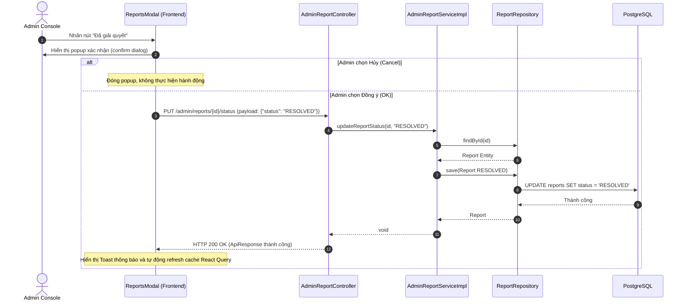

# ĐẶC TẢ YÊU CẦU & THIẾT KẾ CHI TIẾT: UC71 - GIẢI QUYẾT BÁO CÁO VI PHẠM

## PHẦN 1: ĐẶC TẢ NGHIỆP VỤ (REPORT 3)

### 2.2.3 Business Workflow (Luồng nghiệp vụ)

#### Mô tả chi tiết luồng xử lý bằng chữ (Business Step Description):
* **Bước 1 - Chọn hành động**: Admin mở Modal chi tiết báo cáo vi phạm từ hàng đợi báo cáo (UC70) và quyết định thực hiện một trong các thao tác:
  - Ẩn/Hiện lại bài viết vi phạm.
  - Đánh dấu báo cáo là "Đã giải quyết" (RESOLVED).
  - Đánh dấu báo cáo là "Bỏ qua" (DISMISSED).
* **Bước 2 - Hộp thoại xác nhận**: Hệ thống hiển thị một hộp thoại popup xác nhận (`window.confirm`) chứa nội dung thông điệp phù hợp để tránh việc nhấp chuột nhầm lẫn.
* **Bước 3 - Gửi yêu cầu**:
  - Nếu Admin nhấn "Hủy", hệ thống đóng popup và giữ nguyên trạng thái hiển thị của modal.
  - Nếu Admin nhấn "Đồng ý", hệ thống gửi yêu cầu API tương ứng lên Spring Boot Backend:
    - Ẩn/Hiện bài viết: `PUT /api/v1/admin/posts/{postId}/status`
    - Giải quyết/Bỏ qua báo cáo: `PUT /api/v1/admin/reports/{reportId}/status`
* **Bước 4 - Kết thúc**: Hệ thống cập nhật dữ liệu xuống cơ sở dữ liệu, đóng modal chi tiết, hiển thị thông báo Toast thành công tiếng Việt, và làm mới danh sách hàng đợi tự động.

### 3.2 Admin Dashboard & System (Module 6)

#### 3.2.1 Giải quyết báo cáo vi phạm (UC71)

**Function trigger**:
*   **Navigation path**: Admin Console -> Menu "Báo cáo vi phạm" -> Nhấn "Chi tiết" một báo cáo -> Chọn thao tác kiểm duyệt.
*   **Timing Frequency**: Bất cứ khi nào Admin muốn duyệt báo cáo vi phạm.

**Function description**:
*   **Actors/Roles**: Admin
*   **Purpose**: Cho phép Admin đóng các báo cáo vi phạm, đánh dấu chúng là đã giải quyết hoặc bỏ qua, đồng thời ẩn bài viết nếu thực sự có hành vi vi phạm.
*   **Interface**:
    *   Hộp thoại Modal chi tiết báo cáo.
    *   Các nút hành động: **Ẩn bài viết / Hiện lại bài viết** (màu đỏ/xanh lá mềm mại), **Đã giải quyết** (nút tím lavender thương hiệu), **Bỏ qua báo cáo** (nút xám pastel).
    *   Popup xác nhận (`window.confirm`).

**Data processing**:
*   **Resolve Report**: Gửi payload `{"status": "RESOLVED"}` hoặc `{"status": "DISMISSED"}` đến `/admin/reports/{id}/status`. Server cập nhật bản ghi trong DB PostgreSQL.
*   **Hide Post**: Gửi payload `{"hidden": true/false}` đến `/admin/posts/{postId}/status`. Server cập nhật cột `status` của bài viết sang `HIDDEN` hoặc `ACTIVE`.

**Screen layout**:
*   Figure 71.1: Hộp thoại xác nhận (Confirmation Popup) hiển thị đè trên Modal chi tiết.

**Function details**:
*   **Data**: Report ID, Post ID, Status, Hidden state.
*   **Validation**:
    *   Yêu cầu bắt buộc phải xác nhận qua popup trước khi gửi yêu cầu lên máy chủ.
    *   Không cho phép đổi trạng thái báo cáo đã giải quyết về `PENDING`.
*   **Business rules**:
    *   Chỉ Quản trị viên (`ADMIN`) có quyền thực hiện.
    *   Ẩn bài viết (UC68) và Giải quyết báo cáo (UC71) hoạt động độc lập nhưng hỗ trợ lẫn nhau trong modal xử lý.
*   **Error Handling**:
    *   Trả về 403 Forbidden nếu sai quyền truy cập.
    *   Trả về 404 Not Found nếu ID báo cáo không tồn tại.
*   **Normal case**: Cập nhật trạng thái thành công, trả về 200 OK kèm thông điệp Toast tiếng Việt.
*   **Abnormal case**: Lỗi kết nối mạng hoặc lỗi server, trả về hộp thoại cảnh báo lỗi.

---

### 5. Requirement Appendix (Phụ lục Yêu cầu)

#### 5.1 Business Rules (Quy tắc Nghiệp vụ)

| ID | Định nghĩa Quy tắc (Rule Definition) |
| :--- | :--- |
| BR-71-01 | Mọi thao tác đổi trạng thái báo cáo hoặc ẩn bài viết bắt buộc phải hiển thị popup xác nhận để người dùng đồng ý trước khi gửi request. |
| BR-71-02 | Khi một báo cáo vi phạm được chuyển sang trạng thái `RESOLVED` hoặc `DISMISSED`, hệ thống khóa các nút xử lý của báo cáo đó để tránh gửi lại. |

#### 5.3 Application Messages List (Danh sách Thông điệp Ứng dụng)

| # | Mã thông điệp (Message code) | Loại thông điệp (Message Type) | Ngữ cảnh (Context) | Nội dung hiển thị (Content) |
| :--- | :--- | :--- | :--- | :--- |
| 1 | MSG-UC71-01 | Popup Confirm | Nhấn nút "Đã giải quyết" | Bạn có chắc chắn muốn đánh dấu báo cáo này là ĐÃ GIẢI QUYẾT? |
| 2 | MSG-UC71-02 | Popup Confirm | Nhấn nút "Bỏ qua báo cáo" | Bạn có chắc chắn muốn BỎ QUA báo cáo này không? |
| 3 | MSG-UC71-03 | Popup Confirm | Nhấn nút "Ẩn bài viết" | Bạn có chắc chắn muốn ẩn bài viết này? |
| 4 | MSG-UC71-04 | Toast | Giải quyết thành công | Đã giải quyết báo cáo vi phạm |
| 5 | MSG-UC71-05 | Toast | Bỏ qua thành công | Đã bỏ qua báo cáo vi phạm |

---

## PHẦN 2: THIẾT KẾ CHI TIẾT (REPORT 4)

### 3. Detail Design (Thiết kế chi tiết)

#### 3.1 Giải quyết báo cáo vi phạm

##### 3.1.1 Class Diagram (Sơ đồ Lớp)
*(Tương tự như Class Diagram của UC69, sử dụng chung các lớp Controller, Service, Repository, Entity, và DTO của module Reports)*

##### 3.1.2 Sequence Diagram (Sơ đồ Tuần tự)

###### Mô tả chi tiết luồng xử lý bằng chữ (Sequence Flow Description):
1.  **Hộp thoại xác nhận (Popup Confirm)**: Khi Admin nhấn các nút hành động, Frontend sẽ gọi phương thức `window.confirm`. Nếu nhấn Cancel, dừng xử lý.
2.  **Gửi request & Cập nhật trạng thái**: Khi nhấn OK, Frontend gửi yêu cầu PUT lên `AdminReportController`. Controller gọi `AdminReportService` thực hiện thay đổi trạng thái trong database PostgreSQL và phản hồi thành công (200 OK) về cho giao diện.
3.  **Làm mới giao diện**: Frontend nhận phản hồi thành công, ẩn modal, hiển thị Toast, và invalidate cache React Query để tải lại danh sách mới nhất.
