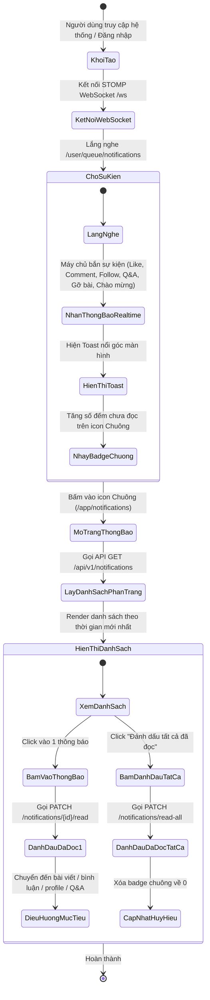
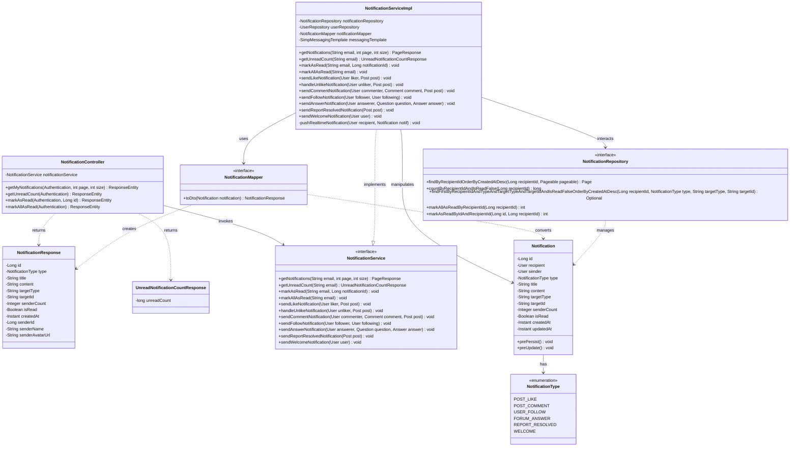
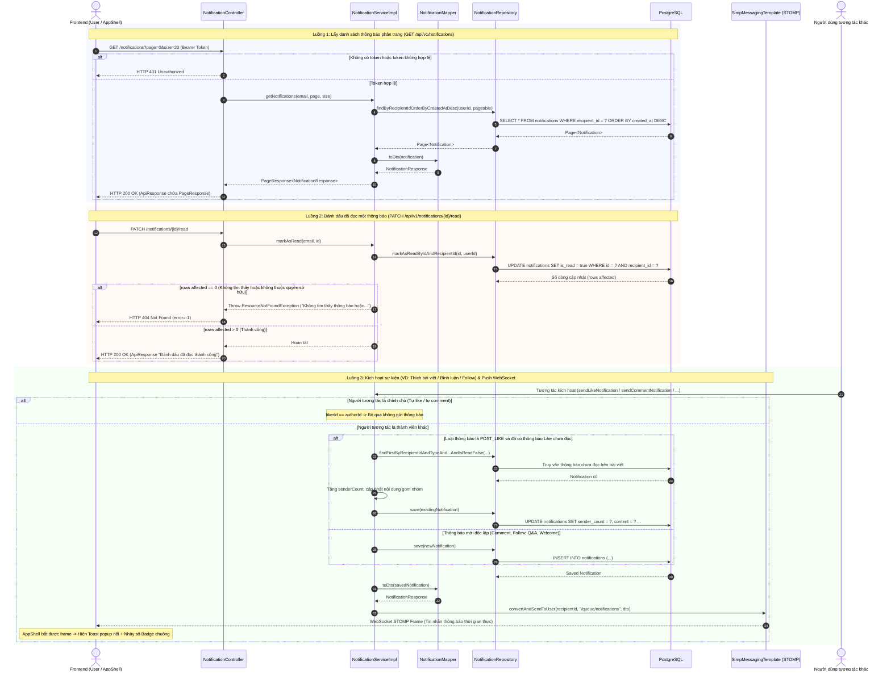

# ĐẶC TẢ YÊU CẦU & THIẾT KẾ CHI TIẾT: UC72 - XEM VÀ QUẢN LÝ THÔNG BÁO (NOTIFICATIONS)

## PHẦN 1: ĐẶC TẢ NGHIỆP VỤ (REPORT 3)

### 2.2.3 Business Workflow (Luồng nghiệp vụ)

#### Mô tả chi tiết luồng xử lý bằng chữ (Business Step Description):
* **Bước 1 - Khởi đầu (Kết nối và Lắng nghe)**: Người dùng đăng nhập thành công vào ứng dụng. Frontend khởi tạo kết nối STOMP WebSocket tới máy chủ (`/ws`) mang theo JWT Bearer token và đăng ký theo dõi hàng đợi thông báo cá nhân `/user/queue/notifications`. Đồng thời gọi API lấy số đếm thông báo chưa đọc ban đầu để hiển thị badge chuông.
* **Bước 2 - Nhận thông báo thời gian thực (Realtime Dispatch)**: Khi có hành vi kích hoạt (người khác thích bài viết, bình luận, nhấn theo dõi, trả lời câu hỏi Q&A, Admin gỡ bài vi phạm, hoặc tài khoản được duyệt sang `ACTIVE`), backend lưu bản ghi vào bảng `notifications` (gom nhóm nếu là lượt thích liên tiếp chưa đọc) và đẩy đối tượng `NotificationResponse` qua WebSocket tới người nhận. Frontend bắt được sự kiện, lập tức kích hoạt Toast popup thông báo nổi và tăng số đếm badge mà không cần người dùng tải lại trang.
* **Bước 3 - Xem chi tiết và Điều hướng**: Khi người dùng nhấn vào biểu tượng Chuông trên Navbar hoặc truy cập đường dẫn `/app/notifications`, hệ thống hiển thị danh sách thông báo phân trang. Khi người dùng bấm vào một thông báo chưa đọc, hệ thống tự động gọi API đánh dấu đã đọc và điều hướng chính xác tới đối tượng liên quan (bài viết và tự động cuộn tới vị trí bình luận cụ thể, trang cá nhân của người theo dõi, hoặc chi tiết câu hỏi diễn đàn).

---

### 3.2 Quản Lý Thông Báo (Module: Notifications)
Module Thông báo chịu trách nhiệm thu thập, lưu trữ, gom nhóm, phát sóng thời gian thực và quản lý trạng thái đọc của các thông báo phát sinh từ mọi hoạt động tương tác trong nền tảng AlumNect.

#### 3.2.1 Xem và Quản lý thông báo người dùng (UC72)

**Function trigger**:
* **Navigation path**: Bấm icon Chuông trên Navbar (`/app/notifications`) hoặc nhấp trực tiếp vào popup Toast nổi khi có thông báo mới đến.
* **Timing Frequency**: On demand (người dùng chủ động mở) và Event-driven (tự động đẩy qua WebSocket khi có sự kiện).

**Function description**:
* **Actors/Roles**: Tất cả người dùng đã đăng nhập (`STUDENT`, `ALUMNI`, `ADMIN`).
* **Purpose**: Cung cấp cập nhật tức thời về mọi tương tác liên quan đến người dùng, hỗ trợ chuyển hướng nhanh đến nội dung liên quan và theo dõi tình trạng xử lý tài khoản.
* **Interface**:
  - Biểu tượng Chuông (`Bell`) trên Navbar hiển thị huy hiệu đỏ (`badge`) chứa số thông báo chưa đọc theo thời gian thực.
  - Trang danh sách thông báo ([NotificationsPage.tsx](file:///d:/Alumnect/alumnect-frontend/src/pages/app/NotificationsPage.tsx)) hiển thị các thẻ thông báo theo phong cách Pastel Premium (avatar người gửi, huy hiệu loại thông báo, chữ đen tương phản cao, thời gian tương đối, chấm cam chưa đọc).
  - Nút thao tác nhanh "Đánh dấu tất cả đã đọc".
  - Thanh phân trang hiện đại: Nút bấm trực tiếp các số trang (`[1]`, `[2]`...) cùng hai nút điều hướng `Trang trước` và `Trang sau`.

**Data processing**:
* **Gom nhóm lượt thích (Like Aggregation)**: Khi bài viết nhận nhiều lượt like mà chủ bài viết chưa đọc thông báo like trước đó, hệ thống không tạo bản ghi rác mới mà cập nhật lại bản ghi cũ: tăng `sender_count`, cập nhật nội dung thành `"[Người mới nhất] và X người khác đã thích bài viết của bạn."`, đưa thời gian cập nhật lên đầu trang. Khi người dùng bỏ thích (Unlike), hệ thống tự động giảm số đếm hoặc xóa bỏ thông báo.
* **Bình luận kèm trích đoạn & Hash điều hướng**: Cắt ngắn nội dung bình luận tối đa 60 ký tự, lưu trữ targetId dạng `{postId}#comment-{commentId}` để frontend tự động cuộn mượt (smooth scroll) và highlight đúng bình luận trong 4 giây.
* **Theo dõi người dùng**: Lưu trữ `targetType="USER"` và `targetId="{followerId}"` để điều hướng chuẩn về `/app/profile?userId={id}`.
* **Tự tương tác**: Kiểm tra `recipientId != senderId`; nếu người dùng tự like/comment bài của mình hoặc tự trả lời câu hỏi của mình thì không sinh thông báo.
* **Chào mừng thành viên**: Tự động sinh thông báo chào mừng 1 lần duy nhất ngay khi tài khoản chuyển sang trạng thái `ACTIVE`, điều hướng về Bảng tin `/app`.

**Screen layout**:
* Desktop & Mobile Navbar: Icon Chuông kèm Badge số đếm chưa đọc.
* Trang `/app/notifications`: Tiêu đề trang, nút "Đánh dấu tất cả đã đọc", danh sách thẻ chuyển động mượt mà (smooth motion), thanh phân trang số trang.
* Toast nổi: Khung thông báo nhỏ gọn màu xanh ngọc (Emerald) xuất hiện ở góc trên bên phải màn hình khi có WebSocket push.

**Function details**:
* **Data**: `id`, `recipient_id`, `sender_id`, `type`, `title`, `content`, `target_type`, `target_id`, `sender_count`, `is_read`, `created_at`.
* **Validation**:
  - `page >= 0`, `size > 0` (mặc định page=0, size=20).
  - Yêu cầu xác thực JWT hợp lệ (401 Unauthorized nếu thiếu token).
  - Không cho phép thao tác đánh dấu đã đọc trên thông báo thuộc về người khác (404 Not Found).
* **Business rules**:
  - BR-NOTIF-01: Không gửi thông báo khi người dùng tự thao tác trên nội dung của chính mình.
  - BR-NOTIF-02: Thông báo lượt thích trên cùng 1 bài viết sẽ được gom nhóm nếu thông báo trước đó chưa đọc.
  - BR-NOTIF-03: Thông báo chào đón thành viên chỉ được gửi một lần duy nhất khi tài khoản chuyển sang `ACTIVE`.
  - BR-NOTIF-04: Đánh dấu tất cả đã đọc chỉ áp dụng cho các thông báo chưa đọc thuộc quyền sở hữu của người dùng đăng nhập.
* **Error Handling**:
  - HTTP 401 Unauthorized: Khi chưa đăng nhập hoặc token JWT hết hạn.
  - HTTP 404 Not Found: Khi ID thông báo cần đánh dấu đã đọc không tồn tại hoặc không thuộc quyền sở hữu.
* **Normal case**: Trả về HTTP 200 OK với danh sách thông báo phân trang hoặc số lượng chưa đọc.
* **Abnormal case**: Lỗi kết nối WebSocket STOMP tự động kích hoạt cơ chế tự kết nối lại (`reconnectDelay: 5000ms`).

---

### 5. Requirement Appendix (Phụ lục Yêu cầu)

#### 5.1 Business Rules (Quy tắc Nghiệp vụ)

| ID | Định nghĩa Quy tắc (Rule Definition) |
| :--- | :--- |
| BR-NOTIF-01 | Người dùng không nhận thông báo do chính mình gây ra (Self-action exemption). |
| BR-NOTIF-02 | Các lượt thích (Like) trên cùng một bài viết chưa được đọc phải được gom nhóm thành 1 thông báo duy nhất và cập nhật số lượng `senderCount`. |
| BR-NOTIF-03 | Nếu người dùng hủy thích (Unlike), số lượng gom nhóm giảm tương ứng; nếu về 0 thì thông báo tự động được thu hồi/xóa bỏ. |
| BR-NOTIF-04 | Thông báo chào đón thành viên (WELCOME) kích hoạt tự động ngay khi tài khoản chuyển trạng thái sang `ACTIVE` và chỉ gửi tối đa 1 lần. |
| BR-NOTIF-05 | Khi click vào thông báo bình luận, giao diện chuyển đến chi tiết bài viết và tự động cuộn (smooth scroll) đến đúng bình luận mục tiêu. |
| BR-NOTIF-06 | Mọi thông báo mới phải được phát sóng trực tiếp qua WebSocket `/user/queue/notifications` cho người nhận đang trực tuyến. |

#### 5.2 Common Requirements (Yêu cầu Chung)
* Danh sách thông báo được tải phân trang theo chuẩn `PageResponse<T>`.
* Huy hiệu đỏ (Badge) tự động ẩn nếu số lượng chưa đọc bằng 0.
* Tất cả thời gian hiển thị theo định dạng tương đối của người dùng địa phương (`vi-VN`).
* Mọi giao tiếp dữ liệu REST API và WebSocket đều yêu cầu mã hóa và xác thực qua JWT Bearer Token.

#### 5.3 Application Messages List (Danh sách Thông điệp Ứng dụng)

| # | Mã thông điệp | Loại thông điệp | Ngữ cảnh | Nội dung hiển thị |
| :--- | :--- | :--- | :--- | :--- |
| 1 | MSG-NOTIF-01 | Toast / WebSocket | Có người thích bài viết | `[Người A] đã thích bài viết của bạn.` |
| 2 | MSG-NOTIF-02 | Toast / WebSocket | Nhiều người thích bài viết | `[Người mới nhất] và X người khác đã thích bài viết của bạn.` |
| 3 | MSG-NOTIF-03 | Toast / WebSocket | Có người bình luận bài viết | `[Người A] đã bình luận về bài viết của bạn: "[Trích đoạn...]"` |
| 4 | MSG-NOTIF-04 | Toast / WebSocket | Có người theo dõi mới | `[Người A] đã bắt đầu theo dõi bạn.` |
| 5 | MSG-NOTIF-05 | Toast / WebSocket | Có câu trả lời Q&A mới | `[Người A] đã trả lời câu hỏi "[Tiêu đề...]" của bạn.` |
| 6 | MSG-NOTIF-06 | Toast / WebSocket | Bài viết bị gỡ do vi phạm | `Bài viết của bạn đã bị gỡ do vi phạm tiêu chuẩn cộng đồng.` |
| 7 | MSG-NOTIF-07 | Toast / WebSocket | Kích hoạt tài khoản ACTIVE | `Chào mừng bạn đến với AlumNect! Khám phá mạng lưới kết nối cựu sinh viên và sinh viên ngay.` |
| 8 | MSG-NOTIF-08 | Toast message | Đánh dấu 1 thông báo đã đọc thành công | `Đánh dấu đã đọc thành công` |
| 9 | MSG-NOTIF-09 | Toast message | Đánh dấu tất cả thông báo đã đọc thành công | `Đánh dấu tất cả thông báo là đã đọc thành công` |
| 10 | MSG-NOTIF-10 | Error Banner / Toast | Truy cập thông báo không tồn tại | `Không tìm thấy thông báo hoặc bạn không có quyền thao tác.` |
| 11 | MSG-NOTIF-11 | Inline Empty State | Không có thông báo nào | `Chưa có thông báo nào` |
| 12 | MSG-NOTIF-12 | HTTP 401 | Chưa đăng nhập khi truy vấn thông báo | `Full authentication is required to access this resource` |

---

## PHẦN 2: THIẾT KẾ CHI TIẾT (REPORT 4)

### 3. Detail Design (Thiết kế chi tiết)

#### 3.1 Xem và Quản lý thông báo người dùng (UC72)

##### 3.1.1 Class Diagram (Sơ đồ Lớp)

###### Mô tả chi tiết cấu trúc các lớp (Class Design Description):
* **Lớp Controller (`NotificationController.java`)**: Tiếp nhận các yêu cầu HTTP từ Client, bao gồm lấy danh sách thông báo phân trang, lấy số lượng thông báo chưa đọc, đánh dấu 1 thông báo đã đọc, và đánh dấu toàn bộ đã đọc. Toàn bộ phản hồi được đóng gói đồng nhất qua `ApiResponse.success()`.
* **Lớp DTO (`NotificationResponse.java`, `UnreadNotificationCountResponse.java`)**: Định nghĩa dữ liệu trả về cho Frontend, bao gồm các trường định danh, loại thông báo, nội dung, đối tượng mục tiêu để điều hướng, số lượng người gom nhóm (`senderCount`), và thông tin cá nhân của người kích hoạt (tên, avatar).
* **Lớp Service (`NotificationService.java`, `NotificationServiceImpl.java`)**: Xử lý toàn bộ logic nghiệp vụ, quản lý gom nhóm lượt thích, cập nhật CSDL PostgreSQL trong transaction `@Transactional`, và tự động đẩy thông báo qua Spring STOMP WebSocket tới hàng đợi cá nhân `/user/queue/notifications` của người nhận.
* **Lớp Mapper (`NotificationMapper.java`)**: Sử dụng MapStruct ánh xạ tự động từ thực thể `Notification` sang `NotificationResponse`, tự động trích xuất `fullName` và `avatarUrl` từ `UserProfile`.
* **Lớp Repository & Entity (`NotificationRepository.java`, `Notification.java`)**: Đại diện cấu trúc bảng `notifications` trong PostgreSQL, cung cấp các câu lệnh truy vấn phân trang có chỉ mục (`idx_notifications_recipient_created`, `idx_notifications_recipient_read`) và bulk update hiệu năng cao.

##### 3.1.2 Sequence Diagram (Sơ đồ Tuần tự Gộp Chung)

###### Mô tả chi tiết luồng xử lý bằng chữ (Sequence Flow Description):
1. **Luồng 1 - Truy vấn danh sách thông báo phân trang**: Client gửi HTTP GET kèm JWT token lên `NotificationController`. Sau khi kiểm tra xác thực, Controller gọi `NotificationService` để tìm thông báo theo `recipient_id` từ CSDL PostgreSQL (có phân trang và sắp xếp theo `created_at DESC`). `NotificationMapper` chuyển đổi các thực thể sang DTO `NotificationResponse` (kèm họ tên và avatar của người gửi) và Controller trả về HTTP 200 OK.
2. **Luồng 2 - Đánh dấu thông báo đã đọc**: Khi người dùng nhấn vào thông báo, Client gửi HTTP PATCH tới `/notifications/{id}/read`. Service thực thi câu lệnh update atomic trong PostgreSQL ràng buộc cả `id` và `recipient_id`. Nếu không có bản ghi nào được cập nhật, hệ thống ném `ResourceNotFoundException` trả về HTTP 404. Nếu thành công, trả về HTTP 200 OK.
3. **Luồng 3 - Bắn thông báo thời gian thực qua WebSocket**: Khi một tương tác xảy ra trong hệ thống (thích bài, bình luận, follow, v.v.), service tương ứng gọi `NotificationService`. Nếu phát hiện người thao tác chính là tác giả, hệ thống lập tức bỏ qua. Ngược lại, hệ thống kiểm tra gom nhóm (với lượt thích) hoặc tạo mới bản ghi thông báo trong PostgreSQL, sau đó thông qua `SimpMessagingTemplate` phát sóng gói tin trực tiếp tới kênh riêng `/user/queue/notifications` của người nhận. `AppShell` tại Frontend nhận được frame, hiển thị Toast thông báo và tăng số đếm badge tức thời.
