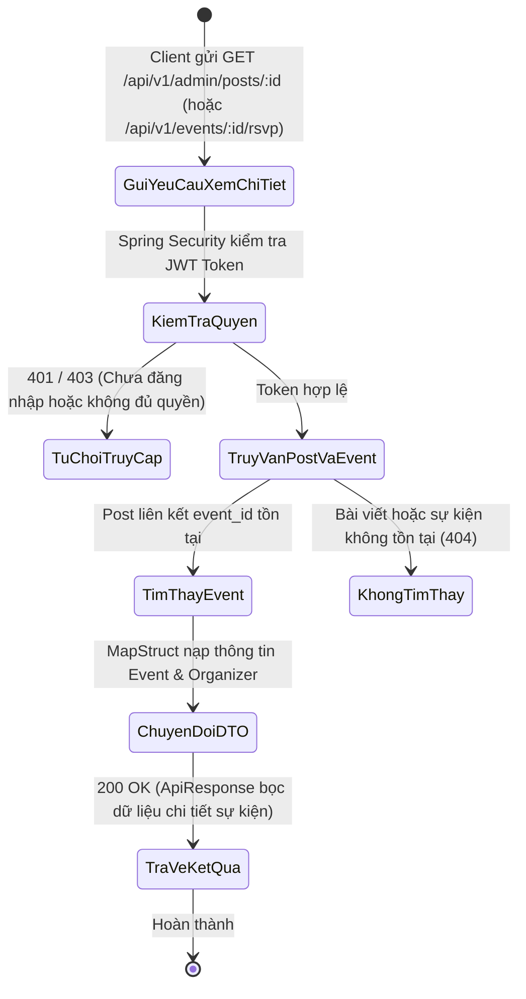
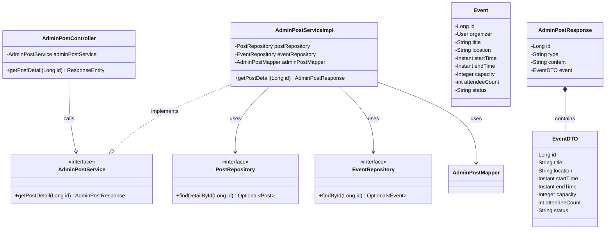
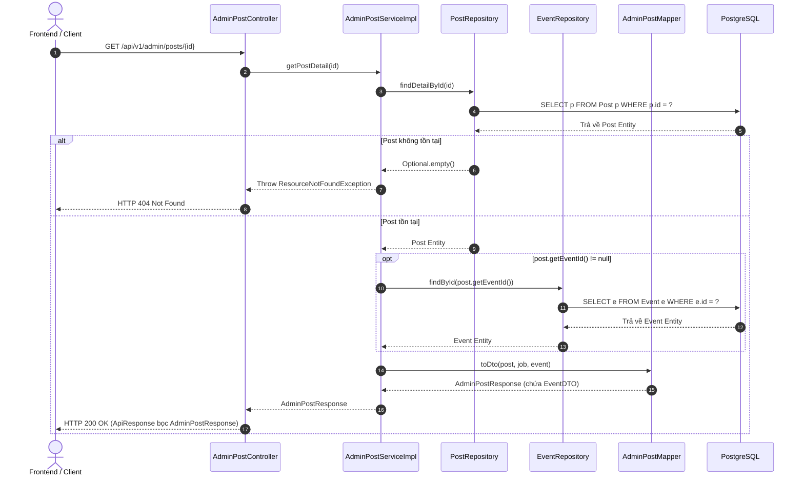

# ĐẶC TẢ YÊU CẦU & THIẾT KẾ CHI TIẾT: UC73 - XEM CHI TIẾT SỰ KIỆN (BACKEND)

## PHẦN 1: ĐẶC TẢ NGHIỆP VỤ (REPORT 3)

### 2.2.3 Business Workflow (Luồng nghiệp vụ)

#### Mô tả chi tiết luồng xử lý bằng chữ (Business Step Description):
* **Bước 1 - Khởi đầu**: Người dùng hoặc Quản trị viên (Admin) gửi yêu cầu xem thông tin chi tiết một sự kiện trên hệ thống.
* **Bước 2 - Tiếp nhận & Kiểm thực**:
  * Request gửi đến Controller tương ứng (`AdminPostController` cho giao diện quản trị hoặc `EventController` cho các tương tác người dùng).
  * Bộ lọc bảo mật kiểm tra tính hợp lệ của Header Authentication.
* **Bước 3 - Truy vấn cơ sở dữ liệu**:
  * Service truy vấn bài viết từ `PostRepository` theo `id`.
  * Nếu bài viết thuộc loại sự kiện (`post.eventId != null`), Service tiếp tục truy vấn chi tiết thực thể `Event` từ `EventRepository`.
  * Nạp các thông tin bổ trợ: Địa điểm tổ chức, thời gian bắt đầu/kết thúc, giới hạn số lượng tham gia (capacity), số lượng người đã đăng ký (attendeeCount), và thông tin người tổ chức (Organizer).
* **Bước 4 - Trả kết quả**:
  * Dữ liệu được `AdminPostMapper` chuyển đổi sang cấu trúc DTO `AdminPostResponse` chứa `EventDTO`.
  * Đóng gói vào `ApiResponse<AdminPostResponse>` và trả về mã trạng thái `200 OK`.

---

### 3.2 Quản Lý Sự Kiện

#### 3.2.1 Xem thông tin chi tiết sự kiện (UC73)

**Function trigger**:
*   **Navigation path**: /admin/posts/:id (đối với bài viết loại EVENT) hoặc trang chi tiết sự kiện trên Bảng tin.
*   **Timing Frequency**: On demand / On screen mount khi người dùng click vào chi tiết sự kiện.

**Function description**:
*   **Actors/Roles**: ADMIN, ALUMNI, STUDENT, GUEST (Xem thông tin cơ bản)
*   **Purpose**: Cung cấp API Backend nạp đầy đủ thông tin chi tiết về sự kiện (tiêu đề sự kiện, địa điểm, thời gian bắt đầu/kết thúc, số lượng người tham gia, sức chứa tối đa, thông tin người tổ chức) phục vụ hiển thị chi tiết và quản trị kiểm duyệt.
*   **Interface**: API Endpoint `GET /api/v1/admin/posts/{id}` trả về JSON DTO có cấu trúc `event: EventDTO`.

**Data processing**:
1. Tiếp nhận request `GET /api/v1/admin/posts/{id}`.
2. Kiểm tra quyền của người gửi yêu cầu.
3. Thực thi truy vấn `postRepository.findDetailById(id)` lấy thông tin bài viết gốc kèm tác giả và danh sách media.
4. Kiểm tra trường `post.getEventId()`: nếu khác null, thực hiện truy vấn `eventRepository.findById(post.getEventId())`.
5. Ánh xạ dữ liệu sang `EventDTO` (bao gồm `title`, `location`, `startTime`, `endTime`, `capacity`, `attendeeCount`, `status`).
6. Trả về đối tượng `ApiResponse` chứa `AdminPostResponse`.

**Screen layout**:
*   Figure 73: Khung hiển thị chi tiết thông tin sự kiện (Event Card Banner) bao gồm: Tên sự kiện, thời gian diễn ra, địa điểm và số người đăng ký tham dự.

**Function details**:
*   **Data**:
    *   `id` (Long): Mã sự kiện.
    *   `title` (String): Tên sự kiện.
    *   `location` (String): Địa điểm tổ chức (Online hoặc địa chỉ thực tế).
    *   `startTime` (Instant): Thời gian bắt đầu sự kiện.
    *   `endTime` (Instant): Thời gian kết thúc sự kiện.
    *   `capacity` (Integer): Giới hạn số người tham gia.
    *   `attendeeCount` (int): Số lượng người đã đăng ký RSVP.
    *   `status` (String): Trạng thái sự kiện (ACTIVE, CANCELLED).
*   **Validation**: ID sự kiện/bài viết phải là số nguyên dương hợp lệ.
*   **Business rules**:
    *   BR-Event-01: Chi tiết sự kiện phải thể hiện chính xác số lượng người tham gia theo thời gian thực từ bảng `event_registrations`.
    *   BR-Event-02: Nếu sự kiện đã bị hủy (CANCELLED), thông tin trạng thái phải được trả về rõ ràng trong DTO.
*   **Error Handling**:
    *   404 Not Found nếu không tìm thấy bài viết hoặc sự kiện liên kết.
*   **Normal case**: Trả về HTTP 200 OK cùng dữ liệu chi tiết sự kiện đầy đủ.
*   **Abnormal case**: Lỗi truy vấn cơ sở dữ liệu, trả về HTTP 500 kèm thông báo lỗi hệ thống.

---

### 5. Requirement Appendix (Phụ lục Yêu cầu)

#### 5.1 Business Rules (Quy tắc Nghiệp vụ)

| ID | Định nghĩa Quy tắc (Rule Definition) |
| :--- | :--- |
| BR-Event-01 | API xem chi tiết sự kiện phải phản ánh trung thực số lượng người đăng ký và trạng thái tổ chức. |
| BR-Event-02 | Các trường thời gian sự kiện phải được chuẩn hóa theo chuẩn ISO-8601 UTC để Client định dạng theo múi giờ địa phương. |

#### 5.2 Common Requirements (Yêu cầu Chung)
*   Sử dụng Fetch Join hoặc truy vấn theo ID để tránh lỗi N+1 Query.
*   Mã hóa toàn bộ dữ liệu truyền tải qua HTTPS/TLS.

---

## PHẦN 2: THIẾT KẾ CHI TIẾT (REPORT 4)

### 3. Detail Design (Thiết kế chi tiết)

#### 3.1 Xem chi tiết sự kiện Backend (UC73)

##### 3.1.1 Class Diagram (Sơ đồ Lớp)

##### 3.1.2 Sequence Diagram (Sơ đồ Tuần tự)

###### Mô tả chi tiết luồng xử lý bằng chữ (Sequence Flow Description):
1. **Tiếp nhận yêu cầu**: Client gửi HTTP GET đến endpoint `/api/v1/admin/posts/{id}`.
2. **Truy vấn Post**: Service gọi `postRepository.findDetailById(id)` để tìm bản ghi bài viết.
3. **Nạp dữ liệu Event**: Nếu bài viết có liên kết đến sự kiện (`post.getEventId() != null`), Service gọi tiếp `eventRepository.findById(eventId)` để lấy thực thể `Event`.
4. **Chuyển đổi dữ liệu**: `AdminPostMapper` chuyển đổi thông tin thực thể `Event` thành `EventDTO` và lồng vào `AdminPostResponse`.
5. **Trả kết quả**: Controller gửi đối tượng phản hồi `ApiResponse.success(...)` chứa toàn bộ thông tin sự kiện về cho Client với mã HTTP `200 OK`.
