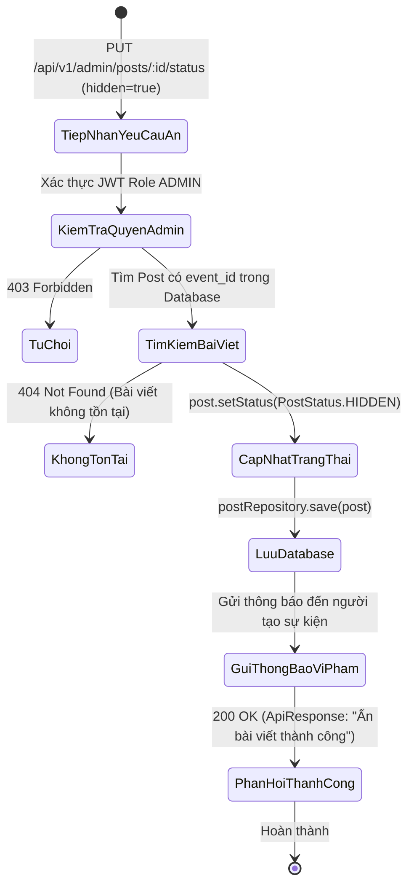
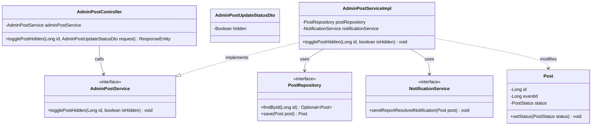
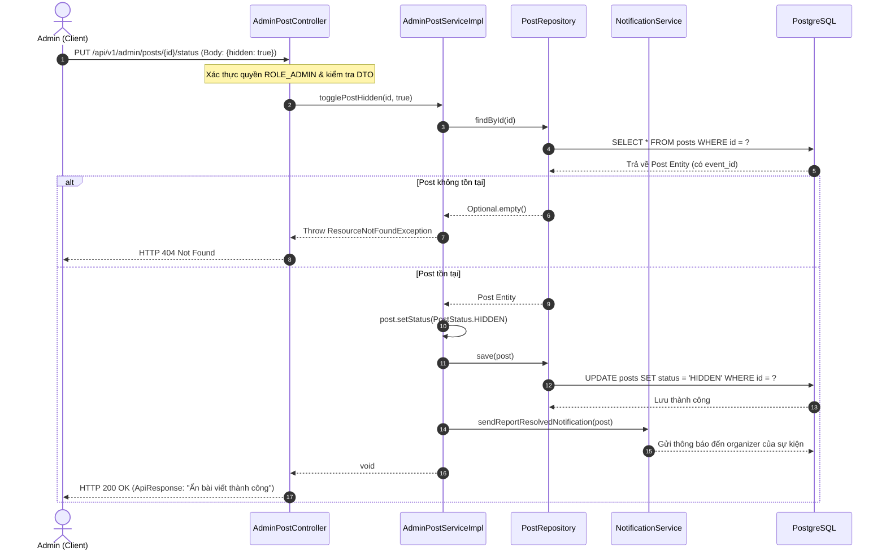

# ĐẶC TẢ YÊU CẦU & THIẾT KẾ CHI TIẾT: UC74 - ẨN / GỠ BỎ SỰ KIỆN VI PHẠM (BACKEND)

## PHẦN 1: ĐẶC TẢ NGHIỆP VỤ (REPORT 3)

### 2.2.3 Business Workflow (Luồng nghiệp vụ)

#### Mô tả chi tiết luồng xử lý bằng chữ (Business Step Description):
* **Bước 1 - Khởi đầu**: Quản trị viên (Admin) gửi yêu cầu ẩn hoặc gỡ bỏ một sự kiện vi phạm quy định nền tảng (nội dung lừa đảo, vi phạm pháp luật hoặc sai sự thật).
* **Bước 2 - Xác thực & Tiếp nhận**:
  * Request `PUT /api/v1/admin/posts/{id}/status` được gửi đến `AdminPostController`.
  * Hệ thống xác minh Header JWT mang Role `ROLE_ADMIN`.
* **Bước 3 - Cập nhật trạng thái sự kiện**:
  * Service tìm kiếm bài viết chứa thông tin sự kiện bằng `id`.
  * Cập nhật trạng thái bài viết sang `HIDDEN`. Khi bài viết ở trạng thái `HIDDEN`, toàn bộ thông tin sự kiện và khả năng RSVP sẽ bị khóa đối với người dùng thông thường.
  * Tự động kích hoạt dịch vụ thông báo `NotificationService` gửi thông báo cảnh cáo vi phạm đến tài khoản của người tổ chức sự kiện.
* **Bước 4 - Kết thúc**:
  * Lưu trạng thái vào cơ sở dữ liệu PostgreSQL.
  * Trả về HTTP 200 OK phản hồi cho phía Admin.

---

### 3.2 Quản Lý Sự Kiện

#### 3.2.1 Ẩn / gỡ bỏ sự kiện vi phạm (UC74)

**Function trigger**:
*   **Navigation path**: Admin gửi request `PUT /api/v1/admin/posts/{id}/status` với `{ "hidden": true }`.
*   **Timing Frequency**: On demand khi phát hiện sự kiện vi phạm.

**Function description**:
*   **Actors/Roles**: ADMIN
*   **Purpose**: Cung cấp API Backend cho phép Quản trị viên ẩn sự kiện vi phạm khỏi Bảng tin sự kiện, ngăn chặn người dùng tiếp tục đăng ký tham gia hoặc tiếp cận thông tin sai lệch.
*   **Interface**: REST API `PUT /api/v1/admin/posts/{id}/status`.

**Data processing**:
1. Controller nhận `id` và body `AdminPostUpdateStatusDto { hidden: true }`.
2. Kiểm tra quyền Admin.
3. Gọi `AdminPostService.togglePostHidden(id, true)`.
4. Tìm bản ghi bài viết trong `postRepository`. Nếu không thấy, ném `ResourceNotFoundException`.
5. Thiết lập `post.setStatus(PostStatus.HIDDEN)`.
6. Gọi `notificationService.sendReportResolvedNotification(post)` để gửi cảnh báo đến tác giả.
7. Lưu thực thể vào cơ sở dữ liệu và trả về kết quả.

**Screen layout**:
*   Figure 74: Giao diện quản trị viên khi kích hoạt ẩn sự kiện vi phạm và trạng thái được cập nhật sang "Đã ẩn".

**Function details**:
*   **Data**:
    *   `id` (Long): Mã bài viết chứa sự kiện vi phạm.
    *   `hidden` (Boolean): Trạng thái ẩn (`true`).
*   **Validation**:
    *   `id` phải là số nguyên dương hợp lệ.
    *   `hidden` không được null (`@NotNull`).
*   **Business rules**:
    *   BR-Admin-Event-01: Chỉ Admin mới có quyền ẩn sự kiện của người khác.
    *   BR-Admin-Event-02: Khi sự kiện bị ẩn, các thành viên khác không thể xem chi tiết hoặc đăng ký RSVP mới.
*   **Error Handling**:
    *   404 Not Found nếu bài viết không tồn tại.
    *   403 Forbidden nếu không có quyền Admin.
*   **Normal case**: Cập nhật trạng thái thành công, trả về HTTP 200 OK.
*   **Abnormal case**: Lỗi cơ sở dữ liệu hoặc lỗi dịch vụ gửi thông báo, trả về HTTP 500.

---

### 5. Requirement Appendix (Phụ lục Yêu cầu)

#### 5.1 Business Rules (Quy tắc Nghiệp vụ)

| ID | Định nghĩa Quy tắc (Rule Definition) |
| :--- | :--- |
| BR-Admin-Event-01 | Khi sự kiện bị ẩn bởi Admin, hệ thống tự động khóa hiển thị sự kiện trên toàn bộ ứng dụng. |
| BR-Admin-Event-02 | Tác giả sự kiện nhận được thông báo giải thích lý do nội dung bị gỡ bỏ. |

#### 5.2 Common Requirements (Yêu cầu Chung)
*   Thực hiện trong Transaction (`@Transactional`) để đảm bảo tính toàn vẹn dữ liệu.
*   Ghi log chi tiết hành động can thiệp của Quản trị viên.

---

## PHẦN 2: THIẾT KẾ CHI TIẾT (REPORT 4)

### 3. Detail Design (Thiết kế chi tiết)

#### 3.1 Ẩn / gỡ bỏ sự kiện vi phạm (UC74)

##### 3.1.1 Class Diagram (Sơ đồ Lớp)

##### 3.1.2 Sequence Diagram (Sơ đồ Tuần tự)

###### Mô tả chi tiết luồng xử lý bằng chữ (Sequence Flow Description):
1. **Tiếp nhận yêu cầu**: Admin gửi yêu cầu `PUT /api/v1/admin/posts/{id}/status` kèm payload `{ "hidden": true }` để ẩn bài viết sự kiện.
2. **Kiểm tra phân quyền**: Spring Security xác thực token và kiểm tra quyền `ADMIN`.
3. **Truy vấn & Cập nhật**: `AdminPostServiceImpl` tìm bài viết qua `PostRepository`. Nếu tìm thấy, đổi trạng thái sang `PostStatus.HIDDEN` và lưu lại vào database.
4. **Gửi thông báo**: `NotificationService` được gọi để gửi thông báo thông tin vi phạm đến tác giả của sự kiện.
5. **Trả kết quả**: Phản hồi HTTP 200 OK thông báo thao tác hoàn tất thành công.
