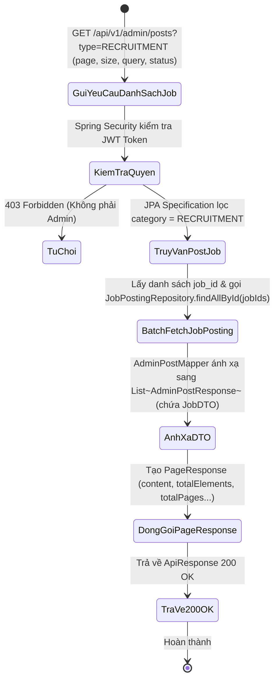
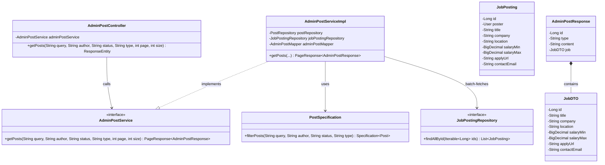
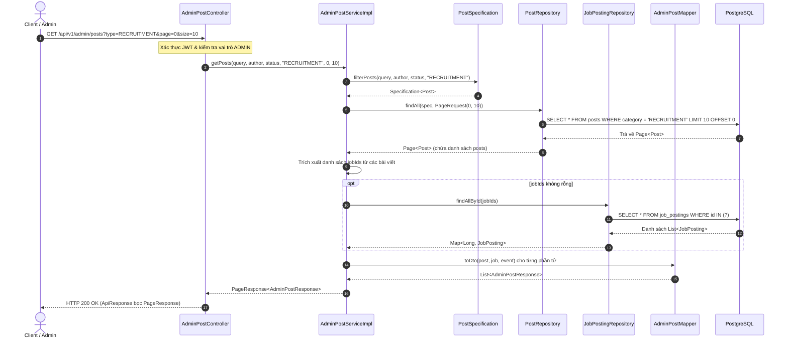

# ĐẶC TẢ YÊU CẦU & THIẾT KẾ CHI TIẾT: UC75 - XEM DANH SÁCH TIN TUYỂN DỤNG / VIỆC LÀM (BACKEND)

## PHẦN 1: ĐẶC TẢ NGHIỆP VỤ (REPORT 3)

### 2.2.3 Business Workflow (Luồng nghiệp vụ)

#### Mô tả chi tiết luồng xử lý bằng chữ (Business Step Description):
* **Bước 1 - Khởi đầu**: Phía Client hoặc Quản trị viên gửi yêu cầu truy vấn danh sách toàn bộ các tin tuyển dụng/việc làm trong hệ thống.
* **Bước 2 - Tiếp nhận & Phân quyền**:
  * Endpoint `GET /api/v1/admin/posts?type=RECRUITMENT` tiếp nhận yêu cầu kèm các tham số tìm kiếm (query, status, author, page, size).
  * Spring Security kiểm tra tính hợp lệ của token và vai trò `ADMIN`.
* **Bước 3 - Truy vấn tối ưu hóa cơ sở dữ liệu (Tránh N+1 Problem)**:
  * Service sử dụng `PostSpecification.filterPosts` để lọc các bài viết có danh mục `PostCategory.RECRUITMENT`.
  * Thực thi truy vấn phân trang qua `PostRepository.findAll(spec, pageable)`.
  * Thu thập toàn bộ danh sách `jobId` từ các bài viết trong trang hiện tại.
  * Thực hiện **Batch Fetching** thông qua `jobPostingRepository.findAllById(jobIds)` trong 1 truy vấn duy nhất để nạp đầy đủ thông tin tin tuyển dụng (tên vị trí, công ty, địa điểm, mức lương min/max, link ứng tuyển).
* **Bước 4 - Ánh xạ & Trả về kết quả**:
  * `AdminPostMapper` kết hợp thực thể `Post` và `JobPosting` tương ứng thành đối tượng `AdminPostResponse` chứa `JobDTO`.
  * Đóng gói vào `PageResponse<AdminPostResponse>` và trả về với mã HTTP `200 OK`.

---

### 3.2 Quản Lý Tin Tuyển Dụng

#### 3.2.1 Xem danh sách tin tuyển dụng / việc làm (UC75)

**Function trigger**:
*   **Navigation path**: Admin truy cập phân hệ Bảng tin / Việc làm hoặc gọi trực tiếp API `GET /api/v1/admin/posts?type=RECRUITMENT`.
*   **Timing Frequency**: On demand / On screen mount khi truy cập danh sách việc làm.

**Function description**:
*   **Actors/Roles**: ADMIN
*   **Purpose**: Cung cấp API Backend hiệu năng cao cho phép Quản trị viên xem, tìm kiếm và phân trang toàn bộ danh sách các tin tuyển dụng việc làm do Cựu sinh viên đăng tải.
*   **Interface**: REST API `GET /api/v1/admin/posts?type=RECRUITMENT&page={page}&size={size}&status={status}&query={query}`.

**Data processing**:
1. Nhận các tham số truy vấn từ URL Request.
2. Xây dựng truy vấn động `Specification<Post>` với điều kiện `category == PostCategory.RECRUITMENT` kết hợp từ khóa tìm kiếm và trạng thái hiển thị.
3. Thực thi phân trang với `PageRequest.of(page, size)`.
4. Gom nhóm `jobId` và truy vấn hàng loạt `JobPosting` qua `JobPostingRepository`.
5. Ghép nối dữ liệu, chuyển đổi sang danh sách `AdminPostResponse`.
6. Trả về `PageResponse` chuẩn bọc trong `ApiResponse`.

**Screen layout**:
*   Figure 75: Bảng danh sách tin tuyển dụng với các thông tin: Vị trí tuyển dụng, Tên doanh nghiệp, Mức lương, Người đăng, Ngày đăng và Trạng thái kiểm duyệt.

**Function details**:
*   **Data**:
    *   `query` (String - Optional): Từ khóa tìm kiếm theo nội dung hoặc tiêu đề công việc.
    *   `author` (String - Optional): Tên hoặc email người đăng bài.
    *   `status` (String - Optional): `VISIBLE`, `HIDDEN`, `ALL`.
    *   `type` (String): `RECRUITMENT`.
    *   `page` (int): Chỉ số trang (bắt đầu từ 0).
    *   `size` (int): Số phần tử trên một trang (mặc định 10).
*   **Validation**: `page >= 0`, `size > 0` và `size <= 100`.
*   **Business rules**:
    *   BR-Job-01: Admin có quyền xem tất cả các tin tuyển dụng bao gồm cả tin đang hiển thị và tin đã bị ẩn/xóa.
    *   BR-Job-02: Dữ liệu trả về phải chứa đầy đủ thông tin mức lương (`salaryMin`, `salaryMax`) và link ứng tuyển (`applyUrl`).
*   **Error Handling**:
    *   403 Forbidden nếu tài khoản không có quyền Admin.
*   **Normal case**: Trả về danh sách tin tuyển dụng phân trang với mã HTTP 200 OK.
*   **Abnormal case**: Lỗi cơ sở dữ liệu, trả về HTTP 500.

---

### 5. Requirement Appendix (Phụ lục Yêu cầu)

#### 5.1 Business Rules (Quy tắc Nghiệp vụ)

| ID | Định nghĩa Quy tắc (Rule Definition) |
| :--- | :--- |
| BR-Job-01 | Phân hệ quản trị cho phép lọc danh sách tin tuyển dụng theo trạng thái (VISIBLE/HIDDEN/ALL). |
| BR-Job-02 | Tối ưu hóa truy vấn cơ sở dữ liệu bằng kỹ thuật Batch Query nhằm đảm bảo tốc độ phản hồi dưới 300ms. |

#### 5.2 Common Requirements (Yêu cầu Chung)
*   Phân trang chuẩn định dạng `PageResponse`.
*   Hỗ trợ tìm kiếm không phân biệt chữ hoa, chữ thường.

---

## PHẦN 2: THIẾT KẾ CHI TIẾT (REPORT 4)

### 3. Detail Design (Thiết kế chi tiết)

#### 3.1 Xem danh sách tin tuyển dụng Backend (UC75)

##### 3.1.1 Class Diagram (Sơ đồ Lớp)

##### 3.1.2 Sequence Diagram (Sơ đồ Tuần tự)

###### Mô tả chi tiết luồng xử lý bằng chữ (Sequence Flow Description):
1. **Tiếp nhận yêu cầu**: Client gửi request GET danh sách bài viết tuyển dụng kèm tham số `type=RECRUITMENT`.
2. **Tạo Specification**: Service sử dụng `PostSpecification` để xây dựng điều kiện lọc theo chuyên mục `RECRUITMENT` cùng các tiêu chí tìm kiếm khác.
3. **Phân trang Post**: `PostRepository` thực thi truy vấn phân trang trên bảng `posts`.
4. **Batch Fetching Job**: Service thu thập tất cả `jobId` trong trang và gọi `jobPostingRepository.findAllById(jobIds)` một lần duy nhất để nạp đầy đủ thông tin tin tuyển dụng.
5. **Đóng gói kết quả**: Mapper chuyển đổi và gán `JobDTO` vào từng `AdminPostResponse`. Toàn bộ dữ liệu được gói vào `PageResponse` và trả về Client với mã HTTP 200 OK.
