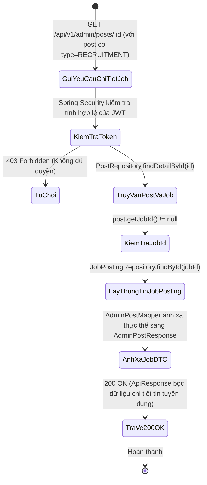
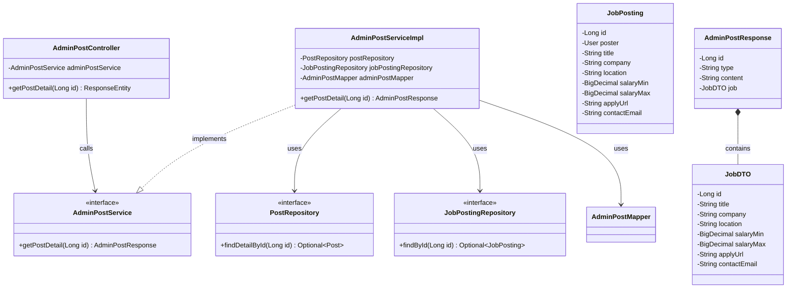
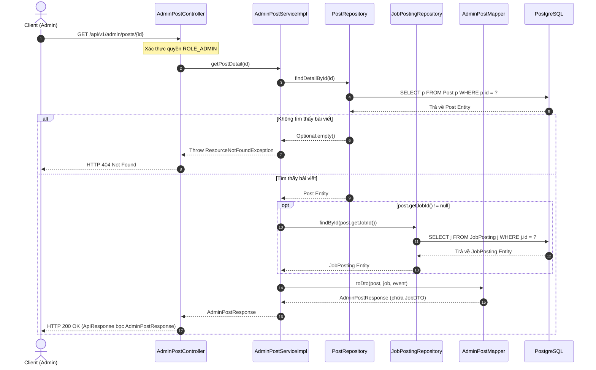

# ĐẶC TẢ YÊU CẦU & THIẾT KẾ CHI TIẾT: UC76 - XEM CHI TIẾT TIN TUYỂN DỤNG (BACKEND)

## PHẦN 1: ĐẶC TẢ NGHIỆP VỤ (REPORT 3)

### 2.2.3 Business Workflow (Luồng nghiệp vụ)

#### Mô tả chi tiết luồng xử lý bằng chữ (Business Step Description):
* **Bước 1 - Khởi đầu**: Quản trị viên (Admin) hoặc Client gửi yêu cầu xem thông tin chi tiết một tin tuyển dụng việc làm bằng ID bài viết.
* **Bước 2 - Kiểm tra bảo mật**:
  * Spring Security chặn request để kiểm tra quyền hạn `ROLE_ADMIN`.
  * Trả về lỗi 403 Forbidden nếu không đủ thẩm quyền.
* **Bước 3 - Truy vấn dữ liệu**:
  * Service gọi `postRepository.findDetailById(id)` để lấy thông tin bài viết và tác giả.
  * Nếu bài viết có liên kết đến tin tuyển dụng (`post.getJobId() != null`), Service gọi tiếp `jobPostingRepository.findById(post.getJobId())` để nạp các thông tin chi tiết: Tên công việc, Tên công ty, Địa điểm làm việc, Mức lương tối thiểu/tối đa, Đường dẫn nộp hồ sơ (`applyUrl`), và Email liên hệ (`contactEmail`).
* **Bước 4 - Chuyển đổi và phản hồi**:
  * `AdminPostMapper` chuyển đổi thông tin thực thể sang `JobDTO` và gắn vào `AdminPostResponse`.
  * Trả về phản hồi `HTTP 200 OK` kèm thông điệp "Lấy chi tiết bài viết thành công".

---

### 3.2 Quản Lý Tin Tuyển Dụng

#### 3.2.1 Xem chi tiết tin tuyển dụng (UC76)

**Function trigger**:
*   **Navigation path**: /admin/posts/:id (đối với tin bài loại RECRUITMENT).
*   **Timing Frequency**: On demand khi Admin nhấp xem chi tiết tin tuyển dụng.

**Function description**:
*   **Actors/Roles**: ADMIN
*   **Purpose**: Cung cấp API Backend trả về toàn bộ thông tin chi tiết của một tin tuyển dụng (bao gồm nội dung bài đăng, thông tin công ty, dải lương, cách thức ứng tuyển và thông tin người đăng) nhằm phục vụ công tác kiểm duyệt tin tuyển dụng.
*   **Interface**: REST API `GET /api/v1/admin/posts/{id}`.

**Data processing**:
1. Nhận `id` bài viết từ đường dẫn URL.
2. Kiểm tra token xác thực.
3. Gọi `AdminPostService.getPostDetail(id)`.
4. Tìm kiếm `Post` trong cơ sở dữ liệu. Nếu không tìm thấy, ném ngoại lệ `ResourceNotFoundException`.
5. Truy vấn bản ghi `JobPosting` tương ứng theo `jobId`.
6. Ánh xạ sang `AdminPostResponse` chứa `JobDTO`.
7. Trả về đối tượng `ApiResponse` thành công.

**Screen layout**:
*   Figure 76: Khung chi tiết tin tuyển dụng (Recruitment Card) bao gồm: Tiêu đề công việc, Tên doanh nghiệp tuyển dụng, Địa điểm làm việc, Khoảng lương dự kiến, Nút ứng tuyển, Email liên hệ, cùng thông tin người đăng và thời gian đăng tin.

**Function details**:
*   **Data**:
    *   `id` (Long): Mã định danh bài viết.
    *   `title` (String): Tiêu đề vị trí tuyển dụng.
    *   `company` (String): Tên công ty/doanh nghiệp.
    *   `location` (String): Địa điểm làm việc (Hà Nội, TP.HCM, Remote...).
    *   `salaryMin`, `salaryMax` (BigDecimal): Mức lương tối thiểu và tối đa.
    *   `applyUrl` (String): Đường dẫn trang ứng tuyển bên ngoài hoặc link form.
    *   `contactEmail` (String): Email nhận hồ sơ trực tiếp.
*   **Validation**: `id` trên đường dẫn phải là số nguyên dương lớn hơn 0.
*   **Business rules**:
    *   BR-Job-Detail-01: Admin có quyền xem chi tiết cả những tin tuyển dụng đã bị ẩn do vi phạm.
    *   BR-Job-Detail-02: Trường hợp tin tuyển dụng không công khai mức lương, các trường `salaryMin`, `salaryMax` sẽ trả về `null` một cách an toàn.
*   **Error Handling**:
    *   404 Not Found nếu ID bài viết hoặc tin tuyển dụng không tồn tại trong hệ thống.
*   **Normal case**: Trả về dữ liệu chi tiết tin tuyển dụng với mã HTTP 200 OK.
*   **Abnormal case**: Lỗi hệ thống hoặc mất kết nối DB, trả về HTTP 500.

---

### 5. Requirement Appendix (Phụ lục Yêu cầu)

#### 5.1 Business Rules (Quy tắc Nghiệp vụ)

| ID | Định nghĩa Quy tắc (Rule Definition) |
| :--- | :--- |
| BR-Job-Detail-01 | Chi tiết tin tuyển dụng phải chứa đầy đủ thông tin nhà tuyển dụng và liên kết ứng tuyển. |
| BR-Job-Detail-02 | Dữ liệu trả về từ API phải được bảo vệ bởi xác thực JWT của Quản trị viên. |

#### 5.2 Common Requirements (Yêu cầu Chung)
*   Phản hồi dữ liệu theo định dạng JSON chuẩn `ApiResponse<AdminPostResponse>`.
*   Thời gian xử lý API dưới 200ms.

---

## PHẦN 2: THIẾT KẾ CHI TIẾT (REPORT 4)

### 3. Detail Design (Thiết kế chi tiết)

#### 3.1 Xem chi tiết tin tuyển dụng Backend (UC76)

##### 3.1.1 Class Diagram (Sơ đồ Lớp)

##### 3.1.2 Sequence Diagram (Sơ đồ Tuần tự)

###### Mô tả chi tiết luồng xử lý bằng chữ (Sequence Flow Description):
1. **Gửi yêu cầu**: Client gửi request `GET /api/v1/admin/posts/{id}` để xem chi tiết tin tuyển dụng.
2. **Kiểm tra bài viết**: Service gọi `postRepository.findDetailById(id)`. Nếu không tồn tại, ném `ResourceNotFoundException` trả về 404.
3. **Nạp thông tin việc làm**: Nếu `post.getJobId()` tồn tại, gọi `jobPostingRepository.findById(jobId)` để lấy bản ghi chi tiết công việc.
4. **Ánh xạ DTO**: Mapper chuyển đổi thực thể `Post` và `JobPosting` sang `AdminPostResponse` với trường `job: JobDTO`.
5. **Trả kết quả**: Controller gửi phản hồi `HTTP 200 OK` chứa dữ liệu chi tiết tin tuyển dụng về cho phía Client.
