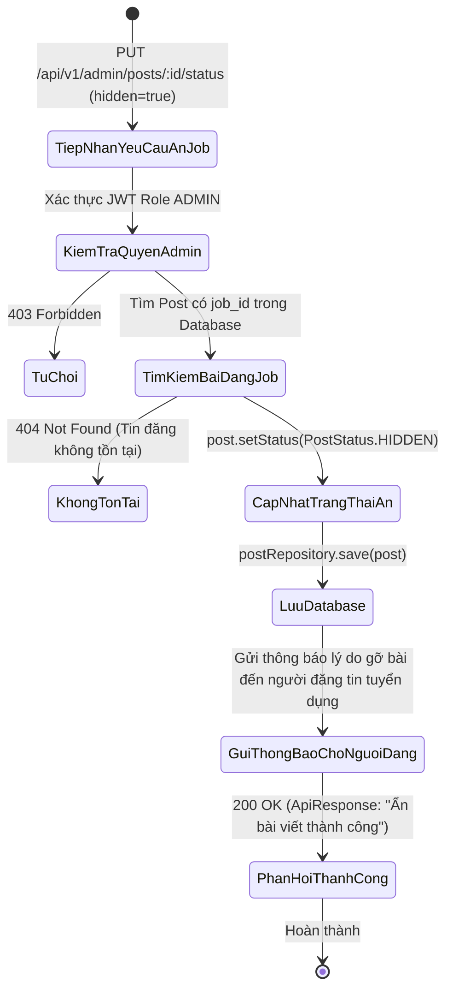
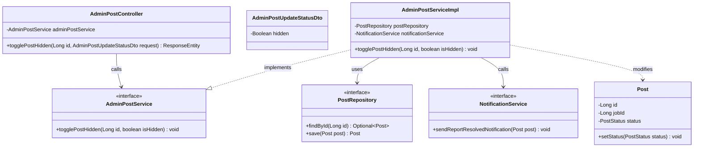
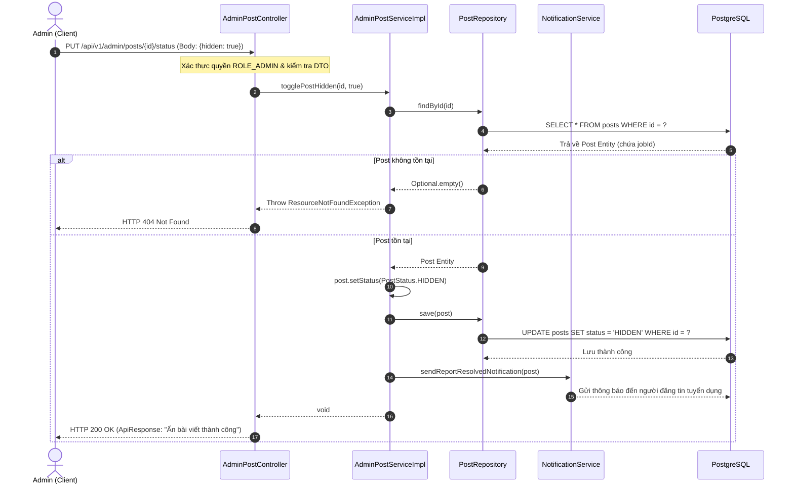

# ĐẶC TẢ YÊU CẦU & THIẾT KẾ CHI TIẾT: UC77 - ẨN / GỠ BỎ TIN TUYỂN DỤNG VI PHẠM (BACKEND)

## PHẦN 1: ĐẶC TẢ NGHIỆP VỤ (REPORT 3)

### 2.2.3 Business Workflow (Luồng nghiệp vụ)

#### Mô tả chi tiết luồng xử lý bằng chữ (Business Step Description):
* **Bước 1 - Khởi đầu**: Quản trị viên (Admin) phát hiện một tin tuyển dụng có dấu hiệu vi phạm (lừa đảo, thông tin việc làm giả mạo, mức lương ảo, hoặc thu phí trái phép).
* **Bước 2 - Gửi yêu cầu gỡ bỏ**:
  * Admin gửi request `PUT /api/v1/admin/posts/{id}/status` với dữ liệu `{ "hidden": true }`.
  * Bộ lọc phân quyền của Spring Boot xác thực quyền `ADMIN`.
* **Bước 3 - Cập nhật trạng thái và bảo vệ người dùng**:
  * Service tìm kiếm bài viết tuyển dụng theo `id`.
  * Cập nhật trạng thái `post.status` thành `HIDDEN`. Khi bị ẩn, tin tuyển dụng này sẽ ngay lập tức biến mất khỏi Bảng tin tuyển dụng, ngăn chặn các sinh viên/cựu sinh viên khác tiếp tục ứng tuyển.
  * Hệ thống tự động gửi thông báo hệ thống qua `NotificationService.sendReportResolvedNotification(post)` đến người đã đăng tin tuyển dụng để thông báo về việc tin đăng đã bị gỡ bỏ do vi phạm quy định.
* **Bước 4 - Hoàn tất**:
  * Ghi nhận dữ liệu cập nhật vào cơ sở dữ liệu PostgreSQL.
  * Phản hồi mã HTTP 200 OK cho Quản trị viên.

---

### 3.2 Quản Lý Tin Tuyển Dụng

#### 3.2.1 Ẩn / gỡ bỏ tin tuyển dụng vi phạm (UC77)

**Function trigger**:
*   **Navigation path**: Admin gửi yêu cầu `PUT /api/v1/admin/posts/{id}/status` với body `{ "hidden": true }`.
*   **Timing Frequency**: On demand khi phát hiện hoặc xử lý báo cáo về tin tuyển dụng vi phạm.

**Function description**:
*   **Actors/Roles**: ADMIN
*   **Purpose**: Cung cấp API Backend cho Quản trị viên gỡ bỏ tin tuyển dụng vi phạm khỏi hệ thống Alumnect, bảo vệ cộng đồng người dùng trước các rủi ro tuyển dụng lừa đảo.
*   **Interface**: REST API `PUT /api/v1/admin/posts/{id}/status`.

**Data processing**:
1. Controller tiếp nhận ID bài viết tuyển dụng và DTO `AdminPostUpdateStatusDto { hidden: true }`.
2. Kiểm tra tính hợp lệ của token và vai trò Admin.
3. Service tìm thực thể `Post` qua `postRepository.findById(id)`.
4. Gán `post.setStatus(PostStatus.HIDDEN)`.
5. Kích hoạt `notificationService.sendReportResolvedNotification(post)` để gửi thông báo cho người đăng bài.
6. Lưu thực thể `Post` vào DB và trả về kết quả thành công.

**Screen layout**:
*   Figure 77: Giao diện Quản trị viên xử lý ẩn tin tuyển dụng vi phạm và cập nhật trạng thái hiển thị sang "Đã ẩn (Vi phạm)".

**Function details**:
*   **Data**:
    *   `id` (Long): Mã bài viết chứa tin tuyển dụng.
    *   `hidden` (Boolean): Trạng thái ẩn (`true`).
*   **Validation**:
    *   `id` phải là số nguyên dương hợp lệ.
    *   `hidden` là giá trị boolean bắt buộc (`@NotNull`).
*   **Business rules**:
    *   BR-Admin-Job-01: Chỉ tài khoản Admin mới có thẩm quyền gỡ bỏ tin tuyển dụng của thành viên khác.
    *   BR-Admin-Job-02: Khi tin tuyển dụng bị ẩn, người dùng không thể xem nội dung chi tiết hoặc truy cập link ứng tuyển.
*   **Error Handling**:
    *   404 Not Found nếu không tìm thấy tin tuyển dụng với ID đã cho.
    *   403 Forbidden nếu yêu cầu không xuất phát từ tài khoản có vai trò Admin.
*   **Normal case**: Trả về HTTP 200 OK và thông báo "Ẩn bài viết thành công".
*   **Abnormal case**: Lỗi máy chủ hoặc mất kết nối DB, trả về HTTP 500.

---

### 5. Requirement Appendix (Phụ lục Yêu cầu)

#### 5.1 Business Rules (Quy tắc Nghiệp vụ)

| ID | Định nghĩa Quy tắc (Rule Definition) |
| :--- | :--- |
| BR-Admin-Job-01 | Tin tuyển dụng có trạng thái HIDDEN sẽ bị loại bỏ khỏi mọi kết quả tìm kiếm và danh sách hiển thị phía người dùng. |
| BR-Admin-Job-02 | Hệ thống tự động ghi nhận thông báo vi phạm đến tác giả bài đăng. |

#### 5.2 Common Requirements (Yêu cầu Chung)
*   Thao tác cập nhật cơ sở dữ liệu được thực hiện an toàn trong Transaction.
*   Trả về mã phản hồi chuẩn RESTful.

---

## PHẦN 2: THIẾT KẾ CHI TIẾT (REPORT 4)

### 3. Detail Design (Thiết kế chi tiết)

#### 3.1 Ẩn / gỡ bỏ tin tuyển dụng vi phạm (UC77)

##### 3.1.1 Class Diagram (Sơ đồ Lớp)

##### 3.1.2 Sequence Diagram (Sơ đồ Tuần tự)

###### Mô tả chi tiết luồng xử lý bằng chữ (Sequence Flow Description):
1. **Gửi yêu cầu**: Quản trị viên gửi lệnh `PUT /api/v1/admin/posts/{id}/status` với dữ liệu `{ "hidden": true }` để ẩn tin tuyển dụng vi phạm.
2. **Xác thực quyền**: Spring Security xác thực token đảm bảo người thực hiện mang quyền `ADMIN`.
3. **Cập nhật trạng thái**: Service tìm kiếm bài viết trong `postRepository`, đổi trạng thái sang `PostStatus.HIDDEN` và lưu vào PostgreSQL.
4. **Gửi cảnh báo**: Kích hoạt `NotificationService` tạo thông báo giải thích lý do gỡ bài gửi đến người đăng tin tuyển dụng.
5. **Phản hồi**: Trả về `HTTP 200 OK` xác nhận tin tuyển dụng đã được ẩn thành công.
