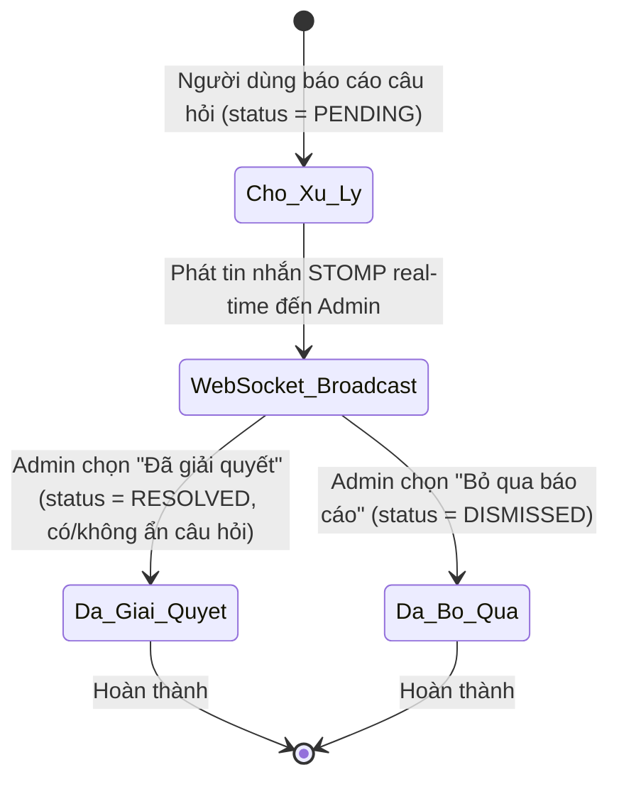
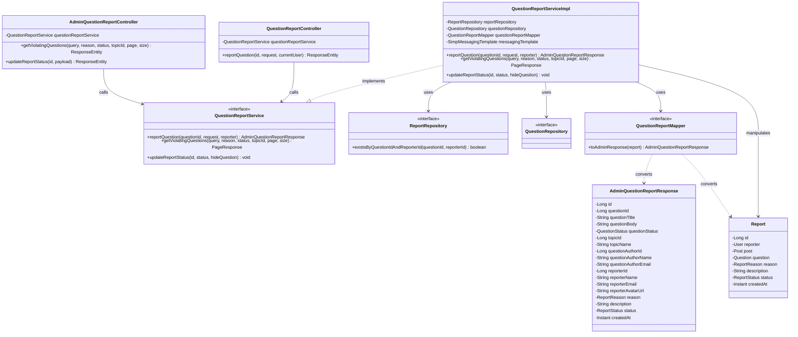
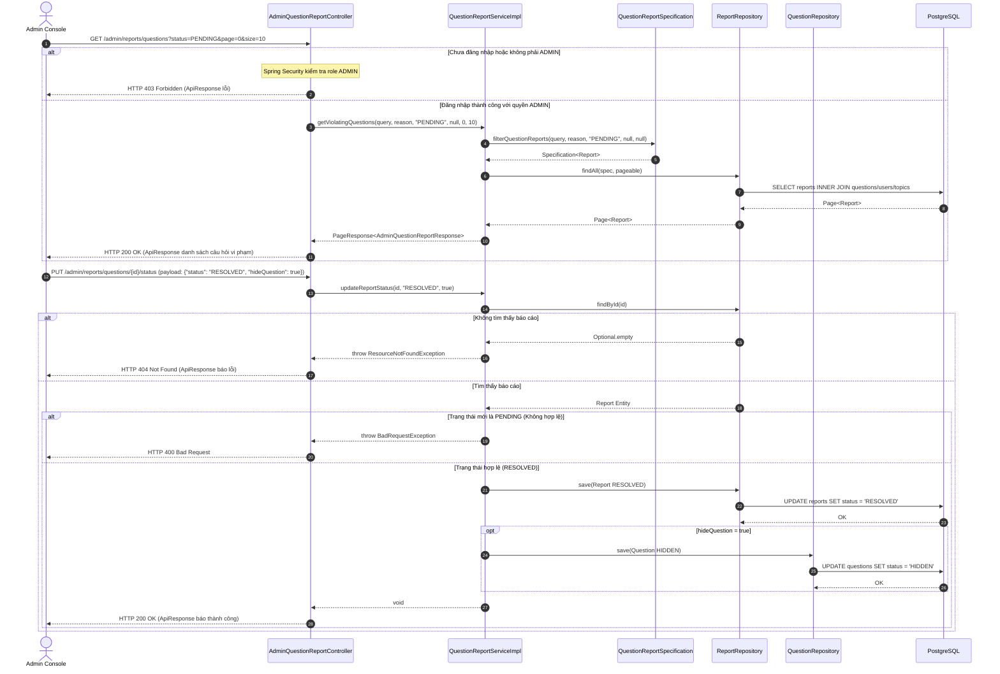

# ĐẶC TẢ YÊU CẦU & THIẾT KẾ CHI TIẾT: UC78 - XEM CÂU HỎI VI PHẠM (VIEW VIOLATING QUESTIONS)

## PHẦN 1: ĐẶC TẢ NGHIỆP VỤ (REPORT 3)

### 2.2.3 Business Workflow (Luồng nghiệp vụ)

#### Mô tả chi tiết luồng xử lý bằng chữ (Business Step Description):
* **Bước 1 - Gửi báo cáo & Phát Real-time**: Khi người dùng (Student/Alumni) gửi báo cáo câu hỏi vi phạm qua API `POST /api/v1/questions/{id}/reports`, hệ thống tạo một bản ghi báo cáo mới trong bảng `reports` ở trạng thái `PENDING`. Ngay lập tức, hệ thống phát đi thông báo WebSocket STOMP tới kênh `/topic/admin/reports/questions`.
* **Bước 2 - Nhận thông báo & Xem danh sách**: Admin đang truy cập Admin Console (tại `/admin/moderation` hoặc `/admin/violating-questions`) sẽ tự động nhận được thông báo đẩy thời gian thực và danh sách báo cáo vi phạm lập tức cập nhật live mà không cần tải lại trang. Admin có thể tìm kiếm, lọc theo trạng thái (`PENDING`, `RESOLVED`, `DISMISSED`) hoặc theo lý do vi phạm.
* **Bước 3 - Xem chi tiết & Xử lý**: Admin nhấp "Chi tiết" để mở Modal xem toàn bộ tiêu đề, nội dung câu hỏi, tác giả câu hỏi, người gửi báo cáo và mô tả lý do. Admin có thể tùy chọn đánh dấu "Ẩn câu hỏi" (chuyển câu hỏi sang `HIDDEN`) và thực hiện một trong hai hành động:
  - Nhấn "Đã giải quyết": Gửi yêu cầu `PUT /api/v1/admin/reports/questions/{id}/status` với `status = RESOLVED` và `hideQuestion = true/false`.
  - Nhấn "Bỏ qua báo cáo": Gửi yêu cầu `PUT /api/v1/admin/reports/questions/{id}/status` với `status = DISMISSED` và `hideQuestion = false`.
* **Bước 4 - Hoàn thành**: Bản ghi báo cáo chuyển trạng thái tương ứng (`RESOLVED` hoặc `DISMISSED`) và câu hỏi gốc sẽ được ẩn/hiện công khai tương ứng trên diễn đàn Q&A.

---

### 3.2 Admin Dashboard & System (Module 6)
Module này cung cấp các tính năng quản lý, theo dõi KPIs, kiểm duyệt nội dung vi phạm và quản trị hệ thống dành riêng cho Quản trị viên (Admin) của hệ thống AlumNect.

#### 3.2.1 Xem danh sách câu hỏi vi phạm (UC78)

**Function trigger**:
*   **Navigation path**: Dashboard Admin -> Menu trái chọn "Kiểm duyệt Diễn đàn" -> Route `/admin/moderation` hoặc `/admin/violating-questions`
*   **Timing Frequency**: Khi trang được tải (screen mount) hoặc nhận sự kiện đẩy real-time STOMP từ máy chủ WebSocket.

**Function description**:
*   **Actors/Roles**: Admin
*   **Purpose**: Cho phép Admin kiểm tra, quản lý, xử lý các báo cáo vi phạm câu hỏi trên diễn đàn Q&A và quyết định ẩn/hiện các câu hỏi vi phạm tiêu chuẩn cộng đồng.
*   **Interface**:
    *   Huy hiệu trạng thái kết nối "Real-time Live" WebSocket.
    *   Các tab bộ lọc trạng thái: "Đang chờ xử lý" (PENDING), "Đã giải quyết" (RESOLVED), "Đã bỏ qua" (DISMISSED).
    *   Dropdown chọn lý do vi phạm: "Tất cả lý do", "Spam / Rác", "Nội dung không phù hợp", "Sai lệch thông tin", "Lừa đảo & Giả mạo", "Lý do khác".
    *   Ô tìm kiếm động: tìm kiếm theo tiêu đề/nội dung câu hỏi, tên/email người báo cáo, tên/email tác giả câu hỏi.
    *   Bảng danh sách báo cáo: hiển thị thông tin người báo cáo, lý do, tiêu đề/nội dung ngắn câu hỏi, tác giả câu hỏi, trạng thái câu hỏi (Công khai, Đã ẩn, Đã xóa).
    *   Modal chi tiết báo cáo: hiển thị thông tin chi tiết người báo cáo, mô tả lý do, toàn bộ nội dung câu hỏi, nút toggle "Ẩn câu hỏi" và các nút "Đã giải quyết", "Bỏ qua báo cáo".

**Data processing**:
*   **GET List**: Nhận các tham số lọc, khởi tạo `QuestionReportSpecification` để truy vấn `SELECT` bảng `reports` JOIN với `questions`, `users`, `user_profiles`, `forum_topics`.
*   **PUT Status**: Kiểm tra xem báo cáo câu hỏi có tồn tại hay không, cập nhật trạng thái báo cáo (`RESOLVED` hoặc `DISMISSED`) và cập nhật trạng thái câu hỏi (`QuestionStatus.HIDDEN` hoặc `QuestionStatus.ACTIVE`).
*   **WebSocket STOMP Broadcast**: Nhận thông điệp từ `/topic/admin/reports/questions` và tự động invalidate cache React Query `['admin-question-reports']`.

**Screen layout**:
*   Figure 78.1: Màn hình Danh sách câu hỏi vi phạm với giao diện Pastel Premium và huy hiệu Real-time Live.
*   Figure 78.2: Modal chi tiết báo cáo câu hỏi vi phạm kèm tùy chọn ẩn/hiện câu hỏi và xác nhận xử lý.

**Function details**:
*   **Data**: Report ID, Question ID, Question Title, Question Body, Question Status, Topic ID, Topic Name, Question Author User, Reporter User, Reason, Description, Status, CreatedAt.
*   **Validation**:
    *   Mã trạng thái cập nhật chỉ chấp nhận `RESOLVED` hoặc `DISMISSED`. Không chấp nhận `PENDING`.
    *   Mô tả lý do báo cáo tối đa 500 ký tự.
*   **Business rules**:
    *   Chỉ người dùng có vai trò `ADMIN` mới được phép xem và kiểm duyệt danh sách câu hỏi vi phạm.
    *   Tự động gửi thông báo WebSocket STOMP real-time tới Admin khi có người dùng gửi báo cáo câu hỏi mới.
    *   Không cho phép tác giả tự gửi báo cáo câu hỏi của chính mình.
    *   Mỗi người dùng chỉ được gửi tối đa 1 báo cáo cho cùng 1 câu hỏi.
*   **Error Handling**:
    *   Trả về `401 Unauthorized` nếu JWT thiếu hoặc hết hạn.
    *   Trả về `403 Forbidden` nếu vai trò không phải `ADMIN`.
    *   Trả về `404 Not Found` nếu không tìm thấy ID báo cáo câu hỏi.
    *   Trả về `400 Bad Request` nếu tham số trạng thái không hợp lệ.
*   **Normal case**: Lấy danh sách câu hỏi vi phạm thành công, trả về JSON bọc trong đối tượng ApiResponse chuẩn kèm mã HTTP 200 OK.
*   **Abnormal case**: Yêu cầu bị từ chối do phân quyền hoặc lỗi máy chủ, trả về thông báo lỗi tiếng Việt tương ứng.

---

### 5. Requirement Appendix (Phụ lục Yêu cầu)

#### 5.1 Business Rules (Quy tắc Nghiệp vụ)

| ID | Định nghĩa Quy tắc (Rule Definition) |
| :--- | :--- |
| BR-78-01 | Chỉ người dùng có vai trò `ADMIN` được phép xem danh sách và xử lý báo cáo câu hỏi vi phạm. |
| BR-78-02 | Khi có câu hỏi vi phạm mới được báo cáo, hệ thống tự động phát STOMP WebSocket broadcast tới kênh `/topic/admin/reports/questions`. |
| BR-78-03 | Trạng thái báo cáo câu hỏi gồm `PENDING` (Chờ xử lý), `RESOLVED` (Đã giải quyết), `DISMISSED` (Đã bỏ qua). |
| BR-78-04 | Admin có quyền quyết định chuyển trạng thái câu hỏi vi phạm sang `HIDDEN` (Đã ẩn) hoặc `ACTIVE` (Công khai) khi giải quyết báo cáo. |
| BR-78-05 | Tác giả câu hỏi không được phép tự gửi báo cáo vi phạm đối với câu hỏi của chính mình và mỗi người dùng chỉ được gửi 1 báo cáo duy nhất cho mỗi câu hỏi. |

#### 5.2 Common Requirements (Yêu cầu Chung)
*   Tất cả múi giờ hiển thị mặc định là Asia/Ho_Chi_Minh.
*   Mọi thông báo thành công hoặc thất bại đều được hiển thị qua Toast hoặc hộp thoại Modal xác nhận rõ ràng.
*   Giao diện tuân thủ bảng màu Pastel Premium (nền kem ấm `#faf4ec`, surface trắng `#ffffff`, chữ mận chín `#322c3f`, hiệu ứng kính mờ và viền chuyển màu).

#### 5.3 Application Messages List (Danh sách Thông điệp Ứng dụng)

| # | Mã thông điệp (Message code) | Loại thông điệp (Message Type) | Ngữ cảnh (Context) | Nội dung hiển thị (Content) |
| :--- | :--- | :--- | :--- | :--- |
| 1 | MSG-UC78-01 | Inline / Toast | Lấy danh sách câu hỏi vi phạm thành công | Lấy danh sách câu hỏi vi phạm thành công |
| 2 | MSG-UC78-02 | Toast | Đã giải quyết báo cáo câu hỏi vi phạm thành công | Đã giải quyết báo cáo câu hỏi vi phạm |
| 3 | MSG-UC78-03 | Toast | Đã bỏ qua báo cáo câu hỏi vi phạm thành công | Đã bỏ qua báo cáo câu hỏi vi phạm |
| 4 | MSG-UC78-04 | Under field / Toast | Trạng thái báo cáo không hợp lệ | Trạng thái báo cáo không hợp lệ: {status} |
| 5 | MSG-UC78-05 | Under field / Toast | Không thể chuyển trạng thái báo cáo về PENDING | Không thể chuyển báo cáo về lại trạng thái PENDING. |
| 6 | MSG-UC78-06 | Inline / Login redirect | JWT Token hết hạn | Phiên đăng nhập không hợp lệ hoặc đã hết hạn. |
| 7 | MSG-UC78-07 | Inline | Người dùng thường cố ý truy cập API Admin | Chỉ Quản trị viên mới được phép truy cập tài nguyên này. |
| 8 | MSG-UC78-08 | Toast | Không tìm thấy ID báo cáo câu hỏi vi phạm | Không tìm thấy báo cáo vi phạm với ID: {id} |

---

## PHẦN 2: THIẾT KẾ CHI TIẾT (REPORT 4)

### 3. Detail Design (Thiết kế chi tiết)

#### 3.1 Xem danh sách và kiểm duyệt câu hỏi vi phạm (UC78)

##### 3.1.1 Class Diagram (Sơ đồ Lớp)

###### Mô tả chi tiết cấu trúc các lớp (Class Design Description):
* **Lớp Controller**:
  * `AdminQuestionReportController.java`: Tiếp nhận các yêu cầu từ Admin để lấy danh sách câu hỏi vi phạm (`GET /admin/reports/questions`) và cập nhật trạng thái xử lý/ẩn bài (`PUT /admin/reports/questions/{id}/status`).
  * `QuestionReportController.java`: Tiếp nhận yêu cầu báo cáo câu hỏi vi phạm từ phía người dùng (`POST /questions/{id}/reports`).
* **Lớp DTO**:
  * `CreateQuestionReportRequest.java`: Chứa lý do và mô tả báo cáo từ phía Client.
  * `AdminQuestionReportResponse.java`: Chứa toàn bộ dữ liệu phản hồi bao gồm tiêu đề, nội dung câu hỏi, tác giả, người báo cáo, lý do và trạng thái.
* **Lớp Service**: Giao diện `QuestionReportService.java` và lớp thực thi `QuestionReportServiceImpl.java` đảm nhận logic nghiệp vụ kiểm tra điều kiện báo cáo, phát thông báo STOMP real-time tới WebSocket broker, và truy vấn lọc động bằng Specifications.
* **Lớp Mapper**: `QuestionReportMapper.java` chuyển đổi giữa thực thể `Report` lồng nhau và DTO phẳng `AdminQuestionReportResponse`.
* **Lớp Repository & Entity**: `ReportRepository.java` và `QuestionRepository.java` thực thi thao tác dữ liệu xuống DB PostgreSQL với thực thể `Report.java` và `Question.java`.

##### 3.1.2 Sequence Diagram (Sơ đồ Tuần tự)

###### Mô tả chi tiết luồng xử lý bằng chữ (Sequence Flow Description):
1.  **Luồng lấy danh sách câu hỏi vi phạm (GET List)**:
    *   Admin gửi yêu cầu GET tới `/admin/reports/questions`.
    *   Spring Security xác thực token JWT và vai trò `ADMIN` từ `Endpoints.java`. Nếu sai quyền, trả về HTTP 403 Forbidden.
    *   Controller chuyển tham số xuống `QuestionReportServiceImpl`. Service dùng `QuestionReportSpecification` lọc theo `question_id IS NOT NULL`, trạng thái, lý do và từ khóa tìm kiếm.
    *   Repository truy vấn database PostgreSQL. Kết quả được ánh xạ sang `AdminQuestionReportResponse` và trả về bọc trong `PageResponse` mã 200 OK.
2.  **Luồng cập nhật trạng thái & ẩn câu hỏi (PUT Status)**:
    *   Admin gửi yêu cầu cập nhật trạng thái báo cáo vi phạm sang `RESOLVED` hoặc `DISMISSED`, kèm cờ `hideQuestion` (ẩn/mở ẩn câu hỏi gốc).
    *   Service tìm bản ghi `Report` trong DB. Nếu không tìm thấy, ném `ResourceNotFoundException` trả về mã 404.
    *   Nếu tìm thấy, Service cập nhật trạng thái của báo cáo. Nếu `hideQuestion = true`, Service tiếp tục cập nhật trạng thái của câu hỏi gốc trong bảng `questions` sang `HIDDEN`.
    *   Hệ thống lưu thay đổi xuống DB PostgreSQL, ghi nhận nhật ký SLF4J, và trả lại phản hồi HTTP 200 OK thành công cho Admin Console.
