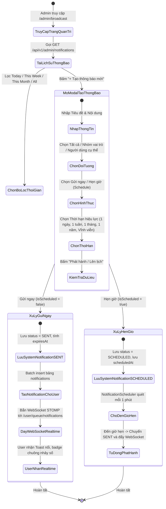
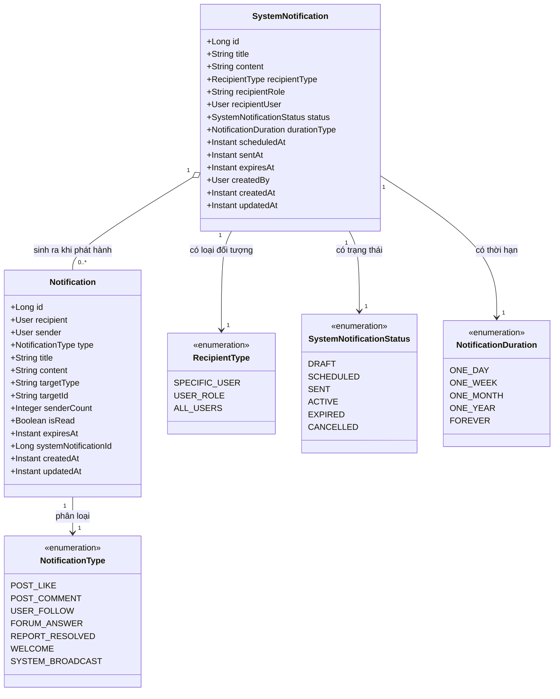
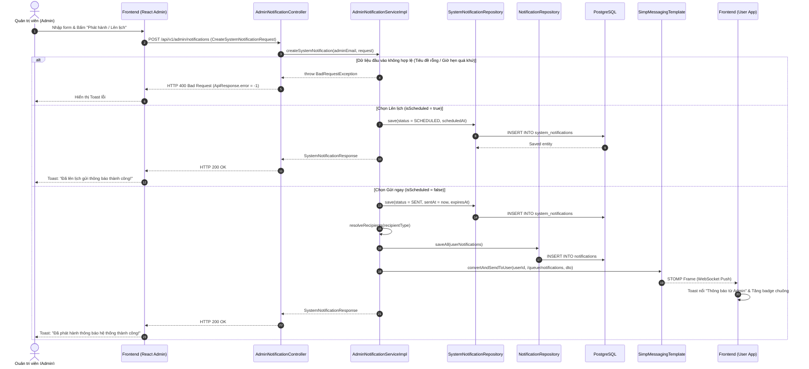

# ĐẶC TẢ YÊU CẦU & THIẾT KẾ CHI TIẾT: UC87 - GỬI THÔNG BÁO HỆ THỐNG (SEND BROADCAST NOTIFICATION)

## PHẦN 1: ĐẶC TẢ NGHIỆP VỤ (REPORT 3)

### 2.2.3 Business Workflow (Luồng nghiệp vụ)



#### Mô tả chi tiết luồng xử lý bằng chữ (Business Step Description):
* **Bước 1 - Khởi đầu (Truy cập & Lọc lịch sử)**: Quản trị viên (Admin) truy cập trang Quản lý thông báo hệ thống (`/admin/broadcast`). Hệ thống tải danh sách lịch sử thông báo phân trang, hỗ trợ lọc theo thời gian (`Hôm nay`, `Tuần này`, `Tháng này`, `Tất cả`) và trạng thái (`SCHEDULED`, `SENT`, `EXPIRED`, `CANCELLED`).
* **Bước 2 - Tạo thông báo và phân loại đối tượng**: Admin nhấn nút `+ Tạo thông báo mới`. Modal xuất hiện cho phép nhập tiêu đề, nội dung và chọn 1 trong 3 nhóm đối tượng:
  - *Tất cả người dùng (All Users)*: Toàn bộ tài khoản có trạng thái `ACTIVE`.
  - *Nhóm vai trò (User Role)*: Nhóm người dùng theo vai trò (`STUDENT`, `ALUMNI`, `ADMIN`).
  - *Người dùng cụ thể (Specific User)*: Tìm kiếm theo tên, email, mã số sinh viên với danh sách gợi ý tự động.
* **Bước 3 - Chọn hình thức phát hành & Thời hạn hiệu lực**:
  - *Gửi ngay*: Hệ thống gán trạng thái `SENT`, tạo bản ghi thông báo trong bảng `notifications` cho toàn bộ người nhận mục tiêu và phát sóng thời gian thực qua WebSocket STOMP.
  - *Hẹn giờ (Schedule)*: Hệ thống lưu trạng thái `SCHEDULED` cùng mốc thời gian `scheduledAt`. Cron job định kỳ quét và tự động gửi khi đến giờ.
  - *Thời hạn hiệu lực*: Cấu hình `1 Ngày`, `1 Tuần`, `1 Tháng`, `1 Năm`, hoặc `Vĩnh viễn`. Hệ thống tự động tính `expiresAt = sentAt + duration`. Khi hết hạn, thông báo chuyển sang `EXPIRED` và tự động ẩn khỏi giao diện người dùng.

---

### 3.2 Quản Lý Thông Báo Hệ Thống (Module: Admin Broadcast & Notifications)
Module Quản trị Thông báo chịu trách nhiệm lưu trữ, điều phối, hẹn giờ phát hành và phát sóng thời gian thực các thông báo quan trọng từ Ban Quản trị tới toàn thể sinh viên và cựu sinh viên FPT University.

#### 3.2.1 Gửi và Quản lý thông báo hệ thống (UC87)

**Function trigger**:
* **Navigation path**: Admin Console -> Menu "Thông báo chung" -> Đường dẫn `/admin/broadcast`.
* **Timing Frequency**: Theo nhu cầu của Quản trị viên (On demand) và tự động kích hoạt theo lịch hẹn (Event-driven / Cron Scheduler).

**Function description**:
* **Actors/Roles**: Quản trị viên hệ thống (`ADMIN`).
* **Purpose**: Truyền thông các tin tức quan trọng, thông báo bảo trì, sự kiện giao lưu và cảnh báo hệ thống tới đúng nhóm đối tượng người dùng một cách tức thời hoặc theo kế hoạch định trước.
* **Interface**:
  - Màn hình chính ([AdminBroadcastPage.tsx](file:///d:/Alum/Alumnect/alumnect-frontend/src/features/admin/components/AdminBroadcastPage.tsx)): Thanh header, nút tạo mới, tab lọc thời gian, dropdown lọc trạng thái, bảng hiển thị lịch sử phân trang chuẩn, modal xem chi tiết và modal xác nhận hủy lịch gửi.
  - Modal tạo thông báo ([CreateNotificationModal.tsx](file:///d:/Alum/Alumnect/alumnect-frontend/src/features/admin/components/CreateNotificationModal.tsx)): Form nhập liệu, bộ chọn 3 loại đối tượng nhận, ô tìm kiếm autocomplete người dùng có avatar, datetime-local picker cho hẹn giờ, bộ chọn thời hạn hiệu lực.

**Data processing**:
* **Lọc khoảng thời gian (Time Filter)**:
  - `TODAY`: Từ `00:00:00` đến `23:59:59` của ngày hiện tại (múi giờ `Asia/Ho_Chi_Minh`).
  - `THIS_WEEK`: Từ thứ Hai đến Chủ Nhật của tuần hiện tại.
  - `THIS_MONTH`: Từ ngày đầu tháng đến ngày cuối cùng của tháng hiện tại.
  - `ALL`: Không giới hạn thời gian tạo.
* **Xử lý Realtime WebSocket**:
  - Máy chủ gửi gói tin `NotificationResponse` trực tiếp tới hàng đợi cá nhân `/user/queue/notifications` của các người nhận tương ứng.
  - Frontend của người dùng nhận diện sự kiện, kích hoạt Toast nổi màu cam/vàng thương hiệu, tăng số đếm chưa đọc trên Chuông Navbar (`unreadCount++`) và làm mới danh sách thông báo mà **không cần reload trang**.
* **Xử lý Tác vụ nền (Scheduler & Expiration)**:
  - Cron job chạy mỗi 1 phút (`0 * * * * *`):
    1. Quét `system_notifications` có `status = 'SCHEDULED'` và `scheduled_at <= now()`, thực hiện gửi và chuyển sang `SENT`.
    2. Quét `system_notifications` có `status IN ('SENT', 'ACTIVE')` và `expires_at <= now()`, chuyển trạng thái sang `EXPIRED`.
  - Phía User, API `GET /notifications` tự động lọc bỏ các thông báo có `expires_at <= now()`.

**Screen layout**:
* Figure 87.1: Admin Broadcast Management Screen layout (`/admin/broadcast`).
* Figure 87.2: Create System Notification Modal with User/Role targeting.
* Figure 87.3: User Realtime Notification Toast & Bell Badge increment.

**Function details**:
* **Data**: `id`, `title`, `content`, `recipient_type`, `recipient_role`, `recipient_user_id`, `status`, `duration_type`, `scheduled_at`, `sent_at`, `expires_at`, `created_by`, `created_at`, `updated_at`.
* **Validation**:
  - `title`: Không được rỗng, tối đa 255 ký tự.
  - `content`: Không được rỗng.
  - `recipientType`: Bắt buộc (`ALL_USERS`, `USER_ROLE`, `SPECIFIC_USER`).
  - `recipientRole`: Bắt buộc nếu chọn `USER_ROLE` (`STUDENT`, `ALUMNI`, `ADMIN`).
  - `recipientUserId`: Bắt buộc nếu chọn `SPECIFIC_USER` (User phải tồn tại trong DB).
  - `isScheduled`: Nếu `true` thì `scheduledAt` bắt buộc và phải ở tương lai.
  - `durationType`: Bắt buộc (`ONE_DAY`, `ONE_WEEK`, `ONE_MONTH`, `ONE_YEAR`, `FOREVER`).
* **Business rules**:
  - BR-BRD-01: Chỉ tài khoản có vai trò `ADMIN` mới có quyền tạo, xem lịch sử và hủy thông báo hệ thống.
  - BR-BRD-02: Thông báo gửi cho `SPECIFIC_USER` chỉ hiển thị và đẩy realtime cho duy nhất người dùng đó.
  - BR-BRD-03: Thông báo gửi cho `USER_ROLE` chỉ gửi tới các tài khoản có trạng thái `ACTIVE` thuộc vai trò chỉ định.
  - BR-BRD-04: Thông báo chỉ có thể hủy (`CANCELLED`) khi đang ở trạng thái `SCHEDULED`.
  - BR-BRD-05: Thông báo đã hết hạn (`EXPIRED`) sẽ tự động ẩn khỏi danh sách thông báo của User.
* **Error Handling**:
  - HTTP 400 Bad Request: Dữ liệu thiếu tiêu đề, chọn ngày hẹn giờ trong quá khứ hoặc hủy thông báo không phải `SCHEDULED`.
  - HTTP 401 Unauthorized: Chưa đăng nhập hoặc token JWT hết hạn.
  - HTTP 403 Forbidden: Người dùng không phải là `ADMIN`.
  - HTTP 404 Not Found: Không tìm thấy người dùng chỉ định hoặc không tìm thấy thông báo hệ thống.
* **Normal case**: Trả về HTTP 200 OK kèm dữ liệu phân trang hoặc đối tượng thông báo vừa tạo.
* **Abnormal case**: Lỗi mạng WebSocket tự động kết nối lại sau 5 giây (`reconnectDelay: 5000ms`).

---

### 5. Requirement Appendix (Phụ lục Yêu cầu)

#### 5.1 Business Rules (Quy tắc Nghiệp vụ)

| ID | Định nghĩa Quy tắc (Rule Definition) |
| :--- | :--- |
| BR-BRD-01 | Chỉ Quản trị viên (`ADMIN`) có quyền truy cập module gửi thông báo hệ thống. |
| BR-BRD-02 | Thông báo gửi tới nhóm vai trò chỉ phát tới các tài khoản `ACTIVE`. |
| BR-BRD-03 | Thời gian hẹn giờ gửi thông báo (`scheduledAt`) bắt buộc phải lớn hơn thời điểm hiện tại. |
| BR-BRD-04 | Hủy lịch gửi thông báo chỉ áp dụng cho các bản ghi đang ở trạng thái `SCHEDULED`. |
| BR-BRD-05 | Thời điểm hết hạn `expiresAt` được tính bằng `sentAt + durationType`. Riêng `FOREVER` có `expiresAt = null`. |
| BR-BRD-06 | Khi thông báo hết hạn, trạng thái chuyển `EXPIRED` và không hiển thị trong hộp thư người dùng. |
| BR-BRD-07 | Người dùng nhận thông báo realtime ngay lập tức qua WebSocket STOMP mà không cần F5/Reload. |
| BR-BRD-08 | Tái sử dụng cơ chế phân trang `PageResponse<T>` và đồng bộ giao diện Pastel Premium. |

#### 5.2 Common Requirements (Yêu cầu Chung)
* Danh sách lịch sử thông báo được phân trang với kích thước mặc định 10 bản ghi/trang.
* Toàn bộ ngày giờ được hiển thị theo định dạng `[HH:mm - dd/MM/yyyy]` theo múi giờ `Asia/Ho_Chi_Minh`.
* Tất cả thao tác tạo/hủy đều hiển thị thông báo phản hồi qua Toast.

#### 5.3 Application Messages List (Danh sách Thông điệp Ứng dụng)

| # | Mã thông điệp | Loại thông điệp | Ngữ cảnh | Nội dung hiển thị |
| :--- | :--- | :--- | :--- | :--- |
| 1 | MSG_BRD_01 | In red, under input | Tiêu đề bị để trống | Tiêu đề thông báo không được để trống |
| 2 | MSG_BRD_02 | In red, under input | Nội dung bị để trống | Nội dung thông báo không được để trống |
| 3 | MSG_BRD_03 | Toast error | Chưa chọn người nhận cụ thể | Vui lòng tìm kiếm và chọn người nhận cụ thể |
| 4 | MSG_BRD_04 | Toast error | Chọn thời gian hẹn giờ trong quá khứ | Thời điểm hẹn gửi phải ở tương lai |
| 5 | MSG_BRD_05 | Toast success | Phát hành thông báo ngay thành công | Đã phát hành thông báo hệ thống thành công! |
| 6 | MSG_BRD_06 | Toast success | Đặt lịch hẹn gửi thành công | Đã lên lịch gửi thông báo thành công! |
| 7 | MSG_BRD_07 | Toast success | Hủy thông báo hẹn giờ thành công | Đã hủy thông báo hẹn giờ thành công! |
| 8 | MSG_BRD_08 | Toast error | Lỗi khi hủy thông báo đã gửi | Chỉ có thể hủy thông báo đang ở trạng thái hẹn giờ (SCHEDULED) |

---

## PHẦN 2: THIẾT KẾ KỸ THUẬT VÀ KIẾN TRÚC HỆ THỐNG (REPORT 4)

### 2.2 Class Diagram & Entity Relationships



---

### 3.1 Sequence Diagram (Sơ đồ tuần tự hợp nhất)



#### Mô tả chi tiết các bước trong sơ đồ tuần tự:
1. **Bước 1-3**: Admin hoàn thiện form tạo thông báo trên giao diện và bấm xác nhận. Frontend gửi yêu cầu HTTP POST tới `AdminNotificationController`. Controller chuyển tiếp tới `AdminNotificationServiceImpl`.
2. **Nhánh lỗi (Validation Error)**: Nếu thông tin bị thiếu hoặc thời gian hẹn giờ nằm trong quá khứ, Service ném `BadRequestException`, Controller trả về mã `400 Bad Request` và giao diện Admin hiển thị Toast thông báo lỗi.
3. **Nhánh hẹn giờ (Scheduled)**: Nếu `isScheduled = true`, Service thiết lập trạng thái `SCHEDULED`, lưu thời điểm `scheduledAt` vào bảng `system_notifications` và trả về kết quả thành công cho Admin.
4. **Nhánh gửi ngay (Send Now)**: Nếu gửi ngay, Service lưu `system_notifications` với trạng thái `SENT`, tính toán `expiresAt`, xác định danh sách người nhận mục tiêu (Tất cả / Theo role / Cá nhân), lưu hàng loạt bản ghi vào bảng `notifications` và phát sóng WebSocket STOMP tới từng người nhận. Giao diện User lập tức nhận Toast và tăng số đếm chưa đọc.

---

### 3.1.4 API Contracts

#### 1. Lấy danh sách lịch sử thông báo hệ thống
* **Đường dẫn**: `GET /api/v1/admin/notifications?timeFilter=ALL&page=0&size=10`
* **HTTP Status**: `200 OK`
* **Response Payload**:
```json
{
  "error": 0,
  "message": "Lấy danh sách thông báo hệ thống thành công",
  "data": {
    "content": [
      {
        "id": 1,
        "title": "Thông báo bảo trì hệ thống toàn diện",
        "content": "Hệ thống sẽ bảo trì nâng cấp máy chủ vào lúc 23:00 tối nay.",
        "recipientType": "ALL_USERS",
        "recipientRole": null,
        "recipientUser": null,
        "status": "SENT",
        "durationType": "ONE_WEEK",
        "scheduledAt": null,
        "sentAt": "2026-09-08T13:20:00Z",
        "expiresAt": "2026-09-15T13:20:00Z",
        "createdBy": {
          "id": 1,
          "fullName": "Admin Hệ Thống",
          "email": "admin@alumnect.edu.vn"
        },
        "createdAt": "2026-09-08T13:20:00Z",
        "updatedAt": "2026-09-08T13:20:00Z"
      }
    ],
    "pageNumber": 0,
    "pageSize": 10,
    "totalElements": 1,
    "totalPages": 1,
    "last": true
  }
}
```

#### 2. Tạo mới / Hẹn giờ gửi thông báo hệ thống
* **Đường dẫn**: `POST /api/v1/admin/notifications`
* **Request Payload (Gửi ngay cho Sinh viên)**:
```json
{
  "title": "Workshop Hướng nghiệp FPTU 2026",
  "content": "Buổi chia sẻ kinh nghiệm phỏng vấn dành riêng cho sinh viên sẽ bắt đầu vào 20:00 ngày mai.",
  "recipientType": "USER_ROLE",
  "recipientRole": "STUDENT",
  "durationType": "ONE_MONTH",
  "isScheduled": false
}
```
* **HTTP Status**: `200 OK`

#### 3. Hủy thông báo hẹn giờ
* **Đường dẫn**: `DELETE /api/v1/admin/notifications/1`
* **HTTP Status**: `200 OK`
* **Response Payload**:
```json
{
  "error": 0,
  "message": "Hủy thông báo hẹn giờ thành công",
  "data": null
}
```
