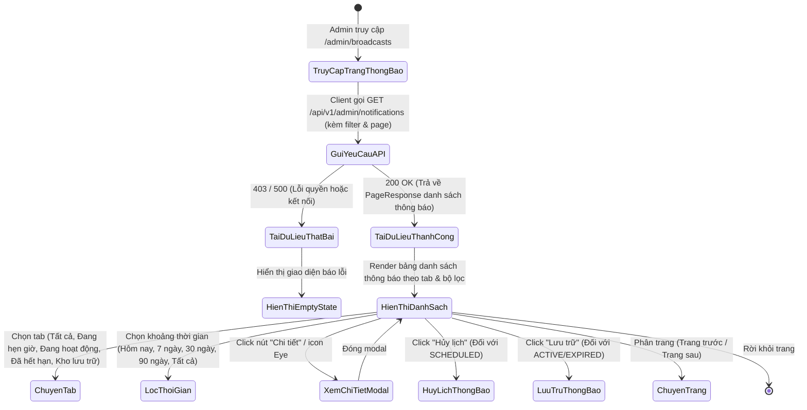
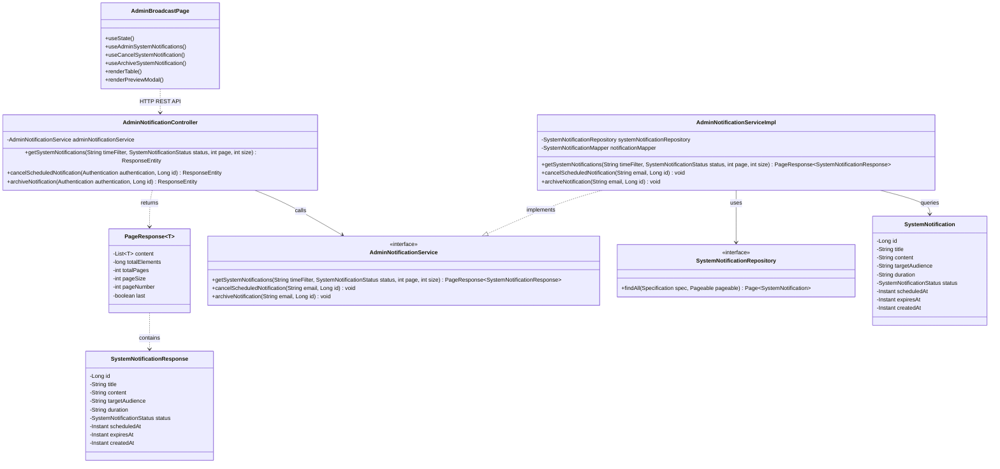
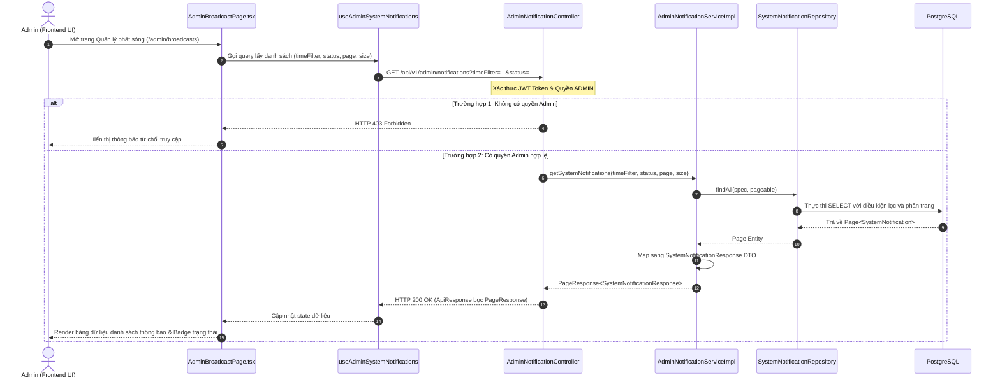

# ĐẶC TẢ YÊU CẦU & THIẾT KẾ CHI TIẾT: UC88 - XEM DANH SÁCH THÔNG BÁO HỆ THỐNG ĐÃ GỬI (ADMIN)

## PHẦN 1: ĐẶC TẢ NGHIỆP VỤ (REPORT 3)

### 2.2.3 Business Workflow (Luồng nghiệp vụ)

#### Mô tả chi tiết luồng xử lý bằng chữ (Business Step Description):
* **Bước 1 - Khởi đầu**: Quản trị viên (Admin) đăng nhập vào hệ thống và truy cập vào phân hệ phát sóng thông báo `/admin/broadcasts`.
* **Bước 2 - Tải dữ liệu danh sách**:
  * Giao diện React hiển thị Skeleton Loading.
  * Hook `useAdminSystemNotifications` gọi API `GET /api/v1/admin/notifications?timeFilter={timeFilter}&status={status}&page={page}&size={size}` kèm Bearer JWT Token.
  * Backend Spring Boot kiểm tra quyền `ADMIN`, thực thi câu lệnh truy vấn JPA Specification lọc theo thời gian và trạng thái, trả về `PageResponse<SystemNotificationResponse>`.
* **Bước 3 - Hiển thị và Tương tác**:
  * Hiển thị bảng danh sách thông báo hệ thống bao gồm: Tiêu đề, Nội dung rút gọn, Đối tượng nhận (Tất cả, Sinh viên, Cựu sinh viên, ...), Thời hạn hiệu lực, Trạng thái (ACTIVE, SCHEDULED, EXPIRED, ARCHIVED, CANCELLED), Thời gian gửi/lên lịch.
  * Hỗ trợ chuyển tab lọc nhanh trạng thái (`SCHEDULED`, `ACTIVE`, `EXPIRED`, `ARCHIVED`).
  * Hỗ trợ lọc theo mốc thời gian (`TODAY`, `7_DAYS`, `30_DAYS`, `90_DAYS`, `ALL`).
  * Xem trước nội dung đầy đủ qua Modal Preview khi click xem chi tiết.
  * Thực hiện thao tác Hủy lịch hẹn giờ gửi (`DELETE /api/v1/admin/notifications/{id}`) hoặc Lưu trữ thông báo (`PUT /api/v1/admin/notifications/{id}/archive`).

---

### 3.2 Quản Lý Thông Báo Hệ Thống

#### 3.2.1 Xem danh sách thông báo hệ thống đã gửi (UC88)

**Function trigger**:
*   **Navigation path**: Sidebar Menu -> Quản trị -> "Phát sóng thông báo" (`/admin/broadcasts`)
*   **Timing Frequency**: On screen mount và mỗi khi Admin thay đổi bộ lọc trạng thái, khoảng thời gian hoặc chuyển trang.

**Function description**:
*   **Actors/Roles**: ADMIN
*   **Purpose**: Cung cấp giao diện trực quan cho Quản trị viên quản lý toàn bộ lịch sử thông báo hệ thống đã phát sóng, đang kích hoạt hoặc đang được hẹn giờ gửi, giúp kiểm soát thông tin truyền thông trên toàn nền tảng Alumnect.
*   **Interface**:
    *   **Header**: Tiêu đề trang "Phát sóng thông báo", mô tả, nút bấm "+ Tạo thông báo mới" (mở Modal UC87).
    *   **Status Tabs**: Các thẻ tab chuyển trạng thái: `Tất cả [All]`, `Đang hẹn giờ [Scheduled]`, `Đang hoạt động [Active]`, `Đã hết hạn [Expired]`, `Kho lưu trữ [Archived]`.
    *   **Time Filter Dropdown**: Lựa chọn khoảng thời gian (Hôm nay, 7 ngày qua, 30 ngày qua, 90 ngày qua, Toàn bộ thời gian).
    *   **Bảng dữ liệu (Data Table)**:
        *   Cột Tiêu đề & Nội dung tóm tắt.
        *   Cột Đối tượng nhận (Target Audience Badge).
        *   Cột Thời hạn hiển thị (Duration).
        *   Cột Thời gian gửi / Lên lịch (Scheduled/Sent Date).
        *   Cột Trạng thái (Badge màu sắc tương ứng: Thành công/Vàng/Đỏ/Xám).
        *   Cột Thao tác: Xem chi tiết (Modal Preview), Hủy lịch (đối với SCHEDULED), Lưu trữ (đối với ACTIVE/EXPIRED).
    *   **Thanh phân trang (Pagination Bar)**: Nút "Trước", "Sau" và hiển thị tổng số bản ghi.
    *   **Preview Modal**: Hiển thị mockup xem trước giao diện thông báo mà người dùng sẽ nhìn thấy.

**Data processing**:
1. Frontend gửi yêu cầu `GET /api/v1/admin/notifications` với các Query Parameters: `timeFilter`, `status`, `page`, `size`.
2. Hệ thống kiểm tra JWT Header, xác thực quyền `ADMIN`.
3. Backend nạp danh sách từ bảng `system_notifications` với điều kiện lọc tương ứng và sắp xếp giảm dần theo thời gian tạo.
4. Trả về đối tượng `ApiResponse<PageResponse<SystemNotificationResponse>>` với mã HTTP 200 OK.
5. Frontend cập nhật state và render danh sách lên bảng.

**Screen layout**:
*   Figure 88.1: Bố cục màn hình quản trị phát sóng thông báo `/admin/broadcasts` với bộ lọc tab ngang và bảng danh sách.
*   Figure 88.2: Modal xem chi tiết nội dung thông báo hệ thống (Notification Preview Modal).

**Function details**:
*   **Data**:
    *   `id` (Long): Mã định danh thông báo.
    *   `title` (String): Tiêu đề thông báo.
    *   `content` (String): Nội dung chi tiết.
    *   `targetAudience` (String): ALL, STUDENTS_ONLY, ALUMNI_ONLY...
    *   `duration` (String): ONE_DAY, ONE_WEEK, ONE_MONTH, FOREVER, CUSTOM...
    *   `status` (String): SCHEDULED, ACTIVE, EXPIRED, ARCHIVED, CANCELLED.
    *   `scheduledAt` (Instant): Thời gian hẹn giờ gửi.
    *   `expiresAt` (Instant): Thời gian hết hạn hiển thị.
    *   `createdAt` (Instant): Thời gian tạo bản ghi.
*   **Validation**:
    *   `page` >= 0, `size` > 0.
    *   `timeFilter` thuộc danh sách hợp lệ: `ALL`, `TODAY`, `7_DAYS`, `30_DAYS`, `90_DAYS`.
*   **Business rules**:
    *   BR-Admin-01: Chỉ tài khoản có vai trò ADMIN mới được phép truy cập và xem lịch sử thông báo hệ thống.
    *   BR-Notif-01: Thông báo ở trạng thái SCHEDULED mới được phép thực hiện thao tác "Hủy lịch".
    *   BR-Notif-02: Thông báo ở trạng thái ACTIVE hoặc EXPIRED mới được phép chuyển vào "Kho lưu trữ" (Archive).
*   **Error Handling**:
    *   403 Forbidden nếu không có quyền Admin.
    *   500 Internal Server Error nếu kết nối cơ sở dữ liệu gián đoạn.
*   **Normal case**: Danh sách thông báo được nạp đầy đủ, hiển thị badge trạng thái chuẩn xác, chuyển tab và phân trang mượt mà.
*   **Abnormal case**: Máy chủ mất kết nối hoặc không có dữ liệu, hiển thị EmptyState thân thiện hướng dẫn tạo thông báo mới.

---

### 5. Requirement Appendix (Phụ lục Yêu cầu)

#### 5.1 Business Rules (Quy tắc Nghiệp vụ)

| ID | Định nghĩa Quy tắc (Rule Definition) |
| :--- | :--- |
| BR-Admin-01 | Chỉ tài khoản có vai trò ADMIN mới được phép truy cập tài nguyên quản trị thông báo. |
| BR-Notif-01 | Thông báo có trạng thái SCHEDULED có thể bị hủy trước khi đến thời điểm phát sóng. |
| BR-Notif-02 | Thông báo ACTIVE/EXPIRED có thể lưu trữ để ẩn khỏi danh sách chính mà không xóa dữ liệu lịch sử. |

#### 5.2 Common Requirements (Yêu cầu Chung)
*   Dữ liệu bảng phân trang chuẩn 10 bản ghi/trang.
*   Thời gian hiển thị theo định dạng chuẩn Việt Nam (`dd/MM/yyyy HH:mm`).
*   Tối ưu hóa tải trang thông qua React Query caching và Skeleton UI.

#### 5.3 Application Messages List (Danh sách Thông điệp Ứng dụng)

| # | Mã thông điệp | Loại thông điệp | Ngữ cảnh | Nội dung hiển thị |
| :--- | :--- | :--- | :--- | :--- |
| 1 | MSG_NOTIF_01 | In line | Không có thông báo nào phù hợp | Chưa có thông báo hệ thống nào trong danh mục này. |
| 2 | MSG_NOTIF_02 | Toast message | Hủy thông báo hẹn giờ thành công | Hủy thông báo hẹn giờ thành công! |
| 3 | MSG_NOTIF_03 | Toast message | Lưu trữ thông báo thành công | Lưu trữ thông báo thành công! |
| 4 | MSG_NOTIF_04 | Toast message | Lỗi tải dữ liệu | Không thể tải danh sách thông báo. Vui lòng thử lại! |

---

## PHẦN 2: THIẾT KẾ CHI TIẾT (REPORT 4)

### 3. Detail Design (Thiết kế chi tiết)

#### 3.1 Xem danh sách thông báo hệ thống đã gửi (UC88)

##### 3.1.1 Class Diagram (Sơ đồ Lớp)

##### 3.1.2 Sequence Diagram (Sơ đồ Tuần tự)

###### Mô tả chi tiết luồng xử lý bằng chữ (Sequence Flow Description):
1. **Gửi yêu cầu**: Admin truy cập giao diện `/admin/broadcasts`, component `AdminBroadcastPage` kích hoạt hook `useAdminSystemNotifications` gửi HTTP GET kèm tham số bộ lọc và token xác thực.
2. **Kiểm tra quyền**: Spring Security xác thực token, đảm bảo người dùng có vai trò `ADMIN`.
3. **Truy vấn dữ liệu**: `AdminNotificationServiceImpl` xây dựng `Specification` truy vấn động theo bộ lọc thời gian và trạng thái, gọi `SystemNotificationRepository` thực thi truy vấn phân trang trên PostgreSQL.
4. **Ánh xạ DTO**: Kết quả Page Entity được chuyển đổi thành danh sách `SystemNotificationResponse` và đóng gói trong `PageResponse`.
5. **Phản hồi & Hiển thị**: Controller trả về `HTTP 200 OK` bọc trong `ApiResponse`. Frontend nhận dữ liệu, tắt hiệu ứng Skeleton và hiển thị danh sách các thông báo trên bảng điều khiển.
