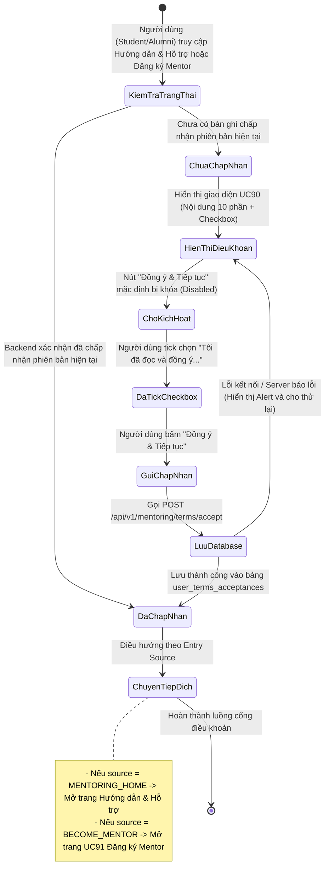
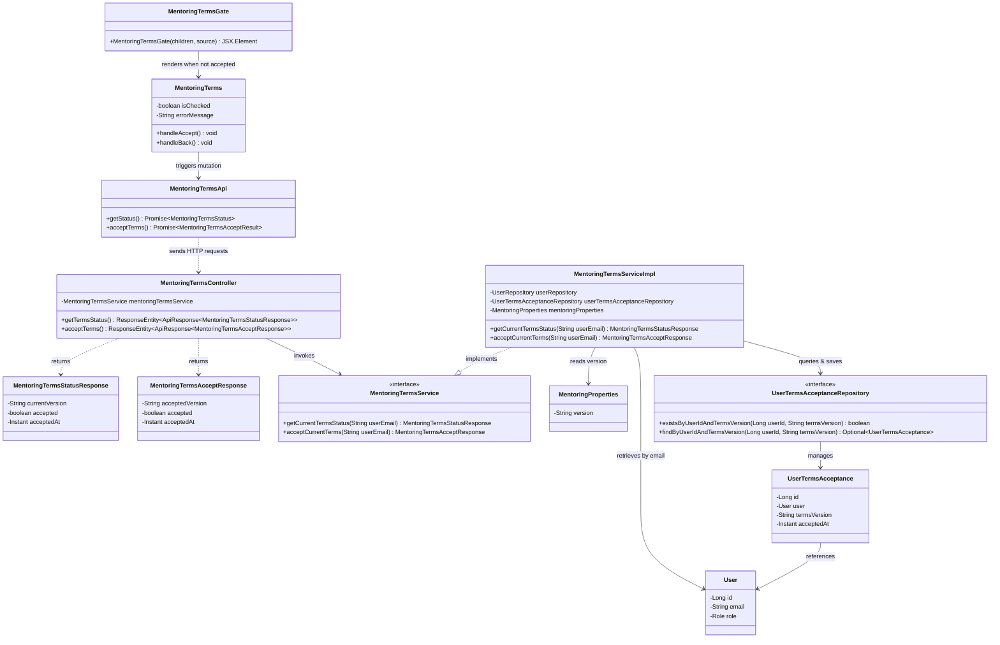
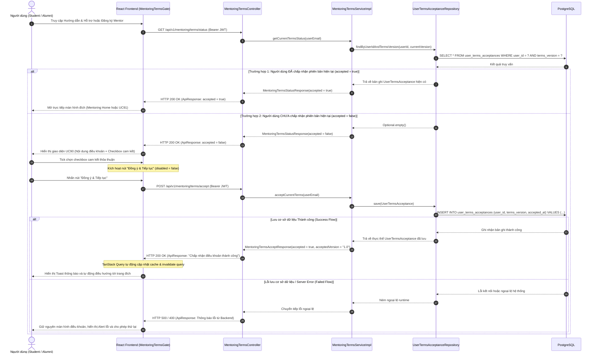

# ĐẶC TẢ YÊU CẦU & THIẾT KẾ CHI TIẾT: UC90 - XEM & CHẤP NHẬN ĐIỀU KHOẢN HƯỚNG DẪN & HỖ TRỢ

---

## PHẦN 1: ĐẶC TẢ NGHIỆP VỤ (REPORT 3)

### 2.2.3 Business Workflow (Luồng nghiệp vụ)

#### Mô tả chi tiết luồng xử lý bằng chữ (Business Step Description):
* **Bước 1 - Khởi đầu (Trigger)**:
  * *Luồng A (Student / Alumni)*: Người dùng nhấn vào menu "Hướng dẫn & Hỗ trợ" trên thanh điều hướng ứng dụng (đường dẫn `/app/mentoring`).
  * *Luồng B (Alumni)*: Cựu sinh viên nhấn vào nút "Trở thành Mentor" (đường dẫn `/app/mentoring/become-mentor`).
* **Bước 2 - Kiểm tra Cổng điều khoản (Terms Gate Check)**:
  * Frontend gọi API `GET /api/v1/mentoring/terms/status` kèm Bearer JWT Token của người dùng.
  * Backend đối chiếu ID người dùng và phiên bản điều khoản hiện tại trong cấu hình hệ thống (`app.mentoring.terms.version`) với bảng `user_terms_acceptances`.
  * **Trường hợp đã chấp nhận (`accepted = true`)**: Người dùng được đi thẳng vào trang đích tương ứng mà không phải xem lại điều khoản.
  * **Trường hợp chưa chấp nhận (`accepted = false`)**: Giao diện cổng điều khoản UC90 được hiển thị.
* **Bước 3 - Xem xét và Chấp thuận (Review & Accept)**:
  * Người dùng đọc 10 phần quy chế và điều khoản hoạt động của module Mentoring.
  * Nút "Đồng ý & Tiếp tục" mặc định ở trạng thái bị vô hiệu hóa (`disabled = true`). Checkbox cam kết mặc định không được chọn (`checked = false`).
  * Người dùng chủ động tick chọn ô checkbox xác nhận đã đọc và hiểu rõ điều khoản. Khi đó nút "Đồng ý & Tiếp tục" chuyển sang kích hoạt (`disabled = false`).
* **Bước 4 - Ghi nhận vào Cơ sở dữ liệu**:
  * Người dùng nhấn nút "Đồng ý & Tiếp tục". Frontend gửi yêu cầu `POST /api/v1/mentoring/terms/accept`.
  * Backend ghi nhận một bản ghi mới gắn liền với tài khoản người dùng và phiên bản hiện tại vào bảng `user_terms_acceptances` (xử lý idempotent đảm bảo không tạo duplicate).
* **Bước 5 - Kết thúc và Điều hướng**:
  * Khi nhận phản hồi thành công từ Backend, hệ thống hiển thị thông báo Toast thành công và tự động điều hướng:
    * Nếu xuất phát từ *MENTORING_HOME*: Mở trang chủ "Hướng dẫn & Hỗ trợ".
    * Nếu xuất phát từ *BECOME_MENTOR*: Mở trang "Đăng ký trở thành Mentor" (UC91).

---

### 3.2 Module Hướng Dẫn & Hỗ Trợ (Mentorship)
Module Hướng dẫn & Hỗ trợ đóng vai trò cầu nối chuyên môn và hướng nghiệp giữa các thế hệ cựu sinh viên (Alumni) và sinh viên (Student) của Đại học FPT. Module tích hợp các tính năng ký kết thỏa thuận (Deal), theo dõi nhật ký thực hiện (Work Log), thanh toán quyết toán minh bạch và giải quyết tranh chấp (Dispute Resolution).

#### 3.2.1 Xem & Chấp nhận Điều khoản Hướng dẫn & Hỗ trợ (UC90)

**Function trigger**:
* **Navigation path**:
  * `/app/mentoring` (Khi người dùng truy cập module Hướng dẫn & Hỗ trợ)
  * `/app/mentoring/become-mentor` (Khi cựu sinh viên chọn đăng ký trở thành Mentor)
  * `/app/mentoring/terms` (Khi người dùng mở trực tiếp trang điều khoản)
* **Timing Frequency**: On screen mount (Kích hoạt kiểm tra tự động mỗi khi người dùng truy cập vào các route được bảo vệ).

**Function description**:
* **Actors/Roles**:
  * `STUDENT` (Sinh viên FPT University)
  * `ALUMNI` (Cựu sinh viên FPT University đã được xác thực)
* **Purpose**: Bảo đảm tính pháp lý, nâng cao ý thức tuân thủ quy tắc ứng xử, cam kết bảo mật và minh bạch trong hoạt động cố vấn trước khi người dùng tham gia vào module Mentorship.
* **Interface**:
  * Tiêu đề: "Điều khoản Hướng dẫn & Hỗ trợ" kèm huy hiệu phiên bản (`Phiên bản 1.0`).
  * Khung cuộn nội dung điều khoản gồm 10 phần quy chuẩn.
  * Hộp chọn cam kết: `[ ] Tôi đã đọc, hiểu rõ và đồng ý với Điều khoản Hướng dẫn & Hỗ trợ...`
  * Nút bấm: `[ Quay lại ]` (Secondary button) và `[ Đồng ý & Tiếp tục ]` (Primary button).
  * Trạng thái Loading: Hiển thị Shimmer Skeleton màu kem ấm chuẩn Pastel Design System.
  * Trạng thái Lỗi: Hiển thị Card cảnh báo màu san hô kèm thông báo từ Backend và nút Thử lại.

**Data processing**:
* Trích xuất thông tin người dùng từ JWT Token trong Security Context.
* Kiểm tra sự tồn tại của bản ghi trong bảng `user_terms_acceptances` với điều kiện `user_id = currentUserId AND terms_version = currentVersion`.
* Ghi nhận chấp nhận với thời gian `accepted_at = now()`.

**Screen layout**:
* Giao diện trung tâm max-w-4xl, sử dụng thẻ pillowy card trắng mềm trên nền kem ấm `#faf4ec`, bo góc `rounded-3xl` và bóng đổ sâu `shadow-soft`.

**Function details**:
* **Data**: `user_id` (BIGINT), `terms_version` (VARCHAR 20), `accepted_at` (TIMESTAMPTZ).
* **Validation**: Checkbox bắt buộc phải checked trước khi gửi yêu cầu. Nút submit bị vô hiệu hóa khi checkbox unchecked hoặc khi đang chờ phản hồi từ server.
* **Business rules**: Tuân thủ nghiêm ngặt 15 quy tắc nghiệp vụ từ BR-UC90-01 đến BR-UC90-15.
* **Error Handling**: Nếu mất kết nối hoặc API phản hồi mã lỗi, giữ nguyên giao diện để người dùng thử lại, tuyệt đối không tự ý cho phép truy cập module.
* **Normal case**: Người dùng tick chọn và gửi thành công, dữ liệu được ghi nhận vào cơ sở dữ liệu và người dùng được điều hướng tới trang đích mong muốn.
* **Abnormal case**:
  * Chưa đăng nhập / Token hết hạn: Spring Security chặn và trả về HTTP 401 Unauthorized, giao diện yêu cầu đăng nhập.
  * Lỗi mạng: Hiển thị thông báo Toast / Banner lỗi và cho phép người dùng bấm Retry.

---

### 5. Requirement Appendix (Phụ lục Yêu cầu)

#### 5.1 Business Rules (Quy tắc Nghiệp vụ)

| ID | Tên quy tắc nghiệp vụ | Định nghĩa quy tắc chi tiết |
| :--- | :--- | :--- |
| **BR-UC90-01** | Bắt buộc đối với Student | Student phải chấp nhận Điều khoản Hướng dẫn & Hỗ trợ trước khi được phép truy cập chức năng trong module Mentoring. |
| **BR-UC90-02** | Bắt buộc đối với Alumni | Alumni phải chấp nhận Điều khoản Hướng dẫn & Hỗ trợ trước khi tiếp tục flow UC91 - Đăng ký trở thành Mentor. |
| **BR-UC90-03** | Dùng chung loại điều khoản | Student và Alumni sử dụng CHUNG một loại Mentoring Terms Acceptance, không tạo phân tách riêng biệt. |
| **BR-UC90-04** | Lưu trữ Database theo User | Dữ liệu chấp nhận điều khoản bắt buộc phải được lưu trữ bền vững vào cơ sở dữ liệu PostgreSQL theo từng tài khoản người dùng (`user_id`). |
| **BR-UC90-05** | Chấp nhận một lần theo phiên bản | Một người dùng chỉ cần thực hiện chấp nhận một lần duy nhất cho cùng một phiên bản điều khoản (`terms_version`). |
| **BR-UC90-06** | Yêu cầu chấp nhận khi đổi phiên bản | Nếu phiên bản điều khoản hiện tại của hệ thống thay đổi (ví dụ: `1.0` sang `2.0`), người dùng bắt buộc phải thực hiện chấp nhận lại phiên bản mới trước khi tiếp tục. |
| **BR-UC90-07** | Trạng thái mặc định ô Checkbox | Hộp kiểm (Checkbox) thỏa thuận cam kết bắt buộc phải ở trạng thái chưa chọn (`unchecked`) khi tải trang. |
| **BR-UC90-08** | Khóa nút Tiếp tục | Nút "Đồng ý & Tiếp tục" chỉ được kích hoạt (enabled) khi người dùng đã chủ động tick chọn ô Checkbox cam kết. |
| **BR-UC90-09** | Không ngầm định chấp thuận | Không được coi việc truy cập trang hoặc bấm nút điều hướng là mặc định chấp nhận điều khoản. |
| **BR-UC90-10** | Hành động chủ động | Việc chấp nhận điều khoản phải là hành động chủ động, có ý thức của người dùng thông qua thao tác tương tác trên giao diện. |
| **BR-UC90-11** | Bền vững qua Đăng xuất | Thao tác Đăng xuất (Logout) không làm mất dữ liệu chấp nhận điều khoản vì thông tin đã được lưu trong cơ sở dữ liệu. |
| **BR-UC90-12** | Đồng bộ đa thiết bị | Người dùng đăng nhập trên trình duyệt hoặc thiết bị khác vẫn được hệ thống nhận biết chính xác trạng thái đã chấp nhận điều khoản. |
| **BR-UC90-13** | Ngăn chặn trùng lặp dữ liệu | Không tạo duplicate bản ghi chấp nhận điều khoản cho cùng một cặp `(user_id, terms_version)` trong cơ sở dữ liệu. |
| **BR-UC90-14** | Không sửa xóa tùy tiện | Bản ghi chấp nhận điều khoản đã lưu trong cơ sở dữ liệu không cho phép người dùng tự ý chỉnh sửa hoặc xóa qua giao diện người dùng. |
| **BR-UC90-15** | Nguồn sự thật Backend | Backend là nguồn dữ liệu chính xác duy nhất để xác định trạng thái chấp nhận điều khoản. Frontend không được sử dụng `localStorage` làm source of truth. |

#### 5.2 Common Requirements (Yêu cầu Chung)
* Giao diện tuân thủ bảng màu Pastel Premium: Canvas `#faf4ec`, bề mặt thẻ trắng mềm `#ffffff`, chữ tiêu đề `#322c3f`, chữ nội dung `#6a6178`.
* Hiệu ứng tải dữ liệu sử dụng Shimmer Skeleton, không sử dụng spinner thô ráp.
* Toàn bộ các API được bảo vệ bằng cơ chế xác thực Bearer JWT Token.

#### 5.3 Application Messages List (Danh sách Thông điệp Ứng dụng)

| # | Mã thông điệp (Message code) | Loại thông điệp (Message Type) | Ngữ cảnh kích hoạt (Context) | Nội dung thông điệp hiển thị (Content) | Mã HTTP |
| :--- | :--- | :--- | :--- | :--- | :--- |
| 1 | `MSG-UC90-01` | ApiResponse | Lấy trạng thái điều khoản thành công | Lấy trạng thái điều khoản thành công | `200 OK` |
| 2 | `MSG-UC90-02` | ApiResponse / Toast | Ghi nhận chấp nhận điều khoản thành công | Chấp nhận điều khoản thành công | `200 OK` |
| 3 | `MSG-UC90-03` | Toast / Banner | Lỗi khi gọi API chấp nhận điều khoản | Chấp nhận điều khoản thất bại. Vui lòng thử lại. | `400 / 500` |
| 4 | `MSG-UC90-04` | Inline Card | Lỗi khi kiểm tra trạng thái điều khoản | Không thể kiểm tra trạng thái điều khoản. Vui lòng thử lại. | `500` |
| 5 | `MSG-UC90-05` | ApiResponse | Chưa đăng nhập hoặc token không hợp lệ | Đầy đủ quyền truy cập / Yêu cầu đăng nhập | `401 Unauthorized` |

---

## PHẦN 2: THIẾT KẾ CHI TIẾT (REPORT 4)

### 3. Detail Design (Thiết kế chi tiết)

#### 3.1 Xem & Chấp nhận Điều khoản Hướng dẫn & Hỗ trợ (UC90)

##### 3.1.1 Class Diagram (Sơ đồ Lớp)

###### Mô tả chi tiết cấu trúc các lớp (Class Design Description):
* **`MentoringTermsController`**: Tiếp nhận và điều phối các yêu cầu HTTP từ Client tại đường dẫn `/api/v1/mentoring/terms`, trích xuất email của người dùng từ `SecurityContextHolder` và trả về đối tượng chuẩn `ResponseEntity<ApiResponse<T>>`.
* **`MentoringTermsStatusResponse` & `MentoringTermsAcceptResponse`**: Các lớp DTO chuyển tải thông tin trạng thái và kết quả chấp thuận điều khoản, bao gồm phiên bản, trạng thái `accepted` và thời điểm chấp thuận `acceptedAt`.
* **`MentoringTermsService` & `MentoringTermsServiceImpl`**: Tầng xử lý nghiệp vụ trung tâm. Quản lý việc đối chiếu phiên bản hiện tại từ `MentoringProperties`, kiểm tra điều kiện bản ghi và thực thi lưu trữ idempotent có kiểm soát tranh chấp đồng thời (`DataIntegrityViolationException`).
* **`MentoringProperties`**: Lớp ánh xạ thuộc tính cấu hình tập trung `app.mentoring.terms.version`, giúp thay đổi phiên bản điều khoản linh hoạt mà không cần sửa mã nguồn.
* **`UserTermsAcceptanceRepository`**: Kế thừa `JpaRepository`, cung cấp các phương thức truy vấn tối ưu dựa trên chỉ mục `(user_id, terms_version)`.
* **`UserTermsAcceptance`**: Thực thể JPA ánh xạ cấu trúc bảng `user_terms_acceptances` với khóa chính tự tăng `BIGINT GENERATED ALWAYS AS IDENTITY` và ràng buộc duy nhất `uq_user_terms_acceptances_user_version`.
* **`MentoringTermsGate` & `MentoringTerms`**: Các component React phía Frontend đóng vai trò chốt chặn điều hướng và kết xuất giao diện điều khoản người dùng theo chuẩn Pastel Design System.

---

##### 3.1.2 Sequence Diagram (Sơ đồ Tuần tự)

###### Mô tả chi tiết luồng xử lý bằng chữ (Sequence Flow Description):
1. **Luồng kiểm tra trạng thái điều khoản (Terms Gate Check Flow)**:
   * Khi người dùng truy cập route tính năng được bảo vệ (`/app/mentoring` hoặc `/app/mentoring/become-mentor`), component `MentoringTermsGate` gửi yêu cầu `GET /api/v1/mentoring/terms/status` lên `MentoringTermsController`.
   * Controller chuyển tiếp email tài khoản xác thực tới `MentoringTermsServiceImpl`. Service đọc phiên bản hiện tại từ `MentoringProperties` và gọi `UserTermsAcceptanceRepository` truy vấn PostgreSQL.
   * Nếu đã có bản ghi chấp nhận phiên bản hiện tại, hệ thống trả về `accepted = true`. Frontend lập tức mở thẳng trang đích mà không hiển thị lại màn hình điều khoản.
   * Nếu chưa có bản ghi chấp nhận, hệ thống trả về `accepted = false`. Frontend hiển thị màn hình UC90.
2. **Luồng chấp nhận điều khoản thành công (Success Acceptance Flow)**:
   * Người dùng đọc nội dung 10 phần và tick vào hộp chọn cam kết, kích hoạt nút "Đồng ý & Tiếp tục".
   * Người dùng nhấn nút, Frontend gửi yêu cầu `POST /api/v1/mentoring/terms/accept`.
   * Controller tiếp nhận và gọi `acceptCurrentTerms` tại Service. Service thực hiện kiểm tra idempotent (nếu đã có thì trả về ngay) và lưu bản ghi mới vào bảng `user_terms_acceptances`.
   * Cơ sở dữ liệu ghi nhận thành công. Service trả về DTO kết quả cho Controller để gửi phản hồi HTTP 200 OK về Frontend.
   * Frontend cập nhật cache TanStack Query, kích hoạt Toast thông báo thành công và điều hướng người dùng tới trang đích phù hợp với `source` kích hoạt.
3. **Luồng ngoại lệ lỗi (Exception / Failure Flow)**:
   * Nếu xảy ra lỗi kết nối cơ sở dữ liệu hoặc lỗi server trong quá trình gửi yêu cầu chấp nhận, `GlobalExceptionHandler` bắt ngoại lệ và trả về mã lỗi HTTP tương ứng cùng thông điệp giải thích từ Backend.
   * Frontend giữ người dùng ở lại giao diện UC90, giữ nguyên trạng thái checkbox đã tick, hiển thị hộp cảnh báo màu san hô với nội dung lỗi từ Backend và cho phép người dùng bấm thử lại.
