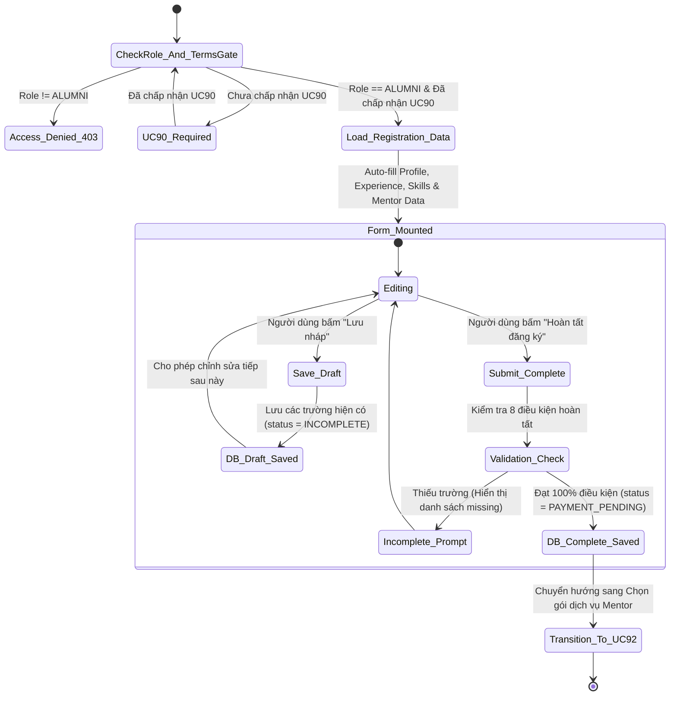
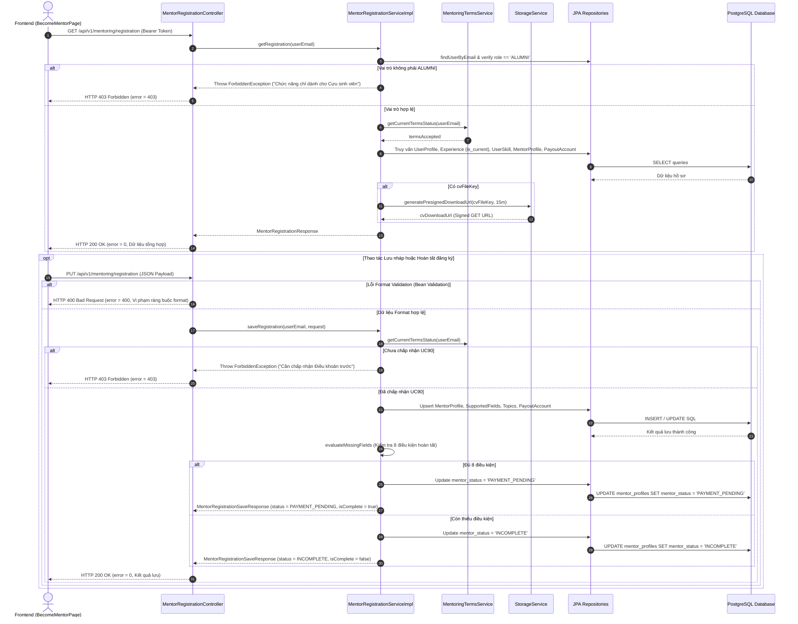

# ĐẶC TẢ YÊU CẦU & THIẾT KẾ CHI TIẾT: UC91 - ĐĂNG KÝ TRỞ THÀNH MENTOR (REGISTER AS MENTOR)

---

## PHẦN 1: ĐẶC TẢ NGHIỆP VỤ (REPORT 3)

### 2.2.3 Business Workflow (Luồng nghiệp vụ)

#### Mô tả chi tiết luồng xử lý bằng chữ (Business Step Description):
* **Bước 1 - Khởi đầu (Trigger & Chốt chặn)**: Cựu sinh viên (Alumni) truy cập vào màn hình `/app/mentoring/become-mentor`. Hệ thống kích hoạt `MentoringTermsGate` để kiểm tra điều kiện tiên quyết: Nếu người dùng chưa chấp nhận phiên bản điều khoản hiện hành tại UC90, hệ thống lập tức hiển thị màn hình chấp nhận điều khoản trước. Nếu người dùng không phải vai trò `ALUMNI` (ví dụ `STUDENT`), hệ thống hiển thị thông báo tính năng chỉ dành riêng cho Cựu sinh viên.
* **Bước 2 - Tải dữ liệu tự động (Auto-fill Data Extraction)**: Sau khi vượt qua chốt chặn, hệ thống gọi `GET /api/v1/mentoring/registration` để trích xuất toàn bộ dữ liệu cá nhân có sẵn từ `user_profiles`, chức danh và công ty hiện tại từ `experiences` (`is_current = true`), danh sách kỹ năng chuyên môn từ `user_skills`, đồng thời tải hồ sơ `mentor_profiles` (nếu có bản nháp trước đó), danh mục ngành nghề từ `industries`, thông tin ngân hàng bảo mật từ `mentor_payout_accounts` và sinh Signed GET URL có thời hạn 15 phút để xem trước CV riêng tư.
* **Bước 3 - Xử lý Lưu nháp (Save Draft)**: Cựu sinh viên có thể điền từng phần thông tin và bấm **"Lưu nháp"**. Hệ thống gửi `PUT /api/v1/mentoring/registration` với payload một phần. Backend thực hiện Bean Validation về format (độ dài, số dương), lưu dữ liệu vào cơ sở dữ liệu với các trường chưa điền mang giá trị `NULL`, giữ nguyên `mentor_status = 'INCOMPLETE'` và trả về danh sách các trường còn thiếu (`missingFields`).
* **Bước 4 - Xử lý Hoàn tất đăng ký (Complete Registration)**: Khi Cựu sinh viên điền đầy đủ 100% thông tin và bấm **"Hoàn tất đăng ký"**, hệ thống kiểm tra 8 điều kiện hoàn tất. Nếu thỏa mãn toàn bộ, Backend cập nhật trạng thái hồ sơ sang `mentor_status = 'PAYMENT_PENDING'`, trả về `isComplete = true` và `nextStep = 'UC92_SELECT_PACKAGE'`.
* **Bước 5 - Kết thúc & Điều hướng**: Frontend hiển thị thông báo thành công và tự động điều hướng Cựu sinh viên sang màn hình **UC92 (Xem & chọn gói Mentor)** để lựa chọn gói đồng hành trước khi thanh toán kích hoạt tại **UC93**.

---

### 3.2 Hướng dẫn & Hỗ trợ (Mentorship)
Module quản lý mạng lưới cố vấn học tập, định hướng nghề nghiệp và kết nối giữa Cựu sinh viên thành đạt và Sinh viên Đại học FPT.

#### 3.2.1 Đăng ký trở thành Mentor (Register as Mentor)

**Function trigger**:
* **Navigation path**: Người dùng click "Trở thành Mentor" từ Navbar, Banner trang chủ Hướng dẫn & Hỗ trợ, hoặc điều hướng trực tiếp tới `/app/mentoring/become-mentor`.
* **Timing Frequency**: Theo nhu cầu của Alumni (On-demand).

**Function description**:
* **Actors/Roles**: Cựu sinh viên (Alumni). Sinh viên (`STUDENT`) hoặc Quản trị viên (`ADMIN`) không có thẩm quyền đăng ký làm Mentor.
* **Purpose**: Cho phép Cựu sinh viên thiết lập hồ sơ cố vấn chuyên biệt, lựa chọn hình thức, loại hình hướng dẫn, ngành nghề hỗ trợ, đính kèm CV năng lực và cung cấp tài khoản thụ hưởng để nhận tiền chia sẻ cố vấn.
* **Interface**:
  * **Phần 1 - Thông tin cá nhân cơ bản**: Thẻ thông tin Read-only trang trọng bao gồm Họ tên, Avatar, Email, Số điện thoại, Chuyên ngành, Năm tốt nghiệp, Cơ sở đào tạo, Mã số sinh viên (kèm liên kết dẫn sang trang chỉnh sửa Profile cá nhân).
  * **Phần 2 - Thông tin chuyên môn & kinh nghiệm**: Hiển thị vị trí & công ty hiện tại (kế thừa từ `experiences`), danh sách kỹ năng chuyên môn (kế thừa từ `user_skills`), ô nhập số năm kinh nghiệm (`yearsOfExperience`) và ô văn bản giới thiệu/định hướng cố vấn (`bio`).
  * **Phần 3 - Thiết lập Hình thức & Lĩnh vực hướng dẫn**: Lựa chọn hình thức (`workingMode`: Trực tuyến, Trực tiếp, Cả hai), lựa chọn loại hình (`mentoringType`: Cá nhân 1-1, Nhóm, Cả hai), danh sách chọn ngành nghề hỗ trợ chuẩn từ danh mục `industries`, ô nhập tag các chủ đề cố vấn chuyên sâu tự do (`mentoringTopics`).
  * **Phần 4 - Đính kèm CV & Tài khoản nhận chi trả**: Khu vực tải tệp CV lên lưu trữ riêng tư R2 (kèm nút xem trước CV an toàn qua Signed GET URL), các ô nhập thông tin ngân hàng (`bankName`, `bankAccountNumber`, `bankAccountHolder`) với nhãn Private cách ly dữ liệu.
  * **Thanh điều phối hành động (Sticky Bar)**: Nút "Lưu nháp" và nút "Hoàn tất đăng ký".

**Data processing**:
1. Frontend gọi `GET /api/v1/mentoring/registration` xác thực Bearer Token.
2. Backend kiểm tra `role == ALUMNI`, kiểm tra trạng thái chấp nhận điều khoản UC90.
3. Backend truy vấn `user_profiles`, `experiences` (current), `user_skills`, `industries`, `mentor_profiles`, `mentor_supported_fields`, `mentor_topics`, `mentor_payout_accounts`.
4. Nếu có `cv_file_key`, Backend sinh `cvDownloadUrl` (Signed GET URL qua S3 Presigner thời hạn 15 phút).
5. Khi người dùng lưu: Frontend gửi `PUT /api/v1/mentoring/registration`. Backend kiểm tra format, upsert vào DB, đánh giá 8 điều kiện hoàn tất để quyết định gán `INCOMPLETE` hay `PAYMENT_PENDING`.

**Function details**:
* **Data**: `yearsOfExperience`, `bio`, `workingMode`, `mentoringType`, `supportedIndustryIds`, `mentoringTopics`, `cvFileKey`, `bankName`, `bankAccountNumber`, `bankAccountHolder`.
* **Validation**:
  * Bean Validation (Format): `yearsOfExperience` $\ge 0$ và $\le 60$, `bio` $\le 2000$ ký tự, `workingMode` thuộc enum hợp lệ, `mentoringType` thuộc enum hợp lệ, `bankAccountNumber` tối đa 50 ký tự, `bankName` tối đa 100 ký tự, `bankAccountHolder` tối đa 150 ký tự viết hoa.
  * Completion Validation (Service): Bắt buộc đủ 8 điều kiện để chuyển trạng thái sang `PAYMENT_PENDING`.
* **Business rules**:
  * Không duplicate `current_position`, `current_company`, `skills` vào `mentor_profiles`.
  * `mentor_supported_fields` liên kết khóa ngoại với `industries.id`.
  * Thông tin ngân hàng nằm trong bảng riêng biệt `mentor_payout_accounts` (1-1) và không hiển thị công khai.
  * Tệp CV lưu trữ riêng tư trên R2, không dùng public URL cố định.
  * UC91 không bao giờ kích hoạt trạng thái `ACTIVE`. Trạng thái `ACTIVE` chỉ xuất hiện tại UC93 sau khi thanh toán gói Mentor qua PayOS.
* **Error Handling**:
  * HTTP 400 Bad Request: Dữ liệu format sai quy chuẩn.
  * HTTP 401 Unauthorized: Chưa đăng nhập hoặc token hết hạn.
  * HTTP 403 Forbidden: Tài khoản không phải ALUMNI hoặc chưa chấp nhận điều khoản UC90.
* **Normal case**: Lưu nháp thành công (`status = INCOMPLETE`) hoặc hoàn tất đăng ký thành công (`status = PAYMENT_PENDING`, điều hướng sang UC92).
* **Abnormal case**: Sinh viên truy cập bị từ chối; người dùng nhập số năm kinh nghiệm âm bị báo lỗi validation.

---

### 5. Requirement Appendix (Phụ lục Yêu cầu)

#### 5.1 Business Rules (Quy tắc Nghiệp vụ)

| ID | Định nghĩa Quy tắc (Rule Definition) |
| :--- | :--- |
| **BR-91-01** | Chỉ người dùng có vai trò `ALUMNI` mới được phép đăng ký trở thành Mentor. Người dùng vai trò `STUDENT` hoặc `ADMIN` bị từ chối với HTTP 403 Forbidden. |
| **BR-91-02** | Người dùng bắt buộc phải chấp nhận phiên bản hiện hành của Điều khoản Hướng dẫn & Hỗ trợ (UC90) trước khi đăng ký hoặc lưu hồ sơ Mentor. |
| **BR-91-03** | Hồ sơ Mentor không lưu trùng lặp chức danh hiện tại, công ty hiện tại và kỹ năng chuyên môn; toàn bộ dữ liệu này được kế thừa trực tiếp từ `experiences` và `user_skills`. |
| **BR-91-04** | Lĩnh vực hướng dẫn hỗ trợ của Mentor bắt buộc phải liên kết với danh mục ngành nghề chuẩn thông qua khóa ngoại `industry_id` trỏ tới bảng `industries`. |
| **BR-91-05** | Các chủ đề hướng dẫn chuyên sâu mang tính tự do của Mentor được lưu trữ tại bảng `mentor_topics`. |
| **BR-91-06** | Thông tin tài khoản ngân hàng thụ hưởng nhận chi trả của Mentor được tách riêng tại bảng `mentor_payout_accounts` quan hệ 1-1 để cô lập dữ liệu riêng tư nhạy cảm. |
| **BR-91-07** | Tệp CV của Mentor là tài liệu riêng tư (Private File), không cấp quyền truy cập công khai và không lưu link công khai cố định. Hệ thống chỉ sinh Signed GET URL có thời hạn (15 phút) khi người có thẩm quyền truy cập. |
| **BR-91-08** | Tính năng Lưu nháp (Save Draft) cho phép người dùng lưu từng phần dữ liệu. Các trường chỉ bắt buộc khi hoàn tất phải mang giá trị `NULL` trong DB nếu người dùng chưa điền; không tự ý gán giá trị mặc định giả tạo cho hình thức hay loại hình hướng dẫn. |
| **BR-91-09** | Việc hoàn tất hồ sơ tại UC91 chỉ chuyển trạng thái hồ sơ sang `PAYMENT_PENDING`. Trạng thái `ACTIVE` chỉ được kích hoạt tại UC93 sau khi thanh toán gói dịch vụ thành công qua PayOS. |
| **BR-91-10** | Quá trình xét duyệt hoàn tất đăng ký diễn ra tự động thông qua việc thỏa mãn bộ 8 điều kiện nghiệp vụ; không yêu cầu Admin phê duyệt thủ công. |

#### 5.2 Common Requirements (Yêu cầu Chung)
* Định dạng phản hồi API tuân thủ cấu trúc chuẩn của hệ thống: `{ "error": 0, "message": "...", "data": {...} }`.
* Mã hóa đầu cuối toàn bộ dữ liệu truyền tải thông qua giao thức bảo mật HTTPS/TLS.
* Che giấu một phần số tài khoản ngân hàng khi ghi nhật ký hệ thống (Masked Logging).
* Tệp CV hỗ trợ các định dạng PDF, DOC, DOCX.

#### 5.3 Application Messages List (Danh sách Thông điệp Ứng dụng)

| # | Mã thông điệp | Loại | Ngữ cảnh | Nội dung hiển thị |
| :--- | :--- | :--- | :--- | :--- |
| 1 | MSG-91-01 | Inline Alert | Sinh viên truy cập trang đăng ký | Dành riêng cho Cựu sinh viên (ALUMNI). Bạn có thể tham gia với vai trò Student để tìm kiếm người hướng dẫn. |
| 2 | MSG-91-02 | Toast Success | Gọi PUT lưu nháp thành công | Đã lưu nháp hồ sơ thành công! |
| 3 | MSG-91-03 | Toast Success | Gọi PUT hoàn tất đăng ký thành công | Chúc mừng! Bạn đã hoàn tất hồ sơ đăng ký Mentor. |
| 4 | MSG-91-04 | Toast Error | Vi phạm format validation (ví dụ năm kinh nghiệm âm) | Số năm kinh nghiệm không được âm |
| 5 | MSG-91-05 | Toast Error | Chưa chấp nhận điều khoản UC90 khi gọi lưu | Bạn cần chấp nhận Điều khoản Hướng dẫn & Hỗ trợ trước khi đăng ký |
| 6 | MSG-91-06 | Toast Error | Bấm hoàn tất nhưng còn thiếu trường bắt buộc | Bạn cần điền đủ các trường thông tin bắt buộc trước khi hoàn tất đăng ký |
| 7 | MSG-91-07 | Toast Success | Tải CV lên kho lưu trữ R2 thành công | Tải tệp CV lên hệ thống thành công! |
| 8 | MSG-91-08 | Toast Error | Tải tệp CV thất bại | Tải CV lên kho lưu trữ thất bại. Vui lòng thử lại. |

---

## PHẦN 2: THIẾT KẾ CHI TIẾT (REPORT 4)

### 3. Detail Design (Thiết kế chi tiết)

#### 3.1 Đăng ký trở thành Mentor (UC91)

##### 3.1.1 Class Diagram (Sơ đồ Lớp)

```mermaid
classDiagram
    %% Controller Layer
    class MentorRegistrationController {
        -MentorRegistrationService mentorRegistrationService
        +getRegistration() ResponseEntity~ApiResponse~MentorRegistrationResponse~~
        +saveRegistration(MentorRegistrationRequest) ResponseEntity~ApiResponse~MentorRegistrationSaveResponse~~
    }

    %% DTO Layer
    class MentorRegistrationRequest {
        +Integer yearsOfExperience
        +String bio
        +MentoringWorkingMode workingMode
        +MentoringType mentoringType
        +List~Long~ supportedIndustryIds
        +List~String~ mentoringTopics
        +String cvFileKey
        +String bankName
        +String bankAccountNumber
        +String bankAccountHolder
    }

    class MentorRegistrationResponse {
        +boolean hasExistingRegistration
        +MentorStatus mentorStatus
        +boolean isComplete
        +PersonalInfo personalInfo
        +ProfessionalInfo professionalInfo
        +MentoringInfo mentoringInfo
        +CvInfo cvInfo
        +PayoutAccountInfo payoutAccount
        +boolean termsAccepted
        +List~String~ missingFields
    }

    class MentorRegistrationSaveResponse {
        +Long mentorProfileId
        +MentorStatus mentorStatus
        +boolean isComplete
        +String nextStep
        +List~String~ missingFields
    }

    %% Service Layer
    class MentorRegistrationService {
        <<interface>>
        +getRegistration(String userEmail) MentorRegistrationResponse
        +saveRegistration(String userEmail, MentorRegistrationRequest request) MentorRegistrationSaveResponse
    }

    class MentorRegistrationServiceImpl {
        -UserRepository userRepository
        -UserProfileRepository userProfileRepository
        -ExperienceRepository experienceRepository
        -UserSkillRepository userSkillRepository
        -IndustryRepository industryRepository
        -MentorProfileRepository mentorProfileRepository
        -MentorSupportedFieldRepository mentorSupportedFieldRepository
        -MentorTopicRepository mentorTopicRepository
        -MentorPayoutAccountRepository mentorPayoutAccountRepository
        -MentoringTermsService mentoringTermsService
        -StorageService storageService
        +getRegistration(String userEmail) MentorRegistrationResponse
        +saveRegistration(String userEmail, MentorRegistrationRequest request) MentorRegistrationSaveResponse
    }

    %% Entities
    class MentorProfile {
        +Long id
        +User user
        +Integer yearsOfExperience
        +String bio
        +MentoringWorkingMode workingMode
        +MentoringType mentoringType
        +String cvFileKey
        +MentorStatus mentorStatus
        +Instant createdAt
        +Instant updatedAt
    }

    class MentorSupportedField {
        +Long id
        +MentorProfile mentorProfile
        +Industry industry
        +Instant createdAt
    }

    class MentorTopic {
        +Long id
        +MentorProfile mentorProfile
        +String topicName
        +Instant createdAt
    }

    class MentorPayoutAccount {
        +Long mentorProfileId
        +MentorProfile mentorProfile
        +String bankName
        +String bankAccountNumber
        +String bankAccountHolder
        +Instant createdAt
        +Instant updatedAt
    }

    MentorRegistrationController ..> MentorRegistrationRequest : validates & uses
    MentorRegistrationController ..> MentorRegistrationResponse : returns
    MentorRegistrationController ..> MentorRegistrationSaveResponse : returns
    MentorRegistrationController ..> MentorRegistrationService : calls
    MentorRegistrationServiceImpl ..|> MentorRegistrationService : implements
    MentorRegistrationServiceImpl --> MentorProfile : manages
    MentorRegistrationServiceImpl --> MentorSupportedField : manages
    MentorRegistrationServiceImpl --> MentorTopic : manages
    MentorRegistrationServiceImpl --> MentorPayoutAccount : manages
```

###### Mô tả chi tiết cấu trúc các lớp (Class Design Description):
* **Lớp Controller (`MentorRegistrationController`)**: Tiếp nhận các yêu cầu HTTP `GET` và `PUT` tại relative path `/mentoring/registration`, kiểm tra tính hợp lệ dữ liệu bằng Bean Validation (`@Valid`) và trả về chuẩn `ResponseEntity<ApiResponse<T>>`.
* **Lớp DTO (`MentorRegistrationRequest`, `MentorRegistrationResponse`, `MentorRegistrationSaveResponse`)**: Định nghĩa hợp đồng dữ liệu giữa Client và Server. DTO Request chỉ áp dụng format validation, không gắn `@NotNull` để đảm bảo tính năng Lưu nháp hoạt động bình thường.
* **Lớp Service (`MentorRegistrationService` & `MentorRegistrationServiceImpl`)**: Chịu trách nhiệm thực thi toàn bộ logic nghiệp vụ: xác thực vai trò ALUMNI, kiểm tra điều khoản UC90, tái sử dụng dữ liệu từ UserProfile, Experience, UserSkill, quản lý vòng đời hồ sơ Mentor, kiểm tra bộ 8 điều kiện hoàn tất và cô lập dữ liệu tài khoản ngân hàng.
* **Lớp Repositories & Entities**:
  * `MentorProfile`: Ánh xạ bảng `mentor_profiles` (chỉ chứa dữ liệu mentor-specific).
  * `MentorSupportedField`: Ánh xạ bảng `mentor_supported_fields` (khóa ngoại trỏ tới `industries`).
  * `MentorTopic`: Ánh xạ bảng `mentor_topics` (danh mục chủ đề cố vấn tự do).
  * `MentorPayoutAccount`: Ánh xạ bảng `mentor_payout_accounts` (dữ liệu ngân hàng riêng tư quan hệ 1-1).

---

##### 3.1.2 Sequence Diagram (Sơ đồ Tuần tự)

###### Mô tả chi tiết luồng xử lý bằng chữ (Sequence Flow Description):
1. **Luồng tải dữ liệu khởi tạo (Get Registration)**:
   * Client gửi request `GET /api/v1/mentoring/registration` kèm Bearer JWT.
   * Controller chuyển tiếp tới Service. Service kiểm tra vai trò `ALUMNI`. Nếu không phải, ném `ForbiddenException` và trả về `HTTP 403`.
   * Nếu hợp lệ, Service truy xuất thông tin từ các thực thể cá nhân, hồ sơ kinh nghiệm và hồ sơ Mentor. Nếu có CV, hệ thống sinh Signed GET URL có thời hạn 15 phút.
   * Service đánh giá các trường còn thiếu và trả về cho Controller đóng gói vào `ApiResponse` gửi về Client `HTTP 200 OK`.
2. **Luồng Lưu nháp (Save Draft)**:
   * Client gửi `PUT /api/v1/mentoring/registration` với thông tin một phần.
   * Bean Validation kiểm tra các ràng buộc kiểu dữ liệu và độ dài. Nếu hợp lệ, Service upsert dữ liệu vào DB, xác nhận chưa đủ 8 điều kiện hoàn tất, gán `mentor_status = 'INCOMPLETE'`, `isComplete = false`, và trả về `HTTP 200 OK`.
3. **Luồng Hoàn tất đăng ký (Complete Registration)**:
   * Client gửi `PUT /api/v1/mentoring/registration` với đầy đủ thông tin.
   * Service đánh giá 8 điều kiện hoàn tất đều thỏa mãn, cập nhật `mentor_status = 'PAYMENT_PENDING'`, `isComplete = true`, `nextStep = 'UC92_SELECT_PACKAGE'` và trả về `HTTP 200 OK` để Client điều hướng sang UC92.
