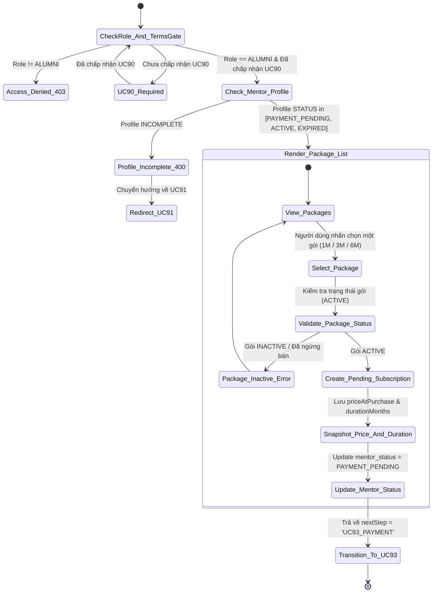
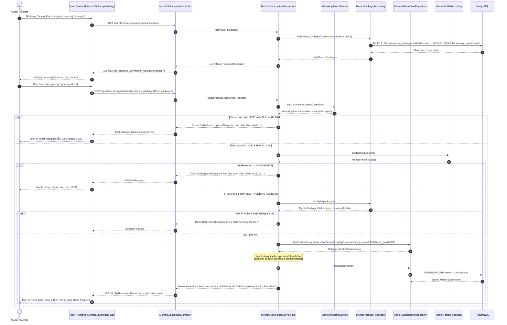

# ĐẶC TẢ YÊU CẦU & THIẾT KẾ CHI TIẾT: UC92 - XEM & CHỌN GÓI MENTOR (SELECT MENTOR PACKAGE)

---

## PHẦN 1: ĐẶC TẢ NGHIỆP VỤ (REPORT 3)

### 2.2.3 Business Workflow (Luồng nghiệp vụ)

#### Mô tả chi tiết luồng xử lý bằng chữ (Business Step Description):
* **Bước 1 - Khởi đầu (Trigger & Chốt chặn)**: Alumni truy cập vào đường dẫn `/app/mentoring/packages` hoặc `/app/mentoring/subscription`. Hệ thống kích hoạt `MentoringTermsGate`: Kiểm tra vai trò `ALUMNI` và cờ đã chấp nhận điều khoản UC90.
* **Bước 2 - Kiểm tra hồ sơ Mentor (Profile Precondition Check)**: Hệ thống gọi API `GET /api/v1/mentoring/subscriptions/packages` để tải các gói đang mở bán và gọi `GET /api/v1/mentoring/subscriptions/my-subscription` để kiểm tra hồ sơ Mentor hiện tại. Nếu chưa hoàn thiện thông tin UC91 (`mentor_status = 'INCOMPLETE'`), hệ thống hiển thị thông báo yêu cầu hoàn thiện UC91 trước khi chọn gói.
* **Bước 3 - Hiển thị & Lựa chọn gói (Package Selection)**: Hệ thống hiển thị các gói dịch vụ active (1 tháng, 3 tháng, 6 tháng) do Admin cấu hình kèm theo giá tiền, thời hạn và các quyền lợi. Alumni bấm "Lựa chọn gói này".
* **Bước 4 - Tạo bản ghi chờ thanh toán (Pending Subscription Generation)**: Frontend gửi `POST /api/v1/mentoring/subscriptions/select-package` với `packageId`. Backend kiểm tra gói có trạng thái `ACTIVE`. Nếu đúng, Backend khởi tạo/cập nhật bản ghi `mentor_subscriptions` với trạng thái `PENDING_PAYMENT`, snapshot lại `price_at_purchase` và `duration_months` tại thời điểm tạo giao dịch.
* **Bước 5 - Cập nhật trạng thái & Chuyển hướng**: Backend cập nhật trạng thái hồ sơ `mentor_profiles` sang `PAYMENT_PENDING` (nếu chưa ACTIVE) và trả về `nextStep = 'UC93_PAYMENT'`. Frontend chuyển hướng Alumni sang màn hình thanh toán tại UC93.

---

### 3.2 Hướng dẫn & Hỗ trợ (Mentorship)

#### 3.2.2 Xem & Chọn gói Mentor (Select Mentor Package)

**Function trigger**:
* **Navigation path**: Alumni bấm nút "Hoàn tất đăng ký" từ UC91 hoặc điều hướng tới `/app/mentoring/packages` / `/app/mentoring/subscription`.
* **Timing Frequency**: Khi Alumni hoàn thành UC91 hoặc cần gia hạn gói Mentor.

**Function description**:
* **Actors/Roles**: Alumni / Mentor.
* **Purpose**: Cho phép Alumni/Mentor xem thông tin chi tiết các gói dịch vụ cố vấn do Admin cấu hình và lựa chọn một gói để tạo giao dịch chờ thanh toán cho UC93.
* **Interface**:
  * **Danh sách các gói dịch vụ (Grid Layout)**: Các thẻ trắng mềm (`MentorSubscriptionCard`) thể hiện tên gói, mã gói, thời hạn (1, 3, 6 tháng), giá niêm yết (VND), chi phí trung bình hàng tháng, mô tả quyền lợi, huy hiệu "Được khuyên dùng nhiều nhất" cho gói 3 tháng, và nút "Lựa chọn gói này".
  * **Thẻ trạng thái gói hiện tại (Current Subscription Banner)**: Hiển thị nếu người dùng đã có gói chờ thanh toán hoặc gói đang hoạt động.

**Data processing**:
1. Frontend gọi `GET /api/v1/mentoring/subscriptions/packages`.
2. Backend truy vấn `mentor_packages` lọc các bản ghi có `status = 'ACTIVE'` sắp xếp theo `duration_months ASC`.
3. Khi Alumni chọn gói, Frontend gửi `POST /api/v1/mentoring/subscriptions/select-package` bọc `packageId`.
4. Backend kiểm tra vai trò `ALUMNI`, kiểm tra UC90, kiểm tra `mentor_profiles.status != 'INCOMPLETE'`, kiểm tra gói dịch vụ `status == 'ACTIVE'`.
5. Backend upsert bản ghi `mentor_subscriptions` ở trạng thái `PENDING_PAYMENT`, chụp snapshot giá `price_at_purchase`, gán `mentor_status = 'PAYMENT_PENDING'`.

**Function details**:
* **Data**: `package_id`, `duration_months`, `price_at_purchase`, `status`.
* **Validation**:
  * Request DTO: `@NotNull(message = "Mã gói dịch vụ không được để trống") packageId`.
  * Business Rules: Gói được chọn phải có trạng thái `ACTIVE`. Hồ sơ Mentor không được ở trạng thái `INCOMPLETE`.
* **Business rules**:
  * Thời hạn gói do Admin cấu hình (1 tháng, 3 tháng, 6 tháng).
  * Giá gói do Admin cấu hình, chụp lại snapshot giá tại thời điểm giao dịch (`price_at_purchase`) để tránh ảnh hưởng khi Admin thay đổi giá sau này.
  * Nếu người dùng đổi chọn gói khác khi đang chờ thanh toán, hệ thống cập nhật gói mới vào bản ghi `PENDING_PAYMENT` hiện có thay vì tạo rác bản ghi.
* **Error Handling**:
  * HTTP 400 Bad Request: Gói không tồn tại/đã ngừng bán hoặc hồ sơ Mentor chưa hoàn thiện.
  * HTTP 403 Forbidden: Người dùng không phải ALUMNI hoặc chưa chấp nhận điều khoản UC90.
* **Normal case**: Tạo thành công bản ghi đăng ký gói chờ thanh toán, trả về `nextStep = 'UC93_PAYMENT'`.
* **Abnormal case**: Chọn gói đã bị vô hiệu hóa (`INACTIVE`) bị từ chối với thông báo lỗi rõ ràng.

---

### 4. Business Rules (Quy tắc Nghiệp vụ)

| ID | Định nghĩa Quy tắc (Rule Definition) |
| :--- | :--- |
| **BR-92-01** | Chỉ người dùng có vai trò `ALUMNI` đã chấp nhận Điều khoản UC90 và có hồ sơ Mentor không bị `INCOMPLETE` mới được chọn gói Mentor. |
| **BR-92-02** | Giá gói dịch vụ được snapshot trực tiếp tại thời điểm chọn gói (`price_at_purchase`), đảm bảo không bị ảnh hưởng nếu Admin chỉnh sửa giá gói niêm yết sau đó. |
| **BR-92-03** | Gói dịch vụ ở trạng thái `INACTIVE` bị chặn không cho phép lựa chọn. |

---

### 5. Application Messages List (Thông điệp Phản hồi)

| Mã MSG | Trường dữ liệu | Thông điệp Tiếng Việt | Mã HTTP Status |
| :--- | :--- | :--- | :--- |
| **MSG-92-01** | `packageId` | Mã gói dịch vụ không được để trống | 400 Bad Request |
| **MSG-92-02** | N/A | Gói dịch vụ không tồn tại hoặc đã ngưng hoạt động. | 400 Bad Request |
| **MSG-92-03** | N/A | Bạn cần hoàn thiện thông tin đăng ký Mentor (UC91) trước khi chọn gói dịch vụ. | 400 Bad Request |
| **MSG-92-04** | N/A | Bạn phải chấp nhận Điều khoản Hướng dẫn & Hỗ trợ trước khi chọn gói Mentor. | 403 Forbidden |
| **MSG-92-05** | N/A | Chức năng chọn gói Mentor chỉ dành riêng cho Cựu sinh viên. | 403 Forbidden |
| **MSG-92-06** | N/A | Lựa chọn gói Mentor thành công. Thông tin thanh toán đã sẵn sàng. | 200 OK |

---

## PHẦN 2: THIẾT KẾ CHI TIẾT (REPORT 4)

### 6. Class Diagram (Sơ đồ Lớp)

```mermaid
classDiagram
    class MentorSubscriptionController {
        +getActivePackages() ResponseEntity~ApiResponse~List~MentorPackageResponse~~~
        +selectPackage(SelectMentorPackageRequest) ResponseEntity~ApiResponse~MentorSubscriptionResponse~~
        +getMySubscription() ResponseEntity~ApiResponse~MentorSubscriptionResponse~~
    }

    class MentorSubscriptionService {
        <<interface>>
        +getActivePackages() List~MentorPackageResponse~
        +selectPackage(userEmail, SelectMentorPackageRequest) MentorSubscriptionResponse
        +getMySubscription(userEmail) MentorSubscriptionResponse
    }

    class MentorSubscriptionServiceImpl {
        -UserRepository userRepository
        -MentorProfileRepository mentorProfileRepository
        -MentorPackageRepository mentorPackageRepository
        -MentorSubscriptionRepository mentorSubscriptionRepository
        -MentoringTermsService mentoringTermsService
        -MentorPackageMapper mentorPackageMapper
        -MentorSubscriptionMapper mentorSubscriptionMapper
        +getActivePackages() List~MentorPackageResponse~
        +selectPackage(userEmail, SelectMentorPackageRequest) MentorSubscriptionResponse
        +getMySubscription(userEmail) MentorSubscriptionResponse
    }

    class MentorPackage {
        -Long id
        -String code
        -String name
        -String description
        -Integer durationMonths
        -BigDecimal price
        -MentorPackageStatus status
        -Instant createdAt
        -Instant updatedAt
    }

    class MentorSubscription {
        -Long id
        -MentorProfile mentorProfile
        -MentorPackage mentorPackage
        -BigDecimal priceAtPurchase
        -Integer durationMonths
        -MentorSubscriptionStatus status
        -Instant startDate
        -Instant endDate
        -Instant createdAt
        -Instant updatedAt
    }

    class MentorPackageRepository {
        <<interface>>
        +findByStatusOrderByDurationMonthsAsc(status) List~MentorPackage~
        +findByCode(code) Optional~MentorPackage~
    }

    class MentorSubscriptionRepository {
        <<interface>>
        +findFirstByMentorProfileIdAndStatusOrderByCreatedAtDesc(profileId, status) Optional~MentorSubscription~
        +findFirstByMentorProfileIdOrderByCreatedAtDesc(profileId) Optional~MentorSubscription~
    }

    MentorSubscriptionController --> MentorSubscriptionService
    MentorSubscriptionServiceImpl ..|> MentorSubscriptionService
    MentorSubscriptionServiceImpl --> MentorPackageRepository
    MentorSubscriptionServiceImpl --> MentorSubscriptionRepository
    MentorSubscription --> MentorPackage
    MentorSubscription --> MentorProfile
```

---

### 7. Sequence Diagram (Sơ đồ Tuần tự Gộp)

