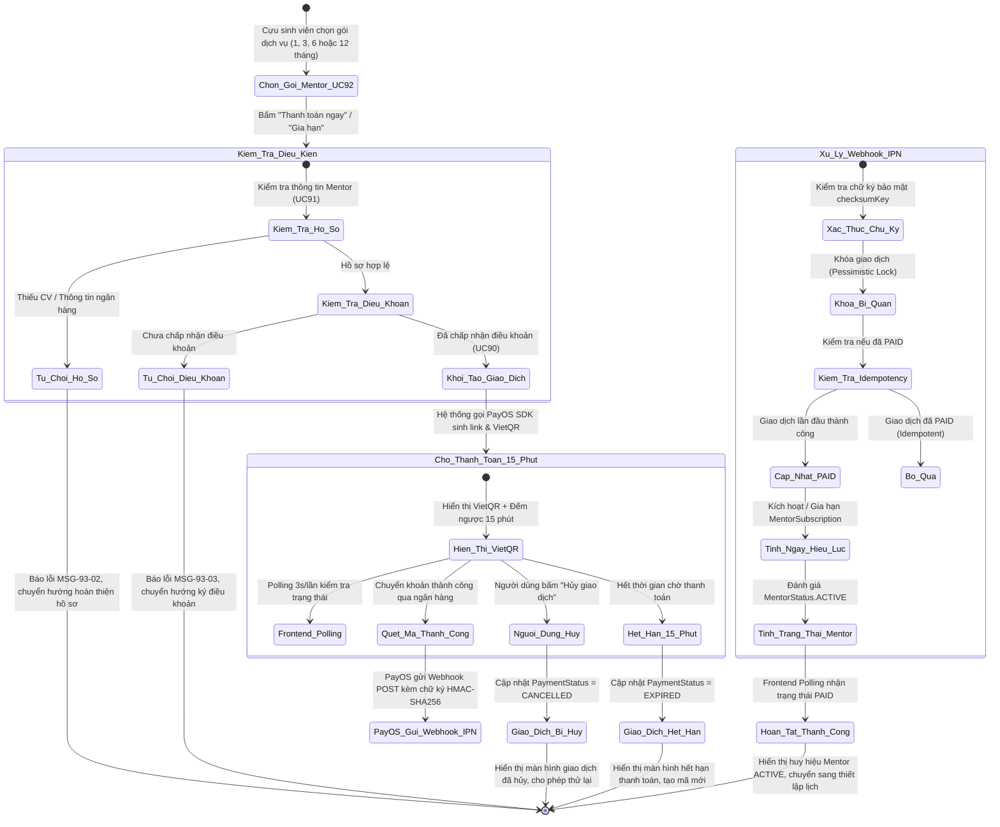
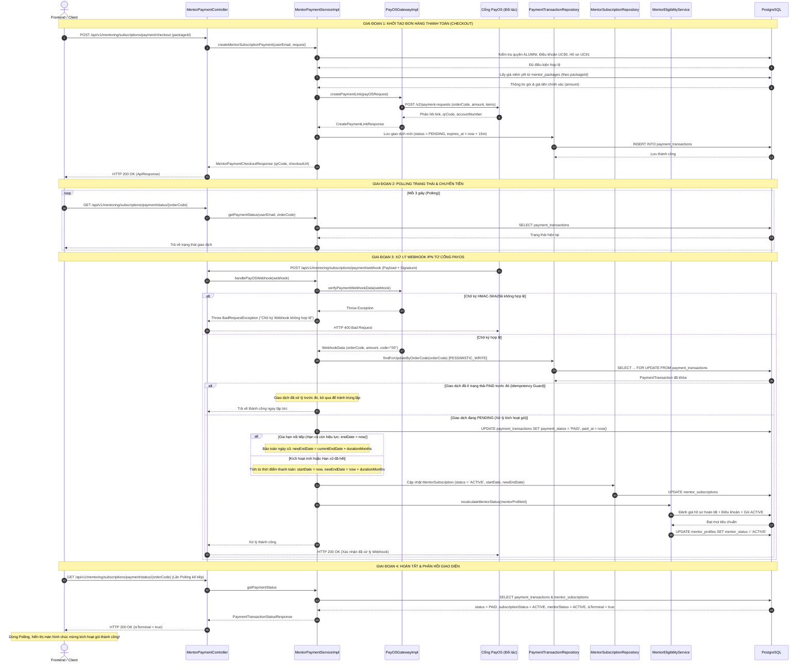

# ĐẶC TẢ YÊU CẦU & THIẾT KẾ CHI TIẾT: UC93 - THANH TOÁN GÓI MENTOR (PAYOS GATEWAY)

---

## PHẦN 1: ĐẶC TẢ NGHIỆP VỤ (REPORT 3)

### 2.2.3 Business Workflow (Luồng nghiệp vụ)

#### Mô tả chi tiết luồng xử lý bằng chữ (Business Step Description):
* **Bước 1 - Khởi đầu**: Cựu sinh viên (Alumni) đã hoàn tất hồ sơ Mentor (UC91) và chấp nhận điều khoản Mentorship (UC90) tiến hành lựa chọn một gói dịch vụ hướng nghiệp (UC92) và nhấn "Thanh toán ngay" hoặc "Gia hạn gói".
* **Bước 2 - Các bước chuyển tiếp**:
  1. *Kiểm tra tiền điều kiện*: Hệ thống kiểm tra vai trò `ALUMNI`, trạng thái hồ sơ mentor không phải `INCOMPLETE`, điều khoản đã được chấp thuận, và gói dịch vụ đang hoạt động (`ACTIVE`).
  2. *Khởi tạo giao dịch PayOS*: Hệ thống truy xuất giá niêm yết từ database `mentor_packages` (tuyệt đối không nhận amount từ client), sinh mã đơn hàng `orderCode` duy nhất 53-bit, gọi PayOS SDK 2.0.1 tạo Payment Link có thời hạn 15 phút, và lưu bản ghi `payment_transactions` với trạng thái `PENDING`.
  3. *Hiển thị và Polling*: Frontend hiển thị mã VietQR động cùng thông tin chuyển khoản chính xác, bắt đầu Polling 3 giây/lần.
  4. *Khách hàng thanh toán*: Khách hàng mở ứng dụng ngân hàng di động bất kỳ quét mã VietQR và xác nhận chuyển tiền.
  5. *Tiếp nhận Webhook IPN*: Cổng PayOS gửi Webhook POST đến máy chủ backend. Hệ thống xác thực chữ ký HMAC-SHA256, khóa bi quan bản ghi giao dịch, áp dụng nguyên tắc Idempotency (bỏ qua nếu đã xử lý), cập nhật giao dịch sang `PAID`, gán mã tham chiếu giao dịch ngân hàng.
  6. *Gia hạn / Kích hoạt bản quyền*: Nếu subscription cũ đang còn hạn, ngày hết hạn mới được cộng dồn nối tiếp từ ngày hết hạn cũ (`newEndDate = currentEndDate + durationMonths`). Nếu là gói mới hoặc đã hết hạn, tính từ thời điểm thanh toán (`paidAt`).
  7. *Tái tính toán trạng thái Mentor*: Gọi dịch vụ `MentorEligibilityService` để chuyển `mentor_profiles.mentor_status` sang `ACTIVE`.
* **Bước 3 - Kết thúc**: Frontend nhận kết quả `PAID` từ chu kỳ polling, tự động ngưng polling, chuyển sang màn hình chúc mừng, cập nhật cache tài khoản và cho phép Mentor thiết lập lịch hướng nghiệp.

---

### 3.2 Quản Lý Hướng Nghiệp (Mentorship Management)
Module Quản lý Hướng nghiệp cung cấp các tính năng hỗ trợ Cựu sinh viên đăng ký làm Mentor, chọn gói dịch vụ hướng nghiệp, kích hoạt bản quyền hướng dẫn sinh viên và thiết lập lịch hẹn cố vấn 1-1.

#### 3.2.1 Thanh toán gói dịch vụ Mentor qua cổng PayOS (UC93)

**Function trigger**:
* **Navigation path**: `/app/mentoring/subscription?step=checkout&packageId={packageId}`
* **Timing Frequency**: Theo nhu cầu người dùng (On-demand) khi đăng ký mới gói Mentor hoặc khi gia hạn gói đã/sắp hết hạn.

**Function description**:
* **Actors/Roles**: Cựu sinh viên (ALUMNI) đã đăng nhập hệ thống.
* **Purpose**: Cung cấp giải pháp thanh toán tự động, tức thì không dùng tiền mặt qua cổng PayOS (VietQR NAPAS 24/7) để kích hoạt quyền hoạt động Mentor trên nền tảng AlumNect.
* **Interface**:
  * **Input Fields**: Lựa chọn gói `packageId` (truyền qua URL query parameter hoặc nút bấm chọn gói).
  * **Buttons**:
    * "Sao chép số tài khoản", "Sao chép số tiền", "Sao chép nội dung".
    * "Mở trang PayOS Checkout" (mở cổng thanh toán PayOS trên tab mới).
    * "Hủy giao dịch" (hủy đơn thanh toán đang chờ).
    * "Thử lại thanh toán" (khi đơn hết hạn hoặc bị hủy).
    * "Thiết lập Lịch hướng nghiệp" (khi thanh toán thành công).
  * **States**:
    * `Loading`: Hiển thị Skeleton loading khi đang gọi API khởi tạo đơn hàng PayOS.
    * `Pending`: Hiển thị thẻ VietQR kèm đồng hồ đếm ngược 15 phút và chỉ báo trạng thái "Đang chờ thanh toán...".
    * `Success`: Hiển thị huy hiệu Mentor ACTIVE, thời hạn gói mới và pháo hoa chúc mừng.
    * `Expired / Cancelled / Failed`: Hiển thị thông báo trạng thái kèm nút tạo mới đơn hàng.

**Data processing**:
1. Nhận yêu cầu khởi tạo checkout từ Frontend, xác thực Token JWT và vai trò `ALUMNI`.
2. Kiểm tra điều kiện: Hồ sơ Mentor hợp lệ, đã ký điều khoản UC90, gói dịch vụ tồn tại và đang `ACTIVE`.
3. Kiểm tra nếu đã có đơn `PENDING` chưa hết hạn cho gói này thì tái sử dụng, tránh sinh đơn rác; nếu khác gói thì hủy đơn cũ trên PayOS và tạo đơn mới.
4. Lấy giá tiền trực tiếp từ bảng `mentor_packages`.
5. Gọi `payOSGateway.createPaymentLink` với `orderCode` duy nhất và thời gian hết hạn 15 phút.
6. Lưu `payment_transactions` với `status = PENDING`.
7. Tiếp nhận Webhook từ PayOS: Xác thực HMAC-SHA256, khóa bi quan dòng dữ liệu `payment_transactions`, kiểm tra số tiền thanh toán, chuyển trạng thái sang `PAID`, cập nhật ngày hiệu lực cho `mentor_subscriptions`, gọi `MentorEligibilityService.recalculateMentorStatus`.

**Screen layout**:
* `Figure 93.1 Master-Detail Mentor Payment Checkout Layout`:
  * Cột trái: Tóm tắt thông tin gói dịch vụ, giá tiền, thời hạn, các quyền lợi mở khóa.
  * Cột phải: Khung quét mã VietQR ngân hàng, thông tin chuyển khoản rõ ràng kèm bộ đếm ngược 15:00.
* `Figure 93.2 Payment Success Celebration Screen`:
  * Huy hiệu vinh danh Mentor Xanh Ngọc Lục Bảo, thông tin gói dịch vụ và các nút điều hướng tiếp theo.

**Function details**:
* **Data**:
  * `packageId` (Long - Bắt buộc)
  * `orderCode` (Long - Hệ thống tự sinh 53-bit duy nhất)
  * `amount` (BigDecimal - Lấy từ DB, không nhận từ Client)
  * `paymentStatus` (Enum: `PENDING`, `PAID`, `FAILED`, `EXPIRED`, `CANCELLED`)
  * `paymentExpiresAt` (Instant - 15 phút kể từ lúc sinh link)
* **Validation**:
  * `packageId` phải tồn tại trong cơ sở dữ liệu và có trạng thái `ACTIVE`.
  * Người dùng phải có vai trò `ALUMNI`.
  * Mentor Profile không được ở trạng thái `INCOMPLETE`.
  * Người dùng phải hoàn thành chấp thuận Điều khoản Hướng nghiệp.
* **Business rules**: Tuân thủ các quy tắc nghiệp vụ BR-93-01 đến BR-93-10 tại Mục 5.1.
* **Error Handling**:
  * Bị từ chối truy cập (403 Forbidden) nếu chưa ký điều khoản hoặc không phải ALUMNI.
  * Lỗi nghiệp vụ (400 Bad Request) nếu gói không tồn tại hoặc hồ sơ chưa đủ điều kiện.
  * Lỗi chữ ký Webhook (400 Bad Request) nếu HMAC-SHA256 không hợp lệ.
* **Normal case**: Khách hàng quét mã VietQR và thanh toán trong 15 phút. PayOS gửi webhook xác nhận $\rightarrow$ Gói kích hoạt `ACTIVE` $\rightarrow$ Mentor chuyển sang trạng thái `ACTIVE` $\rightarrow$ Giao diện tự động chúc mừng.
* **Abnormal case**: Khách hàng không thanh toán trong 15 phút hoặc bấm hủy $\rightarrow$ Đơn hết hạn (`EXPIRED`) $\rightarrow$ Khách hàng bấm thử lại để sinh đơn mới.

---

### 5. Requirement Appendix (Phụ lục Yêu cầu)

#### 5.1 Business Rules (Quy tắc Nghiệp vụ)

| ID | Định nghĩa Quy tắc (Rule Definition) |
| :--- | :--- |
| **BR-93-01** | **Chống thao túng giá tiền**: Số tiền thanh toán (`amount`) phải luôn được truy vấn trực tiếp từ bảng cơ sở dữ liệu `mentor_packages`, tuyệt đối không bao giờ nhận hoặc tin tưởng giá trị số tiền gửi lên từ phía Client. |
| **BR-93-02** | **Xác thực Chữ ký số Webhook**: Webhook IPN từ PayOS là nguồn chân lý duy nhất (Single Source of Truth) để xác nhận thanh toán thành công. Mọi payload webhook phải được xác thực chữ ký HMAC-SHA256 bằng checksum key chính thức của đối tác trước khi xử lý. |
| **BR-93-03** | **Bảo vệ tính Idempotency**: Nếu một giao dịch thanh toán đã ở trạng thái `PAID`, hệ thống phải ghi nhận và trả về thành công ngay lập tức khi nhận các webhook trùng lặp tiếp theo, tuyệt đối không được cộng thêm ngày hiệu lực hoặc chạy lại các logic nghiệp vụ lần hai. |
| **BR-93-04** | **Khóa bi quan chống Race Condition**: Mọi thao tác cập nhật giao dịch thanh toán tại Webhook và thao tác Polling cập nhật trạng thái phải áp dụng khóa bi quan (`PESSIMISTIC_WRITE`) trên dòng dữ liệu của bảng `payment_transactions`. |
| **BR-93-05** | **Gia hạn bảo toàn ngày còn lại**: Khi Mentor thực hiện gia hạn gói dịch vụ trong lúc gói cũ vẫn đang còn hiệu lực (`currentEndDate > paidAt`), thời hạn mới phải được cộng dồn nối tiếp từ ngày hết hạn cũ (`newEndDate = currentEndDate + durationMonths`). |
| **BR-93-06** | **Kích hoạt từ thời điểm thanh toán**: Khi Mentor đăng ký gói dịch vụ lần đầu hoặc thực hiện gia hạn sau khi gói cũ đã hết hạn (`currentEndDate <= paidAt`), thời hạn mới được tính bắt đầu từ đúng thời điểm thanh toán thành công (`startDate = paidAt`, `newEndDate = paidAt + durationMonths`). |
| **BR-93-07** | **Thời hạn giao dịch 15 phút**: Mọi mã liên kết thanh toán PayOS và VietQR chỉ có hiệu lực tối đa 15 phút kể từ thời điểm khởi tạo (`payment_expires_at = now + 15m`). Sau 15 phút nếu chưa thanh toán, đơn chuyển sang trạng thái `EXPIRED`. |
| **BR-93-08** | **Tái tính toán trạng thái Mentor tập trung**: Sau khi thanh toán thành công, trạng thái của Mentor (`MentorStatus`) phải được tính toán lại thông qua hàm nghiệp vụ tập trung `MentorEligibilityService.recalculateMentorStatus`. Mentor chỉ đạt trạng thái `ACTIVE` khi thỏa mãn đồng thời: Hồ sơ cơ bản đầy đủ + Đã upload CV + Đã có tài khoản ngân hàng + Đã chấp thuận điều khoản + Có gói dịch vụ đang hoạt động còn hạn. |
| **BR-93-09** | **Tái sử dụng đơn hàng PENDING**: Nếu người dùng gọi tạo đơn thanh toán cho cùng một gói dịch vụ mà đơn thanh toán cũ vẫn đang ở trạng thái `PENDING` và còn hạn, hệ thống ưu tiên tái sử dụng đơn hàng hiện tại để tránh sinh đơn rác dồn dập trên cổng PayOS. |
| **BR-93-10** | **Tách biệt dòng tiền**: Giao dịch thanh toán bản quyền gói Mentor (`MENTOR_SUBSCRIPTION`) phải được quản lý phân định rõ ràng với các giao dịch thanh toán buổi tư vấn hướng nghiệp giữa Sinh viên và Mentor (`MENTORING_TASK`). |

#### 5.2 Common Requirements (Yêu cầu Chung)
* Mã đơn hàng PayOS (`orderCode`) phải là số nguyên dương an toàn 53-bit (dưới `2^53 - 1` để tương thích JavaScript).
* Mọi phản hồi API đều đóng gói theo cấu trúc chuẩn `ApiResponse<T>` với mã trạng thái HTTP RESTful rõ ràng (200, 400, 401, 403, 404, 500).
* Thời gian hiển thị trên giao diện người dùng tuân theo múi giờ Việt Nam (`Asia/Ho_Chi_Minh` - GMT+7).
* Tự động làm mới cache giao diện người dùng bằng React Query Invalidation khi phát hiện giao dịch thành công.

#### 5.3 Application Messages List (Danh sách Thông điệp Ứng dụng)

| # | Mã thông điệp (Message code) | Loại thông điệp (Message Type) | Ngữ cảnh (Context) | Nội dung hiển thị (Content) |
| :--- | :--- | :--- | :--- | :--- |
| 1 | **MSG-93-01** | Toast Thành công | Khởi tạo đơn hàng PayOS thành công | Khởi tạo đơn thanh toán PayOS thành công. Vui lòng quét mã VietQR để hoàn tất. |
| 2 | **MSG-93-02** | Inline Cảnh báo | Hồ sơ Mentor chưa hoàn tất thông tin (UC91) | Bạn cần hoàn thiện thông tin hồ sơ Mentor và tải lên CV trước khi thanh toán gói dịch vụ. |
| 3 | **MSG-93-03** | Modal Bắt buộc | Chưa đồng ý điều khoản Hướng nghiệp (UC90) | Bạn phải chấp nhận Điều khoản Hướng dẫn & Hỗ trợ trước khi thanh toán gói dịch vụ. |
| 4 | **MSG-93-04** | Inline Lỗi | Gói dịch vụ không tồn tại hoặc đã ngừng cung cấp | Gói dịch vụ không tồn tại hoặc đã ngừng hoạt động. Vui lòng chọn gói khác. |
| 5 | **MSG-93-05** | Toast Thông báo | Đã sao chép nội dung chuyển khoản / STK | Đã sao chép thông tin vào bộ nhớ tạm. |
| 6 | **MSG-93-06** | Banner Cảnh báo | Hết hạn 15 phút thanh toán | Giao dịch đã hết hạn thanh toán (15 phút). Vui lòng nhấn Thử lại để tạo mã VietQR mới. |
| 7 | **MSG-93-07** | Toast Thông báo | Người dùng chủ động hủy đơn hàng | Giao dịch thanh toán đã được hủy theo yêu cầu của bạn. |
| 8 | **MSG-93-08** | Màn hình Chúc mừng | Thanh toán thành công, kích hoạt Mentor | Chúc mừng! Gói Mentor của bạn đã được kích hoạt thành công. Hồ sơ đã sẵn sàng nhận hướng nghiệp! |

---

## PHẦN 2: THIẾT KẾ CHI TIẾT (REPORT 4)

### 3. Detail Design (Thiết kế chi tiết)

#### 3.1 Thanh toán gói dịch vụ Mentor qua cổng PayOS (UC93)

##### 3.1.1 Class Diagram (Sơ đồ Lớp)

```mermaid
classDiagram
    %% Controller Layer
    class MentorPaymentController {
        -MentorPaymentService mentorPaymentService
        +createMentorSubscriptionPayment(userEmail, request) ResponseEntity
        +getPaymentStatus(userEmail, orderCode) ResponseEntity
        +cancelPayment(userEmail, orderCode) ResponseEntity
        +handlePayOSWebhook(webhook) ResponseEntity
    }

    %% DTO Layer
    class CreateMentorPaymentRequest {
        -Long packageId
    }

    class MentorPaymentCheckoutResponse {
        -Long transactionId
        -Long orderCode
        -BigDecimal amount
        -Long packageId
        -String packageName
        -Integer durationMonths
        -String description
        -String qrCodeUrl
        -String checkoutUrl
        -PaymentStatus paymentStatus
        -Instant paymentExpiresAt
        -String accountNumber
        -String accountName
        -String bin
    }

    class PaymentTransactionStatusResponse {
        -Long transactionId
        -Long orderCode
        -BigDecimal amount
        -PaymentStatus paymentStatus
        -Instant paidAt
        -Instant paymentExpiresAt
        -MentorSubscriptionStatus subscriptionStatus
        -MentorStatus mentorStatus
        -Instant subscriptionStartDate
        -Instant subscriptionEndDate
        -Boolean isTerminal
    }

    %% Service Layer
    class MentorPaymentService {
        <<interface>>
        +createMentorSubscriptionPayment(userEmail, request) MentorPaymentCheckoutResponse
        +getPaymentStatus(userEmail, orderCode) PaymentTransactionStatusResponse
        +cancelPayment(userEmail, orderCode) PaymentTransactionStatusResponse
        +handlePayOSWebhook(webhook) void
    }

    class MentorPaymentServiceImpl {
        -UserRepository userRepository
        -MentorProfileRepository mentorProfileRepository
        -MentorPackageRepository mentorPackageRepository
        -MentorSubscriptionRepository mentorSubscriptionRepository
        -PaymentTransactionRepository paymentTransactionRepository
        -PayOSGateway payOSGateway
        -MentoringTermsService mentoringTermsService
        -MentorEligibilityService mentorEligibilityService
    }

    class MentorEligibilityService {
        <<interface>>
        +recalculateMentorStatus(mentorProfileId) MentorStatus
    }

    %% Integration Gateway
    class PayOSGateway {
        <<interface>>
        +createPaymentLink(request) CreatePaymentLinkResponse
        +getPaymentLinkInformation(orderCode) PaymentLink
        +cancelPaymentLink(orderCode, cancellationReason) PaymentLink
        +verifyPaymentWebhookData(webhook) WebhookData
    }

    class PayOSGatewayImpl {
        -PayOS payOS
    }

    %% Repository Layer
    class PaymentTransactionRepository {
        <<interface>>
        +findForUpdateByOrderCode(orderCode) Optional~PaymentTransaction~
        +findByOrderCodeAndUserId(orderCode, userId) Optional~PaymentTransaction~
        +findFirstByMentorSubscriptionIdOrderByCreatedAtDesc(subscriptionId) Optional~PaymentTransaction~
    }

    class MentorSubscriptionRepository {
        <<interface>>
        +findFirstByMentorProfileIdAndStatusOrderByCreatedAtDesc(profileId, status) Optional~MentorSubscription~
        +save(entity) MentorSubscription
    }

    %% Entity Layer
    class PaymentTransaction {
        -Long id
        -User user
        -MentorSubscription mentorSubscription
        -Long orderCode
        -BigDecimal amount
        -TransactionType transactionType
        -PaymentStatus paymentStatus
        -String paymentMethod
        -String paymentReference
        -String qrCodeUrl
        -String checkoutUrl
        -Instant paymentExpiresAt
        -Instant paidAt
    }

    class MentorSubscription {
        -Long id
        -MentorProfile mentorProfile
        -MentorPackage mentorPackage
        -BigDecimal priceAtPurchase
        -Integer durationMonths
        -MentorSubscriptionStatus status
        -Instant startDate
        -Instant endDate
    }

    MentorPaymentController ..> CreateMentorPaymentRequest : validates
    MentorPaymentController ..> MentorPaymentService : calls
    MentorPaymentServiceImpl ..|> MentorPaymentService : implements
    MentorPaymentServiceImpl --> PayOSGateway : delegates
    PayOSGatewayImpl ..|> PayOSGateway : implements
    MentorPaymentServiceImpl --> MentorEligibilityService : recalculates status
    MentorPaymentServiceImpl --> PaymentTransactionRepository : queries with lock
    MentorPaymentServiceImpl --> MentorSubscriptionRepository : updates
    PaymentTransactionRepository ..> PaymentTransaction : manages
    MentorSubscriptionRepository ..> MentorSubscription : manages
```

###### Mô tả chi tiết cấu trúc các lớp (Class Design Description):
* **Lớp Controller (`MentorPaymentController.java`)**: Định tuyến các yêu cầu RESTful liên quan đến thanh toán. Chứa endpoint công khai nhận Webhook IPN và các endpoint bảo vệ yêu cầu quyền `ALUMNI`.
* **Lớp DTO**:
  * `CreateMentorPaymentRequest.java`: Dữ liệu đầu vào chỉ chứa `packageId`, loại bỏ hoàn toàn trường số tiền để ngăn ngừa gian lận giá.
  * `MentorPaymentCheckoutResponse.java`: Đóng gói thông tin VietQR, PayOS Checkout URL, mã đơn hàng và số tài khoản ngân hàng nhận tiền.
  * `PaymentTransactionStatusResponse.java`: Trả về trạng thái thanh toán, cờ `isTerminal` và trạng thái hoạt động mới nhất của Mentor sau thanh toán.
* **Lớp Service (`MentorPaymentServiceImpl.java`)**: Trọng tâm xử lý nghiệp vụ thanh toán. Kiểm tra tiền điều kiện, áp dụng khóa bi quan (`PESSIMISTIC_WRITE`), xử lý tính ngày nối tiếp khi gia hạn gói và kích hoạt cập nhật trạng thái Mentor.
* **Lớp Gateway (`PayOSGatewayImpl.java`)**: Tích hợp trực tiếp với SDK `vn.payos:payos-java:2.0.1` của đối tác PayOS, quản lý gọi API tạo link, hủy link và xác thực chữ ký số HMAC-SHA256 trên webhook payload.
* **Lớp Repository & Entity**:
  * `PaymentTransactionRepository.java`: Cung cấp phương thức `findForUpdateByOrderCode` có annotation `@Lock(LockModeType.PESSIMISTIC_WRITE)` chống ghi đè dữ liệu đồng thời.
  * `PaymentTransaction.java`: Thực thể ánh xạ bảng cơ sở dữ liệu `payment_transactions` được tạo qua migration Flyway V11.

---

##### 3.1.2 Sequence Diagram (Sơ đồ Tuần tự)

###### Mô tả chi tiết luồng xử lý bằng chữ (Sequence Flow Description):
1. **Luồng 1 - Khởi tạo đơn hàng thanh toán (Normal Checkout Case)**:
   - Client gửi yêu cầu khởi tạo thanh toán với `packageId`.
   - Controller tiếp nhận và gọi `MentorPaymentServiceImpl`. Dịch vụ xác thực vai trò `ALUMNI`, kiểm tra hồ sơ Mentor và điều khoản UC90.
   - Dịch vụ truy vấn giá niêm yết từ DB, gọi `PayOSGatewayImpl` để sinh link PayOS cùng mã VietQR động có thời hạn 15 phút.
   - Bản ghi `payment_transactions` được lưu với trạng thái `PENDING`. DTO trả về cho Client để hiển thị giao diện chuyển khoản.
2. **Luồng 2 - Xử lý Webhook IPN thanh toán thành công (Webhook IPN Processing)**:
   - Khi khách hàng quét mã VietQR và chuyển tiền, ngân hàng xác nhận và PayOS bắn Webhook IPN đến Backend.
   - `PayOSGatewayImpl` kiểm tra chữ ký HMAC-SHA256 bằng `checksumKey`. Nếu hợp lệ, hệ thống thực hiện khóa bi quan (`PESSIMISTIC_WRITE`) trên dòng giao dịch tương ứng với `orderCode`.
   - Cơ chế Idempotency kiểm tra xem giao dịch đã ở trạng thái `PAID` chưa. Nếu chưa, chuyển trạng thái giao dịch sang `PAID`, gán mã tham chiếu ngân hàng.
   - Cập nhật bản quyền `mentor_subscriptions`: Nếu gói còn hạn thì cộng nối tiếp ngày cũ; nếu hết hạn thì tính từ ngày thanh toán.
   - Gọi `MentorEligibilityService.recalculateMentorStatus` kiểm tra toàn bộ tiêu chuẩn và chuyển trạng thái `mentor_profiles.mentor_status` sang `ACTIVE`.
   - Trả về mã HTTP 200 OK cho máy chủ PayOS.
3. **Luồng 3 - Ngoại lệ chữ ký số hoặc sai lệch số tiền (Webhook Security Exception)**:
   - Nếu chữ ký số trong webhook payload không khớp với mã băm sinh bởi `checksumKey`, hệ thống từ chối ngay lập tức với lỗi HTTP 400 Bad Request và ghi log cảnh báo an ninh.
   - Nếu số tiền thanh toán trong webhook nhỏ hơn số tiền trên đơn hàng trong database, hệ thống không kích hoạt gói và báo lỗi sai lệch số tiền.
4. **Luồng 4 - Hủy giao dịch hoặc Hết hạn (Cancellation & Expiration Flow)**:
   - Nếu người dùng chủ động nhấn nút "Hủy giao dịch", Client gửi yêu cầu hủy. Hệ thống gọi PayOS SDK hủy liên kết thanh toán và cập nhật giao dịch sang `CANCELLED`.
   - Nếu sau 15 phút không nhận được thanh toán, khi Frontend polling hoặc quét định kỳ, giao dịch tự động chuyển sang `EXPIRED`, Client hiển thị nút "Thử lại thanh toán".
