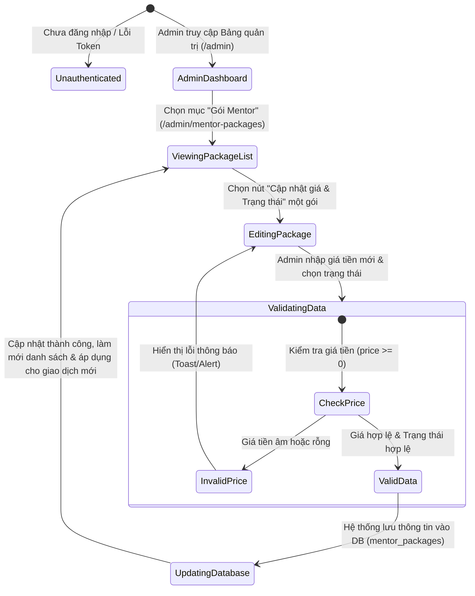
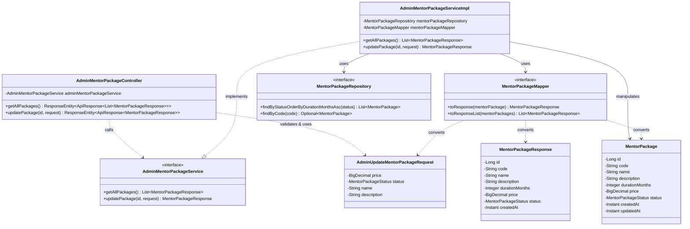
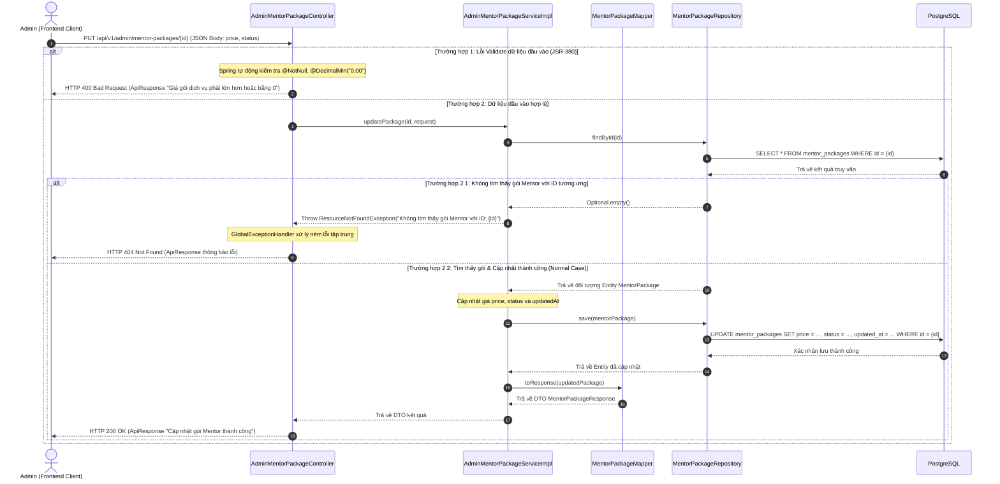

# ĐẶC TẢ YÊU CẦU & THIẾT KẾ CHI TIẾT: UC95 - QUẢN LÝ GÓI MENTOR

## PHẦN 1: ĐẶC TẢ NGHIỆP VỤ (REPORT 3)

### 2.2.3 Business Workflow (Luồng nghiệp vụ)

#### Mô tả chi tiết luồng xử lý bằng chữ (Business Step Description):
* **Bước 1 - Khởi đầu**: Admin đăng nhập thành công vào hệ thống AlumNect với vai trò Quản trị viên (`ADMIN`) và điều hướng tới mục "Gói Mentor" trên thanh điều hướng (`/admin/mentor-packages`).
* **Bước 2 - Hiển thị danh sách**: Hệ thống tự động truy vấn và hiển thị danh sách toàn bộ các gói cố vấn (1 tháng, 3 tháng, 6 tháng) bao gồm cả các gói đang bán (`ACTIVE`) và đã ngừng bán (`INACTIVE`).
* **Bước 3 - Chọn gói & Chỉnh sửa**: Admin nhấn nút "Cập nhật giá & Trạng thái" trên card gói dịch vụ tương ứng. Hệ thống hiển thị Modal chứa thông tin hiện tại và các trường cho phép thay đổi: Giá niêm yết (VND), Trạng thái (ACTIVE/INACTIVE), Tên gói và Mô tả.
* **Bước 4 - Xử lý kiểm tra & Lưu**: Admin nhấn "Lưu thay đổi".
  * *Nếu giá tiền không hợp lệ (< 0 hoặc rỗng)*: Hệ thống từ chối lưu và hiển thị thông báo lỗi trực tiếp trên Modal.
  * *Nếu dữ liệu hợp lệ*: Hệ thống cập nhật bản ghi trong bảng `mentor_packages` và trả về kết quả thành công.
* **Bước 5 - Kết thúc**: Cấu hình gói mới lập tức có hiệu lực đối với các giao dịch đăng ký gói Mentor mới của Alumni. Tất cả các giao dịch đăng ký trong quá khứ (`mentor_subscriptions`) được giữ nguyên mức giá cũ (`price_at_purchase`) và không bị làm thay đổi.

---

### 3.2 Mentoring Package Module

Mô tả: Module Quản lý gói Mentor chịu trách nhiệm cấu hình danh mục gói dịch vụ cố vấn, mức giá niêm yết và trạng thái kinh doanh của từng gói nhằm đảm bảo tính linh hoạt trong chính sách vận hành nền tảng AlumNect.

#### 3.2.1 UC95 - Quản lý giá và trạng thái gói Mentor

**Function trigger**:
*   **Navigation path**: `/admin` -> Menu Sidebar "Gói Mentor" -> `/admin/mentor-packages`
*   **Timing Frequency**: On demand (bất cứ khi nào Admin cần điều chỉnh chính sách giá hoặc tạm dừng gói dịch vụ) hoặc On screen mount.

**Function description**:
*   **Actors/Roles**: Admin (Quản trị viên hệ thống có quyền quản lý gói Mentor)
*   **Purpose**: Cho phép Admin quản lý giá niêm yết và trạng thái hoạt động của các gói dịch vụ Mentor (1/3/6 tháng).
*   **Interface**:
    *   *Màn hình danh sách gói*: Hiển thị 3 card tượng trưng cho gói 1 tháng, 3 tháng, 6 tháng với tên gói, mã gói, giá niêm yết hiện tại, badge trạng thái (`Đang bán` / `Ngừng bán`) và nút "Cập nhật giá & Trạng thái".
    *   *Modal cập nhật*: Ô nhập số Giá tiền (VND), nút chọn Trạng thái (Radio/Button ACTIVE hoặc INACTIVE), ô nhập Tên và Mô tả, nút "Lưu thay đổi" và "Hủy bỏ".

**Data processing**:
1. Admin truy cập trang `/admin/mentor-packages`, Client gửi request `GET /api/v1/admin/mentor-packages` mang theo Admin JWT Token.
2. Spring Boot Backend kiểm tra vai trò `ADMIN`, truy vấn bảng `mentor_packages` lấy tất cả bản ghi sắp xếp theo `duration_months ASC` và trả về Client.
3. Khi Admin gửi Form cập nhật, Client gọi API `PUT /api/v1/admin/mentor-packages/{id}` với request body chứa `price`, `status`, `name`, `description`.
4. Backend dùng JSR-380 validate dữ liệu đầu vào. Service tìm gói theo ID, cập nhật các trường và lưu vào DB.
5. Client nhận phản hồi `200 OK`, tự động xóa cache React Query và cập nhật lại giao diện.

**Screen layout**:
*   Card Layout dạng grid 3 cột trên Desktop / 1 cột trên Mobile.
*   Modal nổi đàn hồi (framer-motion pop animation) ở chính giữa màn hình.

**Function details**:
*   **Data**: `id` (BIGINT), `code` (VARCHAR), `name` (VARCHAR), `durationMonths` (INT), `price` (NUMERIC), `status` (VARCHAR: ACTIVE/INACTIVE), `description` (TEXT).
*   **Validation**:
    *   `price`: Không được null, phải là số thực lớn hơn hoặc bằng 0 (`@DecimalMin("0.00")`).
    *   `status`: Không được null, chỉ nhận 2 giá trị enum `ACTIVE` hoặc `INACTIVE`.
*   **Business rules**:
    *   **BR-MP-01**: Việc thay đổi giá hoặc trạng thái của gói Mentor chỉ áp dụng cho các lần chọn mua mới từ thời điểm lưu trở đi.
    *   **BR-MP-02**: Không được sửa đổi hoặc tính lại số tiền của các giao dịch mua gói (`mentor_subscriptions`) đã hoàn thành trong quá khứ (`price_at_purchase` bảo lưu giá trị lịch sử).
    *   **BR-MP-03**: Không xóa lịch sử giao dịch khi thay đổi hoặc ngừng hoạt động gói Mentor (sử dụng ràng buộc `ON DELETE RESTRICT` đối với bảng gói).
*   **Error Handling**:
    *   Giá gói không hợp lệ -> Hệ thống ném `MethodArgumentNotValidException` (400 Bad Request), hiển thị thông điệp "Giá gói dịch vụ phải lớn hơn hoặc bằng 0".
    *   Không tìm thấy ID gói -> Ném `ResourceNotFoundException` (404 Not Found), hiển thị thông điệp "Không tìm thấy gói Mentor với ID: {id}".
    *   Chưa đăng nhập / Token hết hạn -> HTTP 401 Unauthorized.
    *   Không phải tài khoản Admin -> HTTP 403 Forbidden.
*   **Normal case**: Admin cập nhật giá thành công (ví dụ: gói 3 tháng từ 250.000 ₫ lên 280.000 ₫), hệ thống lưu DB, trả về HTTP 200 OK và làm mới danh sách.
*   **Abnormal case**: Admin nhập giá tiền âm (ví dụ: `-50000`), hệ thống từ chối lưu, trả về HTTP 400 Bad Request và hiển thị thông báo lỗi trên UI.

---

### 5. Requirement Appendix (Phụ phụ Yêu cầu)

#### 5.1 Business Rules (Quy tắc Nghiệp vụ)

| ID | Định nghĩa Quy tắc (Rule Definition) |
| :--- | :--- |
| BR-MP-01 | Mọi sự thay đổi về giá gói hoặc trạng thái gói dịch vụ Mentor chỉ có hiệu lực với các giao dịch mua mới kể từ thời điểm cập nhật. |
| BR-MP-02 | Các bản ghi đăng ký gói (`mentor_subscriptions`) trong quá khứ bắt buộc lưu giữ giá trị `price_at_purchase` tại thời điểm mua và không bị điều chỉnh khi Admin đổi giá gói niêm yết. |
| BR-MP-03 | Không cho phép xóa vĩnh viễn các gói Mentor đã có lịch sử giao dịch nhằm bảo vệ tính toàn vẹn của dữ liệu báo cáo tài chính. |

#### 5.2 Common Requirements
*   Tất cả giá tiền hiển thị trên giao diện người dùng phải được định dạng theo chuẩn tiền tệ Việt Nam (VND).
*   Các thao tác ghi/sửa dữ liệu đều phải thông qua giao thức HTTPS bảo mật với JWT Token hợp lệ của vai trò `ADMIN`.
*   Thời gian cập nhật dữ liệu được lưu dưới dạng `TIMESTAMPTZ` (UTC) và hiển thị theo múi giờ địa phương người dùng (`Asia/Ho_Chi_Minh`).

#### 5.3 Application Messages List (Danh sách Thông điệp Ứng dụng)

| # | Mã thông điệp (Message code) | Loại thông điệp (Message Type) | Ngữ cảnh (Context) | Nội dung hiển thị (Content) |
| :--- | :--- | :--- | :--- | :--- |
| 1 | MSG_MP_01 | Toast / Inline | Lấy danh sách gói Mentor thành công dành cho Admin | Lấy danh sách gói Mentor thành công |
| 2 | MSG_MP_02 | Toast / Inline | Admin cập nhật giá và trạng thái gói Mentor thành công | Cập nhật gói Mentor thành công |
| 3 | MSG_MP_03 | Red text under input | Giá gói rỗng hoặc nhỏ hơn 0 | Giá gói dịch vụ phải lớn hơn hoặc bằng 0 |
| 4 | MSG_MP_04 | Red text under input | Trạng thái rỗng | Trạng thái gói dịch vụ không được để trống |
| 5 | MSG_MP_05 | Modal Alert / Toast | Không tìm thấy ID gói Mentor trong cơ sở dữ liệu | Không tìm thấy gói Mentor với ID: {id} |
| 6 | MSG_MP_06 | Toast message | Người dùng không có quyền Admin truy cập API | Người dùng không có quyền thực hiện thao tác này |

---

## PHẦN 2: THIẾT KẾ CHI TIẾT (REPORT 4)

### 3. Detail Design (Thiết kế chi tiết)

#### 3.1 Quản lý gói Mentor (UC95)

##### 3.1.1 Class Diagram (Sơ đồ Lớp)

###### Mô tả chi tiết cấu trúc các lớp (Class Design Description):
* **Lớp Controller (`AdminMentorPackageController`)**: Lớp REST Controller phụ trách tiếp nhận các yêu cầu HTTP từ giao diện Admin tại đường dẫn `/api/v1/admin/mentor-packages`. Sử dụng annotation `@Valid` để tự động kiểm định DTO và trả về ResponseEntity chuẩn `ApiResponse`.
* **Lớp DTO (`AdminUpdateMentorPackageRequest` & `MentorPackageResponse`)**: 
  * `AdminUpdateMentorPackageRequest`: Chứa dữ liệu đầu vào khi Admin cập nhật gói bao gồm `price` (định dạng `@DecimalMin("0.00")`) và `status`.
  * `MentorPackageResponse`: Chứa thông tin phản hồi hoàn chỉnh của gói Mentor để gửi về Client.
* **Lớp Service (`AdminMentorPackageService` & `AdminMentorPackageServiceImpl`)**: Đóng gói toàn bộ logic nghiệp vụ kiểm tra gói tồn tại theo ID, cập nhật thuộc tính và lưu vào DB trong một giao dịch (`@Transactional`).
* **Lớp Mapper (`MentorPackageMapper`)**: Giao diện MapStruct sinh mã tự động hỗ trợ chuyển đổi linh hoạt giữa Entity `MentorPackage` và DTO `MentorPackageResponse`.
* **Lớp Repository (`MentorPackageRepository`)**: Interface kế thừa `JpaRepository` cung cấp các phương thức CRUD thực thi câu lệnh SQL xuống bảng `mentor_packages`.
* **Lớp Entity (`MentorPackage`)**: Entity JPA đại diện cho bảng `mentor_packages` trong PostgreSQL.

---

##### 3.1.2 Sequence Diagram (Sơ đồ Tuần tự)

###### Mô tả chi tiết luồng xử lý bằng chữ (Sequence Flow Description):
1. **Luồng 1 - Thành công (Normal Case)**:
   * **Gửi yêu cầu**: Admin thay đổi giá/trạng thái gói và nhấn Lưu. Client gửi HTTP `PUT /api/v1/admin/mentor-packages/{id}` kèm payload JSON.
   * **Kiểm tra & Gọi Service**: Sau khi qua bộ kiểm duyệt DTO thành công, Controller gọi `adminMentorPackageService.updatePackage(id, request)`.
   * **Truy vấn DB & Cập nhật**: Service tìm gói theo ID qua `MentorPackageRepository`. Nhận được Entity, Service cập nhật `price`, `status`, `updatedAt` và gọi `save()`. Database thực thi câu lệnh SQL UPDATE.
   * **Phản hồi**: Mapper chuyển Entity kết quả thành DTO `MentorPackageResponse`. Controller đóng gói vào `ApiResponse.success` và trả về HTTP 200 OK cho Admin.
2. **Luồng 2 - Lỗi Validation dữ liệu đầu vào (Validation Error Case)**:
   * Admin nhập giá âm (ví dụ: `-10000`). Spring MVC phát hiện vi phạm annotation `@DecimalMin("0.00")` trong DTO, ném `MethodArgumentNotValidException`. `GlobalExceptionHandler` bắt lỗi và trả về HTTP 400 Bad Request kèm chi tiết trường bị lỗi cho Frontend.
3. **Luồng 3 - Lỗi không tìm thấy tài nguyên (Resource Not Found Case)**:
   * Admin truyền ID không tồn tại (ví dụ: `999`). Service không tìm thấy bản ghi trong DB, ném `ResourceNotFoundException`. `GlobalExceptionHandler` bắt ngoại lệ và trả về HTTP 404 Not Found cho Frontend.
