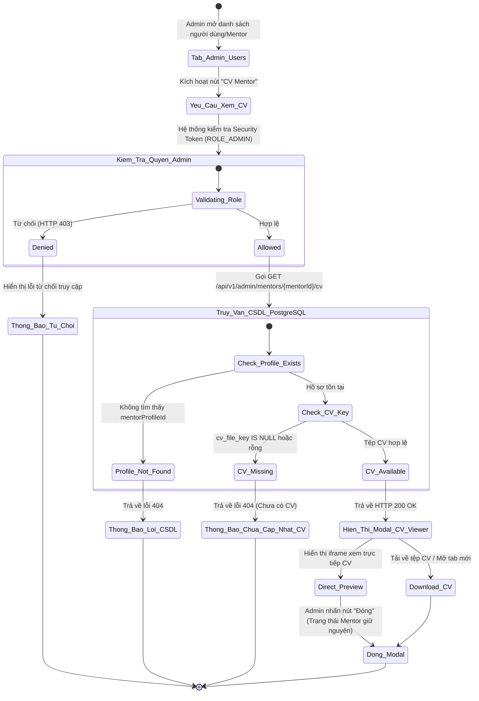
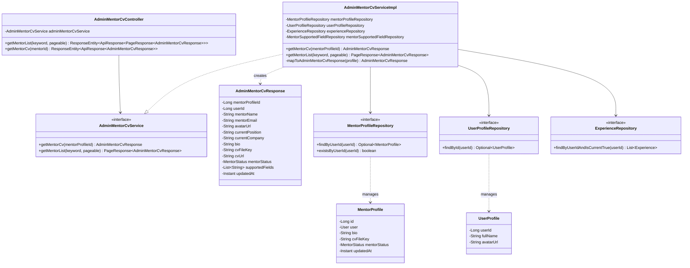
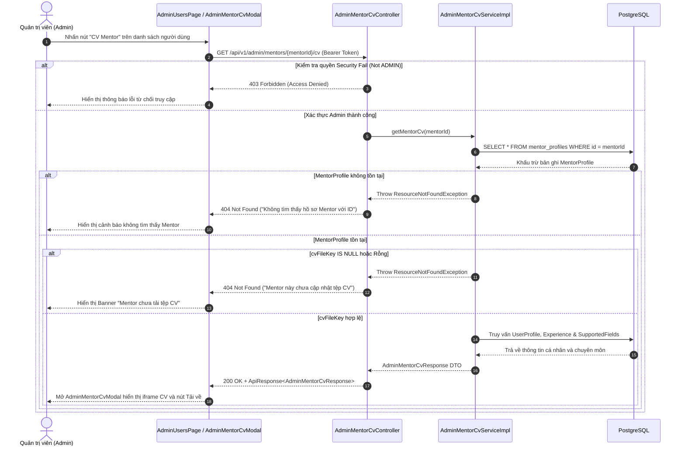

# ĐẶC TẢ YÊU CẦU & THIẾT KẾ CHI TIẾT: UC96 - XEM CV MENTOR

## PHẦN 1: ĐẶC TẢ NGHIỆP VỤ (REPORT 3)

### 2.2.3 Business Workflow (Luồng nghiệp vụ)



#### Mô tả chi tiết luồng xử lý bằng chữ (Business Step Description):
* **Bước 1 - Khởi đầu**: Quản trị viên (Admin) mở màn hình Quản lý người dùng/Mentor (`/admin/users`), chọn một cựu sinh viên (ALUMNI) hoặc Mentor và nhấn nút **"CV Mentor"**.
* **Bước 2 - Kiểm tra quyền**: Hệ thống (Spring Security) xác thực Bearer JWT Token của người dùng. Nếu vai trò không phải `ADMIN`, hệ thống từ chối truy cập (trả về lỗi HTTP 403 Forbidden).
* **Bước 3 - Truy vấn dữ liệu**: Hệ thống thực hiện truy vấn bảng `mentor_profiles`, `users`, `user_profiles`, `experiences` và `mentor_supported_fields` trong CSDL PostgreSQL.
* **Bước 4 - Xử lý ngoại lệ**:
  - Nếu `mentorProfileId` không tồn tại -> Trả về HTTP 404 Not Found (`"Không tìm thấy hồ sơ Mentor với ID"`).
  - Nếu `cv_file_key` chưa được lưu hoặc rỗng -> Trả về HTTP 404 Not Found (`"Mentor này chưa cập nhật tệp CV lên hệ thống"`).
* **Bước 5 - Kết thúc**: Hệ thống trả về thông tin DTO `AdminMentorCvResponse` bọc trong `ApiResponse`. Frontend hiển thị `AdminMentorCvModal` chứa thông tin chuyên môn và trình nhúng xem CV trực tiếp (`iframe`) kèm nút tải về tệp CV. **Trạng thái kinh doanh của Mentor giữ nguyên 100%, không bị tác động.**

---

### 3.2 Module Quản trị hệ thống (Admin Management Module)
Module Quản trị hệ thống quản lý các tài khoản người dùng, báo cáo vi phạm, phân tích dữ liệu và hồ sơ kinh doanh của các Mentor trên nền tảng AlumNect.

#### 3.2.1 Xem CV Mentor (UC96 - Admin View Mentor CV)

**Function trigger**:
*   **Navigation path**: Dashboard Admin -> Quản lý thành viên (`/admin/users`) -> Chọn thành viên Alumni / Mentor -> Nhấn nút **"CV Mentor"**
*   **Timing Frequency**: On demand (bất cứ khi nào Admin cần xem và đối chứng thông tin chuyên môn của Mentor).

**Function description**:
*   **Actors/Roles**: Admin (Quản trị viên)
*   **Purpose**: Cho phép Admin xem, kiểm tra chi tiết CV của Mentor để phục vụ công tác quản lý và đối chứng thông tin, không tạo ra bất kỳ quy trình phê duyệt hay từ chối (Approve/Reject) nào.
*   **Interface**:
    *   **Nút kích hoạt**: Nút bấm màu Cam - Trắng FPT (`#F27024`) có icon `<FileText />` trực tiếp tại bảng danh sách người dùng.
    *   **Giao diện Modal (`AdminMentorCvModal`)**:
        - Thẻ thông tin Mentor: Ảnh đại diện, Họ tên, Email, Vị trí hiện tại, Công ty, Lĩnh vực cố vấn hỗ trợ.
        - Khung xem tệp trực tiếp (`<iframe src={cvUrl} />`).
        - Nút hành động: "Mở trong tab mới", "Tải về tệp CV", "Đóng cửa sổ".
        - Banner cảnh báo quy tắc nghiệp vụ UC96.

**Data processing**:
1. Frontend gửi yêu cầu `GET /api/v1/admin/mentors/{mentorId}/cv` kèm Bearer Token của Admin.
2. Spring Boot kiểm tra Annotation `@PreAuthorize("hasRole('ADMIN')")`.
3. `AdminMentorCvServiceImpl` tìm kiếm đối tượng `MentorProfile` trong DB bằng `mentorProfileId`.
4. Trích xuất thuộc tính `cvFileKey` và chuyển đổi sang DTO `AdminMentorCvResponse`.
5. Trả về kết quả JSON chuẩn `ApiResponse<AdminMentorCvResponse>`.

**Function details**:
*   **Data**: `mentorProfileId`, `userId`, `mentorName`, `mentorEmail`, `avatarUrl`, `currentPosition`, `currentCompany`, `bio`, `cvFileKey`, `cvUrl`, `mentorStatus`, `supportedFields`.
*   **Validation**: Kiểm tra mã tệp CV `cvFileKey != null && !cvFileKey.isEmpty()`.
*   **Business rules**: **BR-96**: Chức năng Xem CV Mentor chỉ dùng cho mục đích kiểm tra đối chứng. Hệ thống KHÔNG cung cấp các thao tác Phê duyệt CV (Approve CV), Từ chối CV (Reject CV), Duyệt Mentor hoặc Từ chối Mentor. Trạng thái của Mentor hoàn toàn độc lập và được duy trì theo chu trình đăng ký gói dịch vụ.
*   **Error Handling**:
    - Trả về mã HTTP 403 Forbidden nếu người dùng không phải Admin.
    - Trả về mã HTTP 404 Not Found nếu không tìm thấy Mentor hoặc Mentor chưa tải CV.
*   **Normal case**: Trả về mã HTTP 200 OK bọc thông tin CV và hiển thị khung preview PDF trong `AdminMentorCvModal`.
*   **Abnormal case**: Hiển thị Banner cảnh báo lỗi màu đỏ trong Modal khi tệp không tồn tại hoặc lỗi kết nối.

---

### 5. Requirement Appendix (Phụ lục Yêu cầu)

#### 5.1 Business Rules (Quy tắc Nghiệp vụ)

| ID | Định nghĩa Quy tắc (Rule Definition) |
| :--- | :--- |
| **BR-96** | Xem CV Mentor (UC96) là tính năng chỉ đọc (Read-Only) dành riêng cho Quản trị viên. Tính năng này KHÔNG tạo ra quy trình duyệt/từ chối Mentor và KHÔNG thay đổi thuộc tính `mentorStatus` của bảng `mentor_profiles`. |

#### 5.3 Application Messages List (Danh sách Thông điệp Ứng dụng)

| # | Mã thông điệp | Loại thông điệp | Ngữ cảnh | Nội dung hiển thị |
| :--- | :--- | :--- | :--- | :--- |
| 1 | MSG_UC96_01 | Toast / Modal | Tải thông tin CV Mentor thành công | Tải CV Mentor thành công |
| 2 | MSG_UC96_02 | Inline Error | Không tìm thấy hồ sơ Mentor | Không tìm thấy hồ sơ Mentor với ID: {mentorId} |
| 3 | MSG_UC96_03 | Inline Error | Mentor chưa cập nhật tệp CV | Mentor này chưa cập nhật tệp CV lên hệ thống |
| 4 | MSG_UC96_04 | Alert Banner | Từ chối truy cập do thiếu quyền Admin | Access Denied: Người dùng không có quyền truy cập chức năng này |

---

## PHẦN 2: THIẾT KẾ CHI TIẾT (REPORT 4)

### 3. Detail Design (Thiết kế chi tiết)

#### 3.1 Xem CV Mentor (UC96 - Admin View Mentor CV)

##### 3.1.1 Class Diagram (Sơ đồ Lớp)



##### 3.1.2 Sequence Diagram (Sơ đồ Tuần tự Gộp duy nhất)



##### Mô tả chi tiết sơ đồ tuần tự (Sequence Diagram Step Description):
1. **Quản trị viên** thực hiện thao tác nhấp vào nút **"CV Mentor"** tại màn hình Quản lý người dùng.
2. Frontend gửi một request `GET /api/v1/admin/mentors/{mentorId}/cv` kèm JWT Token chứa vai trò Admin.
3. **Phân nhánh 1 - Thiếu quyền Admin**: `AdminMentorCvController` đánh giá thông qua `@PreAuthorize`. Nếu không có vai trò `ADMIN`, trả về ngay lập tức HTTP 403 Forbidden.
4. **Phân nhánh 2 - Thiếu dữ liệu Mentor**: `AdminMentorCvServiceImpl` truy vấn bảng `mentor_profiles` trong CSDL PostgreSQL. Nếu không tìm thấy ID, ném ngoại lệ `ResourceNotFoundException` và trả về HTTP 404.
5. **Phân nhánh 3 - Thiếu tệp CV**: Nếu `cv_file_key` trong `mentor_profiles` bị rỗng hoặc NULL, trả về HTTP 404 Not Found thông báo Mentor chưa tải tệp CV.
6. **Phân nhánh 4 - Thành công**: Khi đầy đủ dữ liệu, hệ thống tổng hợp DTO `AdminMentorCvResponse` gửi về cho Client (HTTP 200 OK). Frontend hiển thị `AdminMentorCvModal` với tệp CV nhúng trực tiếp.

---

### 4. Database Design (Thiết kế Cơ sở dữ liệu)

#### 4.1 Bảng `mentor_profiles` (Bảng chính chứa thuộc tính CV)

| Cột (Column) | Kiểu dữ liệu (Data Type) | Nullable | Mô tả (Description) |
| :--- | :--- | :--- | :--- |
| `id` | `BIGINT GENERATED ALWAYS AS IDENTITY` | NO | Khóa chính |
| `user_id` | `BIGINT` | NO | FK liên kết bảng `users` (1-1) |
| `bio` | `TEXT` | YES | Lời giới thiệu cố vấn |
| `working_mode` | `VARCHAR(20)` | YES | ONLINE, OFFLINE, BOTH |
| `mentoring_type` | `VARCHAR(20)` | YES | INDIVIDUAL, GROUP, BOTH |
| `cv_file_key` | `VARCHAR(255)` | YES | Đường dẫn tệp CV của Mentor |
| `mentor_status` | `VARCHAR(20)` | NO | INCOMPLETE, PAYMENT_PENDING, ACTIVE, EXPIRED |
| `created_at` | `TIMESTAMPTZ` | NO | Thời điểm tạo hồ sơ |
| `updated_at` | `TIMESTAMPTZ` | NO | Thời điểm cập nhật gần nhất |

#### 4.2 Migration Script `V7__create_admin_mentor_cv_view_support.sql`

```sql
-- ==============================================================================
-- AlumNect Database Migration - Version 7
-- Feature: Module Quản trị viên - Xem CV Mentor (UC96 - Admin View Mentor CV)
-- Target DBMS: PostgreSQL 14+
-- ==============================================================================

-- Bổ sung Index hỗ trợ Admin truy vấn nhanh CV của Mentor theo mentor_profile_id và cv_file_key
CREATE INDEX IF NOT EXISTS idx_mentor_profiles_cv_lookup ON mentor_profiles(id, cv_file_key) WHERE cv_file_key IS NOT NULL;
```
