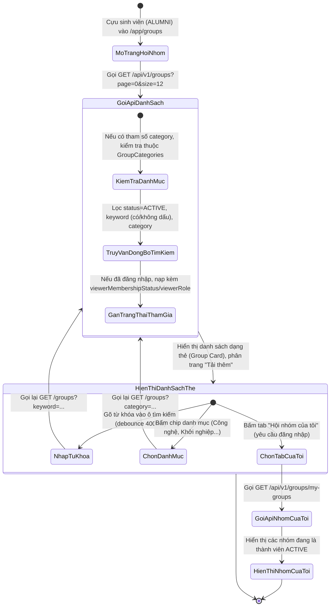
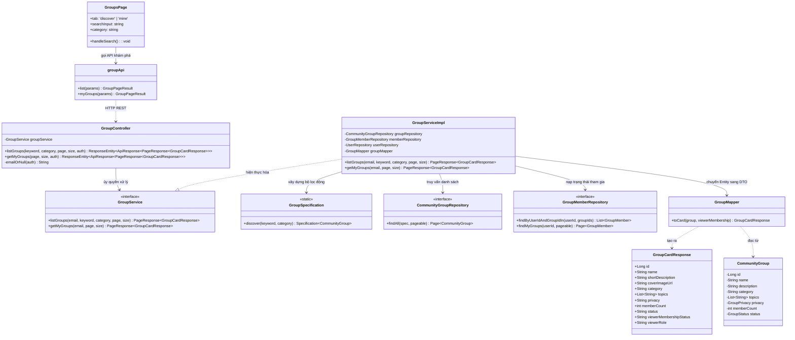
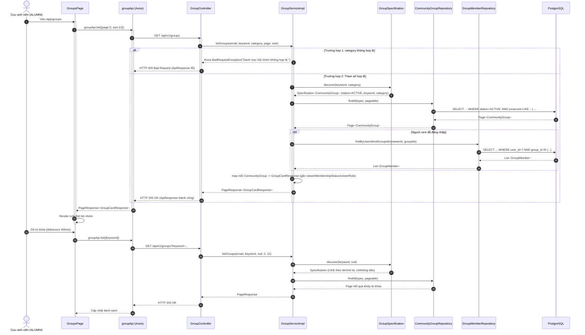

# ĐẶC TẢ YÊU CẦU & THIẾT KẾ CHI TIẾT: UC97 - XEM & TÌM KIẾM HỘI NHÓM (VIEW & SEARCH COMMUNITY GROUPS)

## PHẦN 1: ĐẶC TẢ NGHIỆP VỤ (REPORT 3)

### 2.2.3 Business Workflow (Luồng nghiệp vụ)



#### Mô tả chi tiết luồng xử lý bằng chữ (Business Step Description):
* **Bước 1 - Khởi đầu**:
  * Cựu sinh viên (`ALUMNI`) đã đăng nhập truy cập trang Hội nhóm (`/app/groups`); các vai trò khác không vào được trang này (BR-97-04).
  * Giao diện tự động gọi `GET /api/v1/groups` với `page=0`, `size=12` để nạp trang đầu tiên của danh sách khám phá.
* **Bước 2 - Các bước chuyển tiếp**:
  * **Tìm kiếm theo từ khóa**: Người dùng gõ vào ô tìm kiếm; sau 400ms không gõ thêm (debounce), Frontend gọi lại API với `keyword`. Backend so khớp cả bản có dấu lẫn không dấu (dùng extension `unaccent`) trên tên và mô tả hội nhóm, ký tự đặc biệt của LIKE (`%`, `_`, `\`) được thoát để tránh khớp sai nghĩa.
  * **Lọc theo danh mục**: Người dùng bấm một chip danh mục (VD: "Khởi nghiệp"). Frontend gọi lại API với `category`; Backend kiểm tra giá trị nằm trong danh sách danh mục hợp lệ, trả lỗi 400 nếu không hợp lệ.
  * **Phân trang**: Khi còn trang kế tiếp, nút "Tải thêm hội nhóm" xuất hiện; bấm vào sẽ nối thêm kết quả trang sau vào danh sách hiện có (không thay thế).
  * **Tab "Hội nhóm của tôi"**: Chỉ hiển thị khi đã đăng nhập, gọi `GET /api/v1/groups/my-groups` để liệt kê các hội nhóm người dùng đang là thành viên `ACTIVE` (nhóm `DELETED` không bao giờ xuất hiện).
  * **Trạng thái tham gia trên từng thẻ**: Nếu người xem đã đăng nhập, mỗi thẻ hội nhóm kèm theo `viewerMembershipStatus` (NONE/ACTIVE/PENDING/REJECTED/LEFT/REMOVED) và `viewerRole` để hiển thị đúng nút hành động (Tham gia / Đang chờ duyệt / Đã tham gia / Quản lý hội nhóm).
  * **Danh sách khám phá chỉ gồm hội nhóm `ACTIVE`**: Hội nhóm đang `INACTIVE` (tạm ngừng) hoặc `DELETED` không xuất hiện ở danh sách khám phá công khai, kể cả khi người xem là thành viên — các nhóm `INACTIVE` mà người dùng đang tham gia chỉ còn thấy được qua tab "Hội nhóm của tôi".
* **Bước 3 - Kết thúc**:
  * Danh sách hiển thị dạng lưới thẻ responsive (1 cột trên mobile, nhiều cột trên desktop); khi không có kết quả phù hợp, hiển thị trạng thái rỗng kèm gợi ý xóa bộ lọc.

---

### 3.2 Module Hội nhóm Cộng đồng (Community Groups)
Module Hội nhóm cho phép cựu sinh viên FPTU tạo, khám phá và tham gia các cộng đồng theo sở thích, chuyên môn hoặc định hướng phát triển, duy trì kết nối sau khi tốt nghiệp.

#### 3.2.1 Xem & Tìm kiếm Hội nhóm (UC97 - View & Search Community Groups)

**Function trigger**:
* **Navigation path**: `/app/groups` (tab "Khám phá cộng đồng" mặc định) hoặc tab "Hội nhóm của tôi".
* **Timing Frequency**: On screen mount (khi vào trang) và on demand (mỗi khi gõ từ khóa, đổi danh mục, chuyển tab hoặc bấm "Tải thêm").

**Function description**:
* **Actors/Roles**: Cựu sinh viên (`ALUMNI`) đã đăng nhập. Hội nhóm là tính năng **dành riêng cho cựu sinh viên (`ALUMNI`)** (BR-97-04): mọi màn hình Hội nhóm được bọc `RoleRoute role="ALUMNI"`, tài khoản vai trò khác bị đưa về `/app`, người chưa đăng nhập bị đưa về `/login`.
* **Purpose**: Giúp người dùng khám phá các cộng đồng đang hoạt động, tìm đúng hội nhóm phù hợp với sở thích/chuyên môn mà không cần trở thành thành viên trước.
* **Interface**:
  * Ô tìm kiếm "Tìm kiếm hội nhóm theo tên, từ khóa hoặc chủ đề…" (giới hạn 100 ký tự, có nút xóa nhanh).
  * Dãy chip lọc danh mục ("Tất cả" + 9 danh mục cố định) và nút "Xóa lọc" khi đang có bộ lọc.
  * Tiêu đề trang "Hội nhóm" (`PageHeader`) kèm nút "Tạo hội nhóm" (chỉ hiện với `ALUMNI`, xem UC99); hai tab "Khám phá cộng đồng" / "Hội nhóm của tôi" (tab sau yêu cầu đăng nhập).
  * Lưới thẻ hội nhóm (Group Card): ảnh bìa kèm nhãn danh mục và loại nhóm (Công khai/Riêng tư), nhãn "Tạm ngừng" nếu `INACTIVE`, tên (liên kết tới trang chi tiết), mô tả rút gọn, số thành viên, nút hành động theo trạng thái tham gia (`GroupMembershipActions`).
  * Trạng thái: khung xương (skeleton) khi tải lần đầu, trạng thái rỗng khi không có kết quả, trạng thái lỗi kèm nút "Thử lại", nút "Tải thêm hội nhóm" khi còn trang kế tiếp.

**Data processing**:
* Backend lọc `community_groups` theo `status = ACTIVE`, áp `Specification` động theo `keyword` (so khớp `LOWER(name)`, `unaccent(LOWER(name))`, tương tự với `description`) và `category`.
* Sắp xếp theo `createdAt DESC, id DESC`, phân trang theo `page`/`size` (mặc định 12, tối đa 50).
* Nếu người xem đã đăng nhập, nạp kèm các bản ghi `group_members` của người xem ứng với các `groupId` trong trang kết quả để gắn `viewerMembershipStatus`/`viewerRole` vào từng thẻ (chỉ 1 truy vấn `IN`, không N+1).
* Tab "Hội nhóm của tôi" truy vấn `group_members` theo `userId` + `membershipStatus = ACTIVE` kèm `JOIN FETCH` nhóm và chủ sở hữu, loại trừ nhóm đã `DELETED`.

**Screen layout**:
* Lưới responsive: 1 cột (mobile), 2 cột (tablet), 3 cột (desktop XL) — trang `GroupsPage.tsx`.

**Function details**:
* **Data**:
  * `keyword` (String, tùy chọn, tối đa 100 ký tự): từ khóa tìm theo tên/mô tả.
  * `category` (String, tùy chọn): khóa danh mục (`technology`, `sports`, `arts`, `startup`, `business`, `alumni`, `career`, `academic`, `other`).
  * `page` (int, mặc định 0), `size` (int, mặc định 12, tối đa 50).
* **Validation**:
  * `category` gửi lên phải khớp đúng một khóa trong danh sách cố định phía Backend; giá trị tự do bị từ chối.
* **Business rules**: Xem mục 5.1 (BR-97-01 → BR-97-04).
* **Error Handling**:
  * `400 Bad Request`: `category` không hợp lệ → *"Danh mục hội nhóm không hợp lệ."*
* **Normal case**: Danh sách tải trong < 300ms với trang đầu, cập nhật mượt khi đổi bộ lọc (giữ dữ liệu cũ hiển thị trong lúc tải dữ liệu mới — `placeholderData`).
* **Abnormal case**: Từ khóa chứa ký tự đặc biệt của SQL LIKE (`%`, `_`) được thoát (escape) trước khi truy vấn, không làm lộ toàn bộ danh sách ngoài ý muốn.

---

### 5. Requirement Appendix (Phụ lục Yêu cầu)

#### 5.1 Business Rules (Quy tắc Nghiệp vụ)

| ID | Định nghĩa Quy tắc (Rule Definition) |
| :--- | :--- |
| **BR-97-01** | Danh sách khám phá chỉ hiển thị hội nhóm có `status = ACTIVE`; hội nhóm tạm ngừng (`INACTIVE`) hoặc đã xóa (`DELETED`) không xuất hiện. |
| **BR-97-02** | Tìm kiếm theo từ khóa phải khớp được cả chuỗi có dấu và không dấu tiếng Việt trên tên và mô tả hội nhóm. |
| **BR-97-03** | Lọc theo danh mục chỉ chấp nhận các khóa nằm trong danh sách danh mục cố định phía Backend, không nhận giá trị tự do từ Client. |
| **BR-97-04** | Hội nhóm chỉ dành cho cựu sinh viên (`ALUMNI`): giao diện chặn bằng `RoleRoute role="ALUMNI"` ở mọi route Hội nhóm (danh sách, chi tiết nhóm, chi tiết bài viết) và chỉ hiển thị nút "Tạo hội nhóm" cho `ALUMNI`. Phía Backend, các API đọc không kiểm tra thêm vai trò; API tạo/tham gia chỉ từ chối `ADMIN`. |

#### 5.2 Common Requirements (Yêu cầu Chung)
* Danh sách được phân trang (không tải toàn bộ cùng lúc), dùng mẫu "Tải thêm" thay vì đánh số trang.
* Có trạng thái loading (skeleton), rỗng (empty state) và lỗi (kèm nút thử lại) rõ ràng.
* Giao diện responsive cho desktop, tablet và mobile.

#### 5.3 Application Messages List (Danh sách Thông điệp Ứng dụng)

| # | Mã thông điệp | Loại thông điệp | Ngữ cảnh | Nội dung hiển thị |
| :--- | :--- | :--- | :--- | :--- |
| 1 | `MSG-GRP-01` | In line (empty state) | Không có hội nhóm nào khớp bộ lọc/từ khóa | Không tìm thấy hội nhóm phù hợp — Thử đổi từ khóa hoặc chọn danh mục khác (kèm nút "Xóa bộ lọc"). |
| 2 | `MSG-GRP-02` | In line (empty state) | Chưa tham gia hội nhóm nào | Bạn chưa tham gia hội nhóm nào. |
| 2b | `MSG-GRP-02B` | In line (empty state) | Chưa có hội nhóm nào trong hệ thống | Chưa có hội nhóm nào — Hãy là người đầu tiên tạo dựng hội nhóm cộng đồng. |
| 3 | `MSG-GRP-03` | Inline error | Lỗi tải danh sách | Không tải được danh sách hội nhóm. |
| 4 | `MSG-GRP-04` | API error (400) | `category` không hợp lệ | Danh mục hội nhóm không hợp lệ. |

---

## PHẦN 2: THIẾT KẾ CHI TIẾT (REPORT 4)

### 3. Detail Design (Thiết kế chi tiết)

#### 3.1 Xem & Tìm kiếm Hội nhóm (UC97 - View & Search Community Groups)

##### 3.1.1 Class Diagram (Sơ đồ Lớp)



###### Mô tả chi tiết cấu trúc các lớp (Class Design Description):
* **Lớp Controller**: `GroupController.java` tiếp nhận 2 endpoint GET (danh sách khám phá công khai và nhóm của tôi yêu cầu JWT), đọc `Authentication` để xác định người xem là Guest hay đã đăng nhập.
* **Lớp DTO**: `GroupCardResponse.java` chứa dữ liệu phẳng hiển thị trên thẻ hội nhóm, gồm cả trạng thái tham gia của người xem hiện tại.
* **Lớp Service**: `GroupService.java` (interface) và `GroupServiceImpl.java` xử lý lọc, phân trang và gắn trạng thái thành viên theo từng người xem.
* **Lớp Specification**: `GroupSpecification.java` xây dựng điều kiện JPA Criteria động (trạng thái ACTIVE, từ khóa có/không dấu, danh mục) để tái sử dụng cho mọi truy vấn khám phá.
* **Lớp Repository & Entity**: `CommunityGroupRepository.java` cung cấp `findAll(Specification, Pageable)`; `CommunityGroup.java` ánh xạ bảng `community_groups`.
* **Lớp Mapper**: `GroupMapper.java` chuyển `CommunityGroup` (+ `GroupMember` của người xem nếu có) thành `GroupCardResponse`.
* **Lớp Frontend**: `GroupsPage.tsx` quản lý state tìm kiếm/lọc/tab, gọi `groupApi.ts` để lấy dữ liệu qua TanStack Query (`useInfiniteQuery`).

##### 3.1.2 Sequence Diagram (Sơ đồ Tuần tự)



###### Mô tả chi tiết luồng xử lý bằng chữ (Sequence Flow Description):
1. **Luồng 1 - Tải danh sách khám phá (Normal Case)**: Trang gọi `GET /groups` ngay khi mount; Service xây dựng `Specification` lọc `ACTIVE` + từ khóa/danh mục (nếu có), truy vấn phân trang, rồi (nếu đã đăng nhập) nạp một lượt các `GroupMember` của người xem để gắn trạng thái tham gia vào từng thẻ trước khi trả về.
2. **Luồng 2 - Tìm kiếm/lọc động**: Mỗi khi người dùng đổi từ khóa (sau debounce) hoặc chọn danh mục, Frontend gọi lại đúng endpoint với tham số mới; Backend xử lý độc lập theo từng request, không giữ trạng thái phía server.
3. **Luồng 3 - Lỗi danh mục không hợp lệ**: Nếu `category` không khớp danh sách cố định, Service ném `BadRequestException`, `GlobalExceptionHandler` trả về HTTP 400 kèm thông điệp tiếng Việt cho Client hiển thị.

##### 3.1.3 Thiết kế Cơ sở Dữ liệu & Ràng buộc (Database Schema Design)

* **Bảng `community_groups`** (migration `V5__create_community_groups_schema.sql`):
  * `status VARCHAR(20) CHECK (status IN ('ACTIVE','INACTIVE','DELETED'))` — chỉ mục `idx_groups_status` phục vụ lọc nhanh.
  * `category VARCHAR(50)` — chỉ mục `idx_groups_category`; giá trị được kiểm tra ở tầng Service với danh sách cố định `GroupCategories`, không có ràng buộc `CHECK` ở DB để dễ mở rộng danh mục sau này.
  * `topics VARCHAR(50)[]` — mảng chủ đề, không index riêng (dữ liệu nhỏ).
* **Tìm kiếm không dấu**: Dùng extension `unaccent` (kích hoạt ở `V2__enable_unaccent_extension.sql`) qua hàm JPA Criteria `cb.function("unaccent", ...)`.

##### 3.1.4 Đặc tả API Endpoint (API Specification)

###### 1. Danh sách khám phá hội nhóm:
* **URL**: `GET /api/v1/groups?keyword={kw}&category={cat}&page=0&size=12`
* **Xác thực**: Giao diện yêu cầu đăng nhập vai trò `ALUMNI` (BR-97-04); bản thân API `GET /groups` không bắt buộc JWT (có JWT thì nhận thêm trạng thái tham gia).
* **Phản hồi thành công (HTTP 200 OK)**:
  ```json
  {
    "error": 0,
    "message": "Lấy danh sách hội nhóm thành công",
    "data": {
      "content": [
        {
          "id": 4,
          "name": "Cộng đồng Trí tuệ nhân tạo FPTU",
          "shortDescription": "Nơi cựu sinh viên chia sẻ kiến thức, dự án và cơ hội nghề nghiệp về trí tuệ nhân tạo.",
          "coverImageUrl": null,
          "category": "technology",
          "topics": ["AI", "Machine Learning"],
          "privacy": "PUBLIC",
          "memberCount": 12,
          "status": "ACTIVE",
          "viewerMembershipStatus": "ACTIVE",
          "viewerRole": "OWNER"
        }
      ],
      "pageNumber": 0,
      "pageSize": 12,
      "totalElements": 1,
      "totalPages": 1,
      "last": true
    }
  }
  ```
* **Phản hồi lỗi danh mục không hợp lệ (HTTP 400 Bad Request)**:
  ```json
  {
    "error": 400,
    "message": "Danh mục hội nhóm không hợp lệ.",
    "data": null
  }
  ```

###### 2. Các hội nhóm của tôi:
* **URL**: `GET /api/v1/groups/my-groups?page=0&size=12`
* **Tiêu đề Request**: `Authorization: Bearer <jwt_access_token>` (bắt buộc)
* **Phản hồi thành công (HTTP 200 OK)**: Cấu trúc `PageResponse<GroupCardResponse>` giống trên, chỉ gồm các hội nhóm `membershipStatus = ACTIVE` của người dùng hiện tại, sắp theo `joinedAt DESC`.
