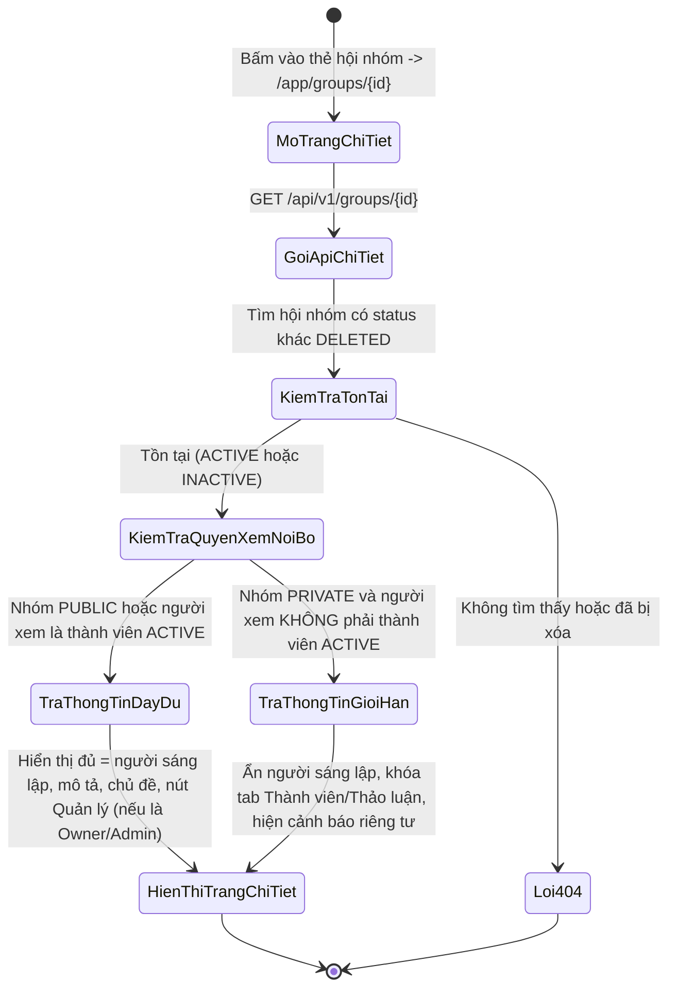
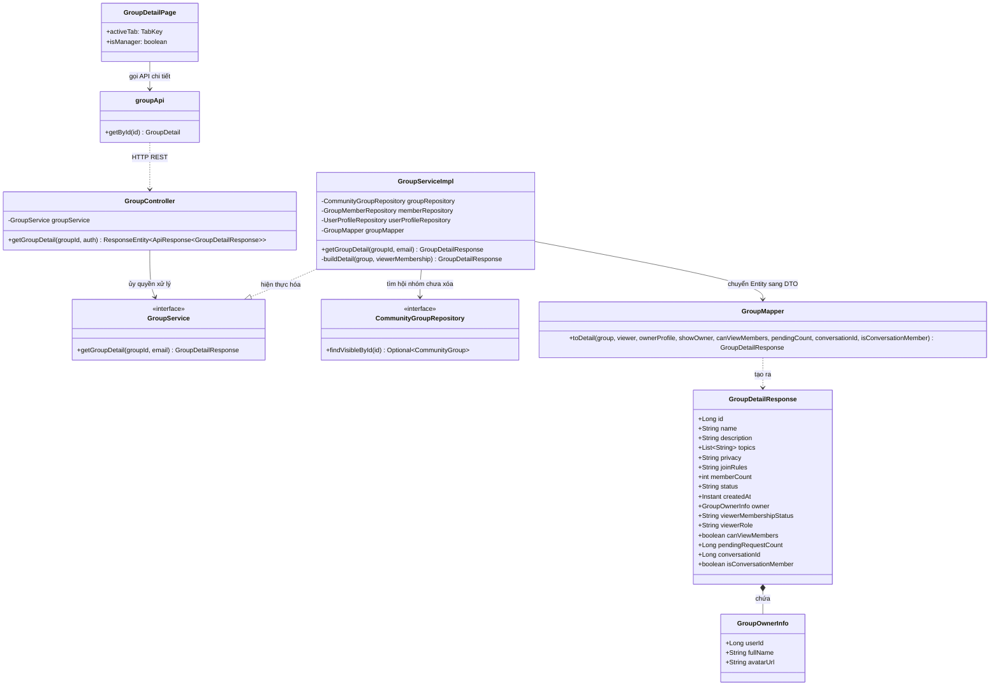
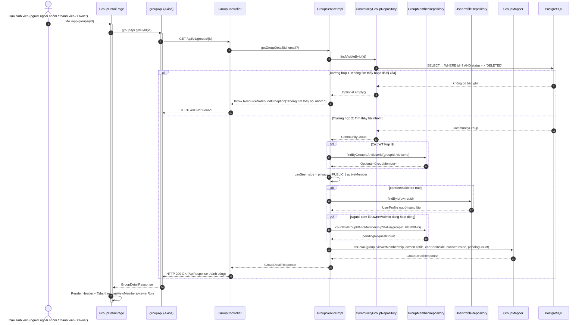

# ĐẶC TẢ YÊU CẦU & THIẾT KẾ CHI TIẾT: UC98 - XEM CHI TIẾT HỘI NHÓM (VIEW GROUP DETAIL)

## PHẦN 1: ĐẶC TẢ NGHIỆP VỤ (REPORT 3)

### 2.2.3 Business Workflow (Luồng nghiệp vụ)



#### Mô tả chi tiết luồng xử lý bằng chữ (Business Step Description):
* **Bước 1 - Khởi đầu**: Người dùng bấm vào một thẻ hội nhóm hoặc truy cập trực tiếp đường dẫn `/app/groups/{id}`. Giao diện gọi `GET /api/v1/groups/{groupId}`.
* **Bước 2 - Các bước chuyển tiếp**:
  * Backend tìm hội nhóm theo `id`, loại trừ các hội nhóm đã `DELETED` (coi như không tồn tại) — trả về `404 Not Found` nếu không tìm thấy hoặc đã xóa. Hội nhóm `INACTIVE` (tạm ngừng) vẫn xem chi tiết được, kèm cảnh báo "Hội nhóm đang tạm ngừng hoạt động".
  * Hệ thống xác định người xem có phải thành viên `ACTIVE` của nhóm hay không (`viewerMembership`).
  * **Nhóm công khai (`PUBLIC`)**: mọi người xem đều thấy đầy đủ thông tin, bao gồm người sáng lập (Owner) và được phép xem Tab Thành viên/Thảo luận.
  * **Nhóm riêng tư (`PRIVATE`)** mà người xem **không phải** thành viên `ACTIVE`: Backend trả `owner = null` và `canViewMembers = false` — chỉ lộ tên, mô tả, ảnh bìa, danh mục, số lượng thành viên, loại nhóm (BR-13 của đặc tả gốc). Giao diện khóa Tab Thành viên và Tab Thảo luận, hiển thị thông báo "Hội nhóm riêng tư — cần tham gia để xem nội dung".
  * Nếu người xem đang là Owner/Admin của nhóm, Backend trả kèm `pendingRequestCount` (số yêu cầu tham gia đang chờ duyệt) để hiển thị chấm đỏ trên Tab "Quản trị nhóm".
* **Bước 3 - Kết thúc**: Trang chi tiết hiển thị đủ các khu vực: Ảnh bìa + thông tin tóm tắt + nút hành động (theo đúng trạng thái tham gia của người xem), các Tab điều hướng phụ (Thảo luận / Giới thiệu / Thành viên / Quản trị nhóm nếu có quyền), và khung thông tin cộng đồng ở cột bên.

---

### 3.2 Module Hội nhóm Cộng đồng (Community Groups)

#### 3.2.1 Xem Chi tiết Hội nhóm (UC98 - View Group Detail)

**Function trigger**:
* **Navigation path**: `/app/groups/{id}` (từ thẻ hội nhóm, kết quả tìm kiếm, hoặc liên kết chia sẻ).
* **Timing Frequency**: On screen mount; gọi lại khi có thay đổi trạng thái tham gia (tham gia/rời/được duyệt...) để đồng bộ giao diện.

**Function description**:
* **Actors/Roles**: Cựu sinh viên (`ALUMNI`) đã đăng nhập; mức độ thông tin khác nhau theo quyền (người ngoài nhóm / thành viên / Owner-Admin). Hội nhóm là tính năng **dành riêng cho cựu sinh viên (`ALUMNI`)** (BR-97-04): mọi màn hình Hội nhóm được bọc `RoleRoute role="ALUMNI"`, tài khoản vai trò khác bị đưa về `/app`, người chưa đăng nhập bị đưa về `/login`.
* **Purpose**: Cho người dùng đầy đủ thông tin để quyết định tham gia hội nhóm, hoặc (nếu đã là thành viên/quản trị) truy cập nhanh các khu vực quản lý.
* **Interface**:
  * **Đầu trang**: Ảnh bìa, nhãn danh mục + loại nhóm (Công khai/Riêng tư) + nhãn "Tạm ngừng" nếu `INACTIVE`, tên, số thành viên, ngày thành lập, người sáng lập (nếu được phép xem), nút "Chia sẻ" (mở hộp chia sẻ chuẩn của hệ thống: gửi qua tin nhắn hoặc sao chép liên kết `/app/groups/{id}`), cụm nút hành động theo trạng thái tham gia, và nút nhóm trò chuyện của hội nhóm ("Nhắn tin nhóm" / "Tham gia nhóm chat" / "Tạo nhóm chat" — chỉ thành viên `ACTIVE`; chi tiết ở đặc tả *Community Group Chat*).
  * **Thanh Tab phụ**: Thảo luận, Giới thiệu, Thành viên, Quản trị nhóm (chỉ Owner/Admin, kèm chấm số yêu cầu đang chờ).
  * **Tab Giới thiệu**: Mô tả đầy đủ, danh sách chủ đề (hashtag), quy định tham gia hoặc văn bản mặc định nếu nhóm chưa đặt quy định riêng.
  * **Cột bên (desktop, chỉ ở Tab Thảo luận)**: thẻ "Đóng góp cho cộng đồng" (`GroupSidebarInfo`) khuyến khích thành viên chia sẻ; thông tin tóm tắt của nhóm hiển thị ở đầu trang và Tab Giới thiệu.
  * **Khối cảnh báo**: hiện khi nhóm `INACTIVE`, hoặc khi nhóm `PRIVATE` và người xem chưa là thành viên.

**Data processing**:
* `GroupServiceImpl.getGroupDetail` tìm nhóm bằng `findVisibleById` (loại trừ `DELETED`), nạp `GroupMember` của người xem (nếu có JWT).
* Tính `canSeeInside = privacy == PUBLIC || activeMember` để quyết định có trả thông tin `owner` (join `UserProfile`) và `canViewMembers` hay không.
* Nếu hội nhóm đã có nhóm trò chuyện (`conversations.community_group_id`), trả `conversationId` và đặt `isConversationMember` theo việc người xem (thành viên `ACTIVE`) đã có trong `conversation_participants` hay chưa.
* Nếu người xem là Owner/Admin đang hoạt động, truy vấn thêm `countByGroupIdAndMembershipStatus(groupId, PENDING)` để trả `pendingRequestCount`.

**Screen layout**:
* Đầu trang (`GroupDetailHeader`) và thanh Tab phụ chiếm toàn chiều rộng; riêng Tab Thảo luận chia 2 cột trên desktop (danh sách bài viết + cột bên 320px), 1 cột trên mobile. Component chính: `GroupDetailPage.tsx`, `GroupDetailHeader.tsx`.
* Liên kết cũ dạng `/app/groups/{id}?postId={n}` (từ thẻ chia sẻ trong chat hoặc "Sao chép liên kết" của bài viết) được `GroupDetailPage` chuyển ngay (`replace`) sang trang chi tiết bài viết `/app/groups/{id}/posts/{n}` (xem UC103).

**Function details**:
* **Data**:
  * `groupId` (Long, trên đường dẫn, bắt buộc).
  * Response `GroupDetailResponse`: `id, name, description, coverImageUrl, category, topics, privacy, joinRules, memberCount, status, createdAt, owner (nullable), viewerMembershipStatus, viewerRole, canViewMembers, pendingRequestCount (nullable), conversationId (nullable — nhóm trò chuyện của hội nhóm nếu đã khởi tạo), isConversationMember (người xem đã tham gia nhóm chat chưa)`.
* **Validation**: Không có input từ Client ngoài `groupId` trên URL (kiểu số nguyên).
* **Business rules**: Xem mục 5.1 (BR-98-01 → BR-98-03).
* **Error Handling**:
  * `404 Not Found`: Hội nhóm không tồn tại hoặc đã bị xóa mềm → *"Không tìm thấy hội nhóm."*
* **Normal case**: Trang tải và hiển thị đầy đủ thông tin trong một lượt gọi API duy nhất.
* **Abnormal case**: Người xem cố truy cập trực tiếp bằng liên kết của một hội nhóm đã bị Owner xóa → nhận 404 thay vì rò rỉ thông tin đã xóa.

---

### 5. Requirement Appendix (Phụ lục Yêu cầu)

#### 5.1 Business Rules (Quy tắc Nghiệp vụ)

| ID | Định nghĩa Quy tắc (Rule Definition) |
| :--- | :--- |
| **BR-98-01** | Hội nhóm riêng tư (`PRIVATE`) không được để lộ thông tin người sáng lập và danh sách thành viên cho người xem không phải là thành viên đang hoạt động (`ACTIVE`). |
| **BR-98-02** | Hội nhóm đã xóa mềm (`DELETED`) không được truy cập được bằng bất kỳ liên kết trực tiếp nào — hệ thống trả về như không tồn tại (404). |
| **BR-98-03** | Chỉ Owner hoặc Admin của hội nhóm mới nhận được số lượng yêu cầu tham gia đang chờ duyệt (`pendingRequestCount`) trong phản hồi chi tiết. |

#### 5.2 Common Requirements (Yêu cầu Chung)
* Hiển thị rõ ràng trạng thái đặc biệt của hội nhóm (tạm ngừng hoạt động, riêng tư) bằng nhãn/màu sắc nổi bật, không gây hiểu nhầm.
* Mọi hành động điều hướng và tải dữ liệu đều có trạng thái loading (skeleton) phù hợp với bố cục thật.

#### 5.3 Application Messages List (Danh sách Thông điệp Ứng dụng)

| # | Mã thông điệp | Loại thông điệp | Ngữ cảnh | Nội dung hiển thị |
| :--- | :--- | :--- | :--- | :--- |
| 1 | `MSG-GRP-05` | Trang lỗi (404) | Hội nhóm không tồn tại/đã xóa | Hội nhóm này không tồn tại hoặc đã bị xóa. |
| 2 | `MSG-GRP-06` | Trang lỗi (khác) | Lỗi tải chi tiết hội nhóm | Không tải được hội nhóm. |
| 3 | `MSG-GRP-07` | Banner cảnh báo | Hội nhóm đang `INACTIVE` | Hội nhóm đang tạm ngừng hoạt động và không nhận thêm thành viên mới. |
| 4 | `MSG-GRP-08` | Banner cảnh báo | Nhóm `PRIVATE`, người xem ngoài nhóm | Hội nhóm riêng tư — cần tham gia để xem nội dung dành cho thành viên. |
| 5 | `MSG-GRP-09` | Toast message | Sao chép liên kết chia sẻ thành công (hộp chia sẻ) | Đã sao chép liên kết hội nhóm! |

---

## PHẦN 2: THIẾT KẾ CHI TIẾT (REPORT 4)

### 3. Detail Design (Thiết kế chi tiết)

#### 3.1 Xem Chi tiết Hội nhóm (UC98 - View Group Detail)

##### 3.1.1 Class Diagram (Sơ đồ Lớp)



###### Mô tả chi tiết cấu trúc các lớp (Class Design Description):
* **Lớp Controller**: `GroupController.getGroupDetail` nhận `groupId` trên đường dẫn và `Authentication` tùy chọn (API không bắt buộc JWT, nhưng giao diện chỉ mở cho `ALUMNI`).
* **Lớp DTO**: `GroupDetailResponse.java` là DTO lồng, chứa `GroupOwnerInfo` (static inner class) chỉ được điền khi `canSeeInside = true`.
* **Lớp Service**: `GroupServiceImpl.getGroupDetail` gọi hàm riêng `buildDetail` để gói logic quyết định hiển thị người sáng lập/số yêu cầu chờ duyệt theo quyền người xem.
* **Lớp Repository & Entity**: `findVisibleById` trong `CommunityGroupRepository` dùng `JOIN FETCH owner` và loại trừ `status = DELETED` ngay trong câu JPQL.
* **Lớp Mapper**: `GroupMapper.toDetail` nhận đủ tham số đã được Service tính toán quyền, không tự quyết định logic nghiệp vụ.
* **Lớp Frontend**: `GroupDetailPage.tsx` điều phối 4 Tab con dựa trên `group.canViewMembers`/`isManagerRole(group.viewerRole)`.

##### 3.1.2 Sequence Diagram (Sơ đồ Tuần tự)



###### Mô tả chi tiết luồng xử lý bằng chữ (Sequence Flow Description):
1. **Luồng 1 - Thành công, nhóm công khai hoặc người xem là thành viên**: Service xác nhận hội nhóm tồn tại, xác định `canSeeInside = true`, nạp hồ sơ người sáng lập và (nếu Owner/Admin) số yêu cầu chờ duyệt, trả về `GroupDetailResponse` đầy đủ.
2. **Luồng 2 - Nhóm riêng tư, người xem ngoài nhóm**: `canSeeInside = false` → `owner = null`, `canViewMembers = false`, `pendingRequestCount = null`; Frontend dựa vào các cờ này để khóa Tab Thành viên/Thảo luận và hiển thị cảnh báo riêng tư.
3. **Luồng 3 - Không tìm thấy (Not Found Case)**: `findVisibleById` không trả về bản ghi do `id` sai hoặc hội nhóm đã `DELETED`; Service ném `ResourceNotFoundException`, `GlobalExceptionHandler` trả HTTP 404, Frontend hiển thị trang "Không tìm thấy hội nhóm".

##### 3.1.3 Thiết kế Cơ sở Dữ liệu & Ràng buộc (Database Schema Design)

* **Truy vấn `findVisibleById`**: `SELECT g FROM CommunityGroup g JOIN FETCH g.owner WHERE g.id = :id AND g.status <> DELETED` — dùng `JOIN FETCH` để tránh truy vấn N+1 khi lấy thông tin chủ sở hữu.
* **Không có bảng riêng cho "lượt xem"**: Chức năng xem chi tiết là thao tác đọc thuần túy (`@Transactional(readOnly = true)`), không ghi log lượt xem vào CSDL.

##### 3.1.4 Đặc tả API Endpoint (API Specification)

###### 1. Xem chi tiết hội nhóm (nhóm công khai hoặc người xem là thành viên):
* **URL**: `GET /api/v1/groups/{groupId}`
* **Phản hồi thành công (HTTP 200 OK)**:
  ```json
  {
    "error": 0,
    "message": "Lấy chi tiết hội nhóm thành công",
    "data": {
      "id": 4,
      "name": "Cộng đồng Trí tuệ nhân tạo FPTU",
      "description": "Nơi cựu sinh viên chia sẻ kiến thức, dự án và cơ hội nghề nghiệp về trí tuệ nhân tạo.",
      "coverImageUrl": null,
      "category": "technology",
      "topics": ["AI", "Machine Learning"],
      "privacy": "PUBLIC",
      "joinRules": "Tôn trọng thành viên, không spam, không quảng cáo.",
      "memberCount": 12,
      "status": "ACTIVE",
      "createdAt": "2026-09-28T14:45:10Z",
      "owner": { "userId": 1, "fullName": "Nguyễn Văn Ái", "avatarUrl": "" },
      "viewerMembershipStatus": "ACTIVE",
      "viewerRole": "OWNER",
      "canViewMembers": true,
      "pendingRequestCount": 2
    }
  }
  ```

###### 2. Xem chi tiết hội nhóm riêng tư (người xem ngoài nhóm):
* **URL**: `GET /api/v1/groups/{groupId}`
* **Phản hồi thành công, dữ liệu rút gọn (HTTP 200 OK)**:
  ```json
  {
    "error": 0,
    "message": "Lấy chi tiết hội nhóm thành công",
    "data": {
      "id": 2,
      "name": "Hội Founder FPTU",
      "description": "Nhóm riêng tư cho founder",
      "coverImageUrl": null,
      "category": "startup",
      "topics": [],
      "privacy": "PRIVATE",
      "joinRules": null,
      "memberCount": 3,
      "status": "ACTIVE",
      "createdAt": "2026-09-28T14:45:10Z",
      "owner": null,
      "viewerMembershipStatus": "NONE",
      "viewerRole": null,
      "canViewMembers": false,
      "pendingRequestCount": null
    }
  }
  ```

###### 3. Hội nhóm không tồn tại hoặc đã bị xóa:
* **URL**: `GET /api/v1/groups/{groupId}`
* **Phản hồi lỗi (HTTP 404 Not Found)**:
  ```json
  {
    "error": 404,
    "message": "Không tìm thấy hội nhóm.",
    "data": null
  }
  ```
