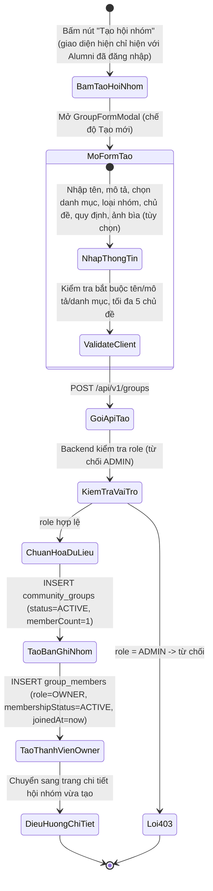
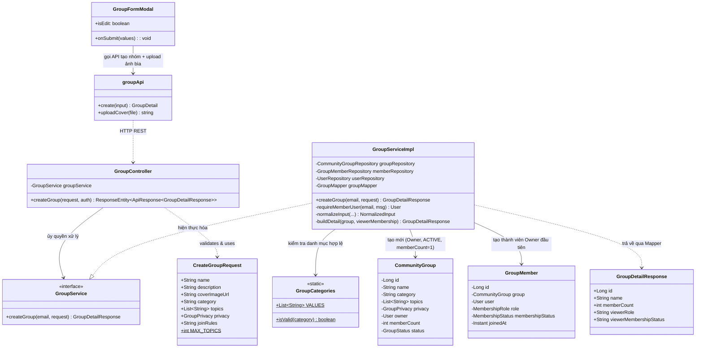
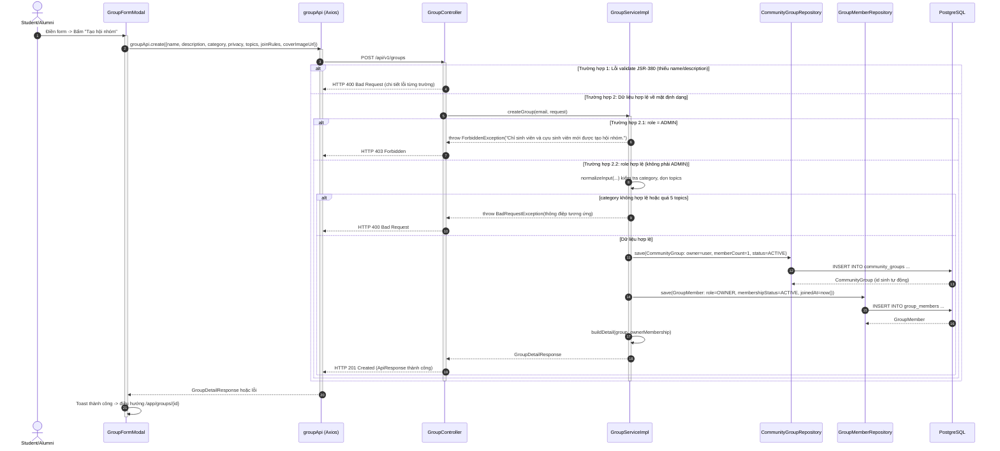

# ĐẶC TẢ YÊU CẦU & THIẾT KẾ CHI TIẾT: UC99 - TẠO HỘI NHÓM (CREATE COMMUNITY GROUP)

## PHẦN 1: ĐẶC TẢ NGHIỆP VỤ (REPORT 3)

### 2.2.3 Business Workflow (Luồng nghiệp vụ)



#### Mô tả chi tiết luồng xử lý bằng chữ (Business Step Description):
* **Bước 1 - Khởi đầu**: Cựu sinh viên (`ALUMNI`) đã đăng nhập bấm nút "Tạo hội nhóm" (ở trang danh sách Hội nhóm). Nút này chỉ hiển thị với `ALUMNI` (BR-97-04, BR-99-01).
* **Bước 2 - Các bước chuyển tiếp**:
  * Form yêu cầu nhập: tên hội nhóm (bắt buộc, tối đa 200 ký tự), mô tả (bắt buộc, tối đa 5000 ký tự), danh mục hoạt động (bắt buộc, chọn từ danh sách cố định), loại hội nhóm (Công khai mặc định hoặc Riêng tư), chủ đề/sở thích liên quan (tùy chọn, tối đa 5 chủ đề cách nhau bằng dấu phẩy, mỗi chủ đề tối đa 50 ký tự), quy định tham gia (tùy chọn, tối đa 2000 ký tự), ảnh bìa (tùy chọn, upload qua presigned URL lên thư mục `groups`).
  * Khi bấm "Tạo hội nhóm", Frontend validate trước bằng Zod (khớp đúng giới hạn phía Backend) rồi gọi `POST /api/v1/groups`.
  * Backend kiểm tra vai trò người gửi (`requireMemberUser`): từ chối `ADMIN` hệ thống (403); việc giới hạn riêng cho `ALUMNI` do giao diện thực hiện.
  * Backend chuẩn hóa dữ liệu: cắt khoảng trắng, kiểm tra danh mục hợp lệ, dọn danh sách chủ đề (bỏ chuỗi rỗng, bỏ trùng không phân biệt hoa/thường, giới hạn tối đa 5, mỗi chủ đề tối đa 50 ký tự).
  * Trong cùng một giao dịch: tạo bản ghi `community_groups` với `status = ACTIVE`, `memberCount = 1`; sau đó tạo luôn bản ghi `group_members` cho chính người tạo với `role = OWNER`, `membershipStatus = ACTIVE`, `joinedAt = now()`.
* **Bước 3 - Kết thúc**: Hội nhóm xuất hiện ngay trong danh sách khám phá (nếu `PUBLIC`) và trong tab "Hội nhóm của tôi" của người tạo; giao diện điều hướng sang trang chi tiết hội nhóm vừa tạo, hiển thị nút "Quản lý hội nhóm".

---

### 3.2 Module Hội nhóm Cộng đồng (Community Groups)

#### 3.2.1 Tạo Hội nhóm (UC99 - Create Community Group)

**Function trigger**:
* **Navigation path**: `/app/groups` → nút "Tạo hội nhóm" (góc phải PageHeader).
* **Timing Frequency**: On demand, bất kỳ lúc nào người dùng muốn thành lập một cộng đồng mới.

**Function description**:
* **Actors/Roles**: Cựu sinh viên (`ALUMNI`) đã đăng nhập. `ADMIN` hệ thống, các vai trò khác và người chưa đăng nhập không được tạo hội nhóm. Hội nhóm là tính năng **dành riêng cho cựu sinh viên (`ALUMNI`)** (BR-97-04): mọi màn hình Hội nhóm được bọc `RoleRoute role="ALUMNI"`, tài khoản vai trò khác bị đưa về `/app`, người chưa đăng nhập bị đưa về `/login`.
* **Purpose**: Cho phép cựu sinh viên thành lập một cộng đồng mới xoay quanh một chủ đề, sở thích hoặc định hướng nghề nghiệp cụ thể.
* **Interface**:
  * `GroupFormModal` ở chế độ tạo mới: ô chọn/tải ảnh nhóm (ảnh bìa), ô tên, chọn danh mục (menu thả xuống tùy biến), 2 nút chọn loại nhóm (Công khai/Riêng tư, kèm biểu tượng Globe/Lock) có mô tả ngắn kèm theo, ô nhập chủ đề (dạng chuỗi phân tách bằng dấu phẩy), textarea mô tả, textarea quy định tham gia.
  * Thông báo lỗi validate ngay dưới từng trường khi bỏ trống trường bắt buộc hoặc vượt giới hạn ký tự/số chủ đề.

**Data processing**:
* `GroupServiceImpl.createGroup`: xác thực vai trò (`requireMemberUser`), chuẩn hóa dữ liệu đầu vào qua `normalizeInput` (dùng chung cho cả Tạo và Cập nhật), lưu `CommunityGroup` rồi lưu `GroupMember` của Owner trong cùng 1 giao dịch `@Transactional`.
* Ảnh bìa (nếu có) được tải lên trước qua `GET /api/v1/files/presigned-url?folder=groups`, Client chỉ gửi URL công khai trả về trong request tạo nhóm — Backend không xử lý file nhị phân.

**Screen layout**:
* Modal toàn màn hình trên mobile, hộp thoại căn giữa tối đa `max-w-2xl` trên desktop — component `GroupFormModal.tsx`.

**Function details**:
* **Data**:
  * `name` (String, bắt buộc, ≤ 200 ký tự).
  * `description` (String, bắt buộc, ≤ 5000 ký tự).
  * `coverImageUrl` (String, tùy chọn, ≤ 500 ký tự).
  * `category` (String, bắt buộc, phải thuộc danh sách cố định).
  * `topics` (List\<String\>, tùy chọn, ≤ 5 phần tử, mỗi phần tử ≤ 50 ký tự).
  * `privacy` (Enum `PUBLIC`/`PRIVATE`, bắt buộc).
  * `joinRules` (String, tùy chọn, ≤ 2000 ký tự).
* **Validation**: Theo đúng giới hạn liệt kê ở trên, kiểm tra cả hai tầng Frontend (Zod) và Backend (Bean Validation + logic chuẩn hóa thủ công trong Service).
* **Business rules**: Xem mục 5.1 (BR-99-01 → BR-99-04).
* **Error Handling**:
  * `403 Forbidden`: Tài khoản `ADMIN` cố tạo nhóm → *"Chỉ sinh viên và cựu sinh viên mới được tạo hội nhóm."*
  * `400 Bad Request`: Thiếu tên/mô tả, danh mục không hợp lệ, hoặc quá 5 chủ đề/chủ đề quá dài.
* **Normal case**: Tạo thành công trả về HTTP 201 kèm `GroupDetailResponse` đầy đủ, `viewerRole = OWNER`, `memberCount = 1`.
* **Abnormal case**: Người dùng rời trang giữa lúc đang tải ảnh bìa lên — Frontend chặn nút "Tạo hội nhóm" (`disabled`) trong lúc `uploading = true` để tránh gửi form với ảnh chưa có URL.

---

### 5. Requirement Appendix (Phụ lục Yêu cầu)

#### 5.1 Business Rules (Quy tắc Nghiệp vụ)

| ID | Định nghĩa Quy tắc (Rule Definition) |
| :--- | :--- |
| **BR-99-01** | Chỉ cựu sinh viên (`ALUMNI`) mới tạo được hội nhóm mới (nút "Tạo hội nhóm" chỉ hiển thị với `ALUMNI`); `ADMIN` hệ thống không được tạo. |
| **BR-99-02** | Người tạo hội nhóm tự động trở thành Chủ sở hữu (`OWNER`) và là thành viên `ACTIVE` đầu tiên; số lượng thành viên khởi tạo luôn bằng 1. |
| **BR-99-03** | Danh mục hoạt động của hội nhóm phải thuộc danh sách cố định do hệ thống quy định, không chấp nhận giá trị tự do từ Client. |
| **BR-99-04** | Danh sách chủ đề (topics) tối đa 5 phần tử, mỗi phần tử tối đa 50 ký tự, tự động loại bỏ phần tử rỗng và trùng lặp (không phân biệt hoa/thường). |

#### 5.2 Common Requirements (Yêu cầu Chung)
* Mọi trường bắt buộc được đánh dấu rõ ràng (`*`) và báo lỗi ngay dưới ô nhập khi không hợp lệ.
* Thao tác tạo mới có nút loading rõ ràng, vô hiệu hóa nút gửi trong lúc xử lý để tránh gửi trùng.
* Thành công hiển thị thông báo toast và tự động điều hướng sang màn hình kết quả (trang chi tiết).

#### 5.3 Application Messages List (Danh sách Thông điệp Ứng dụng)

| # | Mã thông điệp | Loại thông điệp | Ngữ cảnh | Nội dung hiển thị |
| :--- | :--- | :--- | :--- | :--- |
| 1 | `MSG-GRP-10` | Toast message | Tạo hội nhóm thành công | Đã tạo hội nhóm thành công! |
| 2 | `MSG-GRP-11` | In red, under field | Tên hội nhóm bị bỏ trống | Vui lòng nhập tên hội nhóm |
| 3 | `MSG-GRP-12` | In red, under field | Mô tả bị bỏ trống | Vui lòng nhập mô tả hội nhóm |
| 4 | `MSG-GRP-13` | In red, under field | Chưa chọn danh mục | Vui lòng chọn danh mục |
| 5 | `MSG-GRP-14` | In red, under field | Nhập quá 5 chủ đề | Chỉ được nhập tối đa 5 chủ đề |
| 6 | `MSG-GRP-15` | Toast message (error) | Không có quyền tạo nhóm | Chỉ sinh viên và cựu sinh viên mới được tạo hội nhóm. |
| 7 | `MSG-GRP-16` | In red, inline | Tải ảnh bìa thất bại | Tải ảnh lên thất bại. Vui lòng thử lại. |

---

## PHẦN 2: THIẾT KẾ CHI TIẾT (REPORT 4)

### 3. Detail Design (Thiết kế chi tiết)

#### 3.1 Tạo Hội nhóm (UC99 - Create Community Group)

##### 3.1.1 Class Diagram (Sơ đồ Lớp)



###### Mô tả chi tiết cấu trúc các lớp (Class Design Description):
* **Lớp Controller**: `GroupController.createGroup` nhận `CreateGroupRequest` đã qua `@Valid` (Bean Validation) và `Authentication` bắt buộc (endpoint yêu cầu JWT).
* **Lớp DTO**: `CreateGroupRequest.java` chứa annotation `@NotBlank`/`@Size` khớp đúng giới hạn nghiệp vụ; hằng số `MAX_TOPICS = 5` dùng chung cho validate.
* **Lớp Service**: `GroupServiceImpl.createGroup` gọi `requireMemberUser` để chặn `ADMIN`, `normalizeInput` để chuẩn hóa dữ liệu (dùng chung với UC100 - Cập nhật hội nhóm), rồi lưu `CommunityGroup` + `GroupMember` Owner trong cùng giao dịch.
* **Lớp Repository & Entity**: `CommunityGroup.java`/`GroupMember.java` ánh xạ 2 bảng tương ứng; `@Builder.Default memberCount = 1` đặt sẵn giá trị khởi tạo.
* **Lớp hỗ trợ**: `GroupCategories.java` là lớp tiện ích tĩnh giữ danh sách danh mục hợp lệ, dùng chung cho cả tạo mới và cập nhật.
* **Lớp Frontend**: `GroupFormModal.tsx` (chế độ tạo) gọi `groupApi.uploadCover` trước khi submit nếu có ảnh, sau đó gọi `groupApi.create`; thành công thì điều hướng sang `/app/groups/{id}`.

##### 3.1.2 Sequence Diagram (Sơ đồ Tuần tự)



###### Mô tả chi tiết luồng xử lý bằng chữ (Sequence Flow Description):
1. **Luồng 1 - Thành công (Normal Case)**: Sau khi qua hết các bước kiểm tra quyền và chuẩn hóa dữ liệu, Service lưu `CommunityGroup` rồi lưu `GroupMember` Owner trong cùng một `@Transactional`, đảm bảo không bao giờ tồn tại hội nhóm thiếu Owner. Controller trả `HTTP 201 Created` kèm chi tiết hội nhóm.
2. **Luồng 2 - Lỗi Validation đầu vào**: Thiếu `name`/`description` hoặc `privacy` bị bắt bởi Bean Validation (`@NotBlank`, `@NotNull`) trước khi vào Service, trả `400 Bad Request` kèm chi tiết từng trường.
3. **Luồng 3 - Lỗi phân quyền (Business Error)**: Tài khoản `ADMIN` gọi API này sẽ bị `requireMemberUser` chặn ngay từ đầu Service, ném `ForbiddenException`, trả `403 Forbidden`.
4. **Luồng 4 - Lỗi nghiệp vụ danh mục/chủ đề**: `normalizeInput` phát hiện `category` không thuộc danh sách cố định, hoặc số chủ đề sau khi dọn vượt quá 5, sẽ ném `BadRequestException` tương ứng, trả `400 Bad Request`.

##### 3.1.3 Thiết kế Cơ sở Dữ liệu & Ràng buộc (Database Schema Design)

* **Bảng `community_groups`**: `owner_id BIGINT NOT NULL REFERENCES users(id) ON DELETE CASCADE`; `CHECK (member_count >= 0)`; `CHECK (privacy IN ('PUBLIC','PRIVATE'))`; `CHECK (status IN ('ACTIVE','INACTIVE','DELETED'))`.
* **Bảng `group_members`**: `UNIQUE (group_id, user_id)` đảm bảo mỗi người chỉ có đúng 1 dòng trên mỗi nhóm — dòng Owner được tạo ngay khi tạo nhóm, các lần tham gia/rời sau này tái sử dụng chính dòng này (xem UC101).
* **Ràng buộc "mỗi nhóm chỉ có 1 Admin đang hoạt động"** (`uq_gm_one_active_admin`, bổ sung ở `V8__group_video_replies_single_admin.sql`) không ảnh hưởng tới UC99 vì Owner được tạo với `role = OWNER`, không phải `ADMIN`.

##### 3.1.4 Đặc tả API Endpoint (API Specification)

###### 1. Tạo hội nhóm mới:
* **URL**: `POST /api/v1/groups`
* **Tiêu đề Request**: `Authorization: Bearer <jwt_access_token>`
* **Body Request**:
  ```json
  {
    "name": "Cộng đồng Trí tuệ nhân tạo FPTU",
    "description": "Nơi cựu sinh viên chia sẻ kiến thức, dự án và cơ hội nghề nghiệp về trí tuệ nhân tạo.",
    "coverImageUrl": null,
    "category": "technology",
    "topics": ["AI", "Machine Learning", "Data"],
    "privacy": "PUBLIC",
    "joinRules": "Tôn trọng thành viên, không spam, không quảng cáo."
  }
  ```
* **Phản hồi thành công (HTTP 201 Created)**:
  ```json
  {
    "error": 0,
    "message": "Tạo hội nhóm thành công!",
    "data": {
      "id": 4,
      "name": "Cộng đồng Trí tuệ nhân tạo FPTU",
      "memberCount": 1,
      "status": "ACTIVE",
      "viewerMembershipStatus": "ACTIVE",
      "viewerRole": "OWNER",
      "owner": { "userId": 1, "fullName": "Nguyễn Văn Ái", "avatarUrl": "" }
    }
  }
  ```
* **Phản hồi lỗi thiếu quyền (HTTP 403 Forbidden)**:
  ```json
  {
    "error": -1,
    "message": "Chỉ sinh viên và cựu sinh viên mới được tạo hội nhóm.",
    "data": null
  }
  ```
* **Phản hồi lỗi danh mục không hợp lệ (HTTP 400 Bad Request)**:
  ```json
  {
    "error": -1,
    "message": "Danh mục hội nhóm không hợp lệ.",
    "data": null
  }
  ```
