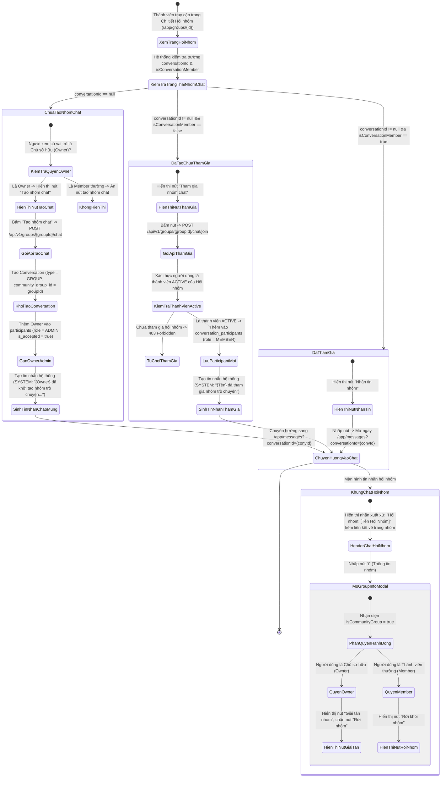
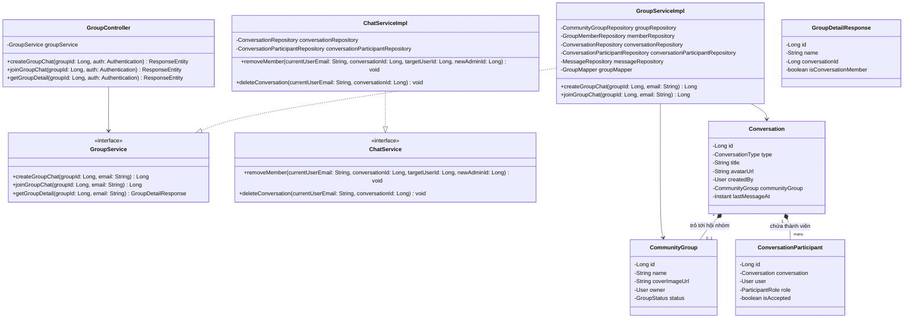
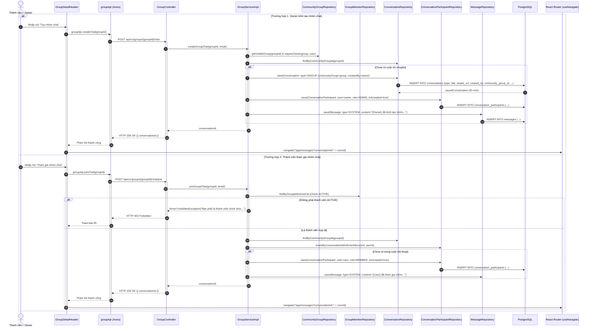

# ĐẶC TẢ YÊU CẦU & THIẾT KẾ CHI TIẾT: UC_COMMUNITY_GROUP_CHAT - NHẮN TIN HỘI NHÓM (COMMUNITY GROUP CHAT)

## PHẦN 1: ĐẶC TẢ NGHIỆP VỤ (REPORT 3)

### 2.2.3 Business Workflow (Luồng nghiệp vụ)



#### Mô tả chi tiết luồng xử lý bằng chữ (Business Step Description):
* **Bước 1 - Khởi đầu (Entry Point tại trang Hội nhóm)**:
  * Người dùng đăng nhập truy cập trang Chi tiết Hội nhóm (`/app/groups/{id}`).
  * Hệ thống tải thông tin chi tiết qua API `GET /api/v1/groups/{id}` kèm các trường thông tin:
    * `conversationId`: Mã nhóm trò chuyện liên kết (nếu hội nhóm đã khởi tạo nhóm chat).
    * `isConversationMember`: Cờ xác định người xem hiện tại đã gia nhập nhóm trò chuyện này chưa.
* **Bước 2 - Các bước chuyển tiếp**:
  * **Trường hợp A: Hội nhóm chưa có nhóm trò chuyện (`conversationId == null`)**:
    * Chỉ có **Chủ sở hữu (Owner)** của Hội nhóm mới nhìn thấy nút **"Tạo nhóm chat"**.
    * Khi Owner nhấp "Tạo nhóm chat", hệ thống gọi `POST /api/v1/groups/{groupId}/chat`.
    * Backend khởi tạo một `Conversation` mới với:
      * `type = 'GROUP'`
      * `title = group.getName()`
      * `avatar_url = group.getCoverImageUrl()`
      * `community_group_id = group.getId()`
      * `created_by = Owner`
    * Owner được ghi nhận vào `conversation_participants` với vai trò `role = 'ADMIN'`.
    * Tự động sinh tin nhắn hệ thống (`MessageType.SYSTEM`): `"{Owner} đã khởi tạo nhóm trò chuyện cho hội nhóm \"{Tên Hội Nhóm}\""`.
    * Điều hướng người dùng ngay lập tức tới khung chat (`/app/messages?conversationId={newConvId}`).
  * **Trường hợp B: Hội nhóm đã có nhóm chat nhưng người xem chưa tham gia (`isConversationMember == false`)**:
    * Nếu người xem là thành viên chính thức (`ACTIVE`) của Hội nhóm, nút hiển thị là **"Tham gia nhóm chat"**.
    * Khi nhấp nút, hệ thống gọi `POST /api/v1/groups/{groupId}/chat/join`.
    * Backend kiểm tra tư cách thành viên `group_members.membership_status == 'ACTIVE'`. Nếu không phải thành viên, trả về lỗi `403 Forbidden`.
    * Ghi nhận người dùng vào `conversation_participants` với vai trò `role = 'MEMBER'`.
    * Tự động sinh tin nhắn hệ thống: `"{Tên thành viên} đã tham gia nhóm trò chuyện."`.
    * Điều hướng người dùng tới khung chat của nhóm.
  * **Trường hợp C: Người xem đã ở trong nhóm chat (`isConversationMember == true`)**:
    * Nút hiển thị là **"Nhắn tin nhóm"**. Nhấp nút sẽ mở ngay cuộc hội thoại tương ứng tại `/app/messages?conversationId={convId}`.
* **Bước 3 - Trải nghiệm trong khung chat & Đồng bộ vòng đời**:
  * **Thẻ xuất xứ Hội nhóm (Group Origin Banner)**:
    * Phía trên thanh Header của cuộc trò chuyện hiển thị nhãn phụ trang nhã: **`Hội nhóm: [Tên Hội Nhóm]`**.
    * Thành viên có thể nhấp trực tiếp vào nhãn này để chuyển nhanh về trang chủ của Hội nhóm.
  * **Thêm thành viên nội bộ**:
    * Trong `GroupInfoModal`, thành viên có thể tìm kiếm và thêm bạn bè vào nhóm chat. Danh sách tìm kiếm tự động loại bỏ các thành viên đã có mặt trong nhóm chat.
  * **Ràng buộc Chủ sở hữu (Owner Constraints)**:
    * Chủ sở hữu Hội nhóm **tuyệt đối không được phép tự rời nhóm chat** hoặc bị kick khỏi nhóm chat. Nếu bấm "Rời nhóm", hệ thống thông báo lỗi: *"Bạn là Chủ sở hữu của hội nhóm này nên không thể rời khỏi nhóm trò chuyện. Nếu muốn chuyển quyền, vui lòng chuyển quyền sở hữu hội nhóm tại trang Quản lý hội nhóm."*.
  * **Đồng bộ tự động 2 chiều khi Rời / Bị xóa khỏi Hội nhóm**:
    * Khi thành viên tự rời Hội nhóm (`leaveGroup`) hoặc bị Ban quản trị xóa khỏi Hội nhóm (`removeMember`), Backend tự động tìm cuộc hội thoại liên kết và xóa tài khoản đó khỏi `conversation_participants` của nhóm chat.
  * **Chuyển giao quyền sở hữu Hội nhóm**:
    * Khi Owner chuyển giao quyền sở hữu hội nhóm cho người kế nhiệm, quyền Trưởng nhóm chat (`ADMIN`) trong `conversation_participants` và quyền sở hữu cuộc trò chuyện `created_by` tự động được bàn giao cho Chủ sở hữu mới.
  * **Giải tán nhóm chat**:
    * Chỉ Chủ sở hữu Hội nhóm mới có nút **"Giải tán nhóm"** trong Modal Thông tin nhóm. Toàn bộ tin nhắn và thành viên nhóm chat sẽ bị xóa vĩnh viễn.

---

### 3.2 Module Quản Lý Hội Nhóm & Nhắn Tin (Community Groups & Messaging)

#### 3.2.1 Nhắn tin Hội nhóm (UC_COMMUNITY_GROUP_CHAT - Community Group Chat)

**Function trigger**:
* **Navigation path**:
  * Từ trang Chi tiết Hội nhóm: `/app/groups/{id}` $\rightarrow$ Nút "Tạo nhóm chat" / "Tham gia nhóm chat" / "Nhắn tin nhóm".
  * Từ trang Tin nhắn: `/app/messages` $\rightarrow$ Nhấp vào hội thoại có gắn nhãn Hội nhóm trong danh sách chat.
* **Timing Frequency**: Theo nhu cầu người dùng (On demand).

**Function description**:
* **Actors/Roles**:
  * **Chủ sở hữu Hội nhóm (Owner)**: Có quyền khởi tạo nhóm chat, giải tán nhóm chat, kick thành viên khỏi nhóm chat, đổi ảnh/tên nhóm chat.
  * **Thành viên Hội nhóm (Active Member)**: Có quyền tham gia nhóm chat, nhắn tin, gửi ảnh/tệp, thêm bạn bè vào nhóm chat, tự rời nhóm chat.
  * **Người dùng chưa tham gia Hội nhóm / Khách**: Bị từ chối quyền tham gia nhóm chat (`403 Forbidden`).
* **Purpose**: Cung cấp kênh trao đổi thời gian thực (Real-time Messaging) gắn liền với từng Hội nhóm sinh viên / cựu sinh viên, giúp gắn kết các thành viên, thảo luận công việc và hoạt động của Hội nhóm.
* **Interface**:
  * **Nút hành động trên Header trang Hội nhóm (`GroupDetailHeader.tsx`)**:
    * Nút "Tạo nhóm chat" (màu tím/xanh nhạt, chỉ hiện với Owner khi chưa có chat).
    * Nút "Tham gia nhóm chat" (màu cam nổi bật, hiện với thành viên ACTIVE chưa vào chat).
    * Nút "Nhắn tin nhóm" (màu xanh/tím, hiện khi thành viên đã ở trong chat).
  * **Header cuộc trò chuyện (`ChatWindow.tsx`)**:
    * Huy hiệu xuất xứ: Icon Hội nhóm kèm text `Hội nhóm: [Tên Hội Nhóm]`, có hiệu ứng hover và liên kết trực tiếp về `/app/groups/{id}`.
  * **Modal Thông tin nhóm (`GroupInfoModal.tsx`)**:
    * Hiển thị nhận diện Hội nhóm liên kết.
    * Danh sách thành viên kèm role `ADMIN` (Owner) và `MEMBER`.
    * Nút "Giải tán nhóm" màu đỏ (chỉ hiển thị cho Owner).
    * Nút "Rời khỏi nhóm" (cho thành viên thường, bị vô hiệu hóa/thông báo chặn đối với Owner).

**Data processing**:
* Kiểm tra quan hệ 1-1 giữa `community_groups` và `conversations` thông qua khóa ngoại `community_group_id`.
* Đồng bộ phân quyền và vòng đời giữa tư cách thành viên hội nhóm (`group_members`) và người tham gia chat (`conversation_participants`).

---

### 5. Requirement Appendix (Phụ lục Yêu cầu)

#### 5.1 Business Rules (Quy tắc Nghiệp vụ)

| ID | Định nghĩa Quy tắc (Rule Definition) |
| :--- | :--- |
| **BR-CG01** | Mỗi Hội nhóm (`community_groups`) chỉ được phép có tối đa **1 nhóm trò chuyện chính thức** duy nhất (ràng buộc `uq_conversations_community_group`). |
| **BR-CG02** | Chỉ có **Chủ sở hữu (Owner)** của Hội nhóm đang hoạt động (`ACTIVE`) mới có quyền khởi tạo nhóm trò chuyện cho Hội nhóm (`POST /api/v1/groups/{groupId}/chat`). |
| **BR-CG03** | Chỉ người dùng đang là thành viên chính thức (`membership_status = 'ACTIVE'`) của Hội nhóm mới được phép tham gia nhóm trò chuyện (`POST /api/v1/groups/{groupId}/chat/join`). Người ngoài nhóm nhận lỗi `403 Forbidden`. |
| **BR-CG04** | Chủ sở hữu Hội nhóm luôn là **Trưởng nhóm (`ADMIN`)** của nhóm chat. Quyền Trưởng nhóm này gắn liền với chức danh Owner của Hội nhóm và không thể chuyển giao độc lập trong khung chat. |
| **BR-CG05** | Chủ sở hữu Hội nhóm **tuyệt đối không được phép rời nhóm chat** (`removeMember` ném ra `400 Bad Request`). Muốn rời, Chủ sở hữu phải chuyển quyền sở hữu Hội nhóm tại trang Quản lý hội nhóm trước. |
| **BR-CG06** | Khi một thành viên rời Hội nhóm hoặc bị Ban quản trị xóa khỏi Hội nhóm, hệ thống **tự động xóa tài khoản đó khỏi nhóm chat** của Hội nhóm (`deleteByConversationIdAndUserId`). |
| **BR-CG07** | Khi Chủ sở hữu Hội nhóm chuyển quyền sở hữu cho người kế nhiệm, quyền Trưởng nhóm chat (`ADMIN`) và người tạo (`created_by`) trong cuộc hội thoại tự động được chuyển sang cho Chủ sở hữu mới. |
| **BR-CG08** | Chỉ có Chủ sở hữu Hội nhóm mới có quyền **Giải tán nhóm trò chuyện** (`DELETE /api/v1/conversations/{id}`). |

#### 5.3 Application Messages List (Danh sách Thông điệp Ứng dụng)

| # | Mã thông điệp | Loại | Ngữ cảnh | Nội dung hiển thị |
| :--- | :--- | :--- | :--- | :--- |
| 1 | `MSG_CG01` | Toast Success | Tạo nhóm chat hội nhóm thành công | *"Khởi tạo nhóm trò chuyện thành công!"* |
| 2 | `MSG_CG02` | Toast Success | Tham gia nhóm chat hội nhóm thành công | *"Đã tham gia nhóm trò chuyện!"* |
| 3 | `MSG_CG03` | Toast Error | Người ngoài hội nhóm cố tham gia chat | *"Bạn phải là thành viên chính thức của hội nhóm để tham gia nhóm trò chuyện."* |
| 4 | `MSG_CG04` | Toast Error | Owner cố bấm rời nhóm chat hội nhóm | *"Bạn là Chủ sở hữu của hội nhóm này nên không thể rời khỏi nhóm trò chuyện. Nếu muốn chuyển quyền, vui lòng chuyển quyền sở hữu hội nhóm tại trang Quản lý hội nhóm."* |
| 5 | `MSG_CG05` | System Message | Khởi tạo nhóm chat | *"{Tên Owner} đã khởi tạo nhóm trò chuyện cho hội nhóm \"{Tên Nhóm}\""* |
| 6 | `MSG_CG06` | System Message | Thành viên tham gia nhóm chat | *"{Tên thành viên} đã tham gia nhóm trò chuyện."* |
| 7 | `MSG_CG07` | Toast Success | Giải tán nhóm trò chuyện | *"Đã giải tán nhóm trò chuyện thành công"* |

---

## PHẦN 2: THIẾT KẾ KỸ THUẬT (REPORT 4)

### 3.1 Detailed Technical Design (Thiết kế Kỹ thuật Chi tiết)

#### 3.1.1 Class Diagram (Sơ đồ Lớp)



#### 3.1.2 Sequence Diagram (Sơ đồ Tuần tự Khởi tạo & Tham gia Chat Hội Nhóm)



#### 3.1.3 Thiết kế Cơ sở Dữ liệu & Ràng buộc (Database Migration V12)

Cơ chế nhóm trò chuyện hội nhóm sử dụng migration `V12__add_community_group_to_conversations.sql`:

```sql
-- Thêm cột liên kết hội nhóm trong bảng conversations:
ALTER TABLE conversations
    ADD COLUMN community_group_id BIGINT REFERENCES community_groups(id) ON DELETE SET NULL;

-- Ràng buộc duy nhất: Mỗi hội nhóm chỉ được có tối đa 1 cuộc trò chuyện nhóm
CREATE UNIQUE INDEX uq_conversations_community_group
    ON conversations(community_group_id)
    WHERE community_group_id IS NOT NULL;
```
