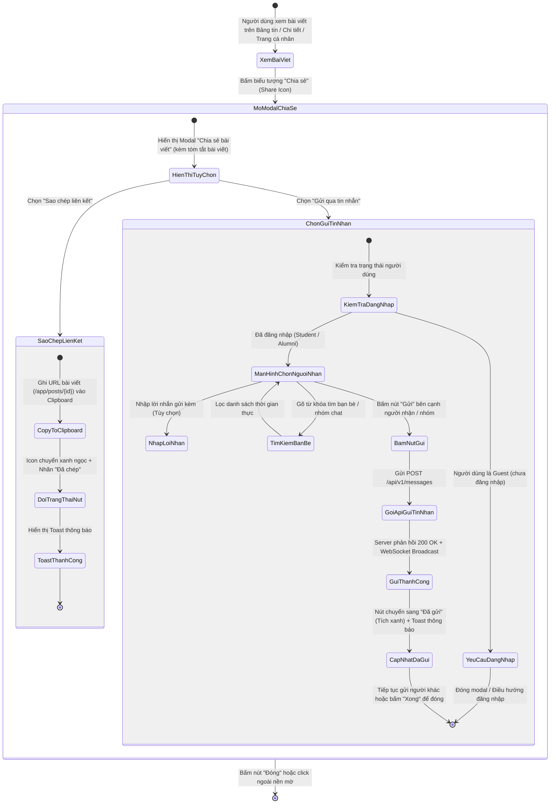
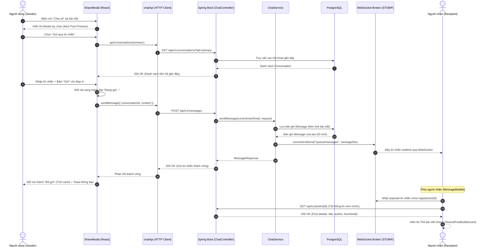
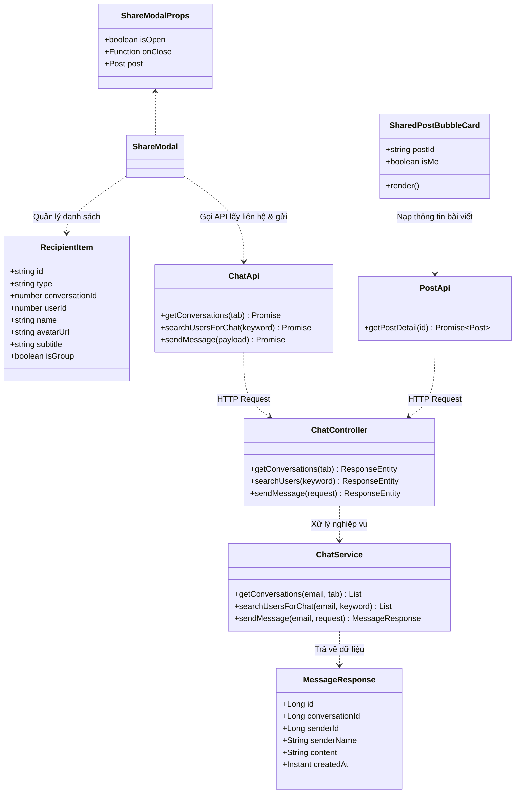

# ĐẶC TẢ YÊU CẦU & THIẾT KẾ CHI TIẾT: UC_SHARE_POST - CHIA SẺ BÀI VIẾT (SHARE POST)

## PHẦN 1: ĐẶC TẢ NGHIỆP VỤ (REPORT 3)

### 2.2.3 Business Workflow (Luồng nghiệp vụ)



#### Mô tả chi tiết luồng xử lý bằng chữ (Business Step Description):
* **Bước 1 - Kích hoạt hành động**: Người dùng duyệt bài viết trên Bảng tin cộng đồng (`FeedPage`), Trang tin tuyển dụng (`JobsPage`), Trang sự kiện (`EventsPage`), Chi tiết bài viết (`PostDetailPage`) hoặc Trang cá nhân (`ProfilePage`), sau đó bấm vào nút biểu tượng **Chia sẻ** tại chân bài viết.
* **Bước 2 - Mở Modal Chia sẻ (`ShareModal`)**:
  * Hệ thống mở cửa sổ pop-up hiển thị bản xem trước thu nhỏ của bài viết (Ảnh đại diện tác giả, họ tên, trích dẫn nội dung, thumbnail).
  * Cung cấp 2 phương thức chia sẻ trực quan:
    * **1. Gửi qua tin nhắn**: Chia sẻ trực tiếp vào hộp thư cá nhân hoặc nhóm chat trong hệ thống AlumNect.
    * **2. Sao chép liên kết**: Lấy đường dẫn trực tiếp của bài viết để chia sẻ ra ngoài nền tảng.
* **Bước 3 - Xử lý theo từng phương thức**:
  * **Trường hợp A - Sao chép liên kết**:
    * Hệ thống tự động tổng hợp đường dẫn tuyệt đối: `${window.location.origin}/app/posts/{post.id}`.
    * Thực hiện ghi vào bộ nhớ tạm thông qua Clipboard API (`navigator.clipboard.writeText`).
    * Giao diện nút bấm tức thì chuyển sang biểu tượng tích xanh ngọc bích `<Check />`, đổi nhãn thành *"Đã sao chép liên kết!"* kèm badge *"Đã chép"* trong 2 giây và hiển thị thông báo Toast thành công.
  * **Trường hợp B - Gửi qua tin nhắn nội bộ**:
    * Hệ thống kiểm tra quyền người dùng: Nếu là Guest chưa đăng nhập, hiển thị thông báo yêu cầu đăng nhập.
    * Nếu đã đăng nhập: Modal chuyển mượt sang giao diện chọn người nhận với bố cục tối ưu (Header, Post Preview, Ô nhập lời nhắn, Ô tìm kiếm và Footer được cố định; chỉ riêng danh sách người nhận là cuộn mượt).
    * Người dùng có thể:
      * Nhập lời nhắn riêng gửi kèm (ví dụ: *"Bài viết này bổ ích lắm, bạn xem thử nhé!"*).
      * Tìm kiếm nhanh bạn bè hoặc nhóm trò chuyện theo tên/chuyên ngành qua ô tìm kiếm (tự động debounce 300ms và tải qua API).
      * Xem danh sách các cuộc trò chuyện gần đây (cả 1-1 và nhóm chat).
    * Bấm nút **"Gửi"** bên cạnh người nhận mong muốn: Nút hiển thị hiệu ứng xoay tròn `Đang gửi...` -> gọi API `POST /api/v1/messages` -> Server lưu DB và phát sự kiện realtime qua STOMP WebSocket -> Nút chuyển thành `Đã gửi` với dấu tích xanh và phát thông báo Toast.
    * Người dùng có thể tiếp tục bấm gửi cho nhiều bạn bè/nhóm khác nhau mà không bị đóng modal.
* **Bước 4 - Trải nghiệm phía người nhận tin nhắn**:
  * Khi người nhận mở đoạn chat trong hệ thống Messenger AlumNect, tin nhắn sẽ hiển thị lời nhắn của người gửi kèm theo **Thẻ bài viết tương tác (Shared Post Embed Card)**:
    * Avatar, tên tác giả bài viết, thời gian/vai trò.
    * Ảnh đại diện bài viết (Thumbnail) và badge phân loại (Sự kiện, Tuyển dụng, Thành tích).
    * Đoạn trích dẫn nội dung bài viết.
    * Nút **"Xem bài viết"** bấm vào sẽ chuyển thẳng đến trang chi tiết bài viết gốc (`/app/posts/{id}`).

---

### 3.2 Module 3 - Social: Feed, Posts, Events & Messaging
Module tương tác xã hội của AlumNect, kết nối chặt chẽ giữa Bảng tin cộng đồng (Community Feed) và Hệ thống Nhắn tin thời gian thực (Real-time Messaging).

#### 3.2.1 Chia sẻ bài viết (Share Post)

**Function trigger**:
*   **Navigation path**: Nút bấm biểu tượng Chia sẻ (Share) tại chân mỗi bài viết trên:
    * `/app` (Bảng tin chính).
    * `/app/posts/:id` (Trang chi tiết bài viết).
    * `/app/jobs` (Trang bảng tin tuyển dụng).
    * `/app/events` (Trang bảng tin sự kiện).
    * `/app/profile/:id` (Tab bài viết trên trang cá nhân).
*   **Timing Frequency**: On demand (bất cứ khi nào người dùng bấm nút Chia sẻ bài viết).

**Function description**:
*   **Actors/Roles**: Guest (chỉ sao chép link), Student, Alumni, Admin.
*   **Purpose**: Lan tỏa bài viết chất lượng trong cộng đồng; hỗ trợ chia sẻ liên kết ra ngoài hoặc gửi trực tiếp cho bạn bè, nhóm thảo luận nội bộ AlumNect mà không làm gián đoạn trải nghiệm lướt bảng tin.
*   **Interface**:
    *   `ShareModal`: Modal hộp thoại nổi bo góc mềm mại (`rounded-3xl`), hiệu ứng mờ nền (`backdrop-blur-xs`), chuẩn responsive trên cả Desktop lẫn Mobile.
    *   **Màn hình 1 - Tùy chọn chia sẻ**:
        *   Mini Context Card: Thumbnail bài viết, tên tác giả, đoạn trích dẫn.
        *   Tùy chọn *"Gửi qua tin nhắn"*: Icon gradient xanh dương, mũi tên điều hướng `>`.
        *   Tùy chọn *"Sao chép liên kết"*: Icon slate chuyển emerald khi chép thành công.
    *   **Màn hình 2 - Gửi qua tin nhắn**:
        *   Header có nút mũi tên quay lại `←` và tiêu đề "Gửi qua tin nhắn".
        *   Ô nhập lời nhắn tùy chọn (`textarea`).
        *   Ô tìm kiếm bạn bè / nhóm chat có icon kính lúp và vòng xoay loading.
        *   Danh sách liên hệ: Avatar, tên, chuyên ngành/thành viên, nút trạng thái (Gửi / Đang gửi / Đã gửi).
        *   Footer cố định có nút "Quay lại" và "Xong/Đóng".
    *   **Thẻ hiển thị trong đoạn chat (`SharedPostBubbleCard`)**:
        *   Khung thẻ bài viết tương tác tích hợp bên dưới bong bóng chat.
        *   Ảnh thumbnail, badge loại bài viết, avatar + tên tác giả, nút điều hướng chi tiết.

**Data processing**:
*   **Sao chép liên kết**: Đọc `window.location.origin` và `post.id` để tạo URL dạng `${origin}/app/posts/${post.id}` và gọi `navigator.clipboard.writeText(url)`.
*   **Tìm kiếm người nhận**: Gọi `GET /api/v1/conversations/users/search?keyword={kw}` với debounce 300ms, đồng thời lọc danh sách hội thoại gần đây `GET /api/v1/conversations?tab=primary`.
*   **Gửi tin nhắn**: Tạo payload gửi tới `POST /api/v1/messages`:
    *   Nếu gửi vào cuộc trò chuyện có sẵn: `{ conversationId: number, content: string }`.
    *   Nếu gửi trực tiếp cho người dùng mới: `{ recipientId: number, content: string }`.
    *   Nội dung `content` ghép giữa lời nhắn của người dùng và link bài viết: `"{customNote}\n\n{postUrl}"` (hoặc chỉ `{postUrl}` nếu không có lời nhắn).
*   **Kết xuất thẻ tương tác phía chat**: `MessageBubble` kiểm tra regex `/(?:https?:\/\/[^\s]+)?\/app\/posts\/(\d+)/`, nếu tìm thấy ID bài viết sẽ kích hoạt component `SharedPostBubbleCard` gọi `GET /api/v1/posts/{id}` (có cơ chế in-memory caching) để hiển thị thẻ tóm tắt tương tác.

**Function details**:
*   **Data**: `postId`, `postUrl`, `customNote`, `conversationId`, `recipientId`, `content`.
*   **Validation**:
    *   `postId` phải là số nguyên dương hợp lệ và bài viết tồn tại trong hệ thống.
    *   `customNote` tối đa 1.000 ký tự.
    *   Phải chỉ định ít nhất một trong hai trường: `conversationId` hoặc `recipientId`.
*   **Business rules**:
    *   **BR-SHARE-01**: Khách vãng lai (Guest) chỉ được phép sử dụng tính năng "Sao chép liên kết". Khi bấm vào "Gửi qua tin nhắn", hệ thống yêu cầu đăng nhập.
    *   **BR-SHARE-02**: Bài viết đang ở trạng thái ẩn hoặc vi phạm (`is_hidden = true`) không cho phép chia sẻ; nếu truy cập từ link cũ, hệ thống báo lỗi không tìm thấy bài viết.
    *   **BR-SHARE-03**: Tin nhắn chia sẻ bài viết được đối xử như một tin nhắn thông thường, tự động phát qua WebSocket STOMP tới tất cả các thành viên tham gia hội thoại ngay lập tức.
    *   **BR-SHARE-04**: Trong modal chia sẻ, sau khi bấm gửi thành công cho một người nhận, nút của người đó chuyển sang trạng thái "Đã gửi" và bị vô hiệu hóa (disabled) để tránh bấm gửi trùng lặp; người dùng vẫn có thể tiếp tục bấm gửi cho những người khác trong cùng một phiên mở modal.
    *   **BR-SHARE-05**: Bố cục của modal phải đảm bảo không xuất hiện thanh cuộn ngoài cho toàn bộ cửa sổ (outer scrollbar); chỉ phần danh sách người nhận mới có thanh cuộn độc lập (`overflow-y-auto`).

---

### 5. Requirement Appendix (Phụ lục Yêu cầu)

#### 5.1 Business Rules (Quy tắc Nghiệp vụ)

| ID | Định nghĩa Quy tắc (Rule Definition) |
| :--- | :--- |
| BR-SHARE-01 | Guest chỉ được phép sao chép liên kết bài viết; bắt buộc đăng nhập để gửi qua tin nhắn nội bộ. |
| BR-SHARE-02 | Bài viết đã bị Admin ẩn (`is_hidden = true`) hoặc đã bị xóa không thể chia sẻ. |
| BR-SHARE-03 | Tin nhắn chia sẻ bài viết được lưu trữ vào CSDL và phát realtime qua kênh WebSocket của cuộc trò chuyện. |
| BR-SHARE-04 | Trạng thái "Đã gửi" được ghi nhớ theo từng người nhận trong phiên mở modal, chống spam/gửi đúp. |
| BR-SHARE-05 | Khung Modal, Header, Form ghi chú, Ô tìm kiếm và Footer luôn cố định; chỉ danh sách liên hệ là cuộn nội bộ. |

#### 5.3 Application Messages List (Danh sách Thông điệp Ứng dụng)

| # | Mã thông điệp | Loại thông điệp | Ngữ cảnh | Nội dung hiển thị |
| :--- | :--- | :--- | :--- | :--- |
| 1 | MSG-SHARE-01 | Toast (Success) | Sao chép liên kết thành công | "Đã sao chép liên kết bài viết!" |
| 2 | MSG-SHARE-02 | Toast (Error) | Trình duyệt chặn quyền truy cập Clipboard | "Không thể sao chép liên kết" |
| 3 | MSG-SHARE-03 | Toast (Success) | Gửi bài viết qua tin nhắn thành công | "Đã gửi bài viết tới {recipient_name}!" |
| 4 | MSG-SHARE-04 | Toast (Error) | Gặp sự cố mạng hoặc lỗi gửi tin | "Không thể gửi tới {recipient_name}. Vui lòng thử lại." |
| 5 | MSG-SHARE-05 | In-line empty | Tìm kiếm không có bạn bè/nhóm nào | "Không tìm thấy người nhận hoặc nhóm phù hợp" |

---

## PHẦN 2: THIẾT KẾ KỸ THUẬT & HỆ THỐNG (REPORT 4)

### 1. Sequence Diagram (Sơ đồ Tuần tự: Gửi bài viết qua tin nhắn)



---

### 2. Class Diagram (Sơ đồ Lớp Hệ thống)



---

### 3. Chi tiết API Đặc tả (API Endpoint Specification)

#### API 1: Gửi bài viết vào cuộc hội thoại
*   **Endpoint**: `POST /api/v1/messages`
*   **Headers**: `Authorization: Bearer <access_token>`, `Content-Type: application/json`
*   **Request Body**:
```json
{
  "conversationId": 12,
  "content": "Bài viết này rất hữu ích, bạn xem qua nhé!\n\nhttp://localhost:5173/app/posts/5"
}
```
*   **Response (`200 OK`)**:
```json
{
  "status": 200,
  "message": "Gửi tin nhắn thành công.",
  "data": {
    "id": 142,
    "conversationId": 12,
    "senderId": 1,
    "senderName": "Nguyễn Văn A",
    "content": "Bài viết này rất hữu ích, bạn xem qua nhé!\n\nhttp://localhost:5173/app/posts/5",
    "createdAt": "2026-09-30T10:20:00Z"
  }
}
```

#### API 2: Lấy chi tiết bài viết phục vụ thẻ nhúng
*   **Endpoint**: `GET /api/v1/posts/{id}`
*   **Headers**: `Authorization: Bearer <access_token>`
*   **Response (`200 OK`)**:
```json
{
  "status": 200,
  "message": "Lấy chi tiết bài viết thành công.",
  "data": {
    "id": "5",
    "type": "recruitment",
    "author": "Phạm Hoàng Dũng",
    "avatar": "https://pub-xxxx.r2.dev/avatar.jpg",
    "time": "4d",
    "text": "TEAM MÌNH CẦN TÌM ĐỒNG ĐỘI SENIOR JAVA SPRING BOOT & REACT...",
    "image": "https://pub-xxxx.r2.dev/job-banner.jpg",
    "likes": 12,
    "comments": 4,
    "reposts": 2
  }
}
```
