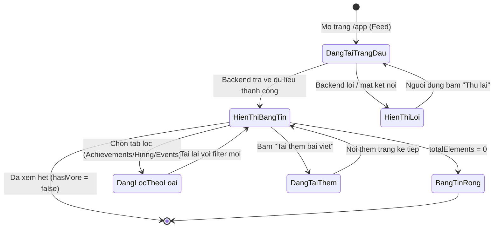
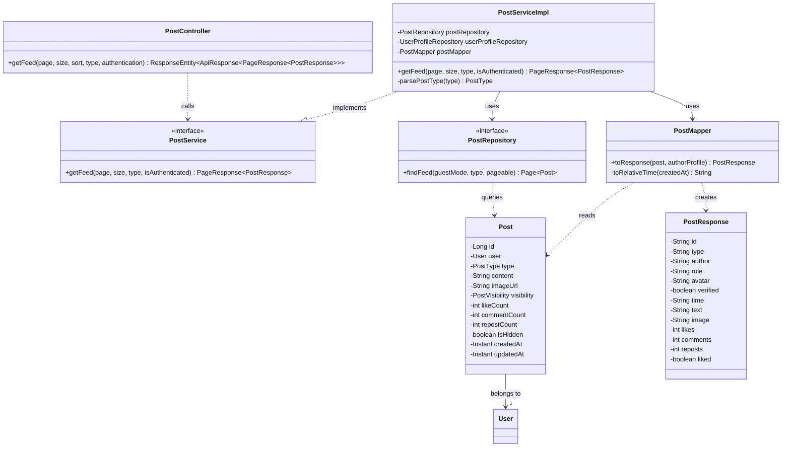
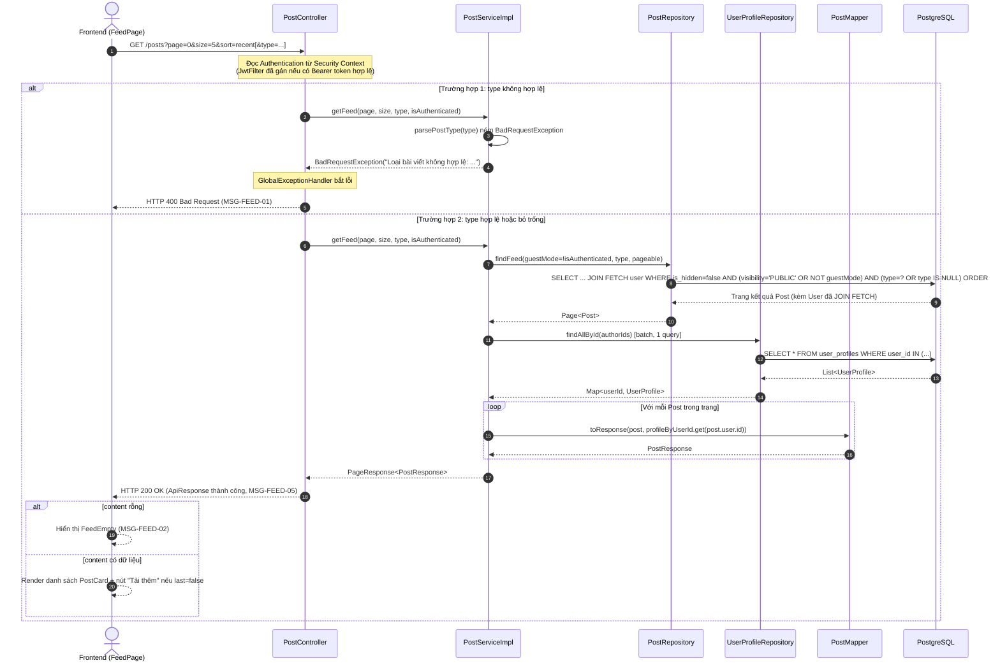

# ĐẶC TẢ YÊU CẦU & THIẾT KẾ CHI TIẾT: UC15 - Xem bảng tin cộng đồng (View community Feed)

## PHẦN 1: ĐẶC TẢ NGHIỆP VỤ (REPORT 3)

### 2.2.3 Business Workflow (Luồng nghiệp vụ)

#### Mô tả chi tiết luồng xử lý bằng chữ (Business Step Description):
- **Bước 1 - Khởi đầu**: Người dùng (Guest/Student/Alumni) mở trang `/app`. Frontend gọi `useFeed('all')` → `GET /api/v1/posts?page=0&size=5&sort=recent`.
- **Bước 2 - Xác định quyền xem**: Backend kiểm tra `Authentication` trong Security Context (do `JwtFilter` gán nếu có Bearer token hợp lệ). Nếu không có/token không hợp lệ → coi là **Guest**; ngược lại → **thành viên** (Student/Alumni/Admin).
- **Bước 3 - Truy vấn dữ liệu**: Backend truy vấn bảng `posts`, loại trừ bài đã ẩn (`is_hidden = true`). Guest chỉ nhận bài `visibility = PUBLIC`; thành viên nhận toàn bộ bài chưa ẩn. Nếu có tham số `type`, lọc thêm theo loại bài viết. Sắp xếp theo `created_at DESC`.
- **Bước 4 - Trả kết quả**: Backend trả về trang kết quả (`content`, `pageNumber`, `totalElements`, `totalPages`, `last`) bọc trong `ApiResponse`.
- **Bước 5 - Hiển thị**: Frontend xác thực từng phần tử bằng Zod (`postSchema.safeParse`), bỏ qua phần tử hỏng, hiển thị danh sách `PostCard`. Nếu `content` rỗng → hiển thị `FeedEmpty`. Nếu lỗi mạng/HTTP → hiển thị `FeedError` kèm nút "Thử lại".
- **Bước 6 - Lọc & tải thêm**: Người dùng chọn tab lọc → tạo `queryKey` mới → gọi lại từ trang 0. Người dùng bấm "Tải thêm bài viết" → gọi trang kế tiếp, nối vào danh sách hiện có cho tới khi `last = true`.

### 3.2 Module 3 - Social: Feed, Posts, Events, Packages & Messaging
Module chứa các tính năng tương tác cộng đồng của AlumNect: bảng tin, bài viết, sự kiện, gói dịch vụ và nhắn tin. UC15 là chức năng nền tảng đầu tiên của module — hiển thị dòng thời gian hoạt động của cộng đồng cựu sinh viên.

#### 3.2.1 Xem bảng tin cộng đồng (View community Feed)

**Function trigger**:
- **Navigation path**: `/app` (trang mặc định sau khi vào khu vực đã đăng nhập; Guest cũng truy cập được).
- **Timing Frequency**: On screen mount (tải trang đầu); on-demand khi đổi filter hoặc bấm "Tải thêm bài viết".

**Function description**:
- **Actors/Roles**: Guest, Student, Alumni (Admin không phải actor chính của UC này nhưng kỹ thuật vẫn xem được bảng tin như một thành viên).
- **Purpose**: Cho phép mọi đối tượng xem hoạt động mới nhất của cộng đồng cựu sinh viên; khuyến khích Guest đăng ký để tương tác đầy đủ.
- **Interface**:
  - Ô soạn bài (`Composer`, chỉ Student/Alumni) hoặc banner mời đăng nhập (`GuestPrompt`, chỉ Guest).
  - Tabs lọc: All / Achievements / Hiring / Events.
  - Danh sách `PostCard`: avatar, tên, badge loại bài, thời gian, nội dung, ảnh (nếu có), số like/comment/repost, nút hành động.
  - Trạng thái: Loading (`PostSkeleton` × 3), Rỗng (`FeedEmpty`), Lỗi (`FeedError` + nút Thử lại), nút "Tải thêm bài viết" / "Bạn đã xem hết bảng tin".

**Data processing**:
1. Frontend gọi `GET /api/v1/posts?page&size&sort=recent[&type]`.
2. Backend đọc `Authentication` từ Security Context → xác định `isAuthenticated`.
3. Backend truy vấn `PostRepository.findFeed(guestMode, type, pageable)` — JOIN FETCH tác giả (User) để tránh N+1.
4. Backend batch-fetch `UserProfile` của toàn bộ tác giả trong trang (1 query `findAllById`) để lấy tên/avatar/headline.
5. `PostMapper` ghép Post + User + UserProfile → `PostResponse` (bao gồm tính chuỗi thời gian tương đối).
6. Backend trả `ApiResponse<PageResponse<PostResponse>>`.
7. Frontend validate bằng Zod, cập nhật cache TanStack Query theo `queryKey: ['feed', filter]`.

**Screen layout**:
- Bố cục 2 cột trên desktop: cột trái (bảng tin chính, `max-w-6xl` chia `1fr` + `320px`), cột phải (sidebar gợi ý follow/event/Q&A, ẩn trên mobile).
- Responsive: cột phải ẩn trên màn hình nhỏ hơn `lg`, `PostCard` full-width.

**Function details**:
- **Data**: `id`, `type`, `author`, `role`, `avatar`, `verified`, `time`, `text`, `image`, `likes`, `comments`, `reposts`, `liked`.
- **Validation**:
  - `page` (số nguyên ≥ 0, mặc định 0), `size` (số nguyên dương, mặc định 5).
  - `type` (nếu có): phải thuộc {`normal`, `achievement`, `recruitment`, `event`} — sai định dạng trả về **MSG-FEED-01**.
- **Business rules**: xem mục 5.1 (BR-08, BR-11, BR-12).
- **Error Handling**: lỗi validate `type` → HTTP 400 (MSG-FEED-01); lỗi hệ thống/mất kết nối → HTTP 500, Frontend hiển thị `FeedError` với nút "Thử lại" gọi `refetch()`.
- **Normal case**: Trả về đúng số bài viết theo quyền xem, phân trang chính xác, hiển thị mượt trên UI.
- **Abnormal case**: DB không có bài viết nào → `content = []`, Frontend hiển thị `FeedEmpty` (MSG-FEED-02); tham số `type` sai → 400 (MSG-FEED-01).

---

### 5. Requirement Appendix (Phụ lục Yêu cầu)

#### 5.1 Business Rules (Quy tắc Nghiệp vụ)

| ID | Định nghĩa Quy tắc (Rule Definition) |
| :--- | :--- |
| BR-08 | Bài viết đã bị Admin ẩn (`is_hidden = true`) không xuất hiện trong bảng tin của bất kỳ ai. |
| BR-11 | Việc ẩn bài viết là xóa mềm (soft-hide) — dữ liệu vẫn được giữ nguyên trong DB, không xóa cứng. |
| BR-12 | Guest (chưa đăng nhập) chỉ xem được bài viết có `visibility = PUBLIC`; bài viết `MEMBERS` chỉ hiển thị cho người dùng đã đăng nhập (Student/Alumni/Admin). |
| BR-13 | Bảng tin luôn sắp xếp theo thời gian tạo mới nhất trước (`created_at DESC`). |
| BR-14 | Trường `liked` luôn trả về `false` ở UC15 — trạng thái "đã thích" theo từng người xem thuộc phạm vi UC "Like Post" (chưa triển khai). |

#### 5.2 Common Requirements (Yêu cầu Chung)
- Dữ liệu bảng tin được phân trang (`page`/`size`), không tải toàn bộ một lần.
- Mọi thời gian hiển thị theo định dạng tương đối ngắn gọn (VD: "5m", "3h", "2d"), tính theo giờ Asia/Ho_Chi_Minh mặc định của hệ thống.
- Giao tiếp Client–Server qua HTTPS/TLS ở môi trường production.

#### 5.3 Application Messages List (Danh sách Thông điệp Ứng dụng)

| # | Mã thông điệp | Loại thông điệp | Ngữ cảnh | Nội dung hiển thị | HTTP Status |
| :--- | :--- | :--- | :--- | :--- | :--- |
| 1 | MSG-FEED-01 | Toast/inline lỗi | Tham số `type` không hợp lệ | "Loại bài viết không hợp lệ: {type}" | 400 |
| 2 | MSG-FEED-02 | In line (empty state) | Bảng tin chưa có bài viết nào | "Chưa có bài viết nào — Hãy là người đầu tiên chia sẻ với cộng đồng cựu sinh viên." | 200 (content rỗng) |
| 3 | MSG-FEED-03 | In line (error state) | Lỗi tải bảng tin (mạng/server) | "Không tải được bảng tin — Đã có lỗi hệ thống xảy ra. Vui lòng thử lại." | 500 / network error |
| 4 | MSG-FEED-04 | In line | Guest cố tương tác (like/comment/repost/report) | "Đăng nhập để tương tác" (title trên nút bị disabled) | N/A (chặn ở Frontend) |
| 5 | MSG-FEED-05 | Success (implicit) | Lấy bảng tin thành công | "Lấy bảng tin thành công" | 200 |

---

## PHẦN 2: THIẾT KẾ CHI TIẾT (REPORT 4)

### 3.1 Xem bảng tin cộng đồng (View community Feed)

#### 3.1.1 Class Diagram (Sơ đồ Lớp)

###### Mô tả chi tiết cấu trúc các lớp (Class Design Description):
- **`PostController`**: tiếp nhận `GET /posts`, đọc `Authentication` do Spring Security cung cấp (null/`AnonymousAuthenticationToken` nếu là Guest), gọi `PostService`.
- **`PostResponse`**: DTO phẳng khớp 100% schema Zod `postSchema` phía Frontend — không cần tầng chuyển đổi thêm ở Client.
- **`PostService`/`PostServiceImpl`**: xử lý nghiệp vụ — parse & validate `type`, gọi Repository, batch-fetch `UserProfile` theo lô để tránh N+1, đóng gói `PageResponse`.
- **`PostMapper`**: (không dùng MapStruct `@Mapper` — lý do kỹ thuật: cần ghép dữ liệu từ 3 nguồn Post/User/UserProfile + tính relative-time, là logic tùy biến chứ không phải mapping field-to-field) ghép dữ liệu và tính chuỗi thời gian tương đối.
- **`PostRepository`**: JPQL `findFeed` — JOIN FETCH tác giả, lọc `isHidden=false`, lọc `visibility=PUBLIC` khi `guestMode=true`, lọc `type` nếu có, sắp xếp `createdAt DESC`.
- **`Post`** (Entity): ánh xạ bảng `posts`, quan hệ `@ManyToOne` tới `User` (tác giả).

#### 3.1.2 Sequence Diagram (Sơ đồ Tuần tự)

###### Mô tả chi tiết luồng xử lý bằng chữ (Sequence Flow Description):
1. **Luồng 1 - Thành công (Normal Case)**: Client gửi GET kèm tham số phân trang (và `type` tùy chọn). Controller xác định vai trò người xem qua `Authentication`. Service truy vấn 1 lần lấy trang bài viết (đã JOIN FETCH tác giả) + 1 lần batch-fetch hồ sơ tác giả (tổng cộng 2 query, không N+1). Mapper ghép dữ liệu, tính thời gian tương đối, trả `PostResponse`. Controller đóng gói `ApiResponse` thành công.
2. **Luồng 2 - Lỗi validate tham số (`type` không hợp lệ)**: `parsePostType` không khớp bất kỳ giá trị `PostType` nào → ném `BadRequestException`, `GlobalExceptionHandler` bắt và trả 400 kèm thông điệp tiếng Việt cụ thể.
3. **Luồng 3 - Rẽ nhánh RBAC (BR-12)**: Cờ `guestMode` được truyền thẳng vào JPQL — Guest không nhận được bất kỳ bài `MEMBERS` nào từ tầng DB (không lọc ở tầng ứng dụng), đảm bảo không rò rỉ dữ liệu qua sai sót logic Java.
4. **Luồng 4 - Hiển thị rỗng (Frontend)**: Khi `content = []` (không có bài viết nào khớp điều kiện), Frontend hiển thị `FeedEmpty` thay vì danh sách trống trơn.
