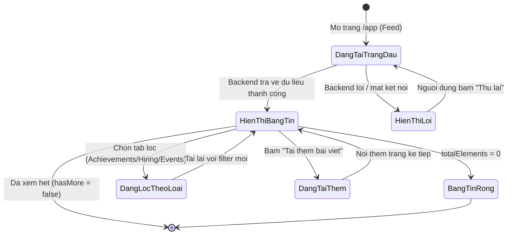
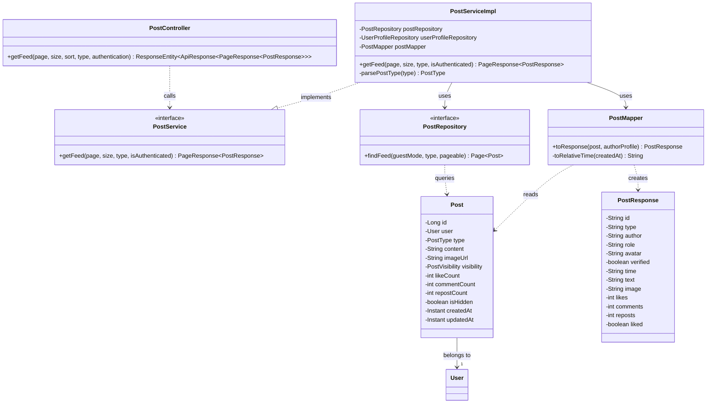
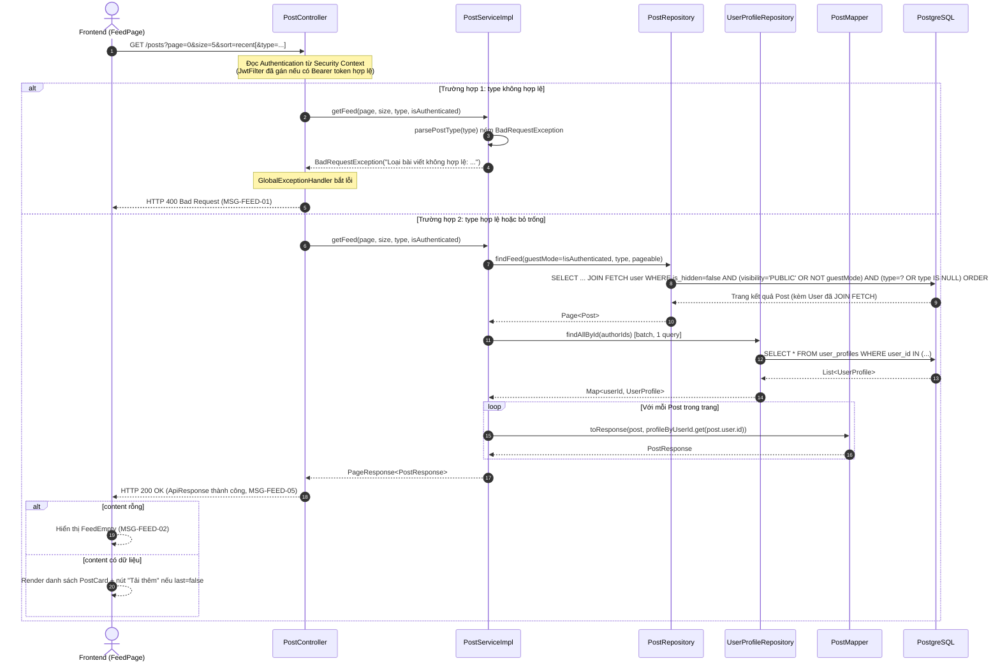

# ĐẶC TẢ YÊU CẦU & THIẾT KẾ CHI TIẾT: UC15 - Xem bảng tin cộng đồng (View community Feed)

## PHẦN 1: ĐẶC TẢ NGHIỆP VỤ (REPORT 3)

### 2.2.3 Business Workflow (Luồng nghiệp vụ)

```mermaid
stateDiagram-v2
    [*] --> DangTaiTrangDau : Mo trang /app (Feed)
    DangTaiTrangDau --> HienThiBangTin : Backend tra ve du lieu thanh cong
    DangTaiTrangDau --> HienThiLoi : Backend loi / mat ket noi
    HienThiLoi --> DangTaiTrangDau : Nguoi dung bam "Thu lai"
    HienThiBangTin --> BangTinRong : totalElements = 0
    HienThiBangTin --> DangLocTheoLoai : Chon tab loc (Achievements/Hiring/Events)
    DangLocTheoLoai --> HienThiBangTin : Tai lai voi filter moi
    HienThiBangTin --> DangTaiThem : Bam "Tai them bai viet"
    DangTaiThem --> HienThiBangTin : Noi them trang ke tiep
    HienThiBangTin --> [*] : Da xem het (hasMore = false)
    BangTinRong --> [*]
```

#### Mô tả chi tiết luồng xử lý bằng chữ (Business Step Description):
- **Bước 1 - Khởi đầu**: Người dùng (Guest/Student/Alumni) mở trang `/app`. Frontend gọi `useFeed('all', '')` → `GET /api/v1/posts?page=0&size=5`.
- **Bước 2 - Xác định quyền xem**: Backend kiểm tra `Authentication` trong Security Context (do `JwtFilter` gán nếu có Bearer token hợp lệ). Nếu không có/token không hợp lệ → coi là **Guest**; ngược lại → **thành viên** (Student/Alumni/Admin).
- **Bước 3 - Truy vấn & Xếp hạng thông minh 2 tầng (Two-Tier Unified Smart Feed)**:
  Hệ thống tính toán tổng số bài viết thực tế trong toàn bộ cơ sở dữ liệu (`totalElements`). 
  - **Tầng 1 (Smart Ranking Feed - 150 bài đầu tiên)**: Áp dụng thuật toán chấm điểm cá nhân hóa thống nhất (chuẩn Facebook/Instagram/LinkedIn) dựa trên: người đang theo dõi (+100), cùng chuyên ngành FPT (+45), cùng khóa học (+35/+20/+10), cùng cơ sở/thành phố (+15/+10), sinh viên xem bài cựu sinh viên (+25), chất lượng nội dung & hình ảnh, điểm tương tác logarit (Likes/Comments/Reposts), độ suy giảm trọng lực (Gravity Time-decay) và ưu đãi bài mới đăng (Freshness Boost). Bài vừa đăng được Frontend chèn tức thì lên đầu (Optimistic Prepend) và xếp hạng tự nhiên khi tải lại trang.
  - **Tầng 2 (Deep Chronological Feed - Khi cuộn sâu qua 150 bài)**: Tự động kết nối và tải trực tiếp các bài viết cũ hơn từ Database theo thứ tự thời gian (`createdAt DESC`), đảm bảo người dùng có thể lướt vô tận qua toàn bộ bài viết trong hệ thống mà không bao giờ bị dừng lại.
- **Bước 4 - Trả kết quả**: Backend trả về trang kết quả (`content`, `pageNumber`, `totalElements`, `totalPages`, `last`) bọc trong `ApiResponse`.
- **Bước 5 - Hiển thị**: Frontend xác thực từng phần tử bằng Zod (`postSchema.safeParse`), hiển thị danh sách `PostCard` tinh gọn, hiện đại. Nếu `content` rỗng → hiển thị `FeedEmpty`.
- **Bước 6 - Lọc danh mục & tải thêm**: Người dùng có thể lọc theo chuyên mục (Tất cả, Thành tựu, Tuyển dụng, Sự kiện) hoặc tìm kiếm từ khóa → cập nhật cache TanStack Query → tải trang mới. Hỗ trợ Infinite Scroll tự động tải thêm khi cuộn tới cuối trang.

### 3.2 Module 3 - Social: Feed, Posts, Events, Packages & Messaging
Module chứa các tính năng tương tác cộng đồng của AlumNect: bảng tin, bài viết, sự kiện, gói dịch vụ và nhắn tin. UC15 là chức năng nền tảng đầu tiên của module — hiển thị dòng thời gian hoạt động của cộng đồng cựu sinh viên.

#### 3.2.1 Xem bảng tin cộng đồng (View community Feed)

**Function trigger**:
- **Navigation path**: `/app` (trang mặc định sau khi vào khu vực đã đăng nhập; Guest cũng truy cập được).
- **Timing Frequency**: On screen mount (tải trang đầu); on-demand khi đổi filter chuyên mục, tìm kiếm từ khóa, hoặc cuộn trang để tải thêm.

**Function description**:
- **Actors/Roles**: Guest, Student, Alumni (Admin không phải actor chính của UC này nhưng kỹ thuật vẫn xem được bảng tin như một thành viên).
- **Purpose**: Cho phép mọi đối tượng xem hoạt động mới nhất của cộng đồng cựu sinh viên; xếp hạng thông minh nhằm cá nhân hóa nội dung phù hợp với từng sinh viên/cựu sinh viên FPT trên cùng một dòng thời gian thống nhất.
- **Interface**:
  - Danh sách `PostCard`: avatar, tên tác giả, tick xanh xác thực, chuyên ngành/vai trò, loại bài viết, thời gian tương đối, nội dung văn bản.
  - **Lưới ảnh thông minh (Smart Photo Grid)**:
    - 1 ảnh: Chiều rộng toàn phần (`max-h-[520px]`), tự động căn tỉ lệ cân đối, bo góc mềm mại.
    - 2 ảnh: Lưới 2 cột tỉ lệ 4:3 hiện đại.
    - 3 ảnh: Bố cục 1 ảnh lớn bên trái chiếm 50% và 2 ảnh nhỏ xếp dọc bên phải.
    - 4+ ảnh: Lưới 2x2, ảnh thứ 4 có lớp phủ tối màu bán trong suốt hiển thị số lượng ảnh còn lại (`+{n}`).
    - Nhấp vào bất kỳ hình ảnh nào sẽ mở `ImageViewerModal` xem ảnh toàn màn hình với bộ điều hướng chuyển ảnh trước/sau.
  - **Thanh công cụ tương tác (Action Bar)**:
    - Nút Thích: Bày tỏ cảm xúc yêu thích bài viết, hiển thị số lượt thích `{số} thích`.
    - Nút Bình luận: Mở giao diện xem và gửi bình luận, hiển thị số lượng `{số} bình luận`.
    - Nút Chia sẻ: Kích hoạt chức năng chia sẻ bài viết (sao chép liên kết hoặc gửi qua tin nhắn).
    - Nút Lưu bài viết: Lưu hoặc bỏ lưu bài viết vào danh mục cá nhân, hiển thị trạng thái đã lưu.
    - Nút Báo cáo: Mở biểu mẫu báo cáo bài viết vi phạm tới ban quản trị.
  - Trạng thái giao diện: Đang tải (`PostSkeleton`), Dữ liệu trống (`FeedEmpty`), Báo lỗi (`FeedError` kèm nút Thử lại), Tải thêm bài viết tự động khi cuộn trang (Infinite Scroll).

**Thuật toán xếp hạng thông minh cá nhân hóa (Smart Ranking Formula 2.0)**:
Hệ thống sử dụng mô hình kết hợp (Hybrid Content-based + Social Graph + Logarithmic Engagement + Smooth Gravity Time-Decay) lấy cảm hứng từ Facebook, Instagram, LinkedIn và Reddit:
1. **Bài viết ghim (Pinned Post)**: Luôn cố định ở đầu trang bảng tin.
2. **Quan hệ xã hội (Social Graph & Affinity)**:
   - Người xem đang theo dõi tác giả bài viết: $+100$ điểm.
   - Trải nghiệm bài tự đăng (Self-post): Khi vừa đăng, Frontend lập tức chèn bài viết vào vị trí đầu tiên (Optimistic Prepend). Khi người dùng F5 / tải lại trang (reset), bài viết xếp hạng tự nhiên theo độ tươi mới (Freshness Boost) mà không can thiệp điểm cứng.
3. **Mức độ tương thích học thuật FPT (Academic & Alumni Graph)**:
   - Cùng chuyên ngành học: $+45$ điểm.
   - Cùng khóa nhập học (Cohort): Cùng khóa $+35$ điểm, lệch 1 khóa $+20$ điểm, lệch 2 khóa $+10$ điểm.
   - Cùng cơ sở đào tạo / thành phố sinh sống: $+15$ / $+10$ điểm.
   - Động lực kết nối Sinh viên & Cựu sinh viên (Cross-Role Career Synergy): Người xem là Student xem bài tuyển dụng hoặc thành tựu từ Alumni: $+25$ điểm.
4. **Chuyên mục bài viết & Định dạng nội dung (Category & Content Richness)**:
   - Bài tuyển dụng (`RECRUITMENT`): $+25$ điểm.
   - Bài thành tựu (`ACHIEVEMENT`) / Sự kiện (`EVENT`): $+20$ điểm.
   - Nội dung chia sẻ chi tiết, tâm huyết ($\ge 150$ ký tự): $+10$ điểm.
   - Bài viết có hình ảnh / media trực quan: $+15$ điểm.
5. **Điểm tương tác bài viết (Logarithmic Engagement Score - Chuẩn Facebook MSI)**:
   $$RawEng = (\text{Likes} \times 3) + (\text{Comments} \times 8) + (\text{Reposts} \times 10)$$
   $$Score_{eng} = 45 \times \ln(1 + RawEng)$$
   *(Bình luận và Chia sẻ mang giá trị tương tác sâu, trọng số cao vượt trội giúp bài viết viral duy trì vị thế top)*.
6. **Hàm suy giảm trọng lực theo thời gian (Smooth Gravity Time-Decay)**:
   $$Decay = \frac{1}{\left(1 + \frac{\text{Hours}}{48}\right)^{1.15}}$$
   *(Thời gian bán rã kéo dài 48 giờ, giúp bài viết chất lượng cao từ ngày hôm qua/hôm kia vẫn giữ được trên 50% điểm số)*.
7. **Ưu đãi khám phá bài mới (Freshness Exploration Boost - Khám phá hợp lý)**:
   Trong 2 giờ đầu (120 phút), bài viết nhận điểm ưu tiên hiển thị giảm dần tuyến tính từ $+25$ về $0$ để thử nghiệm nội dung mà không đè bẹp các bài viết đang thảo luận sôi nổi:
   $$Bonus_{freshness} = \max\left(0, \; 25 \times \left(1 - \frac{\text{Minutes}}{120}\right)\right)$$
8. **Tổng điểm xếp hạng**:
   $$Score_{final} = (Score_{base} + Score_{social} + Score_{academic} + Score_{category} + Score_{eng}) \times Decay + Bonus_{freshness}$$

---

### 5. Requirement Appendix (Phụ lục Yêu cầu)

#### 5.1 Business Rules (Quy tắc Nghiệp vụ)

| ID | Định nghĩa Quy tắc (Rule Definition) |
| :--- | :--- |
| BR-08 | Bài viết đã bị Admin ẩn (`is_hidden = true`) không xuất hiện trong bảng tin của bất kỳ ai. |
| BR-11 | Việc ẩn bài viết là xóa mềm (soft-hide) — dữ liệu vẫn được giữ nguyên trong DB, không xóa cứng. |
| BR-12 | Guest (chưa đăng nhập) chỉ xem được bài viết có `visibility = PUBLIC`; bài viết `MEMBERS` chỉ hiển thị cho người dùng đã đăng nhập (Student/Alumni/Admin). |
| BR-13 | Bảng tin hoạt động theo cơ chế dòng tin thống nhất (Unified Smart Feed tương tự Facebook/Instagram): tất cả bài viết được tổng hợp và xếp hạng thông minh tự động theo độ liên quan cá nhân hóa của người xem, không chia tách thành các tab sắp xếp rời rạc. |
| BR-14 | Trường `liked` và `saved` phản ánh chính xác trạng thái của người xem hiện tại (viewer-specific). |
| BR-15 | Hỗ trợ tìm kiếm từ khóa tiếng Việt không phân biệt dấu và chữ hoa chữ thường thông qua hàm `unaccent()` của cơ sở dữ liệu PostgreSQL trên cả nội dung bài viết và tên tác giả. |
| BR-16 | Giao diện bảng tin được tinh gọn tối đa theo phong cách mạng xã hội hiện đại, loại bỏ các nhãn lý do rườm rà để người dùng tập trung vào nội dung bài viết và trải nghiệm kết nối. |

#### 5.2 Common Requirements (Yêu cầu Chung)
- Dữ liệu bảng tin được phân trang (`page`/`size`), không tải toàn bộ một lần.
- Mọi thời gian hiển thị theo định dạng tương đối ngắn gọn ("vừa xong" nếu dưới 1 phút; "5m", "3h", "2d"), tính bằng hiệu số giữa thời điểm hiện tại và thời điểm tạo bài viết — không phụ thuộc múi giờ hiển thị.
- Giao tiếp Client–Server qua HTTPS/TLS ở môi trường production.

#### 5.3 Application Messages List (Danh sách Thông điệp Ứng dụng)

| # | Mã thông điệp | Loại thông điệp | Ngữ cảnh | Nội dung hiển thị | HTTP Status |
| :--- | :--- | :--- | :--- | :--- | :--- |
| 1 | MSG-FEED-01 | Toast/inline lỗi | Tham số `type` không hợp lệ | "Loại bài viết không hợp lệ: {type}" | 400 |
| 2 | MSG-FEED-02 | In line (empty state) | Bảng tin chưa có bài viết nào | "Chưa có bài viết nào — Hãy là người đầu tiên chia sẻ với cộng đồng cựu sinh viên." | 200 (content rỗng) |
| 3 | MSG-FEED-03 | In line (error state) | Lỗi tải bảng tin (mạng/server) | "Không tải được bảng tin — Đã có lỗi hệ thống xảy ra. Vui lòng thử lại." (lỗi server); dòng mô tả thay bằng "Mất kết nối mạng. Vui lòng thử lại." khi lỗi mạng | 500 / network error |
| 4 | MSG-FEED-04 | In line | Guest cố tương tác (like/comment/repost/report) | "Đăng nhập để tương tác" (title trên nút bị disabled) | N/A (chặn ở Frontend) |
| 5 | MSG-FEED-05 | Success (implicit) | Lấy bảng tin thành công | "Lấy bảng tin thành công" | 200 |
| 6 | MSG-FEED-06 | Toast/inline lỗi | Tham số `page`/`size` không hợp lệ | "Tham số page phải là số nguyên không âm" / "Tham số size phải là số nguyên dương" | 400 |

---

## PHẦN 2: THIẾT KẾ CHI TIẾT (REPORT 4)

### 3.1 Xem bảng tin cộng đồng (View community Feed)

#### 3.1.1 Class Diagram (Sơ đồ Lớp)

```mermaid
classDiagram
    class PostController {
        +getFeed(page, size, sort, type, authentication) ResponseEntity~ApiResponse~PageResponse~PostResponse~~~
    }

    class PostService {
        <<interface>>
        +getFeed(page, size, type, isAuthenticated) PageResponse~PostResponse~
    }
    class PostServiceImpl {
        -PostRepository postRepository
        -UserProfileRepository userProfileRepository
        -PostMapper postMapper
        +getFeed(page, size, type, isAuthenticated) PageResponse~PostResponse~
        -parsePostType(type) PostType
    }

    class PostMapper {
        +toResponse(post, authorProfile) PostResponse
        -toRelativeTime(createdAt) String
    }

    class PostRepository {
        <<interface>>
        +findFeed(guestMode, type, pageable) Page~Post~
    }

    class Post {
        -Long id
        -User user
        -PostType type
        -String content
        -String imageUrl
        -PostVisibility visibility
        -int likeCount
        -int commentCount
        -int repostCount
        -boolean isHidden
        -Instant createdAt
        -Instant updatedAt
    }

    class PostResponse {
        -String id
        -String type
        -String author
        -String role
        -String avatar
        -boolean verified
        -String time
        -String text
        -String image
        -int likes
        -int comments
        -int reposts
        -boolean liked
    }

    PostController ..> PostService : calls
    PostServiceImpl ..|> PostService : implements
    PostServiceImpl --> PostRepository : uses
    PostServiceImpl --> PostMapper : uses
    PostMapper ..> Post : reads
    PostMapper ..> PostResponse : creates
    PostRepository ..> Post : queries
    Post --> "1" User : belongs to
```

###### Mô tả chi tiết cấu trúc các lớp (Class Design Description):
- **`PostController`**: tiếp nhận `GET /posts`, đọc `Authentication` do Spring Security cung cấp (null/`AnonymousAuthenticationToken` nếu là Guest), gọi `PostService`.
- **`PostResponse`**: DTO phẳng khớp 100% schema Zod `postSchema` phía Frontend — không cần tầng chuyển đổi thêm ở Client.
- **`PostService`/`PostServiceImpl`**: xử lý nghiệp vụ — parse & validate `type`, gọi Repository, batch-fetch `UserProfile` theo lô để tránh N+1, đóng gói `PageResponse`.
- **`PostMapper`**: (không dùng MapStruct `@Mapper` — lý do kỹ thuật: cần ghép dữ liệu từ 3 nguồn Post/User/UserProfile + tính relative-time, là logic tùy biến chứ không phải mapping field-to-field) ghép dữ liệu và tính chuỗi thời gian tương đối.
- **`PostRepository`**: JPQL `findFeed` — JOIN FETCH tác giả, lọc `isHidden=false`, lọc `visibility=PUBLIC` khi `guestMode=true`, lọc `type` nếu có, sắp xếp `createdAt DESC`.
- **`Post`** (Entity): ánh xạ bảng `posts`, quan hệ `@ManyToOne` tới `User` (tác giả).

#### 3.1.2 Sequence Diagram (Sơ đồ Tuần tự)

```mermaid
sequenceDiagram
    autonumber
    actor Client as Frontend (FeedPage)
    participant Controller as PostController
    participant Service as PostServiceImpl
    participant Repo as PostRepository
    participant ProfileRepo as UserProfileRepository
    participant Mapper as PostMapper
    participant DB as PostgreSQL

    Client->>Controller: GET /posts?page=0&size=5&sort=recent[&type=...]
    Note over Controller: Đọc Authentication từ Security Context<br/>(JwtFilter đã gán nếu có Bearer token hợp lệ)

    alt Trường hợp 1: type không hợp lệ
        Controller->>Service: getFeed(page, size, type, isAuthenticated)
        Service->>Service: parsePostType(type) ném BadRequestException
        Service-->>Controller: BadRequestException("Loại bài viết không hợp lệ: ...")
        Note over Controller: GlobalExceptionHandler bắt lỗi
        Controller-->>Client: HTTP 400 Bad Request (MSG-FEED-01)

    else Trường hợp 2: type hợp lệ hoặc bỏ trống
        Controller->>Service: getFeed(page, size, type, isAuthenticated)
        Service->>Repo: findFeed(guestMode=!isAuthenticated, type, pageable)
        Repo->>DB: SELECT ... JOIN FETCH user WHERE is_hidden=false AND (visibility='PUBLIC' OR NOT guestMode) AND (type=? OR type IS NULL) ORDER BY created_at DESC
        DB-->>Repo: Trang kết quả Post (kèm User đã JOIN FETCH)
        Repo-->>Service: Page<Post>

        Service->>ProfileRepo: findAllById(authorIds) [batch, 1 query]
        ProfileRepo->>DB: SELECT * FROM user_profiles WHERE user_id IN (...)
        DB-->>ProfileRepo: List<UserProfile>
        ProfileRepo-->>Service: Map<userId, UserProfile>

        loop Với mỗi Post trong trang
            Service->>Mapper: toResponse(post, profileByUserId.get(post.user.id))
            Mapper-->>Service: PostResponse
        end

        Service-->>Controller: PageResponse<PostResponse>
        Controller-->>Client: HTTP 200 OK (ApiResponse thành công, MSG-FEED-05)

        alt content rỗng
            Client-->>Client: Hiển thị FeedEmpty (MSG-FEED-02)
        else content có dữ liệu
            Client-->>Client: Render danh sách PostCard + nút "Tải thêm" nếu last=false
        end
    end
```

###### Mô tả chi tiết luồng xử lý bằng chữ (Sequence Flow Description):
1. **Luồng 1 - Thành công (Normal Case)**: Client gửi GET kèm tham số phân trang (và `type` tùy chọn). Controller xác định vai trò người xem qua `Authentication`. Service truy vấn 1 lần lấy trang bài viết (đã JOIN FETCH tác giả) + 1 lần batch-fetch hồ sơ tác giả (tổng cộng 2 query, không N+1). Mapper ghép dữ liệu, tính thời gian tương đối, trả `PostResponse`. Controller đóng gói `ApiResponse` thành công.
2. **Luồng 2 - Lỗi validate tham số (`type` không hợp lệ)**: `parsePostType` không khớp bất kỳ giá trị `PostType` nào → ném `BadRequestException`, `GlobalExceptionHandler` bắt và trả 400 kèm thông điệp tiếng Việt cụ thể. Tương tự, `page`/`size` vi phạm quy tắc (page < 0, size ≤ 0) cũng bị Service chặn ngay đầu luồng và trả 400 (MSG-FEED-06).
3. **Luồng 3 - Rẽ nhánh RBAC (BR-12)**: Cờ `guestMode` được truyền thẳng vào JPQL — Guest không nhận được bất kỳ bài `MEMBERS` nào từ tầng DB (không lọc ở tầng ứng dụng), đảm bảo không rò rỉ dữ liệu qua sai sót logic Java.
4. **Luồng 4 - Hiển thị rỗng (Frontend)**: Khi `content = []` (không có bài viết nào khớp điều kiện), Frontend hiển thị `FeedEmpty` thay vì danh sách trống trơn.
