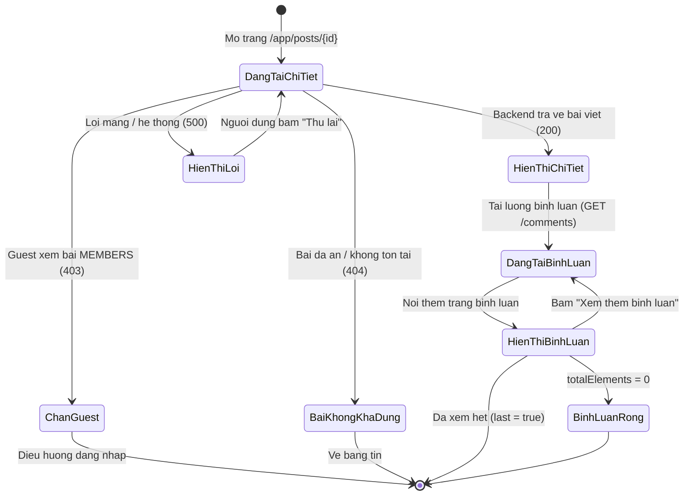
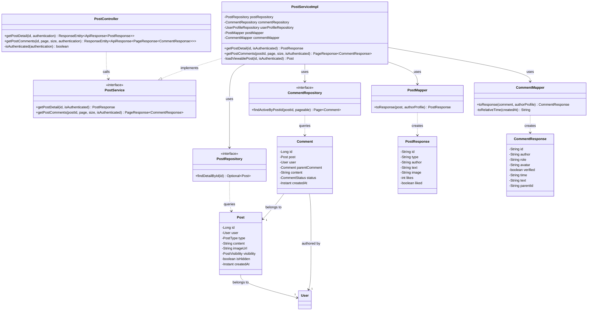
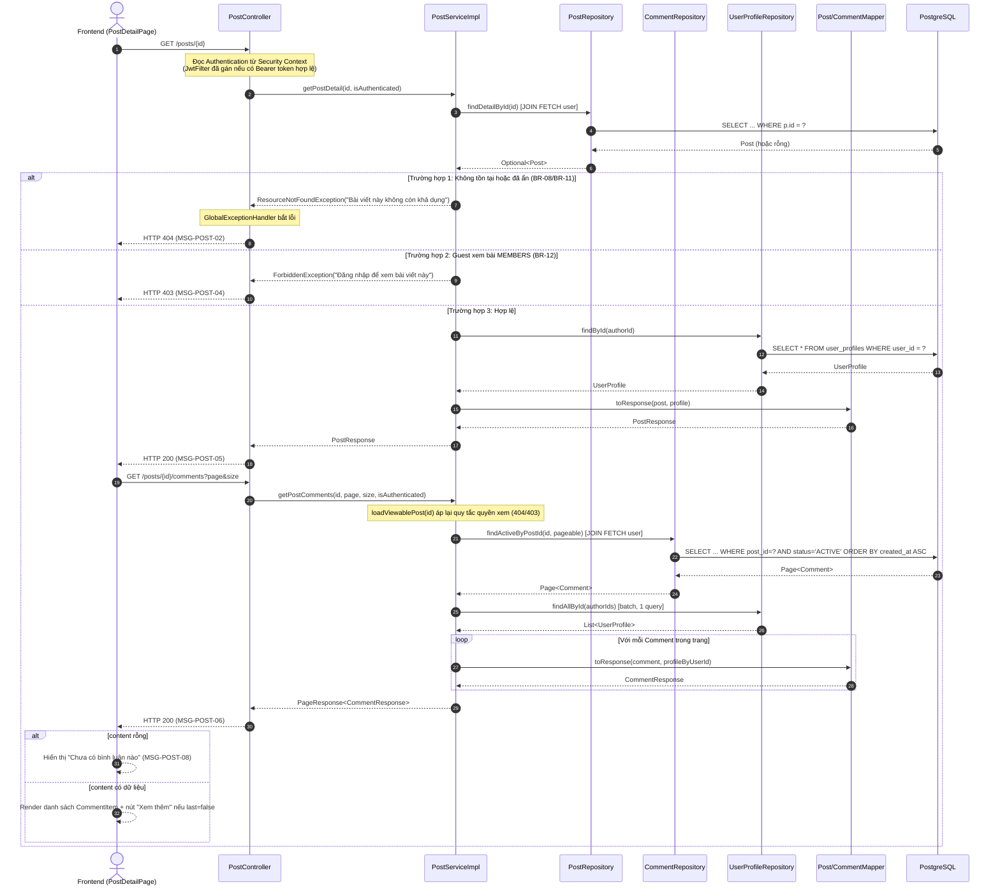

# ĐẶC TẢ YÊU CẦU & THIẾT KẾ CHI TIẾT: UC16 - Xem chi tiết bài viết (View Post Detail)

## PHẦN 1: ĐẶC TẢ NGHIỆP VỤ (REPORT 3)

### 2.2.3 Business Workflow (Luồng nghiệp vụ)

#### Mô tả chi tiết luồng xử lý bằng chữ (Business Step Description):
- **Bước 1 - Khởi đầu**: Người dùng (Guest/Student/Alumni) mở `/app/posts/{id}` (bấm vào một bài viết từ bảng tin UC15). Frontend gọi `usePostDetail(id)` → `GET /api/v1/posts/{id}`.
- **Bước 2 - Xác định quyền xem**: Backend đọc `Authentication` từ Security Context (do `JwtFilter` gán nếu có Bearer token hợp lệ). Không có/không hợp lệ → **Guest**; ngược lại → **thành viên**.
- **Bước 3 - Kiểm tra & truy vấn**: Backend nạp bài viết theo ID (JOIN FETCH tác giả). Nếu không tồn tại **hoặc** `is_hidden = true` → trả 404 "Bài viết này không còn khả dụng" (BR-08/BR-11). Nếu là Guest và `visibility = MEMBERS` → trả 403 (BR-12). Ngược lại ghép Post + User + UserProfile → `PostResponse`.
- **Bước 4 - Hiển thị bài viết**: Frontend validate bằng Zod, hiển thị đầy đủ nội dung, ảnh, số like/comment/repost. Nếu 404 → `PostNotAvailable`; 403 → `PostForbidden` (mời đăng nhập); lỗi khác → `PostError` kèm nút "Thử lại".
- **Bước 5 - Tải luồng bình luận**: Sau khi bài tải thành công, Frontend gọi `useComments(id)` → `GET /api/v1/posts/{id}/comments?page&size`. Backend áp cùng quy tắc quyền xem trên bài viết, rồi trả trang bình luận `ACTIVE` (sắp theo thời gian cũ→mới). Nếu rỗng → hiển thị thông báo "Chưa có bình luận nào".
- **Bước 6 - Tải thêm bình luận**: Người dùng bấm "Xem thêm bình luận" → gọi trang kế tiếp, nối vào danh sách cho tới khi `last = true`. Ô nhập bình luận hiển thị ở trạng thái chờ (đăng bình luận thuộc UC18).

### 3.2 Module 3 - Social: Feed, Posts, Events, Packages & Messaging
Module chứa các tính năng tương tác cộng đồng của AlumNect. UC16 là bước tiếp nối của UC15 (View community Feed): cho phép mở một bài viết để xem toàn bộ nội dung cùng luồng bình luận của nó.

#### 3.2.1 Xem chi tiết bài viết (View Post Detail)

**Function trigger**:
- **Navigation path**: `/app/posts/{id}` (mở khi người dùng bấm vào một bài viết ở bảng tin; Guest cũng truy cập được).
- **Timing Frequency**: On screen mount (tải chi tiết + trang bình luận đầu); on-demand khi bấm "Xem thêm bình luận" hoặc "Thử lại".

**Function description**:
- **Actors/Roles**: Guest (chỉ bài PUBLIC), Student, Alumni.
- **Purpose**: Hiển thị toàn bộ nội dung một bài viết kèm luồng bình luận của nó, cho phép người xem đọc chi tiết trước khi tương tác.
- **Interface**:
  - Nút "Quay lại bảng tin".
  - Thẻ chi tiết bài viết (`PostDetailCard`): avatar, tên, badge loại bài, chức danh · thời gian, nội dung đầy đủ, ảnh (nếu có), thanh số liệu like/comment/repost.
  - Khu bình luận: tiêu đề "Bình luận · N", ô soạn bình luận (trạng thái chờ — đăng bình luận thuộc UC18), danh sách `CommentItem` (avatar, tên, chức danh, thời gian, nội dung; bình luận trả lời được thụt lề), nút "Xem thêm bình luận".
  - Trạng thái: Loading (skeleton), Không khả dụng (404), Dành cho thành viên (403 — mời đăng nhập), Lỗi (retry), Rỗng bình luận.

**Data processing**:
1. Frontend gọi `GET /api/v1/posts/{id}`.
2. Backend đọc `Authentication` → xác định `isAuthenticated`.
3. Backend `PostRepository.findDetailById(id)` (JOIN FETCH tác giả). Kiểm tra tồn tại/ẩn (404) và quyền Guest (403) tại Service.
4. Backend batch-fetch `UserProfile` tác giả, `PostMapper` ghép → `PostResponse`.
5. Frontend gọi `GET /api/v1/posts/{id}/comments?page&size`.
6. Backend áp lại quy tắc quyền xem bài, `CommentRepository.findActiveByPostId` (JOIN FETCH tác giả), batch-fetch hồ sơ, `CommentMapper` ghép → `PageResponse<CommentResponse>`.
7. Frontend validate bằng Zod, cập nhật cache TanStack Query theo `queryKey: ['post', id]` và `['post-comments', id]`.

**Screen layout**:
- Bố cục 1 cột trung tâm (`max-w-2xl`): thẻ chi tiết bài viết ở trên, khu bình luận bên dưới.
- Responsive: ảnh bài viết co giãn theo bề rộng; bình luận trả lời thụt lề trên mọi kích thước màn hình.

**Function details**:
- **Data**: bài viết (`id`, `type`, `author`, `role`, `avatar`, `verified`, `time`, `text`, `image`, `likes`, `comments`, `reposts`, `liked`); bình luận (`id`, `author`, `role`, `avatar`, `verified`, `time`, `text`, `parentId`).
- **Validation**:
  - `id` (path): phải là số nguyên hợp lệ — sai kiểu trả về **MSG-POST-01** (HTTP 400).
  - `page` (≥ 0, mặc định 0), `size` (số nguyên dương, mặc định 10) cho endpoint bình luận — vi phạm trả về **MSG-POST-07** (HTTP 400).
- **Business rules**: xem mục 5.1 (BR-08, BR-11, BR-12).
- **Error Handling**: `id` sai kiểu → 400 (MSG-POST-01); bài không tồn tại/đã ẩn → 404 (MSG-POST-02); Guest xem bài MEMBERS → 403 (MSG-POST-04); lỗi hệ thống/mạng → 500/network (MSG-POST-03), Frontend hiển thị `PostError` với nút "Thử lại".
- **Normal case**: Bài viết và bình luận tải đầy đủ; thành viên đã đăng nhập thấy số liệu tương tác và ô soạn bình luận (chờ mở ở UC18).
- **Abnormal case**: Bài đã ẩn/không tồn tại → `PostNotAvailable` (MSG-POST-02); Guest xem bài MEMBERS → `PostForbidden` (MSG-POST-04); không có bình luận → thông báo "Chưa có bình luận nào".

---

### 5. Requirement Appendix (Phụ lục Yêu cầu)

#### 5.1 Business Rules (Quy tắc Nghiệp vụ)

| ID | Định nghĩa Quy tắc (Rule Definition) |
| :--- | :--- |
| BR-08 | Bài viết đã bị Admin ẩn (`is_hidden = true`) không hiển thị ở bất kỳ đâu, kể cả trang chi tiết — trả về "không còn khả dụng". |
| BR-11 | Việc ẩn bài viết/bình luận là xóa mềm (soft-hide/soft-delete) — dữ liệu vẫn giữ trong DB (`comments.status = DELETED` không hiển thị). |
| BR-12 | Guest (chưa đăng nhập) chỉ xem được bài viết `visibility = PUBLIC`; bài `MEMBERS` (và bình luận của nó) chỉ hiển thị cho người đã đăng nhập. |
| BR-14 | Trường `liked` luôn trả về `false` ở UC16 — trạng thái "đã thích" theo người xem thuộc UC17 "Like Post" (chưa triển khai). |
| BR-15 | Bình luận sắp xếp theo thời gian tạo cũ nhất trước (`created_at ASC`) để giữ đúng mạch hội thoại; chỉ hiển thị bình luận `status = ACTIVE`. |

#### 5.2 Common Requirements (Yêu cầu Chung)
- Luồng bình luận được phân trang (`page`/`size`), không tải toàn bộ một lần.
- Thời gian hiển thị theo định dạng tương đối ngắn gọn ("vừa xong" nếu dưới 1 phút; "5m", "3h", "2d"), tính bằng hiệu giữa thời điểm hiện tại và thời điểm tạo.
- Ảnh bài viết bọc trong `SmartImage` (shimmer khi tải, fallback khi link lỗi).
- Giao tiếp Client–Server qua HTTPS/TLS ở môi trường production.

#### 5.3 Application Messages List (Danh sách Thông điệp Ứng dụng)

| # | Mã thông điệp | Loại thông điệp | Ngữ cảnh | Nội dung hiển thị | HTTP Status |
| :--- | :--- | :--- | :--- | :--- | :--- |
| 1 | MSG-POST-01 | Toast/inline lỗi | Tham số `id` sai kiểu (không phải số) | "Tham số 'id' không hợp lệ" | 400 |
| 2 | MSG-POST-02 | In line (not-available) | Bài viết không tồn tại hoặc đã bị ẩn/gỡ | "Bài viết này không còn khả dụng" | 404 |
| 3 | MSG-POST-03 | In line (error state) | Lỗi tải chi tiết (mạng/server) | "Không tải được bài viết — Đã có lỗi hệ thống xảy ra. Vui lòng thử lại." | 500 / network error |
| 4 | MSG-POST-04 | In line (forbidden) | Guest cố xem bài viết `MEMBERS` | Trên màn hình (`PostForbidden`): "Bài viết dành cho thành viên — Đăng nhập để xem nội dung bài viết này." (kèm nút Đăng nhập). Thông điệp API trả về: "Đăng nhập để xem bài viết này" | 403 |
| 5 | MSG-POST-05 | Success (implicit) | Lấy chi tiết bài viết thành công | "Lấy chi tiết bài viết thành công" | 200 |
| 6 | MSG-POST-06 | Success (implicit) | Lấy bình luận thành công | "Lấy bình luận thành công" | 200 |
| 7 | MSG-POST-07 | Toast/inline lỗi | Tham số `page`/`size` bình luận không hợp lệ | "Tham số page phải là số nguyên không âm" / "Tham số size phải là số nguyên dương" | 400 |
| 8 | MSG-POST-08 | In line (empty state) | Bài viết chưa có bình luận nào | "Chưa có bình luận nào — hãy là người đầu tiên bình luận." | 200 (content rỗng) |

---

## PHẦN 2: THIẾT KẾ CHI TIẾT (REPORT 4)

### 3. Detail Design (Thiết kế chi tiết)

#### 3.1 Xem chi tiết bài viết (View Post Detail)

##### 3.1.1 Class Diagram (Sơ đồ Lớp)

###### Mô tả chi tiết cấu trúc các lớp (Class Design Description):
- **`PostController`**: tiếp nhận `GET /posts/{id}` và `GET /posts/{id}/comments`, đọc `Authentication` (Guest nếu null/Anonymous), gọi `PostService`. Helper `isAuthenticated` dùng chung cho cả UC15 và UC16.
- **`PostService`/`PostServiceImpl`**: xử lý nghiệp vụ — `loadViewablePost` kiểm tra tồn tại/ẩn (404) và quyền Guest (403) dùng chung cho cả xem chi tiết và xem bình luận; batch-fetch `UserProfile` tránh N+1.
- **`PostMapper`** (dùng lại từ UC15) & **`CommentMapper`**: ghép dữ liệu từ 3 nguồn (Post/Comment + User + UserProfile) và tính chuỗi thời gian tương đối — không dùng MapStruct do là logic tùy biến.
- **`PostRepository`/`CommentRepository`**: JPQL `findDetailById` (JOIN FETCH tác giả) và `findActiveByPostId` (lọc `status = ACTIVE`, JOIN FETCH tác giả, sắp `createdAt ASC`).
- **`Comment`** (Entity): ánh xạ bảng `comments`, `@ManyToOne` tới `Post`, `User` (tác giả) và tự tham chiếu `parentComment` (1 cấp trả lời); xóa mềm qua `status`.

##### 3.1.2 Sequence Diagram (Sơ đồ Tuần tự)

###### Mô tả chi tiết luồng xử lý bằng chữ (Sequence Flow Description):
1. **Luồng 1 - Thành công (Normal Case)**: Client gửi `GET /posts/{id}`. Service nạp bài (JOIN FETCH tác giả), kiểm tra quyền xem, batch-fetch hồ sơ tác giả, map sang `PostResponse` (200). Sau đó Client gọi `GET /posts/{id}/comments`; Service áp lại quy tắc quyền xem rồi trả trang bình luận `ACTIVE` đã map (200). Tổng mỗi phần 2 query, không N+1.
2. **Luồng 2 - Không khả dụng (404)**: Bài không tồn tại hoặc `is_hidden = true` → `ResourceNotFoundException` → `GlobalExceptionHandler` trả 404 với thông điệp trung lập (không tiết lộ bài bị ẩn) — BR-08/BR-11.
3. **Luồng 3 - Chặn Guest (403)**: Guest truy cập bài `MEMBERS` → `ForbiddenException` → 403 (MSG-POST-04). Cờ quyền xem được kiểm tra tại Service (`loadViewablePost`) cho cả chi tiết lẫn bình luận, tránh Guest đọc bình luận của bài `MEMBERS`.
4. **Luồng 4 - Hiển thị bình luận (Frontend)**: Khi `content = []`, Frontend hiển thị thông báo "Chưa có bình luận nào"; ngược lại render danh sách và nút "Xem thêm bình luận" khi còn trang (`last = false`).
