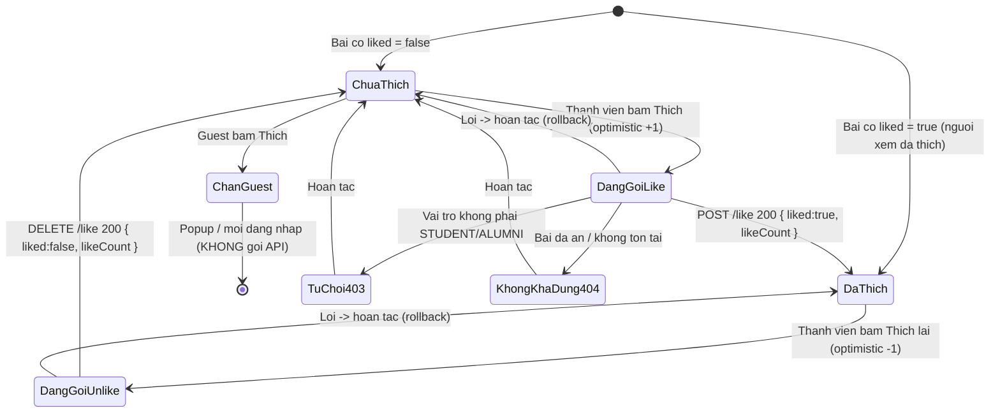
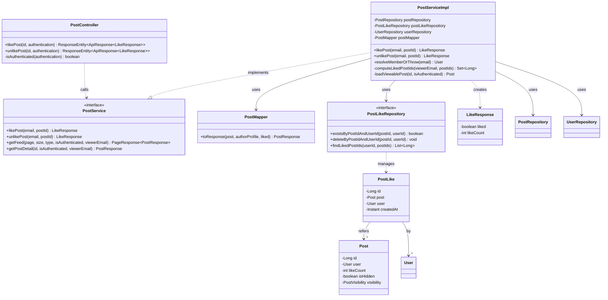
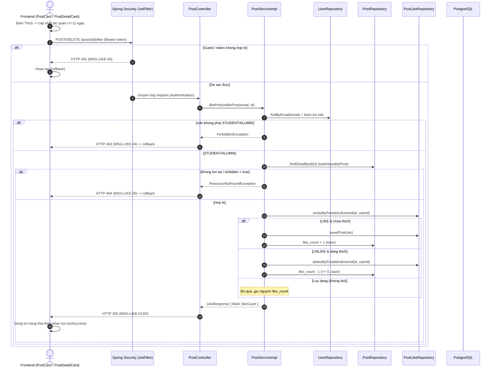

# ĐẶC TẢ YÊU CẦU & THIẾT KẾ CHI TIẾT: UC17 - Thích bài viết (Like a post)

## PHẦN 1: ĐẶC TẢ NGHIỆP VỤ (REPORT 3)

### 2.2.3 Business Workflow (Luồng nghiệp vụ)

#### Mô tả chi tiết luồng xử lý bằng chữ (Business Step Description):
- **Bước 1 - Khởi đầu**: Thành viên (Student/Alumni) bấm nút Thích (biểu tượng trái tim) trên một bài viết ở bảng tin (`FeedPage`) hoặc trang chi tiết (`PostDetailPage`). Frontend cập nhật lạc quan (optimistic) ngay: đổi trạng thái tim + số đếm ±1, rồi gọi `useToggleLike` → `POST /api/v1/posts/{id}/like` (khi thích) hoặc `DELETE /api/v1/posts/{id}/like` (khi bỏ thích).
- **Bước 2 - Chặn Guest tại Frontend**: Nếu người xem là Guest, ở bảng tin nút Thích mở popup mời đăng nhập (BR-12) và **không** gọi API; ở trang chi tiết nút Thích ở trạng thái `disabled`.
- **Bước 3 - Xác thực & phân quyền tại Backend**: Endpoint like/unlike **không** thuộc nhóm công khai nên Spring Security yêu cầu Bearer token — Guest không token bị chặn **401** trước khi vào Controller. Tại Service, `resolveMemberOrThrow` nạp tài khoản theo email (từ JWT) và kiểm tra vai trò: chỉ `STUDENT`/`ALUMNI` được phép, vai trò khác (VD Admin) bị từ chối **403** (BR-LIKE-01).
- **Bước 4 - Kiểm tra bài viết**: `loadViewablePost(id)` nạp bài; nếu không tồn tại hoặc đã bị ẩn (`is_hidden = true`) → **404** "Bài viết này không còn khả dụng" (BR-08/BR-11).
- **Bước 5 - Ghi nhận lũy đẳng**: Khi thích — nếu chưa có bản ghi `post_likes` (UNIQUE post_id+user_id) thì tạo mới và tăng `like_count`; nếu đã thích thì giữ nguyên (lũy đẳng). Khi bỏ thích — nếu đang thích thì xóa bản ghi và giảm `like_count` (không âm); nếu chưa thích thì giữ nguyên. Toàn bộ trong một transaction (BR-LIKE-02/BR-LIKE-03).
- **Bước 6 - Đồng bộ Frontend**: Backend trả `{ liked, likeCount }` (200). Frontend đồng bộ trạng thái tim + số đếm theo phản hồi (`onSuccess`); nếu lỗi (403/404/mạng) thì hoàn tác về trạng thái trước khi bấm (`onError`). Cờ `liked` trong `GET /posts` và `GET /posts/{id}` nay được tính theo người xem (thay cho "luôn false" ở UC16 — xem BR-14).

### 3.2 Module 3 - Social: Feed, Posts, Events, Packages & Messaging
Module chứa các tính năng tương tác cộng đồng của AlumNect. UC17 là bước tương tác đầu tiên trên bài viết ở bảng tin (UC15) và trang chi tiết (UC16): cho phép thành viên bày tỏ yêu thích một bài viết và bỏ thích.

#### 3.2.1 Thích bài viết (Like a post)

**Function trigger**:
- **Navigation path**: Nút Thích (Heart) trên thẻ bài viết ở `/app` (bảng tin) và `/app/posts/{id}` (chi tiết).
- **Timing Frequency**: On-demand — mỗi lần người dùng bấm nút Thích/Bỏ thích.

**Function description**:
- **Actors/Roles**: Student, Alumni (đã đăng nhập). Admin và Guest **không** được thích (Admin → 403; Guest bị chặn ở Frontend/401).
- **Purpose**: Cho phép thành viên bày tỏ yêu thích một bài viết; số lượt thích được tổng hợp và hiển thị cho mọi người xem.
- **Interface**:
  - Nút Thích (biểu tượng trái tim) kèm số lượt thích. Trạng thái đã thích: tim tô đầy (fill) + màu hồng (`rose`); chưa thích: viền xám.
  - Cập nhật lạc quan: bấm là đổi ngay, không chờ mạng.
  - Guest ở bảng tin: bấm → popup "Đăng nhập để thích và tương tác với bài viết."; ở chi tiết: nút `disabled`.

**Data processing**:
1. Frontend gọi `POST /api/v1/posts/{id}/like` (thích) hoặc `DELETE /api/v1/posts/{id}/like` (bỏ thích) — token Bearer do interceptor `http` tự đính kèm.
2. Spring Security kiểm tra token (Guest → 401).
3. Backend `resolveMemberOrThrow(email)`: nạp User theo email, kiểm tra vai trò STUDENT/ALUMNI (else 403).
4. Backend `loadViewablePost(id)`: kiểm tra tồn tại/ẩn (404).
5. Backend kiểm tra `existsByPostIdAndUserId` → tạo/xóa `post_likes` và cập nhật `posts.like_count` (lũy đẳng, trong transaction).
6. Backend trả `LikeResponse { liked, likeCount }` (200).
7. Frontend đồng bộ trạng thái theo phản hồi (`onSuccess`) hoặc hoàn tác khi lỗi (`onError`).

**Screen layout**:
- Nút Thích nằm trong thanh hành động của thẻ bài viết (bảng tin và chi tiết), cùng nhóm với Bình luận/Đăng lại/Báo cáo/Lưu.
- Responsive: nút và số đếm giữ nguyên bố cục trên mọi kích thước màn hình.

**Function details**:
- **Data**: `LikeResponse` (`liked: boolean`, `likeCount: int`). Bài viết mang thêm cờ `liked` (viewer-specific) và `likes` (= `like_count`).
- **Validation**: `id` (path) phải là số nguyên hợp lệ (sai kiểu → 400 do Spring parse `Long`). Không có body đầu vào.
- **Business rules**: xem mục 5.1 (BR-LIKE-01/02/03, BR-08, BR-11, BR-14).
- **Error Handling**: Guest chưa đăng nhập → 401 (MSG-LIKE-03); vai trò không phải STUDENT/ALUMNI → 403 (MSG-LIKE-04); bài không tồn tại/đã ẩn → 404 (MSG-LIKE-05); lỗi mạng/hệ thống → Frontend hoàn tác trạng thái lạc quan.
- **Normal case**: Thành viên thích/bỏ thích thành công; tim và số đếm cập nhật đúng; số lượt thích nhất quán sau khi tải lại (cờ `liked` tính theo người xem).
- **Abnormal case**: Thích lại bài đã thích / bỏ thích bài chưa thích → không đổi (lũy đẳng, vẫn trả 200). Admin bấm (nếu vượt qua UI) → 403. Bài vừa bị ẩn → 404.

---

### 5. Requirement Appendix (Phụ lục Yêu cầu)

#### 5.1 Business Rules (Quy tắc Nghiệp vụ)

| ID | Định nghĩa Quy tắc (Rule Definition) |
| :--- | :--- |
| BR-LIKE-01 | Chỉ `STUDENT` và `ALUMNI` (đã đăng nhập) được thích/bỏ thích bài viết; vai trò khác (VD Admin) bị từ chối với lỗi 403 "Chỉ sinh viên và cựu sinh viên mới được thích bài viết". |
| BR-LIKE-02 | Mỗi người dùng chỉ thích một lần trên mỗi bài viết (ràng buộc `UNIQUE(post_id, user_id)` trên bảng `post_likes`). Thao tác **lũy đẳng**: thích lại bài đã thích không tăng thêm; bỏ thích bài chưa thích không thay đổi. |
| BR-LIKE-03 | Bộ đếm `posts.like_count` (denormalized) được cập nhật đồng thời cùng thao tác thích/bỏ thích trong một transaction; giá trị không âm (`Math.max(0, like_count - 1)`). |
| BR-08 | Bài viết đã bị Admin ẩn (`is_hidden = true`) không thể thích — trả về "không còn khả dụng" (404). |
| BR-11 | Việc ẩn bài viết là xóa mềm (soft-hide) — dữ liệu vẫn giữ trong DB. Xóa bài (nếu có) sẽ CASCADE xóa các bản ghi `post_likes` liên quan (FK `ON DELETE CASCADE`). |
| BR-12 | Guest (chưa đăng nhập) không được thích: ở Frontend nút Thích mời đăng nhập/`disabled`; ở Backend endpoint yêu cầu JWT nên Guest bị chặn 401. |
| BR-14 | **UC17 thay thế BR-14 của UC16**: cờ `liked` trong `GET /posts` và `GET /posts/{id}` nay được tính theo người xem hiện tại (batch `findLikedPostIds`, tránh N+1). Guest luôn nhận `liked = false`. |

#### 5.2 Common Requirements (Yêu cầu Chung)
- Cập nhật lạc quan (optimistic UI) có hoàn tác (rollback) khi lỗi để phản hồi tức thì mà vẫn đảm bảo nhất quán với server.
- Thao tác like/unlike là lũy đẳng ở Backend nên an toàn khi người dùng bấm nhanh nhiều lần.
- Cờ `liked` theo người xem được tính bằng truy vấn gộp (batch) trên danh sách bài của trang — không truy vấn riêng lẻ từng bài (tránh N+1).
- Giao tiếp Client–Server qua HTTPS/TLS ở môi trường production; token Bearer đính kèm mọi request thay đổi trạng thái.

#### 5.3 Application Messages List (Danh sách Thông điệp Ứng dụng)

| # | Mã thông điệp | Loại thông điệp | Ngữ cảnh | Nội dung hiển thị | HTTP Status |
| :--- | :--- | :--- | :--- | :--- | :--- |
| 1 | MSG-LIKE-01 | Success (implicit) | Thích bài viết thành công | "Đã thích bài viết" (data `{ liked: true, likeCount }`) | 200 |
| 2 | MSG-LIKE-02 | Success (implicit) | Bỏ thích bài viết thành công | "Đã bỏ thích bài viết" (data `{ liked: false, likeCount }`) | 200 |
| 3 | MSG-LIKE-03 | In line (unauthorized) | Guest chưa đăng nhập gọi like/unlike | "Bạn chưa đăng nhập hoặc phiên làm việc đã hết hạn." | 401 |
| 4 | MSG-LIKE-04 | In line (forbidden) | Vai trò không phải STUDENT/ALUMNI (VD Admin) | "Chỉ sinh viên và cựu sinh viên mới được thích bài viết" | 403 |
| 5 | MSG-LIKE-05 | In line (not-available) | Bài viết không tồn tại hoặc đã bị ẩn | "Bài viết này không còn khả dụng" | 404 |

---

## PHẦN 2: THIẾT KẾ CHI TIẾT (REPORT 4)

### 3. Detail Design (Thiết kế chi tiết)

#### 3.1 Thích bài viết (Like a post)

##### 3.1.1 Class Diagram (Sơ đồ Lớp)

###### Mô tả chi tiết cấu trúc các lớp (Class Design Description):
- **`PostController`**: thêm `POST /posts/{id}/like` và `DELETE /posts/{id}/like`; lấy email người dùng từ `Authentication.getName()` (đã được Spring Security đảm bảo có token hợp lệ). Trả `LikeResponse` bọc trong `ApiResponse`.
- **`PostService`/`PostServiceImpl`**: thêm `likePost`/`unlikePost`. `resolveMemberOrThrow` kiểm tra RBAC (STUDENT/ALUMNI, else 403); `loadViewablePost` (dùng lại từ UC16) kiểm tra tồn tại/ẩn (404); `computeLikedPostIds` tính cờ `liked` theo người xem cho `getFeed`/`getPostDetail` (batch, tránh N+1). Toàn bộ like/unlike gắn `@Transactional`.
- **`PostMapper`**: chữ ký `toResponse(post, authorProfile, liked)` — cờ `liked` truyền vào theo người xem (thay cho hằng `false` ở UC16).
- **`PostLikeRepository`**: `existsByPostIdAndUserId` (kiểm tra lũy đẳng), `deleteByPostIdAndUserId` (bỏ thích), `findLikedPostIds(userId, postIds)` (JPQL batch — trả về ID các bài trong danh sách mà người dùng đã thích).
- **`PostLike`** (Entity): ánh xạ bảng `post_likes`, `@ManyToOne(LAZY)` tới `Post` và `User`, `createdAt` gán ở `@PrePersist`; ràng buộc `UNIQUE(post_id, user_id)`.
- **`LikeResponse`** (DTO): `{ liked, likeCount }` — trạng thái thích mới + tổng lượt thích sau thao tác.

##### 3.1.2 Sequence Diagram (Sơ đồ Tuần tự)

###### Mô tả chi tiết luồng xử lý bằng chữ (Sequence Flow Description):
1. **Luồng 1 - Thành công (Normal Case)**: Frontend cập nhật lạc quan rồi gọi like/unlike. Service kiểm tra RBAC (STUDENT/ALUMNI) và bài viết khả dụng, tạo/xóa bản ghi `post_likes`, cập nhật `like_count` trong transaction, trả `{ liked, likeCount }` (200). Frontend đồng bộ theo phản hồi.
2. **Luồng 2 - Chưa đăng nhập (401)**: Endpoint không công khai → Spring Security chặn Guest trước khi vào Controller (MSG-LIKE-03). Frontend hoàn tác trạng thái lạc quan; riêng Guest thường đã bị chặn ở UI (popup/disabled).
3. **Luồng 3 - Sai vai trò (403)**: `resolveMemberOrThrow` phát hiện vai trò ≠ STUDENT/ALUMNI → `ForbiddenException` → 403 (MSG-LIKE-04). Kiểm tra RBAC đặt **trước** kiểm tra bài viết, nên Admin thao tác trên bài bất kỳ đều nhận 403.
4. **Luồng 4 - Bài không khả dụng (404)**: `loadViewablePost` phát hiện bài không tồn tại hoặc `is_hidden = true` → `ResourceNotFoundException` → 404 (MSG-LIKE-05).
5. **Luồng 5 - Lũy đẳng**: Thích lại bài đã thích hoặc bỏ thích bài chưa thích → Service bỏ qua thao tác ghi, `like_count` giữ nguyên, vẫn trả 200 với trạng thái nhất quán.
