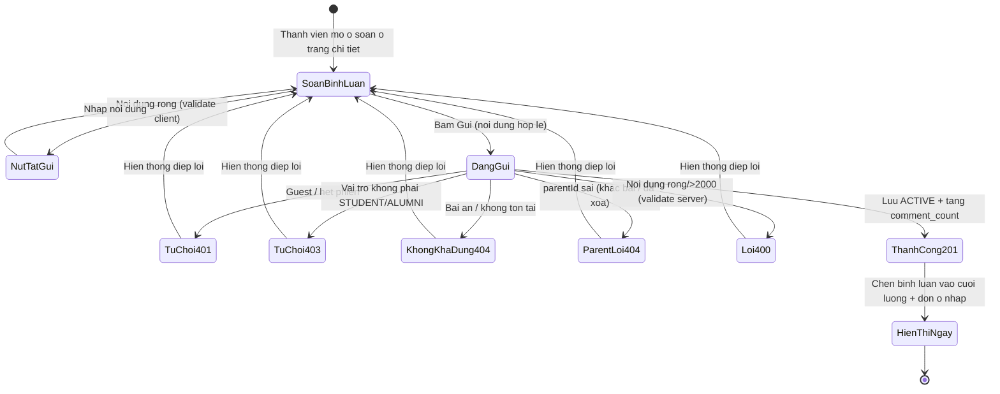
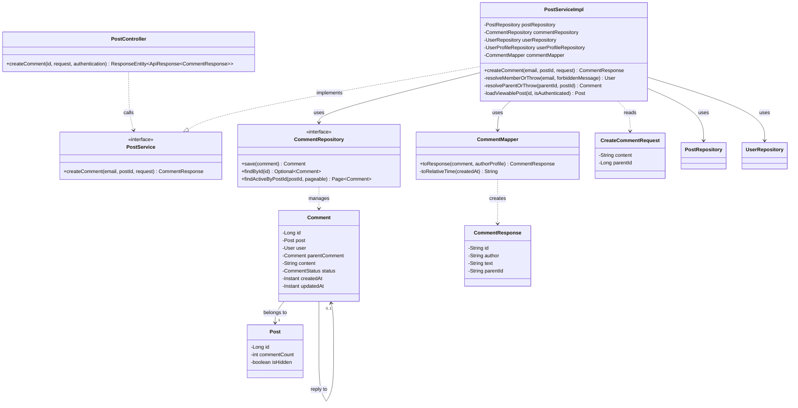
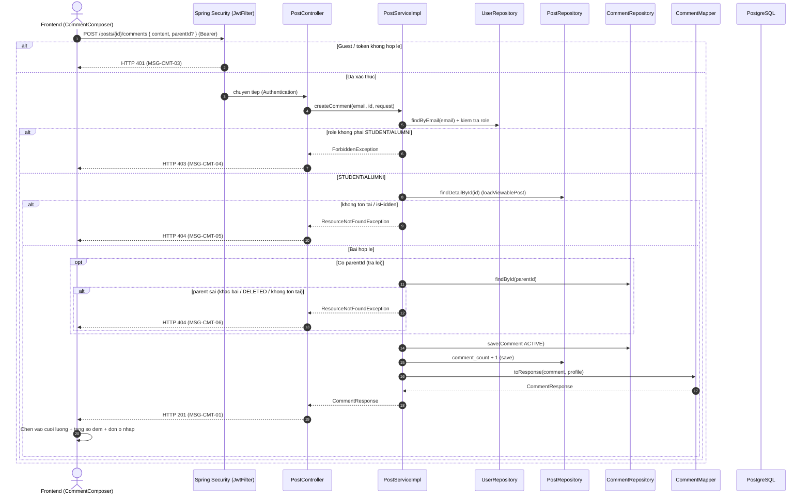

# ĐẶC TẢ YÊU CẦU & THIẾT KẾ CHI TIẾT: UC18 - Bình luận bài viết (Comment on a post)

## PHẦN 1: ĐẶC TẢ NGHIỆP VỤ (REPORT 3)

### 2.2.3 Business Workflow (Luồng nghiệp vụ)

#### Mô tả chi tiết luồng xử lý bằng chữ (Business Step Description):
- **Bước 1 - Khởi đầu**: Thành viên (Student/Alumni) đang ở trang chi tiết bài viết (`/app/posts/{id}`, UC16) nhập nội dung vào ô soạn bình luận (`CommentComposer`). Guest không thấy form — chỉ thấy lời mời đăng nhập.
- **Bước 2 - Kiểm tra phía client**: Nút "Gửi" bị vô hiệu hóa khi nội dung rỗng (sau trim) hoặc đang gửi; giới hạn tối đa 2000 ký tự đồng bộ với ràng buộc backend.
- **Bước 3 - Gửi yêu cầu**: Frontend gọi `POST /api/v1/posts/{id}/comments` với `{ content, parentId? }`; token Bearer được interceptor `http` tự đính kèm.
- **Bước 4 - Xác thực & phân quyền tại Backend**: Endpoint không công khai → Spring Security chặn Guest với **401**. Tại Service, chỉ `STUDENT`/`ALUMNI` được bình luận (vai trò khác → **403**); bài đã ẩn/không tồn tại → **404**.
- **Bước 5 - Kiểm tra trả lời (nếu có)**: Nếu `parentId` khác null, bình luận cha phải thuộc đúng bài viết này và đang ACTIVE, ngược lại → **404**. Bảng chỉ hỗ trợ 1 cấp nên trả lời-của-trả lời được quy về bình luận gốc.
- **Bước 6 - Lưu & cập nhật**: Lưu bình luận `status = ACTIVE` và tăng bộ đếm `comment_count` của bài viết trong cùng một transaction; trả về `CommentResponse` (201).
- **Bước 7 - Hiển thị**: Frontend chèn bình luận mới vào cuối luồng bình luận (thứ tự cũ→mới) và tăng số đếm "Bình luận · N" ngay lập tức, dọn sạch ô nhập.

### 3.2 Module 3 - Social: Feed, Posts, Events, Packages & Messaging
Module chứa các tính năng tương tác cộng đồng của AlumNect. UC18 nối tiếp UC16 (View Post Detail):
cho phép thành viên tham gia thảo luận bằng cách đăng bình luận (và trả lời 1 cấp) trên bài viết.

#### 3.2.1 Bình luận bài viết (Comment on a post)

**Function trigger**:
- **Navigation path**: Ô soạn bình luận ở cuối trang chi tiết bài viết `/app/posts/{id}`.
- **Timing Frequency**: On-demand — mỗi lần người dùng bấm "Gửi".

**Function description**:
- **Actors/Roles**: Student, Alumni (đã đăng nhập). Admin/Guest không được bình luận (Admin → 403; Guest bị chặn ở Frontend/401).
- **Purpose**: Cho phép thành viên đăng bình luận trên bài viết để tham gia thảo luận cộng đồng.
- **Interface**:
  - Ô soạn (`CommentComposer`): avatar người dùng, textarea "Viết bình luận…", bộ đếm ký tự `N/2000`, nút "Gửi".
  - Trạng thái: nút Gửi vô hiệu khi rỗng/đang gửi; spinner "Đang gửi…"; thông điệp lỗi nghiệp vụ; Guest → lời mời đăng nhập.
  - Bình luận mới xuất hiện cuối luồng với thời gian "vừa xong".

**Data processing**:
1. Frontend gọi `POST /api/v1/posts/{id}/comments` với body `{ content, parentId? }`.
2. Spring Security kiểm tra token (Guest → 401).
3. Backend `resolveMemberOrThrow(email, ...)`: kiểm tra vai trò STUDENT/ALUMNI (else 403).
4. Backend `loadViewablePost(id)`: kiểm tra tồn tại/ẩn (404).
5. Backend `resolveParentOrThrow(parentId, postId)`: nếu là trả lời, kiểm tra bình luận cha hợp lệ (404) và quy về gốc.
6. Backend lưu `Comment` (ACTIVE) + tăng `posts.comment_count` (một transaction), map → `CommentResponse` (201).
7. Frontend chèn bình luận vào cuối cache `['post-comments', id]` + tăng `comments` trong cache `['post', id]`.

**Screen layout**:
- Ô soạn nằm ngay dưới tiêu đề "Bình luận · N", phía trên danh sách bình luận (bố cục 1 cột `max-w-2xl`).
- Responsive: textarea co giãn theo bề rộng; trả lời được thụt lề (`ml-10`).

**Function details**:
- **Data**: `CreateCommentRequest` (`content`, `parentId?`); `CommentResponse` (`id, author, role, avatar, verified, time, text, parentId`).
- **Validation**:
  - `content` (bắt buộc, không rỗng sau trim, tối đa 2000 ký tự) — vi phạm trả về **400**.
  - `id` (path) phải là số nguyên hợp lệ; `parentId` (nếu có) phải trỏ tới bình luận cùng bài đang ACTIVE.
- **Business rules**: xem mục 5.1 (BR-CMT-01/02/03, BR-08, BR-11, BR-12).
- **Error Handling**: Guest → 401; sai vai trò → 403; bài ẩn/không tồn tại → 404; bình luận cha sai → 404; nội dung không hợp lệ → 400. Frontend hiển thị message backend nguyên văn dưới ô nhập.
- **Normal case**: Thành viên đăng bình luận/trả lời thành công; bình luận hiện ngay ở cuối luồng; số đếm tăng đúng.
- **Abnormal case**: Nội dung rỗng → nút Gửi vô hiệu (client) / 400 (server); trả lời bình luận đã xóa → 404; Admin cố bình luận → 403.

---

### 5. Requirement Appendix (Phụ lục Yêu cầu)

#### 5.1 Business Rules (Quy tắc Nghiệp vụ)

| ID | Định nghĩa Quy tắc (Rule Definition) |
| :--- | :--- |
| BR-CMT-01 | Chỉ `STUDENT` và `ALUMNI` (đã đăng nhập) được đăng bình luận; vai trò khác (VD Admin) bị từ chối 403 "Chỉ sinh viên và cựu sinh viên mới được bình luận". |
| BR-CMT-02 | Luồng bình luận chỉ hỗ trợ **1 cấp trả lời**: khi trả lời một bình luận vốn đã là trả lời, hệ thống gắn bình luận mới về đúng **bình luận gốc**. Bình luận cha phải thuộc cùng bài viết và đang ACTIVE. |
| BR-CMT-03 | Bộ đếm `posts.comment_count` (denormalized) được tăng đồng thời với việc lưu bình luận trong cùng một transaction. |
| BR-08 | Bài viết đã bị Admin ẩn (`is_hidden = true`) không thể bình luận — trả về "không còn khả dụng" (404). |
| BR-11 | Bình luận lưu mềm qua `status` (ACTIVE/DELETED); bình luận DELETED không hiển thị và không thể trả lời. |
| BR-12 | Guest (chưa đăng nhập) không được bình luận: ở Frontend hiển thị lời mời đăng nhập; ở Backend endpoint yêu cầu JWT nên Guest bị chặn 401. |

#### 5.2 Common Requirements (Yêu cầu Chung)
- Bình luận sắp xếp theo thời gian tạo cũ→mới (`created_at ASC`); bình luận vừa đăng thuộc trang cuối và được Frontend chèn thẳng vào cuối luồng đang hiển thị (không refetch từ đầu).
- Thời gian hiển thị theo định dạng tương đối ngắn gọn ("vừa xong", "5m", "3h", "2d"), tính sẵn ở Backend.
- Cập nhật lạc quan số đếm bình luận đồng bộ giữa tiêu đề và thanh số liệu bài viết.
- Giao tiếp Client–Server qua HTTPS/TLS ở môi trường production; token Bearer đính kèm mọi request thay đổi trạng thái.

#### 5.3 Application Messages List (Danh sách Thông điệp Ứng dụng)

| # | Mã thông điệp | Loại thông điệp | Ngữ cảnh | Nội dung hiển thị | HTTP Status |
| :--- | :--- | :--- | :--- | :--- | :--- |
| 1 | MSG-CMT-01 | Success (implicit) | Đăng bình luận thành công | "Đăng bình luận thành công" (data `CommentResponse`) | 201 |
| 2 | MSG-CMT-02 | In line (validation) | Nội dung rỗng hoặc quá 2000 ký tự | "Nội dung bình luận không được để trống" / "Nội dung bình luận không được vượt quá 2000 ký tự" | 400 |
| 3 | MSG-CMT-03 | In line (unauthorized) | Guest chưa đăng nhập gọi API | "Bạn chưa đăng nhập hoặc phiên làm việc đã hết hạn." | 401 |
| 4 | MSG-CMT-04 | In line (forbidden) | Vai trò không phải STUDENT/ALUMNI (VD Admin) | "Chỉ sinh viên và cựu sinh viên mới được bình luận" | 403 |
| 5 | MSG-CMT-05 | In line (not-available) | Bài viết không tồn tại hoặc đã bị ẩn | "Bài viết này không còn khả dụng" | 404 |
| 6 | MSG-CMT-06 | In line (not-available) | Bình luận cha (khi trả lời) không tồn tại/khác bài/đã xóa | "Bình luận cần trả lời không còn khả dụng" | 404 |

---

## PHẦN 2: THIẾT KẾ CHI TIẾT (REPORT 4)

### 3. Detail Design (Thiết kế chi tiết)

#### 3.1 Bình luận bài viết (Comment on a post)

##### 3.1.1 Class Diagram (Sơ đồ Lớp)

###### Mô tả chi tiết cấu trúc các lớp (Class Design Description):
- **`PostController`**: thêm `POST /posts/{id}/comments` — nhận `@Valid @RequestBody CreateCommentRequest`, lấy email từ `Authentication`, trả `CommentResponse` (HTTP 201). Cùng kiểu với `createPost` của UC14.
- **`PostService`/`PostServiceImpl`**: thêm `createComment` (`@Transactional`). Tái sử dụng `resolveMemberOrThrow` (nay tham số hóa thông điệp 403 để dùng chung UC17/UC18), `loadViewablePost` (404 bài). Thêm `resolveParentOrThrow` kiểm tra trả lời + quy về gốc.
- **`CreateCommentRequest`** (DTO): `content` (`@NotBlank`, `@Size(max=2000)`), `parentId` (tùy chọn).
- **`Comment`** (Entity, tái sử dụng UC16): `@PrePersist` tự set `createdAt/updatedAt` và mặc định `status = ACTIVE`; tự tham chiếu `parentComment` (1 cấp).
- **`CommentMapper`** (tái sử dụng UC16): `toResponse(comment, authorProfile)` — bình luận vừa tạo cho `time = "vừa xong"`.
- **`CommentRepository`** (tái sử dụng UC16): `save`, `findById` (kiểm tra bình luận cha), `findActiveByPostId` (đọc luồng).

##### 3.1.2 Sequence Diagram (Sơ đồ Tuần tự)

###### Mô tả chi tiết luồng xử lý bằng chữ (Sequence Flow Description):
1. **Luồng 1 - Thành công (Normal Case)**: Sau xác thực + RBAC + kiểm tra bài (và bình luận cha nếu trả lời), Service lưu bình luận ACTIVE, tăng `comment_count` cùng transaction, map → `CommentResponse` (201). Frontend chèn bình luận vào cuối luồng và tăng số đếm, dọn ô nhập.
2. **Luồng 2 - Chưa đăng nhập (401)**: Endpoint không công khai → Spring Security chặn Guest trước Controller. Frontend thường đã che form với Guest.
3. **Luồng 3 - Sai vai trò (403)**: `resolveMemberOrThrow` phát hiện role ≠ STUDENT/ALUMNI → 403. Kiểm tra RBAC đặt trước kiểm tra bài.
4. **Luồng 4 - Bài không khả dụng (404)**: `loadViewablePost` phát hiện bài không tồn tại/`is_hidden = true` → 404.
5. **Luồng 5 - Trả lời không hợp lệ (404)**: `resolveParentOrThrow` phát hiện bình luận cha không tồn tại, đã xóa (DELETED) hoặc thuộc bài khác → 404; trả lời-của-trả lời được quy về bình luận gốc.
6. **Luồng 6 - Nội dung không hợp lệ (400)**: `@Valid` trên `CreateCommentRequest` chặn nội dung rỗng/quá 2000 ký tự → 400 (qua `GlobalExceptionHandler`).
