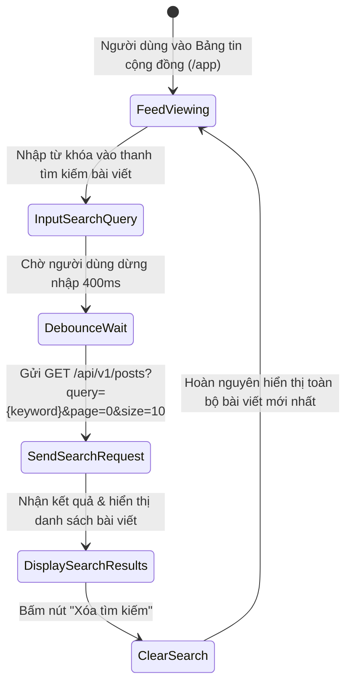
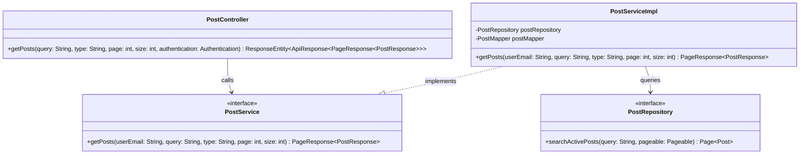
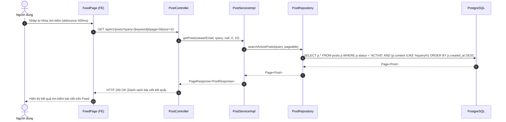

# ĐẶC TẢ YÊU CẦU & THIẾT KẾ CHI TIẾT: UC35 - TÌM KIẾM BÀI VIẾT TRÊN BẢNG TIN (SEARCH FEED POSTS)

## PHẦN 1: ĐẶC TẢ NGHIỆP VỤ (REPORT 3)

### 2.2.3 Business Workflow (Luồng nghiệp vụ)

#### Mô tả chi tiết luồng xử lý bằng chữ (Business Step Description):
* **Bước 1 - Khởi đầu**: Người dùng (Khách vãng lai, Sinh viên hoặc Cựu sinh viên) truy cập Bảng tin cộng đồng AlumNect (`/app`).
* **Bước 2 - Nhập từ khóa**: Người dùng nhập từ khóa cần tìm (tiêu đề, nội dung, chủ đề, tên công ty tuyển dụng hoặc sự kiện) vào ô Search Bar.
* **Bước 3 - Truy vấn dữ liệu**: Sau khoảng thời gian debounce 400ms, hệ thống gửi yêu cầu HTTP `GET /api/v1/posts?query=...` kèm các tham số phân trang.
* **Bước 4 - Phản hồi kết quả**: Backend tìm kiếm trong bảng `posts` (khớp nội dung hoặc thông tin tác giả), trả về danh sách phân trang các bài viết phù hợp có trạng thái `ACTIVE`.

---

### 3.2 Quản Lý Bài Viết & Bảng Tin (Community Feed)

#### 3.2.1 Tìm kiếm bài viết (UC35)

**Function trigger**:
* **Navigation path**: Trang chủ / Bảng tin `/app` -> Thanh tìm kiếm bài viết.
* **Timing Frequency**: On demand khi người dùng nhập từ khóa tìm kiếm.

**Function description**:
* **Actors/Roles**: Tất cả người dùng (GUEST chỉ xem bài PUBLIC; STUDENT/ALUMNI xem thêm bài MEMBERS).
* **Purpose**: Giúp thành viên nhanh chóng tra cứu bài viết theo chủ đề quan tâm, cơ hội việc làm, thông tin sự kiện hoặc nội dung học tập.

---

### 5. Requirement Appendix (Phụ lục Yêu cầu)

#### 5.1 Business Rules (Quy tắc Nghiệp vụ)

| ID | Định nghĩa Quy tắc (Rule Definition) |
| :--- | :--- |
| BR-35-01 | Chỉ trả về các bài viết có `status = 'ACTIVE'`. Bài viết bị ẩn hoặc đã xóa không được xuất hiện trong kết quả tìm kiếm. |
| BR-35-02 | Khách vãng lai (Guest) chỉ tìm thấy các bài viết có phạm vi `visibility = 'PUBLIC'`. |

#### 5.3 Application Messages List (Danh sách Thông điệp Ứng dụng)

| # | Mã thông điệp (Message code) | Loại thông điệp (Message Type) | Ngữ cảnh (Context) | Nội dung hiển thị (Content) |
| :--- | :--- | :--- | :--- | :--- |
| 1 | MSG-SEARCH-01 | Toast / In line | Tìm kiếm thành công | Lấy danh sách kết quả tìm kiếm thành công. |
| 2 | MSG-SEARCH-02 | EmptyState | Không tìm thấy bài viết nào | Không tìm thấy bài viết nào phù hợp với từ khóa của bạn. |

---

## PHẦN 2: THIẾT KẾ CHI TIẾT (REPORT 4)

### 3. Detail Design (Thiết kế chi tiết)

#### 3.1 UC35 Tìm kiếm bài viết (Search Feed Posts)

##### 3.1.1 Class Diagram (Sơ đồ Lớp)

##### 3.1.2 Sequence Diagram (Sơ đồ Tuần tự)

