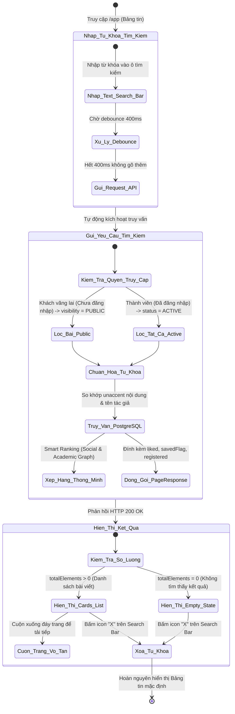
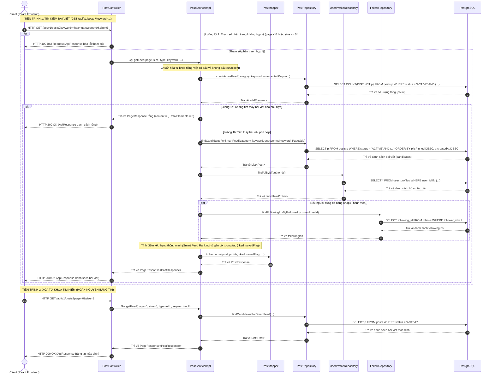

# ĐẶC TẢ YÊU CẦU & THIẾT KẾ CHI TIẾT: UC35 - TÌM KIẾM BÀI VIẾT TRÊN BẢNG TIN (SEARCH FEED POSTS)

## PHẦN 1: ĐẶC TẢ NGHIỆP VỤ (REPORT 3)

### 2.2.3 Business Workflow (Luồng nghiệp vụ)

#### Mô tả chi tiết luồng xử lý bằng chữ (Business Step Description):
* **Bước 1 - Khởi đầu**: Người dùng (Khách vãng lai hoặc Thành viên đã đăng nhập) truy cập vào Bảng tin cộng đồng AlumNect (`/app`). Hệ thống hiển thị thanh tìm kiếm tại Header và các bộ lọc danh mục bài viết.
* **Bước 2 - Nhập từ khóa tìm kiếm**: Người dùng nhập từ khóa mong muốn (chủ đề bài viết, nội dung thảo luận, kỹ năng nghề nghiệp, tên công ty tuyển dụng hoặc họ tên tác giả đăng bài) vào ô tìm kiếm.
* **Bước 3 - Trì hoãn truy vấn (Client Debounce)**: Để tối ưu hóa hiệu năng và tránh gửi request dồn dập trong lúc gõ phím, phía Client kích hoạt cơ chế đếm ngược Debounce 400ms. Khi người dùng dừng gõ quá 400ms, yêu cầu tìm kiếm mới chính thức được gửi đi.
* **Bước 4 - Xử lý tìm kiếm và phân quyền tại Backend**:
  * Phân biệt Khách và Thành viên: Nếu người dùng chưa đăng nhập, hệ thống chỉ lọc các bài viết có phạm vi hiển thị công khai (`visibility = PUBLIC`). Nếu người dùng đã đăng nhập, hệ thống cho phép tìm kiếm trên toàn bộ các bài viết chưa bị ẩn (`status = ACTIVE`).
  * Hỗ trợ Tiếng Việt không dấu (`unaccent`): Backend tạo chuỗi tìm kiếm gồm từ khóa gốc và từ khóa đã loại bỏ dấu tiếng Việt, so khớp đồng thời trên nội dung bài viết và họ tên tác giả.
  * Xếp hạng thông minh (Smart Feed Ranking): Hệ thống chấm điểm ưu tiên các bài viết từ những người dùng đang theo dõi, những tác giả cùng chuyên ngành đào tạo, kết hợp số lượng tương tác và độ mới của bài viết.
  * Đính kèm cờ tương tác: Gắn cờ trạng thái tương tác cá nhân của người xem hiện tại (`liked`, `savedFlag`).
* **Bước 5 - Kết xuất giao diện kết quả**:
  * Nếu có bài viết thỏa mãn: Giao diện kết xuất danh sách bài viết phân trang dưới dạng các thẻ bài viết (`PostCard`), hỗ trợ cuộn vô tận (Infinite Scroll) để tải trang tiếp theo.
  * Nếu không có bài viết nào thỏa mãn: Hiển thị giao diện trạng thái trống (Empty State) thông báo không tìm thấy kết quả.
* **Bước 6 - Xóa tìm kiếm và hoàn nguyên**: Người dùng nhấp vào biểu tượng "X" trên ô tìm kiếm hoặc xóa sạch văn bản, hệ thống tự động hoàn nguyên hiển thị Bảng tin về dòng thời gian mặc định ban đầu.

---

### 3.2 Quản Lý Bài Viết & Bảng Tin

#### 3.2.1 Tìm kiếm bài viết trên bảng tin (Search Feed Posts)

**Function trigger**:
*   **Navigation path**: Thanh điều hướng Header -> Ô tìm kiếm `SearchInput` tại `/app` hoặc Bảng tin cộng đồng `/app`.
*   **Timing Frequency**: On demand (khi người dùng nhập từ khóa tìm kiếm và dừng gõ sau 400ms).

**Function description**:
*   **Actors/Roles**: Khách vãng lai (GUEST), Sinh viên (STUDENT), Cựu sinh viên (ALUMNI), Quản trị viên (ADMIN).
*   **Purpose**: Cung cấp công cụ tìm kiếm nhanh chóng và linh hoạt cho người dùng tra cứu các bài viết trên bảng tin theo từ khóa nội dung hoặc tên tác giả, hỗ trợ tìm kiếm không dấu tiếng Việt, kết hợp phân loại bài viết.
*   **Interface**:
    *   **Thanh tìm kiếm Header (`SearchInput`):** Đặt tại thanh điều hướng với icon kính lúp, placeholder *"Tìm kiếm trên AlumNect..."*, nút xóa nhanh "X" hiển thị khi có ký tự trong ô nhập.
    *   **Thanh lọc danh mục (`FeedFilters`):** Cho phép kết hợp tìm kiếm theo từ khóa với loại bài viết: Tất cả, Thông thường, Thành tựu, Tuyển dụng, Sự kiện.
    *   **Danh sách thẻ bài viết kết quả:** Hiển thị thẻ bài viết chuẩn gồm ảnh đại diện, họ tên tác giả, thời gian đăng, nội dung bài viết, tệp ảnh/video đính kèm, khối thông tin việc làm/sự kiện (nếu có), số lượng tương tác và các nút hành động.
    *   **Màn hình rỗng (Empty State):** Hiển thị khi không có kết quả phù hợp gồm hình ảnh minh họa kính lúp, tiêu đề thông báo và gợi ý thử lại với từ khóa khác.
    *   **Hiệu ứng tải dữ liệu:** Hiển thị khung xương (Skeleton loader) trong thời gian chờ phản hồi từ máy chủ.

**Data processing**:
1.  **Quản lý từ khóa Client:** Trạng thái từ khóa được lưu trữ tập trung và áp dụng cơ chế debounce 400ms để tối ưu hóa tần suất gửi request.
2.  **Gửi yêu cầu truy vấn:** Client gọi `GET /api/v1/posts?keyword={keyword}&page={page}&size={size}&type={type}` (kèm Bearer JWT Token nếu đã đăng nhập).
3.  **Xử lý phía Server:**
    *   Kiểm tra tính hợp lệ của tham số phân trang (`page >= 0`, `size > 0`). Nếu sai, báo lỗi 400 Bad Request.
    *   Xác định quyền truy cập: Guest chỉ tìm kiếm trong phạm vi bài viết công khai `PUBLIC`. Thành viên đã đăng nhập được tìm kiếm trên tất cả bài viết đang hoạt động `ACTIVE`.
    *   Xử lý chuỗi tìm kiếm không dấu bằng hàm chuẩn hóa tiếng Việt `removeAccents`.
    *   Thực thi câu lệnh SQL động với hàm `unaccent()` của PostgreSQL trên cả nội dung bài viết và tên tác giả.
    *   Nạp thông tin hồ sơ tác giả theo lô (Batch fetch) để triệt tiêu lỗi N+1 truy vấn.
    *   Chấm điểm độ liên quan (Smart Feed Ranking) và đóng gói kết quả phân trang trả về cho Client.

**Screen layout**:
*   *Figure 1: Thanh tìm kiếm toàn cục trên Header và Bảng tin cộng đồng (Desktop View)*
*   *Figure 2: Giao diện kết quả tìm kiếm bài viết kết hợp bộ lọc danh mục (Feed View)*
*   *Figure 3: Giao diện trạng thái rỗng khi không tìm thấy kết quả tìm kiếm (Empty State)*

**Function details**:
*   **Data**: 
    *   `keyword` (String, từ khóa tìm kiếm)
    *   `page` (Integer, chỉ số trang, >= 0, mặc định: 0)
    *   `size` (Integer, số bài viết mỗi trang, > 0, mặc định: 5)
    *   `type` (String, loại bài viết: ALL, NORMAL, ACHIEVEMENT, RECRUITMENT, EVENT)
    *   `eventFilter` (String, bộ lọc sự kiện phụ: ALL, UPCOMING, HAPPENING, ENDED)
*   **Validation**: 
    *   Phía Client: Tự động cắt tỉa khoảng trắng thừa (`trim()`), áp dụng Debounce 400ms để ngăn chặn spam request.
    *   Phía Server: Kiểm tra `page >= 0` và `size > 0`. Báo lỗi 400 Bad Request nếu vi phạm.
*   **Business rules**:
    *   **Quy tắc trạng thái bài viết:** Chỉ hiển thị bài viết có trạng thái hoạt động `ACTIVE`. Bài viết đã bị xóa (`DELETED`) hoặc bị ẩn (`HIDDEN`) không được xuất hiện trong kết quả tìm kiếm.
    *   **Quy tắc phân quyền Guest:** Khách chưa đăng nhập chỉ được xem bài viết công khai `PUBLIC`.
    *   **Quy tắc tìm kiếm không dấu:** Hỗ trợ tìm kiếm tiếng Việt không phân biệt dấu và không phân biệt chữ hoa/thường.
*   **Error Handling**:
    *   Mã lỗi validation (400 Bad Request) khi tham số `page` hoặc `size` không hợp lệ.
    *   Mã lỗi máy chủ (500 Internal Server Error) khi gặp sự cố CSDL hoặc lỗi hệ thống ngoài dự kiến.
*   **Normal case**: Người dùng nhập từ khóa, hệ thống hiển thị danh sách bài viết liên quan khớp nội dung hoặc tên tác giả, hỗ trợ cuộn xem thêm mượt mà.
*   **Abnormal case**:
    *   Mất kết nối mạng -> Hiển thị thông báo lỗi mạng, cho phép người dùng bấm nút "Thử lại".
    *   Từ khóa không có kết quả trùng khớp -> Hiển thị màn hình Empty State thân thiện, không làm gián đoạn trải nghiệm người dùng.

---

### 5. Phụ lục Yêu cầu (Requirement Appendix)

#### 5.1 Quy tắc Nghiệp vụ (Business Rules)

| ID | Định nghĩa Quy tắc (Rule Definition) |
| :--- | :--- |
| BR-SEARCH-01 | Kết quả tìm kiếm chỉ trả về các bài viết có trạng thái hoạt động (`ACTIVE`). Bài viết đã bị xóa mềm (`DELETED`) hoặc bị ẩn do vi phạm (`HIDDEN`) tuyệt đối không được hiển thị. |
| BR-SEARCH-02 | Khách vãng lai chưa đăng nhập chỉ được tìm kiếm và xem các bài viết có phạm vi công khai (`PUBLIC`). Các bài viết nội bộ trường (`MEMBERS`) chỉ hiển thị cho thành viên đã đăng nhập. |
| BR-SEARCH-03 | Hệ thống bắt buộc phải hỗ trợ tìm kiếm không phân biệt dấu tiếng Việt thông qua hàm `unaccent()` của cơ sở dữ liệu. Từ khóa không dấu phải khớp với nội dung có dấu và ngược lại. |
| BR-SEARCH-04 | Từ khóa tìm kiếm phải được so khớp đồng thời trên cả hai trường: nội dung văn bản bài viết và họ tên tác giả đăng bài. |
| BR-SEARCH-05 | Phía client bắt buộc phải áp dụng thời gian chờ Debounce tối thiểu 400ms trước khi gửi yêu cầu tìm kiếm lên máy chủ để tối ưu hóa hiệu năng hệ thống. |
| BR-SEARCH-06 | Tìm kiếm theo từ khóa có thể hoạt động độc lập hoặc kết hợp linh hoạt với bộ lọc danh mục bài viết mà không làm mất trạng thái của nhau. |

#### 5.2 Yêu cầu Chung (Common Requirements)
*   Mọi thông điệp báo lỗi dữ liệu hoặc phản hồi giao diện phải bằng **Tiếng Việt**.
*   Toàn bộ kết nối gọi API tìm kiếm phải được bảo vệ qua giao thức an toàn HTTPS/TLS.
*   Dữ liệu kết quả tìm kiếm phải được phân trang đầy đủ (kích thước mặc định 5 bài viết/trang), hỗ trợ tải cuộn vô tận (Infinite Scroll).
*   Thời gian phản hồi của API tìm kiếm bài viết phải dưới 500ms đối với các từ khóa thông dụng.
*   Giao diện thanh tìm kiếm và kết quả phải hiển thị tương thích hoàn toàn (responsive) trên mọi kích thước màn hình từ điện thoại di động đến máy tính để bàn.

#### 5.3 Danh sách Thông điệp Ứng dụng (Application Messages List)

| # | Mã thông điệp | Loại thông điệp | Ngữ cảnh | Nội dung hiển thị |
| :--- | :--- | :--- | :--- | :--- |
| 1 | MSG-SEARCH-01 | Placeholder | Ô tìm kiếm trên Header | Tìm kiếm trên AlumNect... |
| 2 | MSG-SEARCH-02 | Toast/Alert success | Tải danh sách kết quả thành công | Lấy bảng tin thành công |
| 3 | MSG-SEARCH-03 | In line (empty state) | Khi không có bài viết nào khớp từ khóa | Không tìm thấy bài viết nào |
| 4 | MSG-SEARCH-04 | In line (empty state) | Hướng dẫn người dùng khi kết quả rỗng | Hãy thử tìm kiếm với từ khóa khác hoặc kiểm tra lại chính tả. |
| 5 | MSG-SEARCH-05 | Toast/Alert error | Tham số phân trang page âm | Tham số page phải là số nguyên không âm |
| 6 | MSG-SEARCH-06 | Toast/Alert error | Tham số phân trang size nhỏ hơn hoặc bằng 0 | Tham số size phải là số nguyên dương |
| 7 | MSG-SEARCH-07 | Toast/Alert error | Loại bài viết không hợp lệ | Loại bài viết không hợp lệ |

---

## PHẦN 2: THIẾT KẾ CHI TIẾT (REPORT 4)

### 3. Thiết kế chi tiết

#### 3.1 Chức năng Tìm kiếm bài viết trên bảng tin (Search Feed Posts)

##### 3.1.1 Class Diagram (Sơ đồ Lớp)

```mermaid
classDiagram
    %% --- TẦNG CONTROLLER ---
    class PostController {
        -PostService postService
        +getFeed(int, int, String, String, String, Authentication) ResponseEntity
        -isAuthenticated(Authentication) boolean
    }

    %% --- TẦNG DTO ---
    class PostResponse {
        +Long id
        +String authorName
        +String content
        +String category
        +boolean liked
        +boolean savedFlag
        +int likeCount
        +int commentCount
    }

    class PageResponse {
        +List content
        +int pageNumber
        +int pageSize
        +long totalElements
        +int totalPages
        +boolean last
    }

    class ApiResponse {
        +int status
        +String message
        +Object data
    }

    %% --- TẦNG SERVICE ---
    class PostService {
        <<interface>>
        +getFeed(int, int, String, String, String, boolean, String) PageResponse
    }

    class PostServiceImpl {
        -PostRepository postRepository
        -UserRepository userRepository
        -UserProfileRepository userProfileRepository
        -FollowRepository followRepository
        -PostMapper postMapper
        +getFeed(int, int, String, String, String, boolean, String) PageResponse
        -parsePostCategory(String) PostCategory
        -computeLikedPostIds(String, List) Set
        -computeSavedPostIds(String, List) Set
    }

    %% --- TẦNG MAPPER ---
    class PostMapper {
        <<interface>>
        +toResponse(Post, UserProfile, boolean, boolean, JobPosting, Event, boolean) PostResponse
    }

    %% --- TẦNG REPOSITORY ---
    class PostRepository {
        <<interface>>
        +countActiveFeed(PostCategory, String, String) long
        +findCandidatesForSmartFeed(PostCategory, String, String, Pageable) List
        +findChronologicalFeed(PostCategory, String, String, Pageable) Page
    }

    class UserProfileRepository {
        <<interface>>
        +findAllById(Iterable) List
    }

    class FollowRepository {
        <<interface>>
        +findFollowingIdsByFollowerId(Long) List
    }

    class UserRepository {
        <<interface>>
        +findByEmail(String) Optional
    }

    %% --- TẦNG ENTITY ---
    class Post {
        +Long id
        +User author
        +String content
        +PostCategory category
        +PostStatus status
        +boolean isPinned
        +Instant createdAt
    }

    class UserProfile {
        +Long userId
        +String fullName
        +String avatarUrl
        +Major major
    }

    class User {
        +Long id
        +String email
        +Role role
    }

    %% --- MỐI QUAN HỆ ---
    PostController --> PostService : Gọi nghiệp vụ
    PostController ..> ApiResponse : Phản hồi
    PostServiceImpl ..|> PostService : Triển khai
    PostServiceImpl --> PostRepository : Truy vấn bài viết
    PostServiceImpl --> UserProfileRepository : Truy vấn hồ sơ
    PostServiceImpl --> FollowRepository : Truy vấn theo dõi
    PostServiceImpl --> UserRepository : Truy vấn người dùng
    PostServiceImpl --> PostMapper : Sử dụng mapper
    PostServiceImpl ..> PageResponse : Đóng gói phân trang
    PostMapper ..> PostResponse : Ánh xạ thành
    Post --> User : Tác giả
    User --> UserProfile : Hồ sơ
```

###### Mô tả chi tiết cấu trúc các lớp (Class Design Description):
* **Lớp Controller (`PostController`)**: Cung cấp endpoint HTTP `GET /api/v1/posts` để tiếp nhận các tham số tìm kiếm (`keyword`, `page`, `size`, `type`, `eventFilter`). Phương thức `isAuthenticated()` xác định trạng thái người dùng là Guest hay Thành viên dựa trên SecurityContext và chuyển giao dữ liệu cho `PostService`.
* **Lớp DTO (`PostResponse`, `PageResponse`, `ApiResponse`)**: Đóng gói danh sách bài viết trả về kèm theo các trường siêu dữ liệu phân trang và phong bì phản hồi chuẩn của hệ thống.
* **Lớp Service (`PostService` và lớp triển khai `PostServiceImpl`)**: 
  * Định nghĩa và hiện thực toàn bộ quy trình kiểm tra tham số, chuẩn hóa từ khóa tiếng Việt không dấu (`VietnameseStringUtils.removeAccents`), đếm tổng số bản ghi và truy vấn ứng viên bài viết.
  * Áp dụng thuật toán xếp hạng thông minh (Smart Feed Ranking) tính điểm ưu tiên bài viết và gán cờ tương tác cá nhân (`liked`, `savedFlag`).
* **Lớp Mapper (`PostMapper`)**: Giao diện MapStruct tự động chuyển đổi giữa thực thể `Post`, `UserProfile` và DTO `PostResponse`.
* **Lớp Repository & Entity**:
  * `PostRepository` thực thi câu lệnh SQL kết hợp hàm `unaccent` để tìm kiếm toàn văn bản bài viết.
  * `UserProfileRepository` truy vấn theo lô (Batch fetch) thông tin hồ sơ tác giả nhằm loại bỏ lỗi N+1 truy vấn.
  * `FollowRepository` truy vấn quan hệ theo dõi để phục vụ thuật toán xếp hạng mạng xã hội.
  * Các Entity (`Post`, `UserProfile`, `User`) biểu diễn cấu trúc bảng cơ sở dữ liệu PostgreSQL.

##### 3.1.2 Sequence Diagram (Sơ đồ Tuần tự)

###### Mô tả chi tiết luồng xử lý bằng chữ (Sequence Flow Description):

1.  **TIẾN TRÌNH 1: TÌM KIẾM BÀI VIẾT BẢNG TIN (Normal Case)**
    *   **Gửi Request:** Người dùng nhập từ khóa vào ô tìm kiếm. Phía Client áp dụng cơ chế debounce 400ms để giảm tải, sau đó gửi HTTP GET đến `/api/v1/posts?keyword=...&page=0&size=5` (kèm JWT Bearer Token nếu đã đăng nhập).
    *   **Kiểm tra tham số:** `PostController` kiểm tra tham số phân trang (`page >= 0`, `size > 0`). Nếu vi phạm, trả về lỗi HTTP 400 Bad Request. Nếu hợp lệ, chuyển tiếp tới `PostServiceImpl.getFeed()`.
    *   **Chuẩn hóa từ khóa & Truy vấn CSDL:** `PostServiceImpl` chuẩn hóa từ khóa thành chuỗi có dấu và chuỗi không dấu (qua hàm tiện ích `removeAccents`), gọi `PostRepository.countActiveFeed()` đếm tổng số bài viết phù hợp trong CSDL PostgreSQL bằng hàm `unaccent()` trên cả nội dung và tên tác giả.
    *   **Nạp dữ liệu & Xếp hạng thông minh:** Hệ thống truy vấn danh sách bài viết ứng viên, đồng thời nạp hồ sơ tác giả theo lô (batch fetch) qua `UserProfileRepository` để tránh lỗi N+1 truy vấn. Nếu người xem đã đăng nhập, hệ thống truy vấn danh sách người đang theo dõi qua `FollowRepository` để tính điểm ưu tiên bảng tin (Smart Feed Ranking) và gắn cờ tương tác cá nhân (`liked`, `savedFlag`).
    *   **Ánh xạ & Trả kết quả:** Service sử dụng `PostMapper` chuyển đổi các thực thể sang `PostResponse`, đóng gói vào `PageResponse` và trả về `PostController`. Controller phản hồi mã HTTP 200 OK kèm dữ liệu cho Client hiển thị danh sách bài viết.

2.  **TIẾN TRÌNH 2: KHÔNG TÌM THẤY BÀI VIẾT (Empty State Case)**
    *   **Gửi Request:** Client gửi yêu cầu tìm kiếm với từ khóa không khớp bất kỳ bài viết nào trong hệ thống.
    *   **Xử lý phía Server:** `PostRepository.countActiveFeed()` trả về `totalElements = 0`. `PostServiceImpl` đóng gói `PageResponse` với danh sách `content` rỗng và cờ `last = true`.
    *   **Phản hồi giao diện:** Controller trả về HTTP 200 OK. Phía Client nhận danh sách rỗng và hiển thị màn hình Empty State thông báo không tìm thấy kết quả kèm gợi ý thử lại với từ khóa khác.

3.  **TIẾN TRÌNH 3: THAM SỐ PHÂN TRANG KHÔNG HỢP LỆ (Validation Error Case)**
    *   **Gửi Request:** Client gửi tham số phân trang âm (`page < 0` hoặc `size <= 0`).
    *   **Bắt lỗi & Phản hồi:** `PostController` phát hiện lỗi tham số không hợp lệ, ném ngoại lệ `BadRequestException`. `GlobalExceptionHandler` bắt ngoại lệ và trả về mã HTTP 400 Bad Request kèm thông điệp báo lỗi chi tiết.

4.  **TIẾN TRÌNH 4: XÓA TỪ KHÓA TÌM KIẾM (Reset Feed Case)**
    *   **Gửi Request:** Người dùng nhấp vào biểu tượng "X" trên ô tìm kiếm hoặc xóa sạch từ khóa.
    *   **Khôi phục Bảng tin:** Client gửi yêu cầu lấy bài viết mặc định không kèm từ khóa (`GET /api/v1/posts?page=0&size=5`). Hệ thống phản hồi dữ liệu Bảng tin tiêu chuẩn và hoàn nguyên giao diện.
